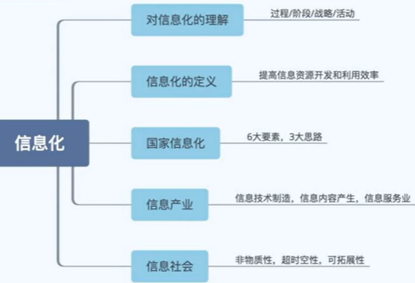
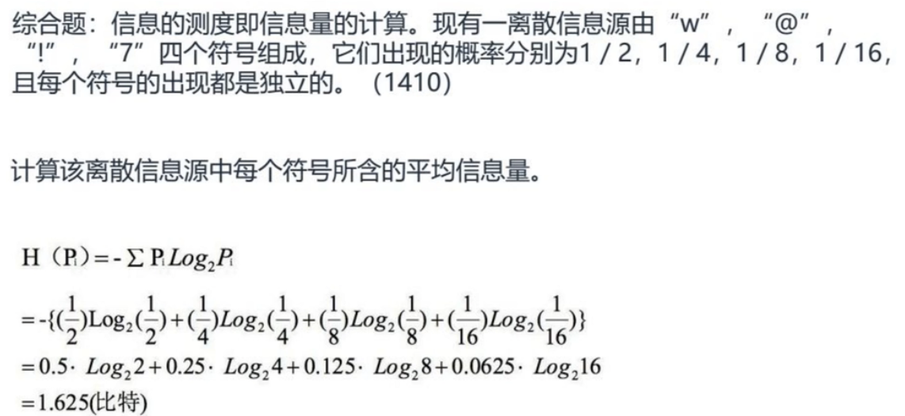
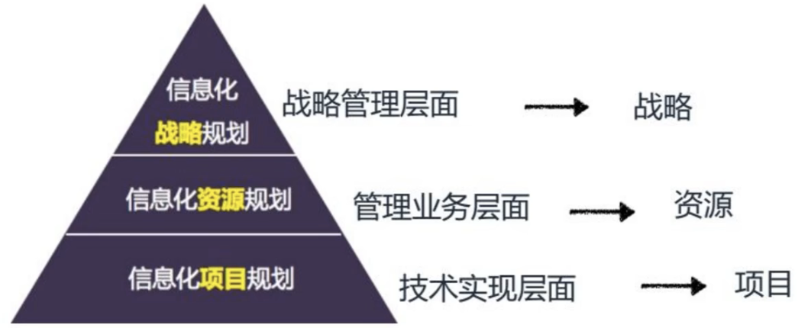

> # [**计算机信息管理专业  080901 笔记**](https://github.com/Eished/self-study-exam_notes)
>
> **自考笔记在线更新地址** : https://github.com/Eished/self-study-exam_notes

# 信息系资源管理 02378

## 大纲

## 历年真题

## 第1章 信息资源管理基础

学习目标与要求

一句话介绍：

- 围绕 “**信息**” 这份战略资源，
  - 从信息资源的 “**管理**” 角度出发，
  - 以 ”**信息系统**” 为主要研究对象，
  - 探讨了信息系统规划、信息系统开发、信息系统的内容、信息系统安全以及信息资源管理中涉及的法律法规。

### 1.1 导言：信息革命与信息化

#### 1.1.1 信息技术与信息革命

- **材料、能源、信息**是支配人类社会发展的三大基本要素。（选择）
- **信息技术**：应用信息科学的原理和方法研究信息**产生、传递、处理**的技术，
  - 具体包括有关信息的产生、收集、交换、存储、传输、显示、识别、提取、控制、加工和利用等方面的技术。
- **现代信息技术**: 3C+S
  - 通信技术（Communication）
  - 计算机技术（Computer）
  - 控制技术（Control）
  - 传感技术（Sensor）
  - 基础: 微电子技术
- **现代信息技术特点:**
  - 数字化: 二进制编码
  - 小型化: 体积变小
  - 网络化: 网络技术普及
  - 智能化: 智能技术
  - 系统化: 一卡通
- **信息革命:**
  - 含义：因信息技术发展而导致的社会变革称为信息革命。
  - 特征: 
    - 技术科学化
    - 群体化
    - 智能化
    - 高新性

#### 1.1.2 信息化

- **信息化定义**：（名词解释）
  - 指一个具体组织实体（如政府），应用**信息技术**提高信息资源**开发和利用**效率的**过程和活动**。
- **对于信息化的理解？**（选择）
  - 国民经济和社会生活中逐步应用的**过程**；国家信息化
  - 人类生存发展的一个历史**阶段**；信息产业
  - 促进经济发展和社会进步的重要**战略**；信息社会
  - 提高信息资源开发和利用效率的**活动**。
- **国家信息化体系的6大要素**（选择）
  - 信息资源
  - 信息网络
  - 信息技术应用
  - 信息技术和产业
  - 信息化人才队伍
  - 信息化政策法规和标准规范
- **国家信息化的3大思路**（选择）
  - 领域信息化
  - 区域信息化
  - 企业信息化
- **3大信息产业**（选择）
  - 信息技术制造（微电子、计算机等信息制造企业）
  - 信息内容产生（门户网站、电子媒体出版业）
  - 信息服务业（信息技术支持，信息中介，信息咨询等）
- 信息社会（不需掌握）
  - 信息化使我们正面对着一个数字化、，网络化的信息社会，它有着与农业社会和工业社会明显不同的特点
  - **信息社会特点**：
    - 非物质性：虚拟性
    - 超时空性：全球化，距离，时间
    - 可拓展性：可共享

### 1.2 信息（重要）

#### 1.2.1 信息的概念及其发展

- 信息传递

  - 
  - 

- 1948 Shannon

  - 通信的发生是以通信者具有不确定性为前提，通信的目的是就是减少不确定性，而消除不确定性的东西正是它所传递的信息
  - 只关注信息的传输，即通信，不关注信息的内容

- Shannon 熵（信息量）公式

  - $$
    H(Pi)=- \sum Pi \log_2(Pi)
    $$

  - 信息量是个状态信息量的平均信息量（数学期望）

  - 

  - 当各个状态的出现概率相等，即 $P_i=\frac{1}{n}$ 时，Shannon 熵公式变成

    - $$
      H=N\times \log(S)
      $$

      - Hartley 信息量测度公式
      - Hartley 公式是 Shannon 熵公式的特例

    - H 为信息量，N 代表 1 条信息包含字符的个数，S 代表通信符号集中符号的个数

- 1996 钟义信 **全信息理论**

  - 本体论

  - **认识论**

    - 语法信息（外在）
      - 随机信息（统计）信息
      - 模糊信息（状态不明确）
      - 偶发信息
    - 语义信息（内在）
    - 语用信息（价值）

  - **全信息** 

    - 实在信息（事物本身固有）
    - 先验信息（主体感知）
    - 实得信息（主体观察）

    引入主体和客体关系，衍生出

#### 1.2.2 信息的性质与分类

- 信息与物质、能量的关系

  - 联系且区别
  - 物质是基础，信息与能量源于物质
  - 信息可以转换为物质和能量

- **信息的性质**（选择题）

  - 无时无刻不在；精神世界信息无限一普遍的和无限的（实在信息）
  - 产生于物质，依附于媒体；可独立被重现一依附于媒体且可以独立于源事物
  - 可复制给其他主体，本身无损失一可以共享
  - 转换成其他形式存储，BMP、PNG一可以变换
  - 时间上传递-存储；空间上传递-通信；一可以传递但不增值
  - 信息随时间变化一动态且有时效性
  - 主体（人）利用感官感知信息一具体而可以被感知和处理的

- 信息的分类

  - 存储介质划分：磁电声光实

    - 磁介质，电介质，光介质，声介质，实体介质

  - 表现形式划分：

    - 文字信息、图像信息、声音信息、气味信息、形态信息

  - 信息的记录方式划分：

    - 事物型信息、记录型信息、智力型信息

  - **按信息源顺序层次划分**：（重点）

    - 原始信息：源事物发出，且未被处理的直接信息
    - 零次信息：人利用感觉（五官）直接得到的信息
    - 再生信息：一次信息（期刊论文）、二次信息、三次信息
    - 划分标准：信息加工处理深度

  - **按信息效用（影响）层次划分**：（重点）

    - | 层次 | 信息内容     | 描述问题 |
      | ---- | ------------ | -------- |
      | 1    | 迹象         | 什么？   |
      | 2    | 事实         | 是什么？ |
      | 3    | 知识         | 为什么？ |
      | 4    | 智能（策略） | 怎么办？ |

      最有效用的信息是： **知识、智能**

- （1）存储介质：磁、电、声、光、实质
  （2）信息表现形式：文字、图像、声音、气味、形态
  （3）信息记录方式：实物型、记录型、智力型
  （4）信息源顺序：原始信息、零次信息、再生信息（一次、二次等）
  （5）信息效用顺序：迹象，事实，知识，智能

#### 1.2.3 信息的测度

- 基于数据量的信息测度：
  - 按数据所占存储装置空间大小来衡量信息量的大小，字节作为单位
    - **重点：**按数据存储大小来衡量的方法 **基于语法信息。**

#### 1.2.4 信息功能与过程

产生 获取 传递 加工 再生 施效（利用）

### 1.3 信息资源管理概述

#### 1.3.1 信息资源

- **资源**：（名词解释）
  - 在自然界和人类社会生活中可以用来创造物质财富和精神财富，并具有一定积累的客观存在形式。
- 经济属性：
  - 需求性
  - 稀缺性
  - 可选择性
    - 不同资源组合有不同效果

#### 1.3.2 信息资源管理的主要内容

IRM: Information Resource Management

- 信息资源
  - 广义信息资源：是信息及其生产者、信息技术的集合，包括社会经济活动中经过加工处理
  - 狭义信息资源：有序化并大量积累的有用信息的集合，为某种目的而生产有用信息的信息生产者集合，加工、处理和传递有用信息的信息技术集合。
  - 信息——多生产者——信息技术
- 信息资源的性质
  - 不可分性
  - 积累性或非消耗性
  - 认知相对性
  - 不同一性
  - 驾驭性
- 内容
  - 管理对象：信息资源
  - 工具：信息技术
  - 特点：技术依赖性和系统综合性

#### 1.3.3 信息资源管理的产生与发展

- 产生背景
  1. 信息**爆炸**：文书记录和文献数量激增
  2. 三个应用**学科的发展**
     1. 数据库管理
     2. 记录或文献管理
     3. 数据处理管理
  3. 信息资源**地位提高**：信息无处不在
- 信息资源管理的发展
  - 马钱德（D.Marchand）和克雷斯莱茵（J.C.Kresslein）**四阶段说**
    - 1900-1960年 物的控制
    - 1960-1970年 自动化技术
    - 1970-1980年 信息资源管理
    - 1990年至今 知识管理
  - 信息资源管理：十九世纪末产生，学说在20世纪末产生
  - 信息资源管理强调“信息资源”为主导、技术是服务的管理理念
  - 知识管理：更高层次的信息资源管理，强调技术与管理的融合。

关键词：

信息化 信息 信息测度 Shannon熵 信息过程 信息资源

本章小结
练习题
网络学习题
思考题

## 第2章 信息化规划与组织

学习目标与要求

### 2.1 组织战略与信息化

- 组织战略
  1. 定义：组织战略是组织达成目标、完成使命的综合计划
  2. 包括：
     - 总战略：总的方向
     - 经营战略：某一产品、部门的竞争合作战略
     - 智能战略：各职能部门制定的战略，如制造、研发、信息技术等
  3. 制定过程：
     - 环境分析：充分考虑组织内部、外部所有的优势和劣势，评估机会和风险，对组织所处环境进行判断
     - 战略决策：明确使命、目标——战略方案
     - 战略规划的形成和完善：细化调整，形成可执行的战略规划
- 组织战略的规划方法
  1. **SWOT 矩阵法**（波士顿矩阵法）
     - SWOT矩阵法是全面分析组织外部环境和内部资源、**寻找满意战略组合**的分析工具。
     - 外部环境分析包括明确机会（O）和威胁（T），内部资源分析包括了解优势（S）和劣势（W），并根据绘制的SWOT矩阵进行组合分析和综合分析。
     - 
  2. 波特五力模型
     - 企业开辟新业务
  3. 价值链分析法
     - 业务流程重组
- 组织战略与信息化关系
  1. 组织信息化的**目的**：支持组织战略实现。
  2. 信息化是组织战略制定的**工具**。
  3. 组织信息化工作**重心**：支持管理决策的智能化。
  4. 组织内**最底层**的普通职员负责事务处理。
- 组织战略与信息化战略
  1. 信息化战略是组织战略的重要组成部分，是组织战略的**指导方针**
  2. 信息化战略必须服从**组织战略**的**核心思想**，在组织战略的框架下制定

### 2.2 信息化规划

#### 2.2.1 信息化规划概述

- 信息化发展中遇到的问题

  - **信息孤岛**：数据信息单元单独存放、不能自动的实现信息共享与交换，需要靠人工与外界进行联系的一种现象

    - **本质是组织信息化进程缺乏整体规划而造成的**

  - **IT 黑洞**：企业在 IT 应用上的巨额投资并没有达到预期效果，经济学家称为”生产率悖论“

    - 产生 IT 黑洞的原因

    

  - **IT 项目泥潭**：90%的 ERP 系统的实施要么超过预定时间，要么超过预算

- 如何解决这些问题？

  - **为了规避风险，保证信息化建设成功和健康发展，需要实现对组织信息化进行周密的计划**

- 信息化规划

  - 战略目标（如何规划）
    1. 业务匹配：信息技术投资与组织的远景规划和战略目标的匹配
    2. 竞争优势：提高组织竞争优势
    3. 管理资源：优化组织信息资源
    4. 技术架构：勾画出组织战略、组织结构和业务流程相适应的信息技术架构
  - **组织信息化规划在时间上一般为 3-5 年**

- 诺兰模型：

  - 组织 IT 应用发展分为起步、扩展、控制、集成、数据管理、成熟 6 个阶段
  - 早起信息化规划局限于技术（战术）层面的**信息系统项目规划**

- 信息化规划层次

  - 战略管理层面
    - 信息化**战略**规划
  - 管理业务层面
    - 信息化**资源**规划
  - 技术实现层面
    - 信息化**项目**规划

  

- 开展信息化规划的方式（选择题）

  - 从下而上
    - 从下而上的方式，比较适合业务相对**稳定**的组织业务相对稳定的组织
  - 由上而下
  - 由外而内
  - 中间开花

#### 2.2.2 信息化战略规划

信息化战略规划内容

- 信息化战略：
  - 描述组织信息化建设的方向、重点、步骤和措施等的策略
  - 是组织信息化建设与发展的整体思路与指导体系

1. 信息化建设的**愿景与架构**（大方向）
   1. 组织战略、核心竞争力的识别
   2. 管理提升与业务改进方向
   3. 信息化的作用点和愿景分析
   4. 分析信息化现状、进行信息化能力评估
      1. 从人、流程、技术三个方面分析企业信息化现状
   5. 分析差距，探讨改进构想
   6. 业务需求调整
   7. 分析信息化体系架构
      1. 定义信息化所涉及的系统边界与环境；
      2. 分析信息化建设的组织结构；
      3. 分析各子系统的相互关系。
2. 项目**方案选择与组织**（做什么）
   1. 项目方案的选择
   2. 信息化建设的项目组织
3. 信息化**项目规划**（怎么做）
   1. 信息化建设阶段规划
   2. 风险管理质量监控策略
   3. 主要实施计划与培训计划

1. 信息化战略的**规划步骤**

   1. 基础信息调研：信息化现状与发展趋势调研、组织信息化需求调研、信息化建设基础条件调研
   2. 现状评估和问题分析
   3. 信息化战略目标设计和制定

2. **信息化战略规划方法**

   1. 战略目标集转化法（SST）

      1. **识别**组织战略集
      2. 将组织战略集**转化**为组织信息化战略
      3. 选出一个方案**送**决策层**审**核

   2. 价值链分析法（VCA）

      1. 内容：将组织看成输入、转换和输出活动的集合

         - 一个组织=一些活动

         - 价值链分析法认为**信息技术**在组织的战略牵引方面起关键作用
         - 信息技术是关键

      2. 内容：将一个组织看成一些输入、转换与输出活动集合，称为价值链，每个活动都能产生增值作用

   3. 关键成功因素法（CSF）

      1. 内容：根据关键因素决定信息资源分配的优先级，利用信息技术发掘新机遇

3. **信息化战略规划书**

   1. 环境分析
   2. 信息化战略
   3. 信息化体系架构设计
   4. 信息化技术标准
   5. 项目分派和管理

#### 2.2.3 信息资源规划

1. 信息资源规划是什么

   1. 某公司信息化发展水平处于初级阶段的表现：

      1. 分散的、独立运行的事务处理系统较多，应用系统之间缺乏自动化数据交换，没有共享数据库。
      2. 应用规模较小，没有中等规模的管理信息系统，数据缺乏规范化。
      3. 集团各单位信息联网困难，没有全系统的信息化标准化管理。

      解决这些问题的技术核心是：信息资源规划（数据集成）

2. 信息资源规划的产生与内涵

   - 数据处理危机：**根本原因是系统缺乏全面有效的高层（战略）数据规划。**
   - **詹姆斯·马丁（J.Martin）提出战略数据规划**
     - 数据标准：数据**命名，属性，设计，使用**一致性规范（选择题）

3. 高复提出，信息资源规划（IRP）：

   

   - 是对组织管理或经营活动所需要的信息，
   - 从**产生、获取，到处理、存储、传输及利用**进行全面的规划

4. 信息资源规划的步骤

   1. 建立负责信息资源规划的工作组，人
   2. 分析职能域及其业务，流程
   3. 对职能域数据进行标准化，技术

5. **组织信息资源管理基础标准：**（选择题）

   1. **数据元素**标准
   2. **信息分类**编码标准
   3. 用户**视图**标准
   4. **概念**数据库标准
   5. **逻辑**数据库标准

3. 信息资源规划的**重点工作**（选择题）
   - 业务分析
   - 主题数据库与数据标准化
     1. **主题数据库：要求信息源的唯一性，即所有源信息一次一处地进入系统。**
     2. **数据标准化：数据元素标准化，信息分类编码标准化。**

#### 2.2.4 信息化项目规划

1. 信息化项目的定义
   - **信息化项目**：在特定时间、质量、资金等约束下，以应用信息技术为目标的一系列活动。
   - 应用型项目：应用 SAP 的 ERP 软件，完成企业资源规划。
   - 开发型项目
2. **信息化项目规划的内容**（选择题）
   1. 范围规划
   2. 进度计划
   3. 成本计划
   4. 质量计划
3. **信息化项目规划的常用工具**（选择题）
   1. 项目管理工具 MS Project
   2. 用 WBS（工作分解结构）工具做出范围计划
   3. 常用的进度计划工具是甘特图

### 2.3 信息化组织

#### 2.3.1 信息化组织机构

1. 案例：海航集团
   - 信息化离不开有效的组织
   - 人、技术、管理
2. **信息化组织机构的类型**（选择题）
   1. **隶属**业务部门的信息部门
   2. 与业务部门**平级**的信息部门
   3. 由 **CEO** 直接领导的信息部门
   4. 由**信息管理委员**会直接领导的信息部门
3. **信息化组织机构的职能**（选择题）
   1. 信息化**战略制定及管理工作**的组织
   2. 信息系统**研发与管理**
   3. 信息系统**运行维护与管理**
   4. 信息资源**管理与服务**
4. 信息化组织机构的岗位设置
   1. **系统研发与管理部**（重要）
      1. **系统分析员**
         - 系统分析员的主要任务是对现行**系统运行环境、作业流程**和**用户需求**进行详细调查，进而确定目标系统的**功能结构、性能指标、资源配置、编码体系、逻辑模型**，以便为系统设计提供科学依据。
      2. 系统设计员
      3. 程序员
      4. 测试人员
   2. 系统运行维护与管理部
      1. 控制台操作员
      2. 设备管理员
      3. 数据录入员
      4. 运行的培训教师
      5. 资料保管员
      6. 支持人员
   3. 信息资源管理与服务部
      1. 资源管理员
      2. **信息员**（重要）
         - 负责信息的**收集、整理和发送**。
      3. 信息服务与技术支持人员

#### 2.3.2 CIO机制

- Chief Information Officer，首席信息官
  - 专门负责组织信息化建设、实施、和运作的管理者
  - 通常是组织决策层成员。
- **CIO 机制的构成**（选择）
  - **核心**：CIO
  - 信息化管理**委员会**：领导小组
  - 信息部门：支持中心**，管理中心**
  - 业务部门的信息人员：业务部门是信息化的**实施主体**
- CIO 的职能
  - 战略的参谋者
  - 战略的执行者
  - 信息的传播中介
- CIO 的能力
  - 管理知识
  - 技术知识
  - 沟通能力
  - 协调能力
  - 项目管理

关键词
本章小结

练习题

网络学习题

思考题

## 第3章 信息系统资源管理

学习目标与要求

### 3.1 信息系统资源管理概述

#### 3.1.1 信息系统的基本概念

#### 3.1.2 信息系统的资源观

#### 3.1.3 信息系统资源管理

### 3.2 信息系统开发管理

#### 3.2.1 信息系统开发管理的目的与意义

#### 3.2.2 信息系统开发管理的内容

### 3.3 信息系统运行维护管理

#### 3.3.1 信息系统运行维护中的人员管理

#### 3.3.2 信息系统日常运行管理

#### 3.3.3 信息系统数据管理

#### 3.3.4 信息系统维护管理

#### 3.3.5 信息系统运行中的IT服务管理

#### 3.3.6 信息系统文档管理

#### 3.3.7 信息系统的评价和审计

关键词
本章小结
练习题
网络学习题
思考题

## 第4章 信息资源内容管理

学习目标与要求

### 4.1 信息需求

#### 4.1.1 什么是信息需求

#### 4.1.2 信息需求的类型

#### 4.1.3 组织中不同层次的信息需求

#### 4.1.4 决策与信息需求

### 4.2 信息采集

#### 4.2.1 信息源

#### 4.2.2 信息采集原则

#### 4.2.3 信息采集方法

#### 4.2.4 信息采集途径

### 4.3 信息存储与检索

#### 4.3.1 信息存储

#### 4.3.2 信息检索

### 4.4 信息加工与分析

#### 4.4.1 信息加工

#### 4.4.2 信息分析

### 4.5 知识管理

#### 4.5.1 知识管理的概念

#### 4.5.2 知识管理工具

#### 4.5.3 知识管理软件简介

### 4.6 信息传递与共享

#### 4.6.1 信息传递

#### 4.6.2 信息共享

关键词
本章小结
练习题
网络学习题
思考题

## 第5章 信息资源管理的标准与法规

学习目标与要求

### 5.1 信息资源管理标准化

#### 5.1.1 标准的基本概念

#### 5.1.2 标准化的基本概念

#### 5.1.3 信息资源管理标准化的意义与作用

#### 5.1.4 信息资源管理标准化的内容

#### 5.1.5 信息资源管理标准化的指导原则和基本方法

#### 5.1.6 信息资源管理标准的制定与实施

### 5.2 ISO9000质量标准体系

#### 5.2.1 IS09000系列标准产生的背景

#### 5.2.2 1S09000系列标准的构成

#### 5.2.3 1S09000标准的应用与发展

### 5.3 信息资源管理的法律规范

#### 5.3.1 概述

#### 5.3.2 信息采集方面的法律规范

#### 5.3.3 信息公开方面的法律规范

#### 5.3.4 信息传播方面的法律规范

#### 5.3.5 信息市畅管理方面的法律规范

#### 5.3.6 信息资源利用方面的法律规范

#### 5.3.7 信息安全方面的法律规范

关键词
本章小结
练习题
网络学习题
思考题

## 第6章 信息资源安全管理

学习目标与要求

### 6.1 信息资源安全管理内涵

### 6.2 信息资源安全的系统管理

#### 6.2.1 信息系统安全模型

#### 6.2.2 行为规范管理

#### 6.2.3 实体安全管理

#### 6.2.4 网络安全管理

#### 6.2.5 软件安全管理

#### 6.2.6 数据安全管理

### 6.3 数据加密技术及其应用

#### 6.3.1 密码学基本概念

#### 6.3.2 加密技术及其应用

关键词
本章小结
练习题
网络学习题
思考题

## 第7章 企业与政府信息资源管理

学习目标与要求

### 7.1 企业信息资源管理

#### 7.1.1 企业及其经营管理

#### 7.1.2 企业信息化与企业信息资源管理

#### 7.1.3 案例

### 7.2 政府信息资源管理

#### 7.2.1 政府信息资源的类型

#### 7.2.2 政府信息资源的特点

#### 7.2.3 案例

关键词
本章小结
练习题
网络学习题
思考题
参考文献
