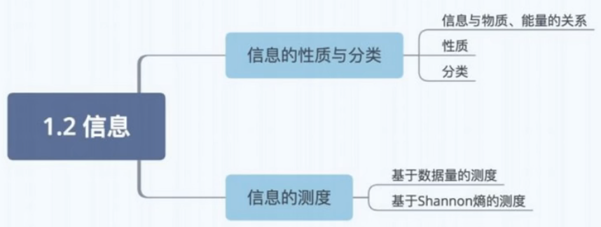

> # [**计算机信息管理专业  080901 笔记**](https://github.com/Eished/self-study-exam_notes)
>
> **自考笔记在线更新地址** : https://github.com/Eished/self-study-exam_notes

# 信息系资源管理 02378

## 大纲

## 历年真题

## 第1章 信息资源管理基础

学习目标与要求

一句话介绍：

- 围绕 “**信息**” 这份战略资源，
  - 从信息资源的 “**管理**” 角度出发，
  - 以 ”**信息系统**” 为主要研究对象，
  - 探讨了信息系统规划、信息系统开发、信息系统的内容、信息系统安全以及信息资源管理中涉及的法律法规。

### 1.1 导言：信息革命与信息化

#### 1.1.1 信息技术与信息革命

- **材料、能源、信息**是支配人类社会发展的三大基本要素。（选择）
- **信息技术**：应用信息科学的原理和方法研究信息**产生、传递、处理**的技术，
  - 具体包括有关信息的产生、收集、交换、存储、传输、显示、识别、提取、控制、加工和利用等方面的技术。
- **现代信息技术**: 3C+S
  - 通信技术（Communication）
  - 计算机技术（Computer）
  - 控制技术（Control）
  - 传感技术（Sensor）
  - 基础: 微电子技术
- **现代信息技术特点:**
  - 数字化: 二进制编码
  - 小型化: 体积变小
  - 网络化: 网络技术普及
  - 智能化: 智能技术
  - 系统化: 一卡通
- **信息革命:**
  - 含义：因信息技术发展而导致的社会变革称为信息革命。
  - 特征: 
    - 技术科学化
    - 群体化
    - 智能化
    - 高新性

#### 1.1.2 信息化

- **信息化定义**：（名词解释）
  - 指一个具体组织实体（如政府），应用**信息技术**提高信息资源**开发和利用**效率的**过程和活动**。
- **对于信息化的理解？**（选择）
  - 国民经济和社会生活中逐步应用的**过程**；国家信息化
  - 人类生存发展的一个历史**阶段**；信息产业
  - 促进经济发展和社会进步的重要**战略**；信息社会
  - 提高信息资源开发和利用效率的**活动**。
- **国家信息化体系的6大要素**（选择）
  - 信息资源
  - 信息网络
  - 信息技术应用
  - 信息技术和产业
  - 信息化人才队伍
  - 信息化政策法规和标准规范
- **国家信息化的3大思路**（选择）
  - 领域信息化
  - 区域信息化
  - 企业信息化
- **3大信息产业**（选择）
  - 信息技术制造（微电子、计算机等信息制造企业）
  - 信息内容产生（门户网站、电子媒体出版业）
  - 信息服务业（信息技术支持，信息中介，信息咨询等）
- 信息社会（不需掌握）
  - 信息化使我们正面对着一个数字化、，网络化的信息社会，它有着与农业社会和工业社会明显不同的特点
  - **信息社会特点**：
    - 非物质性：虚拟性
    - 超时空性：全球化，距离，时间
    - 可拓展性：可共享

### 1.2 信息（重要）

#### 1.2.1 信息的概念及其发展

- 信息传递

  - 
  - 

- 1948 Shannon

  - 通信的发生是以通信者具有不确定性为前提，通信的目的是就是减少不确定性，而消除不确定性的东西正是它所传递的信息
  - 只关注信息的传输，即通信，不关注信息的内容

- Shannon 熵（信息量）公式

  - $$
    H(Pi)=- \sum Pi \log_2(Pi)
    $$

  - 信息量是个状态信息量的平均信息量（数学期望）

  - 

  - 当各个状态的出现概率相等，即 $P_i=\frac{1}{n}$ 时，Shannon 熵公式变成

    - $$
      H=N\times \log(S)
      $$

      - Hartley 信息量测度公式
      - Hartley 公式是 Shannon 熵公式的特例

    - H 为信息量，N 代表 1 条信息包含字符的个数，S 代表通信符号集中符号的个数

- 1996 钟义信 **全信息理论**

  - 本体论

  - **认识论**

    - 语法信息（外在）
      - 随机信息（统计）信息
      - 模糊信息（状态不明确）
      - 偶发信息
    - 语义信息（内在）
    - 语用信息（价值）

  - **全信息**

    - 实在信息（事物本身固有）
    - 先验信息（主体感知）
    - 实得信息（主体观察）

    引入主体和客体关系，衍生出

#### 1.2.2 信息的性质与分类

- 信息与物质、能量的关系

  - 联系且区别
  - 物质是基础，信息与能量源于物质
  - 信息可以转换为物质和能量

- **信息的性质**（选择题）

  - 无时无刻不在；精神世界信息无限一普遍的和无限的（实在信息）
  - 产生于物质，依附于媒体；可独立被重现一依附于媒体且可以独立于源事物
  - 可复制给其他主体，本身无损失一可以共享
  - 转换成其他形式存储，BMP、PNG一可以变换
  - 时间上传递-存储；空间上传递-通信；一可以传递但不增值
  - 信息随时间变化一动态且有时效性
  - 主体（人）利用感官感知信息一具体而可以被感知和处理的

- 信息的分类

  - 存储介质划分：磁电声光实

    - 磁介质，电介质，光介质，声介质，实体介质

  - 表现形式划分：

    - 文字信息、图像信息、声音信息、气味信息、形态信息

  - 信息的记录方式划分：

    - 事物型信息、记录型信息、智力型信息

  - **按信息源顺序层次划分**：（重点）

    - 原始信息：源事物发出，且未被处理的直接信息
    - 零次信息：人利用感觉（五官）直接得到的信息
    - 再生信息：一次信息（期刊论文）、二次信息、三次信息
    - 划分标准：信息加工处理深度

  - **按信息效用（影响）层次划分**：（重点）

    - | 层次 | 信息内容     | 描述问题 |
      | ---- | ------------ | -------- |
      | 1    | 迹象         | 什么？   |
      | 2    | 事实         | 是什么？ |
      | 3    | 知识         | 为什么？ |
      | 4    | 智能（策略） | 怎么办？ |

      最有效用的信息是： **知识、智能**

- （1）存储介质：磁、电、声、光、实质
  （2）信息表现形式：文字、图像、声音、气味、形态
  （3）信息记录方式：实物型、记录型、智力型
  （4）信息源顺序：原始信息、零次信息、再生信息（一次、二次等）
  （5）信息效用顺序：迹象，事实，知识，智能

#### 1.2.3 信息的测度

- 基于数据量的信息测度：
  - 按数据所占存储装置空间大小来衡量信息量的大小，字节作为单位
    - **重点：**按数据存储大小来衡量的方法 **基于语法信息。**

#### 1.2.4 信息功能与过程

产生 获取 传递 加工 再生 施效（利用）

### 1.3 信息资源管理概述

#### 1.3.1 信息资源

- **资源**：（名词解释）
  - 在自然界和人类社会生活中可以用来创造物质财富和精神财富，并具有一定积累的客观存在形式。
- 经济属性：
  - 需求性
  - 稀缺性
  - 可选择性
    - 不同资源组合有不同效果

#### 1.3.2 信息资源管理的主要内容

#### 1.3.3 信息资源管理的产生与发展

关键词
本章小结
练习题
网络学习题
思考题

## 第2章 信息化规划与组织

学习目标与要求

### 2.1 组织战略与信息化

### 2.2 信息化规划

#### 2.2.1 信息化规划概述

#### 2.2.2 信息化战略规划

#### 2.2.3 信息资源规划

#### 2.2.4 信息化项目规划

### 2.3 信息化组织

#### 2.3.1 信息化组织机构

#### 2.3.2 CIO机制

关键词
本章小结

练习题

网络学习题

思考题

## 第3章 信息系统资源管理

学习目标与要求

### 3.1 信息系统资源管理概述

#### 3.1.1 信息系统的基本概念

#### 3.1.2 信息系统的资源观

#### 3.1.3 信息系统资源管理

### 3.2 信息系统开发管理

#### 3.2.1 信息系统开发管理的目的与意义

#### 3.2.2 信息系统开发管理的内容

### 3.3 信息系统运行维护管理

#### 3.3.1 信息系统运行维护中的人员管理

#### 3.3.2 信息系统日常运行管理

#### 3.3.3 信息系统数据管理

#### 3.3.4 信息系统维护管理

#### 3.3.5 信息系统运行中的IT服务管理

#### 3.3.6 信息系统文档管理

#### 3.3.7 信息系统的评价和审计

关键词
本章小结
练习题
网络学习题
思考题

## 第4章 信息资源内容管理

学习目标与要求

### 4.1 信息需求

#### 4.1.1 什么是信息需求

#### 4.1.2 信息需求的类型

#### 4.1.3 组织中不同层次的信息需求

#### 4.1.4 决策与信息需求

### 4.2 信息采集

#### 4.2.1 信息源

#### 4.2.2 信息采集原则

#### 4.2.3 信息采集方法

#### 4.2.4 信息采集途径

### 4.3 信息存储与检索

#### 4.3.1 信息存储

#### 4.3.2 信息检索

### 4.4 信息加工与分析

#### 4.4.1 信息加工

#### 4.4.2 信息分析

### 4.5 知识管理

#### 4.5.1 知识管理的概念

#### 4.5.2 知识管理工具

#### 4.5.3 知识管理软件简介

### 4.6 信息传递与共享

#### 4.6.1 信息传递

#### 4.6.2 信息共享

关键词
本章小结
练习题
网络学习题
思考题

## 第5章 信息资源管理的标准与法规

学习目标与要求

### 5.1 信息资源管理标准化

#### 5.1.1 标准的基本概念

#### 5.1.2 标准化的基本概念

#### 5.1.3 信息资源管理标准化的意义与作用

#### 5.1.4 信息资源管理标准化的内容

#### 5.1.5 信息资源管理标准化的指导原则和基本方法

#### 5.1.6 信息资源管理标准的制定与实施

### 5.2 ISO9000质量标准体系

#### 5.2.1 IS09000系列标准产生的背景

#### 5.2.2 1S09000系列标准的构成

#### 5.2.3 1S09000标准的应用与发展

### 5.3 信息资源管理的法律规范

#### 5.3.1 概述

#### 5.3.2 信息采集方面的法律规范

#### 5.3.3 信息公开方面的法律规范

#### 5.3.4 信息传播方面的法律规范

#### 5.3.5 信息市畅管理方面的法律规范

#### 5.3.6 信息资源利用方面的法律规范

#### 5.3.7 信息安全方面的法律规范

关键词
本章小结
练习题
网络学习题
思考题

## 第6章 信息资源安全管理

学习目标与要求

### 6.1 信息资源安全管理内涵

### 6.2 信息资源安全的系统管理

#### 6.2.1 信息系统安全模型

#### 6.2.2 行为规范管理

#### 6.2.3 实体安全管理

#### 6.2.4 网络安全管理

#### 6.2.5 软件安全管理

#### 6.2.6 数据安全管理

### 6.3 数据加密技术及其应用

#### 6.3.1 密码学基本概念

#### 6.3.2 加密技术及其应用

关键词
本章小结
练习题
网络学习题
思考题

## 第7章 企业与政府信息资源管理

学习目标与要求

### 7.1 企业信息资源管理

#### 7.1.1 企业及其经营管理

#### 7.1.2 企业信息化与企业信息资源管理

#### 7.1.3 案例

### 7.2 政府信息资源管理

#### 7.2.1 政府信息资源的类型

#### 7.2.2 政府信息资源的特点

#### 7.2.3 案例

关键词
本章小结
练习题
网络学习题
思考题
参考文献
