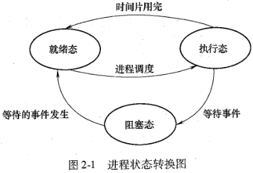
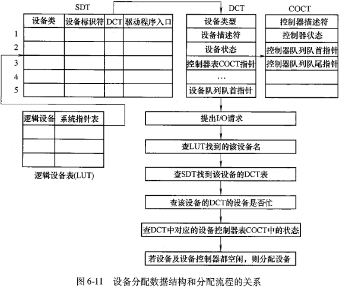
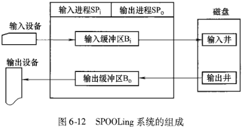

## [**计算机信息管理专业课程**](https://github.com/Eished/self-study-exam_notes)

**最新自考笔记** : https://github.com/Eished/self-study-exam_notes

# 大纲 (02323) 2017版

## 题型

1. 单项选择题
   - 20题x1分
2. 填空题
   - 10题x2分
3. 简答题
   - 5题x4分
4. 综合题
   - 4题x10分

# 第一章 操作系统简介

- 本章主要内容：
  1. 计算机系统的概念
  2. 操作系统的定义、作用和功能
  3. 操作系统的分类
  4. 管态、目态、特权指令、访管指令的概念
  5. 操作系统与用户的两个接口

- 重点：
  1. 操作系统的功能、分类
  2. 处理器的工作状态
  3. 程序状态字
  4. 系统功能调用

本章考试分值约为8~10分，出题形式多以单选题、多选题、填空题为主。

## 第一节 什么是操作系统

1. 用户与硬件之间的接口
   1. 操作系统概念：操作系统是一种复杂的系统软件，是不同程序代码、数据结构、初始化文件的集合，可执行。
   2. 操作系统是提供计算机用户与计算机硬件之间的接口，并管理计算机软件和硬件资源，并且通过这个接口使应用程序的开发变得简单、高效接口是两个不同部分的交接面。接口分为硬件接口和软件接口，计算机的所有功能最终都是由硬件的操作来实现的，计算机屏蔽了对硬件操作的细节。
   3. 操作系统完成的两个目标：
      1. 与硬件相互作用，为包含在所有硬件平台上的所有底层可编程部件提供服务
      2. 为运行在计算机系统上的应用程序（即用户程序）提供执行环境

2. 资源管理者

   现代计算机特点是支持多任务，一方面保证用户程序的顺利执行，另一方面使计算机系统资源得到高效的利用，保证计算机系统的高性能操作系统的功能：

   1. 处理机管理
   2. 内存管理
   3. 设备管理
   4. 文件管理

## 第二节 操作系统的发展

- 无操作系统一单道批处理系统一多道批处理系统一微机操作系一实时操作系统
  - 无操作系统阶段：电子管，无存储设备，第一台：1946年宾夕法尼亚大学的「埃尼阿克」
  - 单道批处理系统：晶体管，磁性存储设备，内存中有一道批处理作业，计算机资源被用户作业独占
  - 吞吐量是指单位时间内计算机系统处理的作业量
  - 多道程序系统：集成电路芯片，出现了分时操作系统（多个终端）
  - 微机操作系统：第一台 Intel 公司顾问 GaryKildall 编写的`CP/M`系统，是一台磁盘操作系统，用于 Inte8080 
  - 实时操作系统：广泛应用于各种工业现场的自动控制、海底探测、智能机器人和航空航天等。
- 批处理、实时、分时系统的优缺点比较：
  - 单道批处理系统：**自动性**、**顺序性**、**单道性**。
    - 优点：减少了等待人工操作的时间
    - 缺点：CPU资源不能得到有效的利用。
  - 多道批处理系统：多道性、**无序性**、调度性、**复杂性**。
    - 优点：能够使 CPU 和内存 IO资源得到充分利用，提高系统的吞吐量。
    - 缺点：系统平均周转时间长，缺乏交互能力
  - 分时系统：多路性、**及时性**、**交互性**、独立性。
    - 优点：提供了人机交互，可以使用户通过不同终端分享主机。
    - 缺点：不能及时接收及时处理用户命令。
  - 实时操作系统（用户实时控制和实时信息处理）：多路性、独立性、及时性、交互性、**可靠性**。
    - 在实时系统中，往往采取多级容错措施来保证系统安全和数据安全
- 操作系统产品：
  1. 主机操作系统（批处理、事务处理（银行支票处理或航班预订）、分时处理），
  2. 微机操作系统，
  3. 服务器操作系统、
  4. 嵌入式操作系统（物联网操作系统）

## 第三节 操作系统的特征

- 操作系统特征：
  - **并发**（多个事件在同一时间间隔内同时发生）
  - 共享
  - 虚拟
  - 异步

## 第四节 操作系统的功能

- 内存管理：
  - 任务是为多道程序的运行提供良好的运行环境，方便用户使用内存，提高内存利用率，以及从逻辑上扩充内存实现虚拟存储。
  - **内存分配**
    1. 用于内存分配数据结构。用来记录内存使用状况，如内存空闲区域的大小、空闲区域的起始地址等，为内存分配的实现提供依据
    2. 内存分配功能。系统按照一定的内存分配算法分配内存空间。
    3. 内存回收功能。系统需要回收被释放的内存空间
  - **内存保护**
  - **地址映射**
    - 逻辑地址与物理地址
    - 地址映射，将逻辑地址转换为对应的物理地址
  - **内存扩充**（借助与虚拟存储技术）
    - 请求调入功能。
    - 置换功能。
- 进程管理
- 文件管理：
  - 存储空间的管理
  - 目录管理
  - 文件的读写管理和存取控制
- 设备管理
  1. 缓冲管理。管理各种缓冲区。
  2. 设备分配。分配用户 IO所需要的设备。
  3. 设备处理。由设备驱动程序来实现CPU与设备控制器之间的通信
  4. 设备独立性和虚拟设备。设备独立性功能使应用程序独立于物理设备。
- 提供用户接口：
  - 命令接口
    - 联机用户接口
    - 脱机用户接口
  - 图形用户接口
  - 程序接口

## 第五节 操作系统的体系结构

- 操作系统体系结构的分析
  1. 简单的监控程序模型
  2. 单体结构模型
  3. 层次结构模型
  4. 客户/服务器模型与微内核结构
  5. 动态可扩展结构模型
- 单体内核是操作系统中最早、最常见的体系结构（ `UNIX/MS-DOS/LinUX/MAC OS X/BSD`）
- 层次结构最经典的例子 Dijkstra 的 THE 系统

## 第六节 指令的执行

- 指令的执行：
  - 程序是指令的集合，程序的执行就是按照某种控制流执行指令的过程。
  - 一个单一指令需要的处理称为指令周期，包括取指周期和执行周期
    1. 处理器与存储器之间的指令或数据传送操作。
    2. 处理器与O设备之间的指令或数据传送操作。
    3. 算术运算操作或逻辑运算操作。
    4. 控制操作，即修改指令的执行顺序的操作。

# 第二章 进程管理

- 本章主要内容：
  1. 多道程序涉及的概念
  2. 进程的定义及其四大属性
  3. 进程控制块（PCB）和进程队列的组织
  4. 中断及中断处理的概念
  5. 进程调度和作业调度及其计算
  6. 线程的相关概念

- 重点：
  1. 多道程序设计
  2. 进程、原语
  3. 进程调度和作业调度

本章考试分值约为20~25分。出题形式多以单选题、多选题、填空题、简答题、综合应用题为主。

## 第一节 进程的描述

- 程序的顺序执行特点：顺序性，封闭性、可再现性

- 程序的并发执行特点：间断性、失去封闭性、不可再现性

- 进程的概念：

  1. 进程是允许并发的程序在某个数据集合上的运行过程
  2. 进程是正文段、用户数据段和进程控制块共同组成的执行环境。正文段存放被执行的机器指令，用户数据段存放进程在执行时要操作的用户数据，进程控制块存放程序的执行环境，操作系统通过这些描述和管理进程。
     - 进程代表了程序的执行过程，是一个动态的实体，它随着指令的执行而不断变化，在**某个特定时刻的进程内容被称为进程映像**。

- 进程的特征：

  1. 并发性
  2. 独立性
  3. 异步性
  4. 动态性
  5. 结构特征

- 进程和程序的区别：

  - 程序是静态的，进程是动态的
  - 程序是永久的，进程是暂时存在的
  - 程序和进程存在的实体不同。程序是指令的集合，进程是由正文段、用户数据段、进程控制块组成

- 进程和程序的联系：

  - 进程是程序的一次执行，进程总是对应至少一个特定的程序，执行程序的代码一个程序可以对应多个进程

- 进程控制块：

  进程实体存在的标志是操作系统管理进程所使用的数据结构一进程控制块

  - **进程控制块是进程实体的一部分，是操作系统中最重要的数据结构**，进程控制块中记录了操作系统所需要的，用户描述进程情况以及控制进程运行所需要的全部信息，进程控制块是操作系统感知进程存在的唯一标志。
  - 进程控制块中的信息：
    - 进程标识符信息
      - 进程标识符用于**唯一标识一个进程**。进程控制块中除了存有本进程的标识符外，还存放其父进程、子进程的标识符
    - 处理机状态信息
      1. **通用寄存器**。用户程序可以访问的寄存器，用于暂存信息。
      2. **指令计数器**。其中存放了CPU要访问的下一条指令的地址
      3. **程序状态字 PSW**。其中包含状态信息，如条件码、执行方式和中断屏蔽标志等。
      4. **用户栈指针**。每个用户进程都有一个与之相关的系统栈，用于存放过程和系统调用参数及调用地址，栈指针指向该栈的栈顶。
    - 进程调度信息
      - 进程调度信息包括进程状态信息、进程优先级和进程调度所需的其他信息。
    - 进程控制信息
      - 进程控制信息包括程序和数据的地址、进程同步和通信机制、资源清单，以及链接指

- 进程的状态

  1. 三种基本状态：**就绪态**、**执行态**、**阻塞态**

  2. 进程状态的装换

     

  3. Linux 的进程状态

     1. Linux2.4.30进程状态及状态定义。

        1. 可运行状态（ TASK RUNNING）。
        2. 可中断的等待状态（ TASK INTERRUPTIBLE）。
        3. 不可中断的等待状态（ TASK UNINTERRUPTIBLE）。
        4. 暂停状态（ TASK STOPPED）
        5. 僵死状态（TAK_ ZOMBIE）。

        > #define TASK RUNNINGP o
        > #define TASK INTERRUPTIBLE 1
        > #define TASK UNINTERRUPTIBLE 2
        > #define TASK ZOMBIE, 4
        > #define TaSK SToPpEd 8定义文件:include/ linux/sched.h)

     2. Linux2.6.11进程状态及其定义。

        1. 可运行状态（ TASK RUNNING）。
        2. 可中断的等待状态（ TASK INTERRUPTIBLE）
        3. 不可中断的等待状态（ TASK UNⅠ NTERRUPTIBLE）
        4. 暂停状态（ TASK STOPPED）。
        5. 跟踪状态（ TASK TRACED）。
        6. 僵死状态（ TASK ZOMBIE）。
        7. 僵死_撤销状态（ EXIT DEAD）。

        > #define TASK RUNNING
        > #define TASK INTERRUPTIBLE
        > #define TASK UNINTERRUPTIBLE 2
        > #define TASK STOPPED
        > #define TASK tRaced
        > #define EXIT ZoMbIe define EXIT dEAd
        > (定义文件: include/ linux/ sched.h)
        > 在Limx2.6.11中,状态字段的值通常用一个简单的赋值语句设置.例如, `procdesc_ptr -> state= TASK RUNNING`

- 进程的组织

  

  1. 连接方式
     - 把系统中具有相同状态的进程的进程控制块（PCB）用其中的链接字链接成一个队列，如图2-2所示。
  2. 索引方式
     - 系统根据所有进程的状态，建立几张索引表，索引表的每一个表项指向一个PCB的物理块，如图2-3所示。
  3. 进程队列
     - 前面讲解了进程控制块，当系统中有很多进程时，可以把进程控制块用队列组织起来，形成进程队列。把具有相同状态的进程放在同一个队列中，具有不同状态的进程就形成了不同的进程队列。处于就绪态的进程构成的进程队列称为就绪队列，处于阻塞态的进程构成的进程队列称为阻塞队列。
     - 根据算法的需要，又可以把就绪队列按照优先权的不同分成几个优先权不同的就绪队列，把阻塞进程根据阻塞原因的不同分成不同的阻塞队列，阻塞原因相同的进程在同一个阻塞队列中，如图24所示。

  

## 第二节 进程的控制

1. 进程的创建
2. 进程的阻塞
3. 进程的唤醒
4. 进程的终止
5. 操作系统的启动和系统中进程的出现

## 第三节 操作系统的内核

1. 支撑功能
   - 支撑功能包括**中断处理**、**时钟管理**和**原语操作**。原语操作也称原子操作，是一组在执行过程中不能被中断的操作。
2. 资源管理功能
   - 资源管理包括进程管理、存储器管理和设备管理。

1. 中断
   1. 什么是中断
   2. 为什么需要中断
   3. 中断的类型
   4. 引起中断的原因
   5. 中断响应
   6. 单重中断的处理过程
   7. 如何找到中断服务子程序
2. 时钟管理
   1. 时钟的重要性
   2. 计算机系统中的时钟
   3. 操作系统的时钟机制
   4. Linux 时钟
3. 系统调用
   1. 什么是系统调用
   2. 系统调用与一般函数的区别
   3. 普通函数执行过程实例
   4. 系统调用执行过程实例
   5. 系统调用的类型
   6. Linux 中的系统调用举例
   7. 操作系统提供系统调用的优点

## 第四节 进程同步

1. 进程同步的基本概念
2. 同步机制应遵循的准则
   1. 空闲让进
   2. 忙则等待
   3. 有限等待
   4. 让权等待
3. 信号量机制
   1. 整型信号量机制
   2. 记录型信号量机制
   3. AND 型信号量机制
4. 经典的进程同步问题
   1. 生产者—消费者问题的描述
      1. 问题描述
      2. 需要解决的问题
      3. 信号量的设置
      4. 同步程序
         1. 生产者进程同步代码的描述
         2. 消费者进程同步代码的描述
      5. 说明
   2. 读者—写者问题
      1. 问题描述
      2. 信号量的设置
      3. 同步程序
         1. 写进程同步代码的描述
         2. 读进程同步代码的描述
5. 管程
   1. 管程的基本概念
      1. 管程的定义
      2. 管程的说明
   2. 管程的应用
      1. 利用管程解决生产者一消费者问题
      2. 利用管程解决哲学家进餐问题

## 第五节 进程通信

1. 共享存储器系统
2. 消息传递系统
3. 管道通信
4. 消息缓冲队列

## 第六节 线程

1. 线程的描述
   1. 线程的概念和分类
      1. 线程的概念
      2. 线程的分类
         1. 线程的调度与切换速度。
         2. 系统调用。
         3. 线程执行时间的分配。
   2. 线程的3种基本状态
   3. 线程控制块
      1. 线程控制块的定义
      2. 线程控制块的定义
      3. 线程控制块的组织方式
   4. 线程与进程的关系
2. 线程的控制
   1. 线程创建
      1. 用户线程的创建
      2. 内核线程的创建
   2. 线程的终止
      1. 引起线程终止的原因
      2. 线程的终止过程
   3. 线程的调度与切换
      1. 用户线程的调度与切换
      2. 内核线程的调度与切换
   4. 线程的阻塞与唤醒
      1. 引起线程阻塞的事件
      2. 用户线程的阻塞与唤醒
      3. 内核线程的阻塞与唤醒
3. 线程的同步
4. 线程通信

# 第三章 进程调度与死锁

## 第一节 进程调度的功能与时机

1. 进程调度的功能
2. 进程调度的时机

## 第二节 进程调度算法

1. 选择调度方式和算法的若干准则
   1. 周转时间短
   2. 响应时间快
   3. 截止时间的保证
   4. 系统吞吐量高
   5. 处理机利用率好
2. 调度算法
   1. 先来先服务调度算法(First-Come,First-Served, FCFS)
      1. 调度算法
      2. 性能分析
   2. 短进程优先调度算法(Shortest-Process-First, SPF)
      1. 调度算法
      2. 算法优点
      3. 算法的缺陷
      4. 性能分析
   3. 优先权调度算法
      1. 调度算法
      2. 优先权调度算法的类型
         1. 非抢占式(Nonpreemptive) 优先权调度算法
         2. 抢占式(Preemptive) 优先权调度算法
      3. 优先权的类型
         1. 静态优先权
         2. 动态优先权
      4. 优先权调度算法存在的问题和解决方案
         1. 问题
         2. 解决方案
   4. 时间片轮转调度算法(Round-Robin, RR)
      1. 时间片轮转调度算法
      2. 时间片大小的确定
         1. 系统对响应时间的要求
         2. 就绪队列中进程的数目
         3. 系统的处理能力
      3. 时间片轮转调度算法的性能评价
   5. 多级队列调度
      1. 多级队列调度算法(Multilevel Queue-Scheduling Algorithm)
      2. 多级队列调度算法应用举例
   6. 多级反馈队列调度

## 第三节 实时系统中的调度

1. 实现实时调度的基本条件

   1. 提供必要的调度信息
   2. 系统处理能力强
      1. 单处理机情况下必须满足的限制条件
      2. n 和处理机情况下必须满足的限制条件
   3. 采用抢占式调度机制
      1. 基于时钟中断的抢占式优先权调度算法
      2. 立即抢占的优先权调度算法
   4. 具有快速切换机制
      1. 对外部中断的快速响应能力
      2. 快读的进程切换能力

2. 常用的集中实时调度算法

   1. 最早截止时间优先 EDF(Earliest Deadline First, EDF)算法
   2. 最低松弛度优先 LLF(Least Laxity First, LLF) 算法

   

## 第四节 进程切换

- 进程切换使当前正在执行的进程成为被替换进程，出让其所使用的CPU，以运行被进程调度程序选中的新进程。进程切换通常包括以下几个步骤。
  1. 保存包括程序计数器和其他寄存器在内的CPU上下文环境。
  2. 更新被替换进程的进程控制块。
  3. 修改进程状态，把执行态改为就绪态或者阻塞态。
  4. 将被替换进程的进程控制块移到就绪队列或阻塞队列。
  5. 执行通过进程调度程序选择的新进程，并更新该进程的进程控制块。
  6. 更新内存管理的数据结构。
  7. 恢复被调度程序选中的进程的硬件上下文。

## 第五节 多处理器调度

1. 多处理器系统(MultiProcessor Systems, MPS)的类型
   1. 紧密耦合的多处理器系统和松弛耦合的多处理器系统
      1. 紧密耦合的多处理器系统
      2. 松弛耦合的多处理器系统
   2. 对称多处理器系统和非对称多处理器系统
2. 多处理器系统中的进程分配方式
   1. 对称多处理器系统中的进程分配方式
      1. 静态分配
      2. 动态分配
   2. 非对称多处理器系统（MPS）中的进程分配方式
3. 进程(线程)调度方式
   1. 自调度
      1. 自调度算法的优点
      2. 自调度方式的缺点
   2. 成组调度
      1. 成组调度的优点
      2. 成组调度中的时间分配
   3. 专用处理器分配

## 第六节 死锁

1. 产生死锁的原因和必要条件
   1. 原因
   2. 必要条件
      1. 互斥条件
      2. 请求和保持条件
      3. 不剥夺条件
      4. 环路等待条件
   3. 实例
      1. 互斥
      2. 请求和保持
      3. 不剥夺
      4. 环路等待
2. 处理死锁的基本方法
   1. 死锁的预防
      1. 摒弃请求和保持条件
      2. 摒弃不剥夺条件
      3. 摒弃环路等待条件
   2. 死锁的避免
      1. 系统的安全状态
      2. 安全状态举例
      3. 不安全状态举例
      4. 安全状态可以向不安全状态转换
3. 银行家算法
   1. 数据结构
   2. 银行家算法的说明
      1. 资源试分配算法
      2. 安全性检测算法
   3. 实例
   4. 银行家算法应用情况的说明
4. 死锁的检测和解除
   1. 何时调用 检测算法
   2. 资源分配图
   3. 死锁定理
   4. 死锁的解除
      1. 进程终止
      2. 资源抢占

# 第四章 内存管理

- 本章主要内容：
  1. 计算机系统中的存储器
  2. 逻辑地址和绝对地址
  3. 重定位
  4. 单用户连续存储管理
  5. 固定分区管理
  6. 可变分区存储管理及常用的分配算法
  7. 页式虚拟存储管理、虚拟存储器、页面调度

- 重点：
  1. 可变分区方式的主存分配算法以及移位技术
  2. 页式主存空间的分配与回收
  3. 页面调度算法

本章考试分值约为15分。出题形式多以单选题、多选题、填空题、简答题、综合应用题为主。

## 第一节 储存器的层次结构

- 储存器系统层级结构

  在这个层次系统中，从高层到低层（L0~L5），较低层的存储设备速度更慢、容量更大、价格更便宜。

  1. 在最高层（L0层），是少量的快速 CPU **寄存器**，CPU 可以在一个时钟周期内访问它们。
  2. 接下来是一个或多个小型或中型的基于 **SRAM 的高速缓存存储器**，可以在几个 CPU 时钟周期内访问它们。
  3. 然后 L3 层是一个大的基于 **DRAM 的主存**，可以在几十或几百个时钟周期内访问它们。
  4. L3 的下层 L4 是慢速但容量很大的**本地磁盘**。
  5. L5 表示有些系统可能还包括一层附加的**远程服务器上的磁盘**，需要通过网络来访问它们。例如NTF网络文件系统这样的分布式文件系统，允许程序访问存储在远程网络服务器上的文件。

- 程序的执行遵循局部性原理。关于程序执行的局部性原理有以下几个论点。

  1. 程序在执行时，除了少部分的转移和过程调用指令以外，在大多数情况下是顺序执行的。
  2. 过程调用将会使程序的执行轨迹由一部分内存区域转到另一部分内存区域。但研究表明，在大多数情况下，过程调用的深度都不超过5; 这就是说，程序将会在一段时间内局限在这些过程的范围内运行
  3. 程序中存在很多循环结构，它们虽然由少数指令构成，但多次执行。
  4. 程序中往往包括许多对数据结构的处理。例如对数组进行操作，它们往往都局限在很小的范围内。

- 总的来说，局部性原理表现为**时间和空间的局部性**。

  1. 时间局部性。如果程序中的某条指令一旦执行，则不久后该指令可能再次执行。如果某个数据结构被访问，不久以后该数据结构可能被再次访问。
  2. 空间局部性。一且程序访问了某个单元，在不久之后，其附近的存储单元也将被访问。

## 第二节 程序的链接和装入

## 第三节 连续分配储存管理方式

## 第四节 基本分页储存管理方式

## 第五节 基于分页的虚拟储存系统

## 第六节 分段储存管理

## 第七节 Linux 的伙伴系统

# 第五章 文件系统

- 本章主要内容：
  1. 文件、文件系统的定义及功能
  2. 文件的存储介质
  3. 文件的组织结构、记录的成组与分解
  4. 文件存储空间管理的方法
  5. 文件的目录结构
  6. 文件的保护、保密及其文件的基本操作

- 重点：
  1. 逻辑文件、物理文件
  2. 记录的成组与分解
  3. 文件目录结构以及画二级目录结构图

本章考试分值约为20分。出题形式多以单选题、填空题、简答题、综合应用题为主。

## 第一节 文件

1. 文件命名
2. 文件结构
   1. 无结构字节序列
   2. 固定长度记录序列
   3. 树形结构
3. 文件类型
   1. ASCII 文件(American Standard Code for Information Interchange)
   2. 二进制文件
4. 文件存取
   1. 顺序存取
   2. 随机存取
5. 文件属性
6. 文件操作
   1. CREATE
   2. DELETE
   3. OPEN
   4. CLOSE
   5. READ
   6. WRITE
   7. APPEND
   8. SEEK
   9. GETATTRIBUTES
   10. SETATTRIBUTES
   11. REANME

## 第二节 目录

1. 层次目录系统
   1. 目录文件的结构
   2. 目录结构
      1. 单层目录
      2. 两级目录
      3. 树形目录
2. 路径名
   1. 绝对路径名
   2. 相对路径名
3. 目录操作
   1. CREATE
   2. DELETE
   3. OPENDIR
   4. CLOSEDIR
   5. READDIR
   6. RENAME

## 第三节 文件系统的实现

1. 实现文件
   1. 连续分配
   2. 使用此盘链接表的分配
   3. 使用内存的链接表分配
   4. i- 结点
2. 实现目录
   1. CP/M 中的目录
   2. MS-DOS 中的目录
   3. UNIX 中的目录
3. 磁盘空间管理
   1. 簇大小
   2. 记录空闲块
      1. 空闲簇链接表
      2. 位图

# 第六章 I/O 设备管理

- 本章主要内容：
  1. 设备管理的功能
  2. 设备的分类及独占设备的分配
  3. 磁盘的驱动调度及其算法
  4. 设备的启动与I/O中断处理
  5. 缓冲技术和虚拟技术

- 重点：
  1. 设备管理的功能
  2. 设备的相对号与绝对号
  3. 磁盘的驱动调度
  4. SPOOLING

本章考试分值约为15分。出题形式多以单选题、多选题、填空题、简答题、综合应用题为主。

## 第一节 I/O 系统的组成

1. I/O 系统的结构
   1. 微机 I/O 系统

      - 总线型 I/O 系统结构如 图 6-1 所示。CPU与内存之间可以直接进行信息交换，但是不能与设备直接进行信息交换，必须经过设备控制器。

      

   2. 主机 I/O 系统

      - I/O 系统可能采用四级结构，包括主机、通道、控制器和设备。一个通道可以控制多个设备控制器，一个设备控制器也可以控制多个设备。图 6-2 所示为具有通道的 I/O 系统结构。

      

      

2. I/O 设备的分类

   1. 按传输速率分类
      1. 低速设备。如键盘和鼠标，传输速率为几个~几百个字节/秒。
      2. 中速设备。如打印机，传输速率为数千个~数万个字节/秒。
      3. 高速设备。如磁带机、磁盘机、光盘机，传输速率为几十万~几兆字节/秒。
   2. 按信息交换的单位分类
      1. 块设备。数据的存取以数据块为单位，如磁盘。块设备在块中保存信息，块的大小通常是固定的，并且一次只传送一块，通常可以通过块号访问数据。
      2. 宇符设备。传送字节流，没有使用块结构。终端、打印机、通信端口和鼠标等都是字符设备。
         在操作系统实现驱动程序时，通常需要区分一个设备是块设备还是字符设备，操作系统对这两种设备的缓冲管理和驱动程序的实现方式是不同的。
   3. 按设备的共享属性分类
      1. 独占设备。是必须作为临界资源以互斥方式访问的设备。在一个进程没有使用完毕之前，其他任何进程不能访问该设备，直到设备被释放。例如，打印机是典型的独占设备。
      2. 共享设备。是允许多个进程共同访问的设备，如硬磁盘是典型的共享设备。
      3. 虚拟设备。是通过某种虚拟技术把一台物理设备变成若干逻辑设备，从用户的角度看，多个用户拥有各自的设备，可以随时向设备发出访问请求并得到系统应答。

3. 设备控制器

   1. 什么是设备控制器

      1. 设备控制器是CPU与LO设备之间的接口，接收O的命令并控制设备完成L0工作。
      2. 设备控制器是一个可编址设备，连接多个设备时可有多个设备地址。控制器可以直接做在主板上，也可以做成插卡插在主板上。现在有些设备的控制器嵌入在设备中，如激光打印机的控制器。

   2. 设备控制器的功能

      1. 接收和识别命令
      2. 数据交换
         1. 将驱动器中的比特流汇集在控制器的缓冲区中以形成字节块。
         2. 实现CPU到控制器、控制器到CPU的双向数据传送。
         3. 将控制器对设备的控制命令传送给设备控制器。
      3. 设备状态了解和报告
      4. 地址识别
         1. 设备控制器必须能识别它所控制的每个设备的地址。
         2. 设备控制器中的寄存器本身应该有唯一的地址，以使CPU能向寄存器中读/写数据。
         3. 将CPU要访问的外设地址送入控制器，由控制器的地址译码器译码后选中目标设备。
      5. 数据缓冲
      6. 差错控制

   3. 设备控制器的组成

      1. 设备控制器与处理机的接口：数据线、控制线和地址线
      2. 设备控制器与设备的接口：设备与设备控制器接口中的3类信号为数据、状态和控制信号。
      3. I/O逻辑：I/O 逻辑主要由指令译码器和地址译码器两部分功能部件构成，将CPU的命令和地址分别译码，控制指定设备进行 I/O 操作。
         设备控制器的逻辑结构如 图 6-3 所示。

      

   4. I/O 通道

      - I/O通道是一种特殊的处理机，它具有执行  I/O指令的能力，并通过执行通道程序来控制 I/O操作。简单地说，通道是大型主机系统中专门用于 I/O的专用计算机。

## 第二节 I/O 控制方式

- 输人/输出方式有早期的程序轮询控制方式。在中断机制被引入计算机系统后，输入/输出控制采用中断控制方式。为了提高块设备的输入/输出性能，可以利用DMA（ Direct Memo ry Access，直接内存访问）控制器对输入/输出进行DMA控制。

1. 轮询
2. 中断
3. DMA

## 第三节 缓冲管理

1. 缓冲的引入
   1. 处理数据流的生产者与消费者之间的速度差异。
   2. 协调传输数据大小不一致的设备。
2. 单缓冲
3. 双缓冲
4. 循环缓冲
   1. 循环缓冲的组成
   2. 循环缓冲的使用
   3. 进程同步
5. 缓冲池
   1. 缓冲池组成
   2. Getbuf 过程和 Putbuf 过程
   3. 缓冲区的工作方式

## 第四节 设备分配

1. 设备分配中的数据结构

   1. **设备控制表** DCT (Device Control Table)
      1. 设备类型
      2. 设备标识符
      3. 设备状态: 忙/闲
      4. 重复执行的次数活时间
      5. 设备队列的首指针。设备队列也称设备请求队列，是因请求设备而被阻塞的进程的PCB构成的队列。设备队列的队首指针指向队首的PCB。
   2. **控制器控制表** COCT(Controller Control Table)
      1. 控制器标识符。
      2. 控制器状态。
      3. 与控制器相连接的通道表指针。
      4. 控制器队列的队首指针。
      5. 控制器队列的队尾指针。
   3. **通道控制表** CHCT(Channel Control Table)
      1. 通道标识符通道状态。
      2. 与通道连接的控制器表首址。
      3. 通道队列的队首指针。
      4. 通道队列的队尾指针。
   4. **系统设备表** SDT(System Device Table)
      - 系统设备表是系统范围的数据结构，其中记录了系统中全部设备的情况。
      - 每个设备占个表目，其中包括设备类型、设备标识符、设备控制表及设备驱动程序的入口地址。

   

2. 设备分配

   1. 设备的固有属性
      1. 独占设备
         - 对于独占设备，应采用独享分配策略，即将一个设备分配给某进程后，便由该进程独占，直至进程完成或释放该设备。然后，系统才能再将该设备分配给其他进程使用。这种分配策略的缺点是，设备得不到充分利用，而且还可能引起死锁
      2. 共享设备
         - 对于共享设备，可同时分配给多个进程使用，此时需要注意对这些进程访问该设备的先后顺序进行合理的调度。
      3. 可虚拟设备
         - 由于可虚拟设备是指一台物理设备在采用虚拟技术后可变成多台逻辑上的所谓虚拟设备，因而一台可虚拟设备是可共享的设备，可以将它同时分配给多个进程使用，并对进程访问该设备的先后顺序进行控制。
   2. 设备分配算法
      1. 先来先服务
      2. 基于优先权的分配算法
   3. 设备分配方式
      1. 安全分配方式
         - 在这种分配方式中，每当进程发出I/O请求后，便进入阻塞状态，直到其I/O操作完成时才被唤醒。在采用这种分配策略时，一旦进程已经获得某种设备（资源）后便阻塞，使该进程不可能再请求任何其他资源，而在它运行时又不能保持任何资源。因此，这种分配方式已经摒弃了造成死锁的4个必要条件之一的“请求和保持”条件，从而使设备分配是安全的。其缺点是进程进展缓慢，即对于同一个进程，CPU与I/O设备是串行工作的。
      2. 不安全分配方式
         - 在这种分配方式中，进程在发出I/O请求后仍在继续运行，需要时又发出其他的I/O请求。仅当进程所请求的设备已被另一个进程占用时，请求进程才进入阻塞状态。这种分配方式的优点是，一个进程可同时操作多个设备，使进程推进迅速。其缺点是分配不安全，因为它可能具备“请求和保持”条件，从而可能造成死锁。

3. 设备独立性

   1. 设备独立性的概念
      - 为了提高操作系统的可适应性和可扩展性，在现代操作系统中都毫无例外地实现了设备独立性，也称为设备无关性。其基本含义是应用程序独立于具体使用的物理设备。
      - 设备独立性，引入了逻辑设备和物理设备这两个概念。在应用程序中，使用逻辑设备名称来请求使用某类设备，而系统在实际执行时，还必须使用物理设备名称。因此，系统必须具有将逻辑设备名称转换为物理设备名称的功能。
   2. 实现设备独立性带来的好处
      1. 应用程序与物理设备无关，系统增减或变更外围设备时不需要修改应用程序。
      2. 易于处理输入/输出设备的故障。
      3. 提高了系统的可靠性，增加了设备分配的灵活性。
   3. 设备独立软件
      1. 执行所有设备的公有操作
         - 执行的操作包括：独占设备的分配与回收、将逻辑设备名映射为物理设备名、对设备进行保护、缓冲管理和差错控制。为了实现逻辑设备名到物理设备名的转化，可以利用称为逻辑设备表LUT（ Logical Unit Table）的数据结构。
      2. 向用户层软件提供统一接口
         - 设备独立软件向用户层屏蔽访问硬件的细节，向应用软件和最终用户提供简单、统一的访问接口。

4. 独占设备的分配程序

   1. 分配设备
   2. 分配控制器
   3. 分配通道

5. SPOOLing 技术

   1. 什么是 SPOOLing

      在多道程序环境下，利用一道**程序来模拟脱机输入时的外围控制机的功能，把低速LO设备上的数据传送到高速输出磁盘上，再利用另一道程序来模拟脱机输出时外围控制机的功能，把数据从磁盘传送到低速输出设备上**。这种在联机情况下实现的同时外围操作称为SPOOLing（ Simultaneous Perihernal Operations On-Line

      1. SPOOLing 系统的组成

         

         1. 输入井和输出井
         2. 输入缓冲区和输出缓冲区
         3. 输入进程 SPi 和 输出进程 SPo
         4. 请求 I/O 队列

   2. 利用 SPOOLing 技术实现共享打印机

      1. 由输出进程在输出井中申请空闲盘块区，并将要打印的数据送入其中。
      2. 输出进程再为用户申请并填写一张用户请求打印表，将该表挂到请求打印队列上。
         当打印机空闲时，输出进程完成以下动作。
         1. 从请求打印队列队首取一张请求打印表。
         2. 将打印数据从输出井送到打印机缓冲区 (输出缓冲区)
         3. 打印。
         4. 打印完毕，若打印队列不为空，则转第①步。

   3. SPOOLing系统的特点如下。

      1. 提高了 I/O 速度。由于使用了磁盘作为低速设备（如打印机、磁带等）的大容量缓存，提高了输人/输出的速度。
      2. 将独占设备改造为共享设备。通过 SPOOLing系统使独占设备变为了逻辑上的共享设备，系统可以同时接受多个用户对设备的访问请求。
      3. 实现了虚拟设备功能。把一台物理上只能互斥使用的设备，变为了从用户眼里看到的共享设备。宏观上看，系统可以同时响应多个用户对设备的请求。微观上看，任意时刻设备只能为某一个用户进程服务， SPOOLing系统实现了将独占设备变换成多个逻辑设备的功能。

## 第五节 I/O 软件管理

## 第六节 磁盘管理

