# [**计算机信息管理专业课程**](https://github.com/Eished/self-study-exam_notes)

**最新自考笔记** : https://github.com/Eished/self-study-exam_notes


# 大纲 2018版

## 题型

1. 单项选择题
   - 15题x2分=30分
2. 填空题
   - 10题x1分=10分
3. 设计题
   - 5题x4分=20分
4. 简答题
   - 5题x6分=30分
5. 综合题
   - 1题x10分=10分

## 数据库系统原理试卷分析

**选择题30分（重要）**
1数据库概念发展
2数据库系统结构
3关系数据结构
4关系数据结构
5关系数据结构
6数据库设计
7数据库设计
8 MySQL操作
9 MYSQL操作
10数据库编程 存储过程
11数据库完整性约束
12触发器
13用户权限
14数据仓库
15数据仓库 大数据

**填空题10分**
16DBMS概念
17表的态
18数据库设计
19数据库设计安全
20数据库操作语句
21数据库安全 完整性约束 触发器
22数据库安全 权限
23数据库安全 事务
24数据
25大数据

**设计题20分 (重要)**
27关系代数查询
28SQL语句查询
29SQL语句查询
30SQL语句建立视图

**简答题30分 (重要)**
31数据库系统的结构
32数据库安全完整
33数据库编程存储
34数据库编程存储过程体
35数据库安全事务-封锁

**综合题 10分**

36数据库设计
（1）E-R图
（2）关系模式
（3）SQL语句建立表

## 使用软件

- [MySQL Workbench](https://dev.mysql.com/downloads/workbench/)


# 第一章 数据库系统概论

## 第一节 数据库基本概念

- **数据(Data)**：
  
- 符号记录下来的可以识别的信息，数据是信息的符号表示或载体，而信息则是数据的载体。
  
- **信息**：
  
- 为关于现实世界存在方式或运行状态的反映，信息只有通过数据形式的表示才能被人们理解和接受；
  
- **数据库（DataBase, DB）**：
  
- 指长期存储在计算机内、有组织的、可共享的数据集合。
  
- **数据库管理系统(DataBase Management System, DBMS)**：是位于用户和操作系统之间的一层数据管理软件。
  1. 数据定义
  2. 数据操纵
  3. 数据库运行管理
  4. 数据库建立和维护
  5. 数据组织\存储\管理
  6. 其它

  > DBMS的主要功能：数据库的定义功能（DBMS提供DDL定义数据库的三级模式、两级映像等）、数据库的操纵功能（DBMS提供DML实现对数据的操作，基本的数据操作有检索和更新两类）、数据库的保护功能、数据库的维护功能、数据字典。
  
- **数据库系统(DataBase System,DBS)**：
  
  - 指在计算机系统中引入数据库后的系统构成，一般由数据库、数据库管理系统、应用系统、数据库管理员和用户构成。
  
  > 1．DBS的组成：是数据库、硬件、软件和数据库管理员的集合体。
  >
  > 2．软件包括DBMS、OS、各种主语言和应用开发支撑软件等程序。其中，DBMS是DBS的核心软件，要在OS支持下才能工作。
  >
  > 3．数据库管理员（DBA）：是控制数据整体结构的一组人员，负责DBS的正常运行，承担创建、监控和维护数据库结构的责任。


## 第二节 数据管理技术的发展

1. **人工管理**
   1. 数据不保存
   2. 应用程序管理数据
   3. 数据面向应用
2. 文件系统
   1. 长期保存
   2. 只能文件级共享, 不能实现数据普通共享,
   3. 数据冗余大
3. **数据库系统**
   1. 数据集成
   2. 数据共享性高
   3. 数据冗余小
   4. 数据一致性
   5. 数据独立性
   6. 实施统一管理与控制
   7. 减少应用程序开发与维护的工作量

## 第三节 数据库系统的结构

### 1.3.1 数据库系统的三级模式结构

1. **模式（Schema）**: 逻辑模式、概念模式

   - 也叫概念模式或逻辑模式; 
   - 是数据库全体数据的逻辑结构和特征的描述, 是所有用户的公共数据视图。

2. **外模式（External Schema）**:子模式、用户模式

   - 用户与数据库系统的接口，是用户用到的那部分数据的描述。
   - 外模式由若干个记录类型组成。

3. **内模式（Internal Schema）**: 存储模式

   - 是数据库在物理存储方面的描述。

4. 三级模式结构的两层映像与数据独立性

   - 特点
     - 概念模式独立于数据库其它模式的描述, 是数据库的核心和关键
     - 内部存储依赖于概念模式, 独立于外部模式和具体存储设备
     - 外模式面向具体应用, 基于全局逻辑结构, 独立于内模式和存储设备
     - 应用依赖于外模式, 与数据库模式和存储结构独立

   1. 外模式/模式映像
      - 存在于外模式和逻辑模式之间，用于定义外模式和逻辑模式之间的对应性。
   2. 逻辑模式/内模式映像
      - 存在于逻辑模式和内模式之间，用于定义逻辑模式和内模式之间的对应性。
   3. 数据库系统的三级模式、两级映像结构使数据库系统达到了高度的数据独立性。
      - 数据独立性：
        - 是指应用程序与数据库的**数据结构之间相互独立**，在修改数据结构时，尽可能不修改应用程序。分为逻辑数据独立性和物理数据独立性。
      - 逻辑数据独立性：
        - 如果数据库的逻辑模式要修改，那么只要对外模式/逻辑模式映像作相应的修改，可以使外模式和应用程序尽可能保持不变。这样就认为数据库达到了逻辑数据独立性。
      - 物理数据独立性：
        - 如果数据库的内模式要修改，即数据库的物理结构有所变化，那么只要对逻辑模式/内模式映像作相应的修改，可以使逻辑模式尽可能保持不变。也就是对内模式的修改尽量不影响逻辑模式，当然对外模式和应用程序的影响更小，这样就认为数据库达到了物理数据独立性。

### 1.3.2 数据库系统的运行与应用结构

1. **客户/服务器 (Client/Server, CS) 结构**
2. **浏览器/服务器 (Browser/Server, B/S) 结构**


## 第四节 数据模型

### 1.4.1 数据特征与数据模型组成要素

- 静态和动态两种特征
  - 静态约束
  - 动态操作
- 数据模型组成
  1. 数据结构
  2. 数据操作
  3. 数据约束

### 1.4.2 数据模型的分类

1. 概念层数据模型

   1. 信息世界中的基本概念
      1. 实体(Entity)
      2. 属性(Attribute)
      3. 码或键(Key)
      4. 域(Domain)
      5. 实体型(Entity Type)
      6. 实体集(Entity Set)
      7. 联系(Relationship)
   2. 概念模型的表示方法
      1. 实体型: 用矩形表示, 内写实体名
      2. 属性: 椭圆表示, 内写名称, 无向边连接相应实体
      3. 联系: 菱形表示, 内写名称, 无向边连接实体

2. 逻辑层数据模型

   1. 层次模型

      - 有向树

   2. 网状模型

      - 图

   3. **关系模型的优点(201810)**

      - 二维表

      1. **建立在严格数学概念上**
      2. **概念统一, 结构简单清晰**
      3. **存取路径对用户透明, 独立安全, 简化程序员工作**

   4. 面向对象模型

      - 复杂模型

3. 物理层数据模型

   1. 逻辑模型的物理实现


# 第二章 关系型数据库

## 第一节 关系型数据库概述

## 第二节 关系型数据模型

### 2.2.1 关系数据结构(字典)

1. 表(Table)

   - 也称关系,  二维的数据结构; 由唯一表名 \ 若干列 \ 若干行组成

2. 关系(Relation)

   - 基本关系: 存储逻辑
   - 查询表: 查询结果表
   - 视图表: 虚标

3. 列(Column)

   - 也称字段(Field)或属性;
   - 有唯一列名, 表示一种属性

4. 属性(Attribute)

   - 列即为属性
   - 列的值为属性值

5. 行(Row)

   - 也称元组(Tuple)或记录(Record)
   - 表中属性按行存储, 由若干字段组成

6. 元组(Tuple)

7. 分量(Component)

   - 元组中的一个属性值

8. 码或键(Key)

   - 唯一标识元组关系的属性

9. 超码或超键(Super Key)

   - 在关系中的一个码移去某个属性, 它任然是这个关系的码, 称为该关系的超码或超键
   - 一般每个关系至少有一个默认的超码, 即该关系的所有属性的集合

10. 候选码或候选键(Candidate Key)

    - 在关系中的一个码中, 不能移去任何一个属性, 否则不是该关系的码, 称为该关系的候选码或候选键
    - 即该关系的最小超码或最小超键

11. 主码或主键(Primary Key)

    - 若干候选码中制定一个用来唯一标识关系的元组

12. 全码或全键(All-Key)

    - 一个关系模式的所有属性集合是这个关系的主码或主键

13. 主属性(Primary Attribute)和非主属性(Nonprimary Attribute)

    - 关系中包含在任何一个候选码中的属性称为主属性

14. 外码或外键(Foreign Key)

    - 关系中的某个属性(或属性组)不是这个关系的主码或候选码, 而是另一关系的主码

15. 参照关系(Referencing Relation)和被参照关系(Referenced Relation)

    - 指以外码相关联的两个关系

    - 参照关系也称从关系: 外码所在的关系
    - 被参照关系也称主关系: 以外码作为主码

16. 域(Domain)

    - 属性的取值范围

17. 数据类型(Data Type)

    - 限制该列中存储的数据

18. 关系模式(Relation Schema)

    - 数据库也有 型(type)和 值(value) 之分; 
    - 关系模式是型, 关系是值;
    - 关系模式是静态的, 关系是动态的

19. 关系数据库(Relation Database)

    - 以关系模型作为数据的逻辑模型, 并采用关系作为数据组织方式的一类数据库
    - 数据库表名字段等, 一般不使用中文, 用英文

20. 二维表作为关系数据库

    1. 每一个属性都是不可分解的
    2. 每一个关系仅仅有一种关系模式
    3. 每一个关系模式中的属性必须命名, 同一个关系中属性名不能相同
    4. 同一个关系中不允许出现候选码或候选键值完全相同的元组
    5. 元组(行)的顺序可以任意交换
    6. 属性(列)的顺序可以任意交换

### 2.2.2 关系操作集合

1. 基本的关系操作

   - 查询(Query)
     - 选择\投影\连接\除\并\差\交\笛卡尔积等
   - 插入(Insert)
   - 删除(Delete)
   - 修改(Update)

2. 关系数据语言的分类

   - 特点: 高度非过程化

   1. 关系代数语言
   2. 关系演算语言
   3. 两者兼备的语言(SQL)

3. 关系代数

   - 关系代数运算符
   - 关系到数操作经过有限次复合的式子称为关系代数操作表达式, 简称为关系代数表达式; 
     - 可以使用关系代数表达式表示所需要执行的各种数据库查询和修改处理; 
     - 因而, 关系代数也是一种抽象的查询语言, 它通过对关系的操作来表达查询

   1. 传统的集合运算

      - 传统集合运算是**二目运算**, 它将关系看成元组的集合, 其运算是从关系的"水平"方向, 即行的角度来进行, 具体有并、差、交、笛卡尔积4种运算

      1. 并( UNION)
         - 假设有两个关系R1和R2,R1和R2的并运算产生一个新关系R3; R3是由属于关系R1或 R2的所有不同元组所组成, 记为 R3=R1UR2; R1和R2 的**属性个数相同**,且相应属性分别有**相同的值域**
      2. 差( DIFFERENCE)
         - 假设有两个关系R1和R2，R1和R2的差运算产生一个新关系R3.R3是由属于关系R1，但不属于R2的元组组成，记为R3=R1-R2; 同样，进行差运算的两个关系必须具有**相同的属性个数**，且相应属性具有**相同的值域**
      3. 交( INTERSECTION)
         - 假设有两个关系R1和R2，R1和R2的交运算产生一个新关系R3.R3是由既属于关系R1，同时又属于R2的元组组成，记为R3=R1∩R2; 参与交运算的两个关系必须具有**相同的属性个数**，且相应属性分别有**相同的值域**。交运算也可由差运算来表示，即R1∩R2=R1-(R1-R2)。
      4. 笛卡尔积( CARTESIAN PRODUCT)
         - 假设有两个关系R1和R2，且R1为m元关系，R2为n元关系，R1 和R2 的笛卡尔积产生一个新关系 R3，记作R3=R1×R2; R3 是由R1和R2的所有元组连接而成的具有(m+n）个分量的元组组成。**新关系R3中元组的前m个分量是R1的一个元组，后n个分量为R2的一个元组**。

   2. 专门的关系运算

      - 一元专门关系操作包括对单个关系进行垂直分解的投影运算和进行水平分解选择运算；
      - 二元专门关系操作则是对两个关系进行操作，包括连接运算和除运算

      1. 选择(SELECT)
         - $\sigma_F(R)$ : F 为条件表达式, R 为指定的被运算关系名
         - `SELECT 关系名 WHERE 条件;`
         - 条件是由常数、属性名或列名、比较操作符`（>、≥、<、≤、≠）`及逻辑操作符`（-、∧、V）`组成的条件表达式。
      2. 投影(PROJECTION)
         - $\pi_A(R)$ : R 为被运算关系名, A 为属性序列
         - `PROJECTION 关系名(属性名1, 属性名2, ..., 属性名n);`
      3. 连接(JOIN)
         - `JOIN 关系名1 AND 关系名2 WHERE 条件;`
      4. 除(DIVISION)
         - 若除关系为m元关系，除关系为n元关系，则运算结果为一个 m-n 元关系

### 2.2.3 关系的完整性约束

1. **实体完整性约束(Entity Integrity Constraint)**
   - 实体完整性约束是指关系的主属性，即**主码的组成不能为空**，也就是关系的主属性不能是空值 NULL。
2. **参照完整性约束(Referential Integrity Constraint)**
   - 参照完整性约束就是定义**外码**和**主码**之间的**引用规则**，它是对关系间引用数据的一种限制。
3. **用户自定义完整性约束(201810)**
   - 用户定义的完整性约束是**针对某一应用环境**的完整性约束条件，它反映了**某一具体应用**所涉及的数据应满足的要求。
   - 关系模型**提供**定义和检验这类完整性规则的**机制**，其目的是用**统一的方式由系统来处理**它们，不再由应用程序来完成这项工作。
   - 在实际系统中，这类完整性规则一般在**建立数据库表**的**同时进行定义**，但如果某些约束条件没有建立在库表级，则**应用编程人员**应在各模块的具体编程中通过程序进行**检查和控制**
4. 关系模型完整性约束的检验
   1. 执行插入操作
      - 首先，检查**实体完整性约束**，检查插入行在主码属性上的值是否已经存在，若不存在，可以执行插入操作；否则不可以执行插入操作。或者，检查插入行在主码的各个属性上的值是否为空（NULL），若都不为空，可以执行插入操作；否则不可以执行插入操作。
      - 然后，再检查**参照完整性约束**，如果是向被参照关系插入，不需要考虑参照完整性约束；如果是向参照关系插入，检查插入行在外码属性上的值是否已经在相应被参照关系的主码属性值中存在，若存在，可以执行插入操作；否则不可以执行插入操作，或将插入行在外码属性上的值改为空值后再执行插入操作（假定该外码允许取空值）。
      - 最后，检查**用户定义完整性约束**，检查要被插入的元组中各属性值是否满足域完整性约束和其他特殊定义的完整性规则，包括数据类型、精度、取值范围、是否允许空值、是否有默认值等，以及检查插入行在相应属性上的值是否遵守具体应用的业务规则，若满足，可以执行插入操作；否则不可以执行插入操作，并给出错误信息。
   2. 执行删除操作
   3. 执行更新操作

## 第三节 关系数据库的规范化理论

### 2.3.1 关系模式中可能存在的冗余和异常问题

1. **数据冗余**
   - 数据冗余是指同一数据被反复存储的情况。
2. 更新异常
   - 数据冗佘将导致存储空间的浪费和潜在数据不一致性及修改麻烦等问题。
3. 插入异常
   - 数据的插入操作异常是指应该插入到数据库中的数据不能执行插入操作的情形。
4. 删除异常
   - 数据的删除操作异常是指不应该删去的数据被删去的情形。

### 2.3.2 函数依赖与关键字(重点)

1. **完全函数依赖**
   - 设 R 为任一给定关系，X、Y 为其属性集，若X→Y，且对 X 中的任何真子集 X 都有X→Y，则称 Y 完全函数依赖于 X 。
   - 例如，假设一个有关学生选课信息的关系模式 `SC(SNO, CNO, CTITLE, INAME, IPLACE, GRADE)`，
     - 其各属性的含义分别是：`学号、课程编号、课程名、授课老师、老师办公地址、成绩`，
     - 在该关系中，函数依赖 `(SNO,CNO)→GRADE` 为完全函数依赖。
     - 显然，其中的单个属性 `SNO 或 CNO` 都不能单独函数决定 `GRADE`
2. **部分函数依赖**
   - 设 R 为任一给定关系，X、Y 为其属性集，若X→Y，且 X 中存在一个真子集 X 满足X→Y，则称 Y 部分函数依赖于 X
   - 例如，在表2.9 所示的有关学生住宿登记的关系 S1中，有函数依赖 `(SNO SNAME)→SSEX`，但其中`SNO→SSEX`，根据定义2.3，`(SNO, SNAME)→SSEX`为部分函数依赖。
3. **传递函数依赖**
   - 设 R 为任一给定关系，X、Y、Z为其不同属性子集，若 X→Y, Y→X, Y→Z，则有X→Z，称为 Z 传递函数依赖于 X
   - 例如，假设有一个关系模式 `BOOKS（BNO, PNAME, PADDRESS）`，其各属性的含义分别是`书号 出版社名称 出版社地址`。
     - 一种书对应一个唯一书号，并只能为某一个出版社出版；一个出版社一般只有一个唯一名称和唯一地址，但一个出版社可出版多种书。
     - 此时，该关系中存在函数依赖：`BNO→ PNAME和 PNAME→ PADDRESS`，但 `PNAME→BNO`，故有 `PADDRESS对BNO` 的传递函数依赖。
4. 严格的**关键字的定义(201810)**: 
   - 设 R 为任一给定关系，U 为其所含的全部属性集合，X 为U 的子集，若有完全函数依赖 X→U，则 X 为 R 的一个候选关键字。
   - 作为候选关键字的属性集 X 唯一标识 R 中的元组，但该属性集的任何真子集不能唯一标识 R 中的元组。
     - 显然，一个关系 R 中可能存在多个候选关键字，通常选择其中之一作为主关键字，即主键。
     - 候选关键字中所含有的属性称为主属性，不包含在候选关键字中的属性称为非主属性。
     - 例如，在上述有关学生选课信息的关系模式SC中，属性集`（SNO,CNO）`为候选关键字，于是`SNO和CNO`为主属性，除此之外的其他属性均为非主属性

### 2.3.3 范式与规范化过程

- 关系数据库中的关系需要满足一定的要求，**不同程度的要求称为不同的范式**（Normal Form, NF）。
  - 满足最低要求的称为第一范式，称简 1NF，这是最基本的范式；
  - 在第一范式的基础上进一步满足一些新要求的称为第二范式（2NF）；
  - 以此类推，再进一步的范式是第三范式（3NF）及其改进形式 BCNF（ Boyce-Codd Normal Form）；
  - 当然，还有更进一步的高级范式，如第四范式（4NF）、第五范式（5NF）等，但本书只介绍到第三范式及其改进形式BCNF
- 一个低一级范式的关系模式通过模式分解（Schema Decomposition）可以转换为若干个高一级范式的关系模式的集合，这种过程就叫规范化（ Normalization）。
  - 在关系数据库系统中，所有的关系结构都必须是规范化的，即至少是第一范式的。
  - 但实际应用中的很多数据格式都不是第一范式的，因此在数据库逻辑设计中需要将非规范化的结构转换为规范化的关系；
  - 同时为了减少数据库中的数据冗余和增强数据的易操作性，以及消除数据插入、删除异常等现象，要求数据库中的每个关系都必须满足一定的规范条件，以结构更单纯、更规则的关系逐步取代原有关系

1. **第一范式**
   - 设 R 为任一给定关系，如果 R 中每个列与行的交点处的取值都是不可再分的基本元素，则 R 为第一范式
2. **第二范式**
   - 设 R 为任一给定关系，若 R 为 1NF，且其所有非主属性都完全函数依赖于候选关键字，则 R 为第二范式
3. **第三范式**
   - 设 R 为任一给定关系，若 R 为 2NF，且其每一个非主属性都不传递函数依赖于候选关键字，则 R 为第三范式。
4. **BCNF**
   - 第 3 范式的改进形式, 为了解决 3NF 有时出现的插入及删除操作异常等问题。
   - 设 R 为任一给定关系，X、Y为其属性集，F 为其函数依赖集，若 R 为 3NF，且其 F 中所有函数依赖 ⅹ→Y（Y不属于x）中的 X 必包含候选关键字，则 R 为 BCNF。

### 2.3.4 关系规范化理论的应用

- 关系规范化理论主要应用于数据库设计中的概念设计阶段，对所产生的概念设计，可用它来分析其实体划分是否适合，判断属性分配到哪个实体中更为合理。在实现设计中当将 E-R 图向关系模型转换时，还可以用它来分析并发现概念设计中可能存在的遗漏或不当之处，特别是联系实体是否不单独转换为一独立关系而集成到与之相联的基本实体中去处理时，规范化理论是最有效的评价准则


# 第三章 数据库设计

## 第一节 数据库设计概述

### 3.1.1 数据库的生命周期

- 通常，从数据库演变过程的角度来看，数据库的生命周期可分为两个阶段，
  - 分别是**数据库分析与设计**阶段、**数据库实现与操作**阶段。
  - 其中，数据库分析与设计阶段包括**需求分析、概念设计、逻辑设计和物理设计**四个环节；
  - 数据库实现与操作阶段包含**数据库的实现、操作与监督、修改与调整**三个子阶段。

### 3.1.2 数据库设计的目标

- 事实上，数据库设计具有两个十分重要的目标，即**满足应用功能需求**和**良好的数据库性能**。
  - 其中，满足应用功能需求，主要是指用户当前与可预知的将来应用所需要的数据及其联系，应全部准确地存储在数据库之中，从而可满足用户应用中所需要的对数据进行的存、取、删、改等操作；
  - 良好的数据库性能，主要是指对数据的高效率存取和空间的节省，并具有良好的数据共享性、完整性、一致性及安全保密性。
  - 因此，在进行数据库设计时，设计者必须确定系统的目标，这样可以确保开发工作进展顺利，并能够提高工作效率，保证数据模型的准确和完整

### 3.1.3 数据库设计的内容

1. 数据库结构设计

   - 数据库结构设计是针对给定的应用环境进行数据库的模式或子模式的设计，包括数据库的

     - 概念结构设计
     - 逻辑结构设计
     - 物理结构设计

     模式定义并给出各应用程序共享的结构，是静态的，一经形成通常不会改变。

2. 数据库行为设计

   - 数据库行为设计是确定数据库用户的行为和动作，而用户的行为和动作是对数据库的操作，所以**行为设计是动态的**

### 3.1.4 数据库设计的方法

1. 直观设计法
   - 直观设计法是一类最原始的数据库设计方法，它利用设计者的经验和技巧来设计数据库模式。不适应如今信息系统的开发。
2. 规范设计法
   - 规范设计法是一类较为普遍、常用的数据库设计方法。
     1. 新奥尔良（ New Orleans）设计方法
        - 将数据库设计分为四个阶段，分别是需求分析、概念结构设计、逻辑结构设计和物理结构设计，它**注重数据库的结构设计**，而不太考虑数据库的行为设计
     2. 基于 ER 模型的数据库设计方法
        - 基本思想是在需求分析的基础上用 E-R 图构造一个反映现实世界实体之间联系的企业模式，然后将此模式转换成某一特定 DBMS 下的概念模式。
     3. 基于第三范式的设计方法
        - 是一类结构化设计方法，其思想是在需求分析的基础上首先确定数据库的模式、属性及属性间的依赖关系，然后将它们组织在一个单一的关系模式中，再分析模式中不符合第三范式的约束条件，进行模式分解，规范成若干个第三范式关系模式的集合。
3. 计算机辅助设计法
   - 以领域专家的知识或经验为主导，模拟某规范化设计的方法，通常通过人机交互的方式来完成设计的某些过程。目前，许多计算机辅助软件工程工具（俗称CASE工具），可以用来帮助数据库设计人员完成数据库设计的些工作，如此可减轻数据库设计人员的工作量，加快数据库设计的进度，例如 Rational 公司的 Rational rose 等。

### 3.1.5 数据库设计的过程

1. **需求分析阶段**；
2. **结构设计阶段**，其包括概念结构设计、逻辑结构设计和物理结构设计；
3. **行为设计阶段**，其包括功能设计、事务设计和程序设计；
4. **数据库实施阶段**，其包括加载数据库数据和调试运行应用程序；
5. **数据库运行和维护阶段**。


## 第二节 数据库设计的基本步骤

### 3.2.1 需求分析

1. 确定数据库范围

   - 确定数据库应支持哪些应用功能。

2. 应用过程分析

   - 了解并分析数据与数据处理间的关系。

3. 收集与分析数据

   - 数据收集与分析的任务是了解并分析数据的组成格式及操作特征，每个数据元素的语义及关系等，并将它们收集起来整理归档。

   1. 静态结构

      不施加应用操作于其上时数据的原始状况

      1. 数据表分类
      2. 数据元素表

   2. 动态结构

      将应用操作施加于数据之上后数据的状况

      1. 任务分类表
      2. 数据操作特征表

   3. 数据约束

      使用数据时的特殊要求

      1. 数据安全的保密性
      2. 数据的完整性
      3. 响应时间
      4. 数据恢复

4. 编写需求分析报告

   1. 数据库的应用功能目标要求明确标明数据库的应用范围及应达到的应用处理功能。
   2. 标明不同用户视图范围根据机构与职能关系图和数据流程图，并参考任务分类表等，确定不同部门或功能的局部视图范围
   3. 应用处理过程需求说明
      1. 数据流程图，其主要反映应用部门原始业务处理的工作流程。
      2. 任务分类表，其标明不同任务的功能及使用状况。
      3. 数据操作特征表，其标明任务和数据间的联系及不同数据的不同操作特征与执行频率。
      4. 操作过程说明书，其根据数据流程图、任务分类表及数据操作特征表等，标明各任务的主要逻辑执行步骤
   4. 数据字典（Data Dictionary, DD）
      - 数据字典（ Data Dictionary,DD）是数据库系统中存储三级结构定义的数据库，通常指的是数据库系统中各类数据详细描述的集合。它的功能是存储和检索各种数据描述，即元数据（ Metadata）。
   5. 数据量
      - 根据数据分类表中的静态数据量和操作特征表中的动态数据量，进行统计计算，求出数据总量。
   6. 数据约束

### 3.2.2 概念结构设计

- **概念结构设计**的任务是在需求分析中产生的需求分析报告的基础上，按照特定的方法设计满足应用需求的用户信息结构，该信息结构通常称为概念模型。
- 概念模型独立于任何软件与硬件，其设计的主要目标是最大限度地满足应用需求，可完全不顾及具体的硬件和软件的限制，特别是DBMS的限制，因而它是一个符合用户要求的趋于理想化的信息结构。
- 概念结构设计的常用方法有**实体分析法**和**属性综合法**两种，它们也分别称为**自顶向下法**和**自底向上法**。
  - 其中，自底向上法采用从属性分析开始，高层实体及联系通过底层属性组成的设计技术。
  - 实际上，这是一种基于统计分析推导的方法，即通过对数据元素与应用任务联系的定性定量统计分析技术来推导出相应的信息结构的方法，其处理过程可分为属性分类实体构成、联系的确定等相对独立的步骤

### 3.2.3 逻辑结构设计

1. 逻辑结构设计的输入与输出信息

   1. 独立于特定DBMS的概念模型。
   2. 有关响应时间、安全保密性、数据完整性及恢复方面的要求说明，包括保持数据致性的规则说明。
   3. 数据量及使用频率
   4. 特定DBMS特性，包括DBMS支持的数据模型及数据定义语言的说明

   在完成逻辑结构设计之后，应该形成如下输出信息。

   1. 一个特定DBMS支持的概念模式，或称之为模式。
   2. 一个或多个外部视图，或称之为子模式。
   3. 物理设计说明，其主要包括存入数据库中的数据量、使用频率及响应时间要求。
   4. 程序设计说明，其是在需求分析的基础上，根据已完成的逻辑模型，编制各程序名、执行逻辑步、存取数据的名、顺序及操作特征（读、写、删、改）的说明。

2. 逻辑结构设计的步骤

   

   1. **模型转换** 
      - 将概念模型等价地转换为特定DBMS支持的关系模型、网状模型或层次模型表示。对于一个特定的应用环境，通常只转换为用户要求的某个特定DBMS所支持的一种模型表示。
   2. **子模式设计** 
      - 抽取或导出模式的子集，以构造不同用户使用的局部数据逻辑结构。具体的规则在DBMS的使用指南中通常会有明确的说明。
   3. **编制应用程序设计说明** 
      - 为可实际运行的应用程序设计提供依据与指导，并作为设计评价的基础。
   4. **设计评价**
      - 分析并检验模式及子模式的正确性与合理性，其方法是通过程序设计指南中提交的程序执行逻辑步骤在子模式上的模拟执行来考核模式及子模式是否满足应用需求，有无遗漏，并进一步估计数据容量及存取效率，为物理设计提供参考信息。评价分析中，如若发现不合理之处，则返回到模型转换处重新执行，如此反复，直至满足要求为止

### 3.2.4 物理设计

- 物理设计是指对于一个给定的数据库逻辑结构，研究并构造物理结构的过程
  - 其具体任务主要是确定数据库在存储设备上的**存储结构及存取方法**，
  - 因DBMS的不同还可能包括建立索引和聚集，以及物理块大小、缓冲区个数和大小、数据压缩的选择等

### 3.2.5 数据库实施

1. 加载数据
2. 应用程序设计
3. 数据库试运行

### 3.2.6 数据库运行和维护

- 只有经过试运行之后，确认系统无故障或暂未发现故障时，系统才能投入到生产实际中运行。数据库系统投入实际运行标志着数据库设计和应用开发的基本完成，但绝不意味着设计和应用开发工作的终止。随着应用的深入和拓展，有可能暴露原未发现的问题；也有可能因对数据的不断增、删、改而使得系统的物理存储结构变坏或存取效率下降；另外，应用需求也有可能发生改变或扩展。所有这些，都需要工作人员在系统运行中做好维护工作，监督、发现和分析问题，提出改进或扩展方案并付诸实施。此外，还应定期或不定期地进行数据转储，当系统出现故障吋进行恢复处理，并实施安全与完整性控制。
- 系统维护中最困难的工作是数据库重组与重构。重组是当空间利用率和存取效率下降时进行的，它并不改变数据库的逻辑结构和物理结构，只是利用DBMS提供的设施调整数据库中数据的存储位置，从而回收“碎片”，使有关联的数据尽可能靠近存放，达到提高空间利用率和数据存取效率的目的。重构是指部分修改数据库的逻辑结构或物理结构，这往往因应用需求的改变与拓展或发现当初的设计欠妥而引起的，例如增、删、改数据类型，增、删、改索引与聚集等。


## 第三节 关系数据库设计方法(重点)

### 3.3.1 关系数据库设计过程与各级模式

- 如图3 所示，按照数据库设计的基本步骤，在关系数据库设计的不同阶段，会形成数据库的各级模式

  

  - 在需求分析阶段，综合各个用户的应用需求；
  - 在概念结构设计阶段形成独立于机器特点、独立于各个关系数据库管理系统产品（如 MySQL、 Oracle、SQL Server等）的概念模式，

- 例如本书使用的 E-R 图；

  - 在逻辑结构设计阶段，将 E-R 图转换成具体的数据库产品支持的关系数据模型，形成**数据库逻辑模式**，
  - 然后根据用户处理的要求、安全性的考虑，在基本表的基础上再建立必要的视图，形成**数据的外模式**；
  - 在物理结构的设计阶段，根据关系数据库管理系统的特点和处理的需要，进行物理存储安排，建立索引，形成**数据库内模式**。

### 3.3.2 概念结构设计方法

1. E-R 图的表示方法

   1. 实体型，其用矩形表示，矩形框内写明实体的名称

   2. 属性，其用椭圆形表示，并用无向边将其与相应的实体连接起来

   3. 联系，其用菱形表示，菱形框内写明联系的名称，并用无向边分别与有关实体连接起来，同时在无向边旁标上联系的类型（1:1、1:N 或 M:N），如果一个联系具有属性，则这些属性也要用无向边与该联系连接起来。

      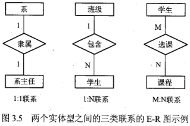

      两个以上的实体型之间的联系

      - 两个以上的实体型之间也会存在一对一、一对多或多对多的联系。

      单个实体型内的联系

      - 同一个实体集内的各实体之间也可以存在一对多对多的联系。

2. 局部信息结构设计

   1. 确定局部范围
   2. 选择实体
   3. 选择实体的关键字属性
   4. 确定实体间联系
   5. 确定实体的属性

   

3. 全局信息结构设计

   1. 属性冲突
      - 属性域冲突，即属性值的类型、取值范围、取值集合的不同。例如年龄，有的是以出生日期的形式表示的，而有的是以整数的形式来表示的。
      - 属性取值单位冲突。例如，人的身高有的是以米为度量单位，有的则是以厘米为表示单位。
   2. 命名冲突
      - 同名异义，即不同意义的实体类型名或联系类型名在不同的局部应用中具有相同的名字。
      - 异名同义，即同一意义的实体类型名或联系类型名在不同的局部应用中具有不同的名字。
   3. 结构冲突
      - 同一对象在一个局部 E-R 图中作为实体，而在另一个局部 E-R 图中作为属性
      - 同一实体在不同的 E-R 图中属性个数和类型不同。
      - 实体之间的联系在不同的 E-R 图中是不同的类型。

   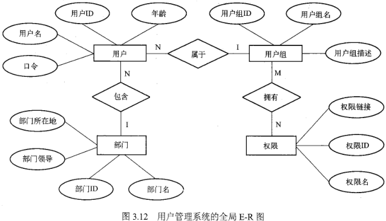

### 3.3.3 逻辑结构设计方法

1. E-R图向关系模型的转换
   1. 一个实体型转换为一个关系模式。
      - 实体的属性作为关系的属性，实体的码作为关系的码。
   2. 一个一对一（1:1）联系可以转换为一个独立的关系模式，也可以与任意一端对应的关系模式合并。
      - 如果转换为一个独立的关系模式，则与该联系相连的各实体的码以及联系本身的属性均转换为关系的属性，每个实体的码均是该关系的候选码；
      - 如果与某一端实体对应的关系模式合并，则需要在该关系模式的属性中加入另一个关系模式的码和联系本身的属性。
   3. 一个一对多（1:N）联系可以转换为一个独立的关系模式，也可以与N端对应的关系模式合并。
      - 如果转换为一个独立的关系模式，则与该联系相连的各实体的码以及联系本身的属性均转换为关系的属性，而关系的码为N端实体的码。
   4. 一个多对多（M:N）联系转换为一个关系模式。
      - 与该联系相连的各实体的码以及联系本身的属性均转换为关系的属性，而关系的码为各实体码的组合。
   5. 三个或三个以上实体间的一个多元联系可以转换为一个关系模式。
      - 与该多元联系相连的各实体的码以及联系本身的属性均转换为关系的属性，而关系的码为各实体码的组合
   6. 具有相同码的关系模式可合并。
2. 对关系数据模型进行优化
   1. 确定各属性间的函数依赖关系。
   2. 对于各个关系模式之间的数据依赖进行极小化处理，消除冗余的联系。
   3. 判断每个关系模式的范式，根据实际需要确定最合适的范式。
   4. 按照需求分析阶段得到的处理要求，分析这些模式对于这样的应用环境是否合适，确定是否要对某些模式进行合并或分解。
   5. 对关系模式进行必要的分解，提高数据操作的效率和存储空间的利用率
3. 设计面向用户的外模式
   1. 可以通过视图机制在设计用户视图时，重新定义某些属性的别名，使其更符合用户的习惯，以方便使用。
   2. 可以对不同级别的用户定义不同的视图，以保证系统的安全性。
   3. 简化用户对系统的使用。如果某些局部应用中经常要使用某些很复杂的查询，为了方便用户，可以将这些复杂查询定义为视图，用户每次只对定义好的视图进行查询，如此大大简化了用户的使用。

### 3.3.4 物理结构设计方法

1. 建立索引
   - 索引的建立是通过 DBMS 提供的有关命令来实现的（可参阅本书43.3小节）。
     - 由于建立索引会带来维护索引空间的开销，因而建立索引的数据对象通常应具有较少的插入、修改和删除操作。
     - 一般，用以建立索引的那些属性也应是其所在关系中使用频率较高的属性。
   - 建立索引的方式通常有静态和动态两种。
     - 静态建立索引是指应用人员预先建立索引，旦建立，后续的应用程序均可直接使用该索引存取数据，它多适合于用户较多且使用周期相对较长的数据；
     - 动态建立索引是指应用人员在程序内外临时建立索引，它多适合于单独用户或临时性使用要求情况。
2. 建立聚集
   - 聚集是将相关数据集中存放的物理存储技术，借以提高IO的数据命中率而改善存取速度，其功能由具体的DBMS所提供，如 MySQL。
     - 所谓集中存放是指将相关数据尽可能地存放于一个物理块中，或一个磁道中，或一个柱面中，或相邻区域（块、磁道、柱面）中。
     - 例如，一个教师关系中含姓名、出生时间、性别、职称等属性，若1975年出生的教师有100个，则该关系中含有100个1975年出生教师数据的元组，最坏情况下，100个元组分布在100个不同物理块中，当按出生时间访问1975年出生的教师信息时，则可能需要100次IO（假定一次IO读入一个物理块）。若按出生时间集中存放数据，则一次能读入多个1975年出生的教师数据。
   - 数据聚集结构的一种有效方式是块结构方式，块与块之间由指针连接，一个块对应于一个物理分区。数据聚集可在一个或多个关系上建立。若在一个关系上建立聚集，则可按垂直或水平方向对关系分组。可将常用或经常一起使用的属性值或元组值集中存放，其他的则另外存放。若在多个关系上建立聚集，则将多个不同关系中常在一起使用的数据集中存放。无论采用何种方式，数据使用频率较高的数据才有必要建立聚集，数据量通常也较大，且更新操作应较少。
   - 对关系数据库系统来说，就市场上流行的主要DBMS而言，建立了索引和聚集之后，其物理设计就基本完成，而逻辑模型本身通常并不需要进行改变。此时的物理模型实际上就是关于在逻辑模型上建立了哪些索引与聚集，以及如何建立的说明。显然，程序编制说明中应加入如何利用索引和聚集来加快数据访问的速度，从而提高应用程序执行效率的相关说明。


# 第四章 SQL与关系型数据库基本操作

## 第一节 SQL 概述

### 4.1.1 SQL 的发展

- SQL标准是1986年10月由美国国家标准局颁布

### 4.1.2 SQL 的特点

1. SQL不是某个特定数据库供应商专有的语言。几乎所有重要的关系数据库管理系统都支持SQL，所以掌握SQL可以帮助用户与几乎所有的关系数据库进行交互。
2. SQL简单易学。它的语句全都是由具有很强**描述性的英语单词所组成**，而且这些单词的数目不多。
3. SQL尽管看上去很简单，但它实际上是一种强有力的语言，灵活使用其语言元素可以进行非常复杂和高级的数据库操作。
4. 需要注意的是：SQL语句**不区分大小写**。许多SQL开发人员习惯于对所有SQL**关键字使用大写**，而对所有**列和表的名称使用小写**，这样的书写方式可使代码更易于阅读和调试，本书列举的实例也将遵照这个方式。

### 4.1.3 SQL 的组成

1. 数据定义语言(Data Definition Language,DDL)
   - `CREATE`：用于创建数据库或数据库对象。
   - `ALTER`：用于对数据库或数据库对象进行修改。
   - `DROP`：用于删除数据库或数据库对象。
2. 数据操纵语言(Data Manipulation Language, DML)
   1. `SELECT`：用于从表或视图中检索数据，其是数据库中使用最为频繁的SQL语句
   2. `INSERT`：用于将数据插入到表或视图中。
   3. `UPDATE`：用于修改表或视图中的数据，其既可修改表或视图中一行数据，也可同时修改多行或全部数据
   4. `DELETE`：用于从表或视图中删除数据，其中可根据条件删除指定的数据。
3. 数据控制语言(Data Control Language, DCL)
   1. `GRANT`：用于授予权限，可把语句许可或对象许可的权限授予其他用户和角色。
   2. `REVOKE`：用于收回权限，其功能与 GRANT相反，但不影响该用户或角色从其他作为成员继承许可权限。
4. 嵌入式和动态 SQL 规则
5. SQL 调用和会话规则

## 第二节 MySQL 预备知识

### 4.2.1 MySQL 使用基础

1. LAMP（ Linux+ Apache+MySQL+ PHP/Perl/Python），即使用Linx作为操作系统， Apache作为Wb服务器， MySQL作为数据库管理系统，PHP、Perl或 Python语言作为服务器端脚本解释器
2. WAMP（ Windows+ Apache+ MySQL+ PHP/Perl/Python），即使用 Windows作为操作系统， Apache作为Web服务器， MySQL作为数据库管理系统，PHP、Perl或 Python语言作为服务器端脚本解释器

### 4.2.2 MySQL 中的 SQL

1.  常量

   常量是指在程序运行过程中值不变的量，也称为字面值或标量值。常量的使用格式取决于值的数据类型，可分为字符串常量、数值常量、十六进制常量、时间日期常量、位字段值、布尔值和NULL值。

   - 字符串常量是指用单引号或双引号括起来的字符序列，分为 ASCⅡ 字符串常量和Unicode 字符串常量。
   - 数值常量可以分为整数常量和浮点数常量。其中，整数常量是不带小数点的十进制数；浮点数常量则是使用小数点的数值常量。
   - 一个十六进制值通常指定为一个字符串常量，每对十六进制数字被转换为一个字符，其最前面有一个大写字母“X”或小写字“x”
   - 日期时间常量是用单引号将表示日期时间的字符串括起来而构成的。
   - 可以使用`b'value'`格式符号书写位字段值。其中， value是一个用0或1书写的二进制值。位字段符号可以方便地指定分配给BIT列的值。
   - 布尔值只包含两个可能的值，分别是TRUE和 FALSE。其中， FALSE的数字值是
     “0”，TRUE的数字值是“1”。
   - NUL值通常用于表示“没有值”“无数据”等意义，它与数字类型的“0”或字符串类型的空字符串是完全不同的。

2. 变量

   - 变量用于临时存储数据，变量中的数据可以随着程序的运行而变化。变量有名字和数据类型两个属性。其中，变量的名字用于标识变量，变量的数据类型用于确定变量中存储数值的格式和可执行的运算。
   - 在 MySQL中，变量分为用户变量和系统变量。在使用时，用户变量前常添加一个符号
     @”，用于将其与列名区分开；而大多数系统变量应用于其他SQL语句中时，必须在系统变量名称前添加两个“@”符号。

3. 运算符

   - 常用的运算符算术运算符有：
     - `+（加）、-（减）、*（乘）、/（除）和%（求模）` 5种运算。
   - 位运算符有：
     - `&（位与）、|（位或）、^（位异或）、~（位取反）、>（位右移）、<（位左移）`。
   - 比较运算符有：
     - `=（等于）、>（大于）、<（小于）、>（大于等于）、<=（小于等于）、∞（不等于）、！=（不等于）、<→（相等或都等于空）`
   - 逻辑运算符有：
     - `NOT或！（逻辑非）、AND或&&（逻辑与）、OR或‖（逻辑或）XOR（逻辑异或)`

4. 表达式

   - 表达式是常量、变量、列名、复杂计算、运算符和函数的组合。
   - 一个表达式通常可以得到一个值。与常量、变量一样，表达式的值也具有某种数据类型，可能的数据类型有字符类型、数值类型、日期时间类型。因而，根据表达式的值的数据类型，表达式可分为字符型表达式、数值型表达式和日期表达式。

5. 内置函数

   - 数学函数，例如`ABS()`函数、`SORT()`函数；
   - 聚合函数，例如 `COUNT()`函数；
   - 字符串函数，例如 `ASC()`函数、 `CHAR()`函数
   - 日期和时间函数，例如`NOW()`函数、 `YEAR()`函数；
   - 加密函数，例如 `ENCODE()`函数、 `ENCRYPT()`函数
   - 控制流程函数，例如`IF()`函数、 `IFNULL()`函数；
   - 格式化函数，例如 `FORMAT()`函数
   - 类型转换函数，例如`CAST()`函数；
   - 系统信息函数，例如 `USER()`函数、`VERSION()`函数。

## 第三节 数据定义

### 4.3.1 数据库模式定义

1. 创建数据库

   ```mysql
   CREATE {DATABASE|SCHEMA}[IF NOT EXISTS] db_name
   [DEFAULT] CHARACTER SET[=]charset_name
   |[DEFAULT] COLLATE[=]collation_name
   ```

   - `[]`标示其内容为可选项;
   -  `|` 用于分隔花括号中的选择项,表示可任选其中一项来与花括号外的语法成分共同组成SQL语句命令, 即选项彼此间是"或"的关系
   - `db_name` 用于标示具体的数据库命名,且该数据库名必须符合操作系统文件夹命名规则, 而在 MySQL中则不区分大小写;
   - 关键字 `DEFAULT` 用于指定默认值;
   - 关键字 `CHARACTER SET` 用于指定数据库字符集 `Charset`;
   - 关键字 `COLLATE` 用于指定字符集的校对规则;
   - 关键字 `IF NOT EXISTS` 用于在创建数据库前进行判断,只有该数据库目前尚不存在时才执行 `CREATE DATABASE` 操作,即此选项可以避免出现数据库已经存在而再新建的错误

   例 4.1

   ```mysql
   CREATE DATABASE mysql_test;
   ```

   

2. 选择数据库

   ```mysql
   USE db_name;
   ```

   

3. 修改数据库

   ```mysql
   ALTER{DATABASE|SCHEMA}[db_name]
   alter_specification...
   ```

   例 4.2 修改已有数据库 mysql test的默认字符集和校对规则

   ```mysql
   ALTER DATABASE mysql_test
   DEFAULT CHARACTER SET gb2312
   DEFAULT COLLATE gb2312_chinese_ci;
   ```

   

4. 删除数据库

   ```mysql
   DROP{DATABASE|SCHEMA}{IF EXISTS}db_name;
   ```

   例 4.3 

   ```mysql
   DROP DATABASE IF EXISTS mytest;
   ```

   

5. 查找数据库

   ```mysql
   SHOW{DATABASE|SCHEMAS}
   [LIKE 'pattern'|WHERE expr]
   ```

   例 4.4 

   ```mysql
   SHOW DATABASES;
   ```

   

### 4.3.2 表定义与操作

1. 创建表

   `CREATE TABLE`语句的语法内容较多,主要由表创建定义( create definition)、表选项
   ( table options)和分区选项( partition options)等内容所构成 

   ```mysql
   CREATE [TEMPORARY]TABLE tbl_name
   (
   字段名1 数据类型 [列级完整性约束条件][默认值]
     [,字段名2 数据类型[列级完整性约束条件][默认值]]
     [,...]
     [,表级完整性约束条件]
   )[ENGINE=引擎类型];
   ```

   例 4.5 在一个已有数据库`mysql_list`中新建一个包含客户姓名、性别、地址、联系方式等内容的客户基本信息表, 要求将客户的 id 号指定为该表的主键.

   ```mysql
   USE mysql_test;
   mysql> CREATE TABLE customers
       -> (
       -> cust_id INT NOT NULL AUTO_INCREMENT,
       -> cust_name CHAR(50) NOT NULL,
       -> cust_sex CHAR(1) NOT NULL DEFAULT 0,
       -> cust_address CHAR(50) NULL,
       -> cust_contact CHAR(50) NULL,
       -> PRIMARY KEY(cust_id)
       -> );
   Query OK, 0 rows affected (0.17 sec)
   ```

   1. 临时表与持久表
      - `TEMPORARY` 为临时表, 不加为持久表
      - 临时表只有创建者可见, 断开连接会自动删除
   2. 数据类型
   3. 关键字 `AUTO_INCREMENT`
      - 为表中数据类型为整型的列设置自增属性
      - 每个表只能有一个自增列, 并且它必须被索引
   4. 指定默认值 `DEFAULT`
      - 而如若该列被定义为 `NOT NULL`,则默认值取决于该列的类型
      - 对于一个`AUTO INCREMENT`列,默认值是在顺序中的下一个值;
      - 对于除 `TIMESTAMP`以外的日期和时间类型,默认值是该类型适当的"零"值;
      - 对于表中第一个 `TIMESTAMP`列,默认值是当前的日期和时间
   5. `NULL` 值
   6. 主键 `PRIMARY KEY()`

2. 更新表

   1. `ADD[COLUMN]` 子句

      - 例 4.6 向数据库 `mysql_test`的表 `customers`中添加一列,并命名为 `cust_city`, 用于描述用户所在的城市, 要求其不能为`NULL`, 默认值为字符串`Wuhan`, 且该列位于原表 `cust_sex`列之后

        ```mysql
        mysql> ALTER TABLE mysql_test.customers
            -> ADD COLUMN cust_city char(10) NOT NULL DEFAULT 'Wuhan' AFTER cust_sex;
        ```

      - 通过关键字" `AFTER`"在原表 `cust_sex`列之后添加了一个新列 `cust_city`,也可通过关键字" FIRST"将新列 `cust_city`作为原表的第一列,若不指定这两个关键字,则新列会添加到原表的最后.另外,此例中对表名的指定采用的是完全限定的表名方式, 即" `db_name.tbl_name`"的表名格式

      - 类似地,可以在 `ALTER TABLE`语句中通过使用 `ADDPRIMARY KEY`子句、`ADD FOREIGN KEY`子句、 `ADD INDEX`子句为原表添加一个主键、外键和索引等.

   2. `CHANGE[COLUMN]` 子句

      - 例 4.7 将数据库 `mysql test`中表 `customers`的 `cust sex`列重命名为`sex`,且将其数据类型更改为字符长度为 1 的字符数据类型`char(1)`,允许其为`NULL`,默认值为字符常量`M`.

        ```mysql
        mysql> ALTER TABLE mysql_test.customers
            -> CHANGE COLUMN cust_sex sex char(1) NULL DEFAULT 'M';
        Query OK, 0 rows affected (0.04 sec)
        ```

      - 如果试图改变的数据类型与原有数据类型不兼容，SQL命令则不会被执行，且系统会提示错误；而在类型兼容的情况下，该列的数据可能会被截断

   3. `ALTER[COLUMN] 子句`

      - 例 4.8 将数据库 `mysql test`中表 `customers`的 `cust city`列的默认值修改为字符常量 ‘Beijing’

        ```mysql
        mysql> ALTER TABLE mysql_test.customers
            -> ALTER COLUMN cust_city SET DEFAULT 'Beijing';
        Query OK, 0 rows affected (0.04 sec)
        ```

        

   4. `MODIFY[COLUMN] 子句`

      - 例 4.9 将数据库 `mysql test`中表 `customers`的 `cust name`列的数据类型由之前的字符长度为 50 的定长字符数据类型 `char（50）`更改为字符长度为 20 的定长字符数据类型 `char（20）`，并将此列设置成表的第一列。

        ```mysql
        mysql> ALTER TABLE mysql_test.customers
            -> MODIFY COLUMN cust_name char(20) FIRST;
        ```

        

   5. `DROP[COLUMN] 子句`

      - 例 4.10 删除数据库 `mysql test`中表 `customers`的 `cust contact`列。

        ```mysql
        mysql> ALTER TABLE mysql_test.customers
            ->  DROP COLUMN cust_contact;
        Query OK, 0 rows affected (0.05 sec)
        ```

      - 类似地,也可分别通过在 `ALTER TABLE` 语句中添加 `DROP PRIMARY KEY`子句、 `DROP FOREIGN KEY`子句、`DROP INDEX`子句卸除原表的主键、外键和索引等

   6. `RENAME[TO]` 子句

      - 例 4.11使用 `RENAME [TO]`子句,**重命名数据库** `mysql test`中表 `customers`的表名为`backup customers`

        ```mysql
        mysql> ALTER TABLE mysql_test.customers
            -> RENAME TO mysql_test.backup_customers;
        Query OK, 0 rows affected (0.03 sec)
        ```

        

3. 重命名表

   - ```mysql
     RENAME TABLE tbl_name TO new_tbl_name
     [,tbl_name2 to new_tbl_name2] ...
     ```

   - 例 4.12 使用 `RENAME TABLE`语句,将例 4.1 中的表 `backup customers`再重新命名为`customer`

     ```mysql
     mysql> RENAME TABLE mysql_test.backup_customers TO mysql_test.customers;
     Query OK, 0 rows affected (0.05 sec)
     ```

     

4. 删除表

   - ```mysql
     DROP [TEMPORARAY] TABLE [IF EXISTS]
     	tbl_name[,tbl_name]...
     	[RESTRICT|CASXADE]
     ```

   - 需要注意的是: `DROP TABLE`语句可以同时删除多个表(包括临时表), 但操作者必须拥有该命令的权限;

     - 当表被删除时, 其中存储的数据和分区信息均会被删除, 所以使用该语句须格外小心, 但操作者在该表上的权限并不会自动被删除

5. 查看表

   1. 显示表的名称

      ```mysql
      SHOW [FULL] TABLES {FROM|IN} db_name]
      [LIKE'pattern'|WHERE expr]
      ```

      - 例 4.13 显示数据库 `mysql test`中所有的表名

        ```mysql
        mysql> SHOW TABLES;
        +----------------------+
        | Tables_in_mysql_test |
        +----------------------+
        | customers            |
        +----------------------+
        1 row in set (0.00 sec)
        ```

        

   2. 显示表的结构

      ```mysql
      SHOW [FULL] COLUMNS {FROM|IN} tbl_name [{FROM|IN} db_name]
      [LIKE'pattern'|WHERE expr]
      ```

      ```mysql
      {DESCRIBE|DESC} tbl_name[col_name|wild]
      ```

      MySQL 支持用 `DESCRIBE`作为 `SHOW COLUMNS FROM`的一种快捷方式

      - 例 4.14 显示数据库 `mysql test`中表 `customers`的结构

        ```mysql
        mysql> DESC mysql_test.customers;
        +--------------+----------+------+-----+---------+----------------+
        | Field        | Type     | Null | Key | Default | Extra          |
        +--------------+----------+------+-----+---------+----------------+
        | cust_name    | char(20) | YES  |     | NULL    |                |
        | cust_id      | int(11)  | NO   | PRI | NULL    | auto_increment |
        | sex          | char(1)  | YES  |     | M       |                |
        | cust_city    | char(10) | NO   |     | Beijing |                |
        | cust_address | char(50) | YES  |     | NULL    |                |
        +--------------+----------+------+-----+---------+----------------+
        5 rows in set (0.00 sec)
        ```

        

### 4.3.3 索引定义

- DBMS 根据表中的一列或若干列按照一定顺序建立的列值与记录行之间的对应关系表,因而索引实质上是一张描述索引列的列值与原表中记录行之间一一对应关系的有序表
- 在列上创建了索引之后,查找数据时可以直接根据该列上的索引找到对应记录行的位置, 从而快速地查找到数据
  1. 索引是以文件的形式存储的，DBMS会将一个表的所有索引保存在同一个索引文件中，索引文件需要占用磁盘空间。如果有大量的索引，索引文件可能会比数据文件更快地达到最大的文件尺寸。特别是如果在一个大表上创建了多种组合索引，索引文件会膨胀得非常快。
  2. 索引在提高查询速度的同时，却会降低更新表的速度。在更新表中索引列上的数据时，索引会被自动更新，以确保索引树与表中的内容保持一致，这可能需要重新组织一个索引。如果表中的索引很多，这会非常浪费时间，由此会降低 INSERT、 UPDATE、 DELETE和其他写入操作的效率。表中的索引越多，则更新表的时间就会越长。
- 根据具体用途，索引在逻辑上通常包含有如下几类
  1. 普通索引（ `INDEX`）
     这是最基本的索引类型，它没有任何限制。创建普通索引时，通常使用的关键字是`INDEX`或`KEY`
  2. 唯一性索引（ `UNIQUE`）
     这类索引和普通索引基本相同，只是有一点区别，即索引列中的所有值都只能出现一次，必须是唯一的。创建唯一性索引时，通常使用的关键字 `UNIQUE`。
  3. 主键（ `PRIMARY KEY`）
     主键是一种唯一性索引。创建主键时，必须指定关键字 `PRIMARY KEY`，且不能有空值。主键一般是在创建表的时候指定，也可以通过修改表的方式添加主键，并且每个表只能有一个主键。

1. 索引的创建

   1. 使用 `CREATE INDEX`语句创建索引

      可以使用专门用于创建索引的 `CREATE INDEX`语句在一个已有的表上创建索引，但该语句不能创建主键。

      ```mysql
      CREATE[UNIQUE]INDEX index_name
      ON tbl_name(index_col_name,...)
      ```

      `index_col_name`的格式为：

      ```mysql
      col_name[(length)][ASC|DESC]
      ```

      - 可选项“ `UNIQUE`”关键字用于指定创建唯一性索引；“ `index_name`”用于指定索引名，一个表可以创建多个索引，但每个索引在该表中的名称必须是唯一的；“ `tbl_name`”用于指定要建立索引的表名；“ `index_col_name`”是关于索引列的描述。

      - 关于索引列的描述可包含这样三个语法要素：“ `col_name`”用于指定要创建索引的列名，通常可考虑将查询语句中在 `WHERE`子句和`JOIN`子句里出现的列来作为索引列可选项“ `length`”，用于指定使用列的前 `length`个字符来创建索引，使用列的一部分创建索引有利于减小索引文件的大小，节省磁盘空间；关键字“`ASC`”或“`DESC`”是可选项，用于指定索引按升序（ASC）还是降序（`DESC`）来排列，默认时为`ASC`

      - 例 4.5 在数据库 `mysql_test`的表 `customers`上，根据客户姓名列的前三个字符创建个升序索引 `index_customers`

        ```mysql
        mysql> CREATE INDEX index_customers
            -> ON mysql_test.customers(cust_name(3) ASC);
        Query OK, 0 rows affected (0.05 sec)
        ```

        该语句成功执行后，接着输入语句 `SHOW INDEX FROM mysql_test.customers`即可查看到已建立的索引

      - 例 4.16 在数据库 `mysql test`的表 `customers`上，根据客户姓名列和客户 id 号创建一个组合索引 `index_cust`

        ```mysql
        mysql> CREATE INDEX index_cust
            -> ON mysql_test.customers(cust_name,cust_id);
        Query OK, 0 rows affected (0.02 sec)
        ```

   2. 使用 `CREATE TABLE`语句创建索引

      1. 语法项 `(CONSTRAINT [symbol]] PRIMARY KEY(index_col_name;…)`, 用于表示在创建新表的同时创建该表的主键

      2. 语法项 `{INDEX|KEY}[index_name](index_col_name,…)`, 用于表示在创建新表的同时创建该表的索引

      3. 语法项 `[CONSTRAINT[symbol]] UNIQUE [INDEX|KEY][index_name](inde_name,…)`,用于表示在创建新表的同时创建该表的唯一性索引;

      4. 语法项`[CONSTRAINT[symbo]FOREIGN KEY[lindex name](Gindex_col_name,…)`,用于表示在创建新表的同时创建该表的外键

         - 其中,关键字"`KEY`"是关键字 `INDEX`的同义词;
         - 关键字" `CONSTRAINT`"用于为主键、 `UNIQUE`键、外键定义一个名字;
         - 在使用 `CREATE TABLE`语句定义列选项的时候,可以通过直接在某个列定义后面添加关键字" `PRIMARY KEY`"的方式来创建主键,而当主键是由多个列组成的多列索引时,则不能使用这种方法,只能通过在语句最后加上一个 `PRIMARY KEY( col name,…)`子句的方式来实现

         - 例 4.17 在已有数据库 `mysql test`上新建一个包含产品卖家 id 号、姓名、地址、联系方式、售卖产品类型、当月销量等内容的产品卖家信息表 seller ,要求在创建表的同时, 为该表添加由卖家 id 号和售卖产品类型组成的联合主键, 并在当月销量上创建索引

         ```mysql
         mysql> CREATE TABLE seller
             -> (
             -> seller_id int NOT NULL AUTO_INCREMENT,
             -> seller_name char(50) NOT NULL,
             -> seller_adderss char(50) NULL,
             -> seller_contact char(50) NULL,
             -> product_type int(5) NOT NULL,
             -> sales int NULL,
             -> PRIMARY KEY(seller_id,product_type),
             -> INDEX index_seller(sales)
             -> );
         Query OK, 0 rows affected, 1 warning (0.03 sec)
         ```

         主键都不能为空

   3. 使用 `ALTER TABLE`语句创建索引

      1. 语法项 `ADD{ INDEX KEY} index name](index col name,…)`,用于表示在修改表的同时为该表添加索引
      2. 语法项 `ADD[ CONSTRAINT[ symbol]] PRIMARY KEY( Gindex col name;…)`,用于表示在修改表的同时为该表添加主键;
      3. 语法项 `ADD[ CONSTRAINT[ symbolJUNIQUE[ NDEX KEY][ index name]( index col name,…)`,用于表示在修改表的同时为该表添加唯一性索引;
      4. 语法项 `ADD[ CONSTRAINT[ symbol]FOREIGN KEY[ lindex name]( index col name;…)`,用于表示在修改表的同时为该表添加外键.

      - 例 4.8 使用 `ALTER TABLE`语句在数据库 `mysql test`中表 `seller`的姓名列上添加一个非唯一的索引,取名为 `index_seller_name`

        ```mysql
        mysql> ALTER TABLE mysql_test.seller
            -> ADD INDEX index_seller_name(seller_name);
        Query OK, 0 rows affected (0.02 sec)
        ```

2. 索引的查看

   ```mysql
   SHOW {INDEX|INDEXES|KEYS}
   {FROM|IN} tbl_name
   [{FROM|IN} db_name]
   [WHERE expr]
   ```

   

3. 索引的删除

   1. 使用 `DROP INDEX`语句删除索引

      ```mysql
      DROP INDEX index_name ON tbl_name
      ```

      其中," `index_name`"用于指定要删除的索引名," `tbl_name`"用于指定该索引所在的表

      - 例 4.19 删除 例 4.16 中所创建的索引 `index_cust`

        ```mysql
        mysql> DROP INDEX index_cust ON mysql_test.customers;
        Query OK, 0 rows affected (0.02 sec)
        ```

   2. 使用 `ALTER TABLE`语句删除索引

      1. 选用 `DROP PRIMARY KEY`子句用于删除表中的主键, 由于一个表中只有一个主键, 其也是一个索引;

      2. 选用 `DROP INDEX`子句用于删除各种类型的索引

      3. 选用 `DROP FOREIGN KEY`子句用于删除外键

         - 例 4.20 使用 `ALTER TABLE`语句删除数据库 `mysql test`中表 `customers`的主键和索引`index_customers`

           ```mysql
           mysql> ALTER TABLE mysql_test.customers
               -> #DROP PRIMARY KEY,
               -> DROP INDEX index_customers;
           ```

           主键有 auto_increment，先清除自增才能删 ` MODIFY COLUMN cust_id INT NOT NULL;`

           删除后设置回 KEY

           ```mysql
           mysql> ALTER TABLE mysql_test.customers
               -> MODIFY COLUMN cust_id INT NOT NULL KEY AUTO_INCREMENT FIRST
               -> ADD COLUMN cust_contact char(50) NULL
               -> CHANGE COLUMN sex cust_sex char(1) NULL DEFAULT 'M';
Query OK, 0 rows affected (0.04 sec)
           ```
           
           ```mysql
           mysql> DESC mysql_test.customers;
           +--------------+----------+------+-----+---------+----------------+
           | Field        | Type     | Null | Key | Default | Extra          |
           +--------------+----------+------+-----+---------+----------------+
           | cust_id      | int(11)  | NO   | PRI | NULL    | auto_increment |
           | cust_name    | char(20) | YES  |     | NULL    |                |
           | cust_sex     | char(1)  | YES  |     | M       |                |
           | cust_city    | char(10) | NO   |     | Beijing |                |
           | cust_address | char(50) | YES  |     | NULL    |                |
           | cust_contact | char(50) | YES  |     | NULL    |                |
           +--------------+----------+------+-----+---------+----------------+
           6 rows in set (0.00 sec)
           ```
           
           

## 第四节 数据更新

### 4.4.1 插入数据 

1. 使用 `INSERT...VALUES` 语句插入单行或多行元组数基

   ```mysql
   INSERT [INTO] tbl_name[(col_name,...)]
   {VALUES|VALUE}({expr|DEFAULT},...),(...),...
   ```

   1. " `tbl_name`"指定欲被插入数据的表名.

   2. " `col_name`"指定需要插入数据的列名列表; 

      1. 如果要向表中所有列插入数据, 则全部列名均可省略; 
      2. 如果只是向表的部分列插入数据, 则需要明确指定这些列的列名;
      3. 而对于那些没有被指定的列, 它们的值可根据列的**默认值或相关属性**来确定, 通常MySQL是按照下列原则进行处理的:
         1. 对于具有标志( `IDENTITY`)属性的列, 系统会自动生成序号值来唯一标志该列;
         2. 具有默认值的列, 其值可通过在 `INSERT` 语句中指定关键字" `DEFAULT`"将其设为默认值;
         3. 没有默认值的列, 若允许为空值, 则其值可通过在 `INSERT` 语句中指定关键字
            "`NULL`" 将其设为空值, 若不允许为空值, 则 `INSERT` 语句执行出错;
         4. 对于类型为 `TIMESTAMP`的列,系统会为其自动赋值
         5. 由于 `AUTO INCREMENT`属性列的值是在表中其他列被赋值之后生成的,所以在对表中其他列做任何赋值操作(如 `INSERT`语句)时,对该 `AUTO INCREMENT`属性列的引用只会返回数字0

   3. 通过关键字" `VALUES`"或"`VALUE`"引导的子句,其包含各列需要插入的数据清单; 数据清单中数据的顺序必须与列的顺序相对应,同时该子句中的值可以是:

      1. "`expr`",表示一个常量、变量或一个表达式,也可以是空值`NULL`,其值的数据类型要与列的数据类型一致,如果表达式的类型与列值不匹配,这样做会造成类型转化或插入语句出错,另外当列值为字符型时,需要用单引号括起
      2. 关键字" `DEFAULT`",即用于指定此列值为该列的默认值,前提是该列之前已经明确指定了默认值,否则插入语句会出错.

      - **例 4.21** 使用 `INSERT… VALUES`语句向数据库 `mysql test`的表 `customers`中插入这样行完整数据:`(901,张三,F,北京市,朝阳区)`

        ```mysql
        mysql> INSERT INTO mysql_test.customers
            -> VALUES(901,'张三','F','北京市','朝阳区');
        Query OK, 1 row affected (0.07 sec)
        ```

      - **例 4.22** 使用 `INSERT… VALUES`  语句向数据库 `mysql test`的表 `customers`中插入一行数据,要求该数据目前只用明确给出 `cust name`列和 `cust address`列的信息,即分别为"李四"和"武汉市",而 `cust id`列的值由系统自动生成, `cust sex`列选用表中默认值,另外`cust contact`列的值暂不确定,可不用指定

        ```mysql
        mysql> INSERT INTO mysql_test.customers
            -> VALUES(0,'李四',DEFAULT,'武汉市',NULL);
        Query OK, 1 row affected (0.01 sec)
        ```

        VALUES语句的使用中没有给出待插入表的列表清单 , 最好将其改为这样的SQL语句形式

        ```mysql
        mysql> INSERT INTO mysql_test.customers(cust_id,cust_name,cust_sex,cust_address,cust_contact)
            -> VALUES(0,'王五',DEFAULT,'上海市',NULL);
        Query OK, 1 row affected (0.01 sec)
        ```

        其中,第一个列 `cust id`指定为数字0,也可设置为`NULL`,这是因为每次插入一个新行时,该列会由 MySQL在前一行该列值的基础上自动增量;

2. 使用 `INSERT...SET` 语句插入部分列值数据

   ```mysql
   INSERT[INTO]tbl_name
   SET col_name={expr|DEFAULT},...
   ```

   - 例 4.23 使用 `INSERT…SET`语句来实现 例 4.22 的数据插入需求

     ```mysql
     mysql> INSERT INTO mysql_test.customers
         -> SET cust_name='李四',cust_address='武汉市',cust_sex=DEFAULT;
     Query OK, 1 row affected (0.01 sec)
     ```

     

3. 使用 `INSERT...SELECT` 语句插入子查询数据

   ```mysql
   INSERT [INTO] tbl_name[(col_name,...)]
   SELECT...
   ```

   - 在此语法中: `SELECT`子句用于快速地从一个或多个表中取出数据,并将这些数据作为行数据插入到另一个表中, `SELECT`子句返回的是一个查询到的结果集, `INSERT`语句将这个结果集插入到指定表中,其中结果集中每行数据的字段数、字段的数据类型必须与被操作的表完全一致

### 4.4.2 删除数据

- ```mysql
  DELETE FROM tbl_name
  [WHERE where_condition]
  [ORDER BY ...]
  [LIMIT row_count]
  ```

  - " `tbl name`"指定要删除数据的表名;
  - 可选项 `WHERE`子句表示为删除操作限定删除条件,从而删除特定的行,
    - 若省略 `WHERE`子句,则表示删除该表中的所有行,但表的定义仍在数据字典中,即 `DELETE`语句删除的是表中的数据,而不是关于表的定义;
  - 可选项 `ORDER BY`子句表示各行将按照子句中指定的顺序进行删除;
  - 可选项`LIMT`子句用于告知服务器在控制命令被返回到客户端前被删除的行的最大值

- 例 4.24 使用 `DELETE`语句删除数据库 `mysql test`的表 `customers`中客户名为"王五"
  的客户信息

  ```mysql
  mysql> DELETE FROM mysql_test.customers
      -> WHERE cust_name='王五';
  Query OK, 1 row affected (0.03 sec)
  ```

  

### 4.4.3 修改数据

- ```mysql
  UPDATE tbl_name
  SET col_name={expr1|DEFAULT}[,col_name2={expr2|DEFAULT}]...
  [WHERE where_condition] 
  [ORDER BY ...]
  [LIMIT row_count]
  ```

  - " `tbl name`"指定要修改的表的名称;
  - `SET`子句用于指定表中要修改的列名及其列值, 其中每个指定的列值可以是表达式, 也可以是该列所对应的默认值, 如果指定的是默认值,则用关键字" `DEFAULT`"表示列值;
  - 可选项 `WHERE`子句用于限定表中要修改的行,若不指定此子句,则 `UPDATE`语句会修改表中所有的行;
  - 可选项 `ORDER BY`子句用于限定表中的行被修改的次序;
  - 可选项`LMIT`子句用于限定被修改的行数

- 例 4.25 使用 `UPDATE`语句将数据库 `mysql test`的表 `customers`中姓名为"张三"的客户的地址更新为"武汉市"

  ```mysql
  mysql> UPDATE mysql_test.customers
      -> SET cust_address='南京市'
      -> WHERE cust_name='张三';
  Query OK, 1 row affected (0.01 sec)
  ```

  更新多个值用 `,` 分隔; 删除即设置为空; 


## 第五节 数据查询(难点)

### 4.5.1 SELECT 语句 

- 语法格式

  ```mysql
  SELECT 
  [ALL|DISTINCT|DISTINCTROW]
  select_expr[,select_expr ...]
  FROM table_refrences
  [WHERE where_condition]
  [GROUP BY{col_name|expr|position}
  	[ASC|DESC],... [WITH ROLLUP]]
  [HAVING where_condition]
  [ORDER BY {col_name|expr|position}
  	[ASC|DESC], ...]
  [LIMIT {[offset,] row_count|row_count OFFSET offset}]
  ```

  - `SELECT`子句用于指定输出的字段;
    - `FROM`子句用于指定数据的来源; 
    - `WHERE`子句用于指定数据的选择条件; 
    - `GROUP BY`子句用于对检索到的记录进行分组; 
    - `HAVING`子句用于指定组的选择条件; 
    - `ORDER BY`子句用于对查询的结果进行排序
  - `SELECT`子句和`FROM`子句是必需的,其他子句都是可选的,并且在`SELECT`语句的使用中, **所有被添加选用的子句必须依照 `SELECT` 语句的语法格式所罗列的顺序来使用**,
    - 例如,一个 `HAVING`子句必须位于 `GROUP BY`子句之后,并位于 `ORDER BY`子句之前,
    - 表 4.2 描述了在 `SELECT`语句中使用这些子句应遵守的次序及说明

  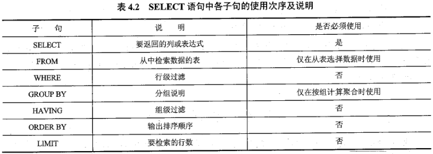

  - 在 `SELECT`语句的语法结构中, 三个关键字"`ALL`"" `DISTINCT`"" `DISTINC TROW`"为可选项,用于指定是否应返回结果集中的重复行; 
    - 若没有指定这些选项, 则默认为`ALL`,即 `SELECT`操作中所有匹配的行,包括可能存在的重复行,都将被返回;
    - 若指定选项`DISTINCT`或 `DISTINCTROW`,则会消除结果集中的重复行, 其中 `DISTINCT`或`DISTINCTROW`为同义词, 且这两个关键字应用于 `SELECT`语句中所指定的所有列, 而不仅仅是前置某个列

### 4.5.2 列的选择与指定

1. 选择指定的列

   - 选择一个或多个表中的某个或某些列作为 `SELECT`语句的查询列; 

     - 若查询列有多个,则各个列名之间需要用逗号进行分隔, 且查询结果返回时, 结果集中各列的次序是依照`SELECT`语句中指定列的次序给出的;
     - 若查询一个表中的所有列, 则可在 `SELECT`语句指定列的位置上直接使用星号(`*`)通配符, 而不必逐个列出所有列名, 此时结果集中各列的次序一般是这些列在表定义中出现的次序;
     - 列名的指定可以采用直接给出该列的名称的方式, 也可以使用完全限定的列名方式, 即" `tbl_name. col_name`"的列名格式

   - 例 4.26 查询数据库 `mysql test`的表 `customers`中各个客户的姓名、性别和地址信息

     ```mysql
     mysql> SELECT cust_name,cust_sex,cust_address
         -> FROM mysql_test.customers;
     ```

   - 例 4.27 查询数据库 `mysql test`的表 `customers`中各个客户的所有信息

     ```mysql
     mysql> SELECT *FROM mysql_test.customers;
     ```

     

2. 定义并使用列的别名

   ```mysql
   column_name[AS]column_alias
   ```

   - 例 4.28 查询数据库 `mysql test`的表 `customers`中客户的 `cust name`列、 `cust address`列和 `cust contact`,要求将结果集中 `cust address`列的名称使用别名"地址"替代.

     ```mysql
     mysql> SELECT cust_name,cust_address AS 地址,cust_contact
         -> FROM mysql_test.customers;
     ```

     

3. 替换查询结果集中的数据

   ```mysql
   CASE
   WHEN 条件1 THEN 表达式2
   	WHEN 条件2 THEN 表达式2
   	...
   ELSE 表达式
   END[AS]column_alias
   ```

   - 例 4.29 查询数据库 `mysql test`的表 `customers`中客户的 `cust name`列和 `cust sex`列, 要求判断结果集中 `cust sex`列的值, 如果该列的值为M, 则显示输出"男", 否则为"女", 同时在结果集的显示中将 `cust sex`列用别名"性别"标注

     ```mysql
     mysql> SELECT cust_name,
         -> CASE
         -> WHEN cust_sex='M' THEN'男'
         -> ELSE'女'
         -> END AS 性别
         -> FROM mysql_test.customers;
     ```

     

4. 计算列的值

   - **例 4.30** 查询数据库 `mysql test`的表 `customers`中每个客户的 `cust name`列、 `cust sex`列,以及对 `cust id`列加上数字 100后的值

     ```mysql
     mysql> SELECT cust_name,cust_sex,cust_id+100
         -> FROM mysql_test.customers;
     ```

     

5. 聚合函数

   - SELECT语句的语法项" `select expr`"也可以指定为聚合函数; 
   - 聚合函数通常是数据库系统中一类系统内置函数,常用于对一组值进行计算,然后返回单个值;
   - 它通常与 `GROUP BY`子句一起使用,如果 `SELECT`语句中有一个 `GROUP BY`子句,则这个聚合函数对所有列起作用,如果没有,则 `SELECT`语句只产生一行作为结果
   - 除 COUNT函数外,聚合函数忽略空值

   

   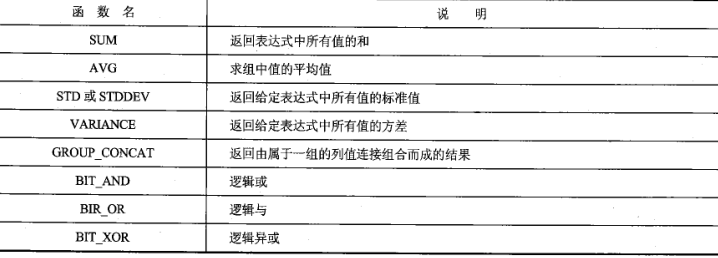

   

### 4.5.3 FROM 子句与多表连接查询

1. 交叉连接

   - 交叉连接,又称笛卡尔积; 在 MySQL中,它是通过在`FROM`子句中使用关键字" `CROSS JOIN`"来连接两张表, 从而实现一张表的每一行与另一张表的每一行的笛卡尔乘积, 并返回两张表的每一行相乘的所有可能的搭配结果, 供 `SELECT`语句中其他语法元素( 如 `WHERE`子句、 `GROUP BY`子句等)进行过滤和筛选操作

   - **例 4.31** 假设数据库中有两张表,分别是`tbl1`和`tbl2`, 现要求输出这两张表执行交叉联接后的所有数据集\

     ```mysql
     mysql> SELECT*FROM tbl CROSS JOIN tbl2;
     ```

     - 在`FROM`子句中也**可以省略关键字 `CROSS JOIN`**, 而使用逗号分隔交叉联接的两张表

       ```mysql
       mysql> SELECT*FROM tbl,tbl2;
       ```

       

2. 内连接

   ```mysql
   SELECT some_columns
   FROM table1
   INNER GION
   	table2
   ON some_conditions;
   ```

   - " `some columns`"用于指定需要检索的列的名称或列别名;

   - " `tablel`"和"`table2`"用于指定进行内连接的两张表的表名或表别名;

   - `ON`子句通过事先设定的连接条件`some conditions`", 来指定两张表按什么条件进行连接, 且连接条件中可采用任何一种比较运算符; 

   - 接条件" `some conditions`"一般使用的语法格式是:

     - ```mysql
       [<table>.]<列名或列别名><比较运算符>[<table2>.]<列名或列别名>
       ```

   - **例 4.32** 根据第二章描述的学生基本信息登记表 `tb student`和学生成绩表 `tb score`, 使用内连接查询每个学生及其选课成绩的详细信息;

     由于学生基本信息存储在 `tb student`表中, 学生选课成绩信息存储在 `tb score`表中, 所以这个查询涉及两张表, 这两张表之间进行连接的连接条件是两个表中的 `studentNo`相等

     ```mysql
     mysql> SELECT*
         -> FROM tb_student INNER JOIN tb_score
         -> ON tb_student.studentNo=tb_score.studentNo;
     +-----------+--------+-----------+---------+
     | studentNo | stName | studentNo | stScore |
     +-----------+--------+-----------+---------+
     |         1 | 32     |         1 |      99 |
     +-----------+--------+-----------+---------+
     1 row in set (0.00 sec)
     ```

     - 由于内连接是系统默认的表连接, 因而在`FROM`子句中可以省略关键字" `INNER`",而只用关键字"`JOIN`"连接表;
     -  在`FROM`子句中,也可以在多个表之间连续使用关键字`INNER JOIN`"或关键字"`JOIN`",如此可以同时实现多个表的内连接;

   - 此外,关于内连接的使用,通常有如下三种情形

     1. 等值连接
        - 在`FROM`子句中使用关键字" `INNER JOIN`"或"`JOIN`"连接两张表时, 如若**在`ON`子句**的连接条件中使用运算符"`=`"(即等号), 即进行相等性测试, 则此连接方式称为等值连
     2. 非等值连接
        - 在`FROM`子句中使用关键字" `INNER JOIN`"或"`JOIN`"连接两张表时, 如若**在`ON`子句**的连接条件中使用除运算符"`=`"之外的运算符, 即进行不相等性测试, 则此连接方式称为非等值连接,也称为不等连接
     3. 自连接
        - 在`FROM`子句中使用关键字" `INNER JOIN`"或"`JOIN`"连接表时, 可以将一个表与它自身进行连接, 这种连接方式称为自连接;
        - 自连接是一种特殊的内连接, 若需要在一个表中查找具有相同列值的行, 则可以考虑使用自连;
        - 使用自连接时, 需要为表指定两个不同的别名, 且对所有查询列的引用均必须使用表别名限定, 否则 `SELECT`操作会失败

3. 外连接

   1. 左外连接
      - 左外连接，也称左连接，它的使用语法格式与内连接大致相同，区别仅在于它在`FROM`子句中使用关键字" `LEFT OUTER JOIN`"或关键字" `LEFT JOIN`"来连接两张表，而不是使用关键字" `INNER JOIN`"或"`JOIN`"，如此可用于接收关键字" `LEFT OUTER JOIN`"或" `LEFT JOIN`"左边表（也称为基表）的所有行，并用这些行与该关键字右边表（也称为参考表）中的行进行匹配，即匹配左表中的每一行及右表中符合条件的行。
      - 这种连接方式特别适合当左表与右表具有一对多关系的情形。在左外连接的结果集中除了匹配的行之外，还包括左表中有的，但在右表中不匹配的行，对于这样的行，从右表中被选择的列的值被设置为`NULL`; 也就是说，左外连接的结果集中的`NULL`值表示右表中没有找到与左表相符的记录
   2. 右外连接
      - 右外连接，也称右连接，它的使用语法格式与内连接大致相同，区别仅在于它在`FROM`子句中使用关键字“ `RIGHT OUTER JOIN`”或关键字“ `RIGHT JOIN`”来连接两张表，而不是使用关键字“ `INNER JOIN`”或“`JOIN`”
      - 右外连接是以右表为基表，其连接方法与左外连接完全一样。在右外连接的结果集中除了匹配的行之外，还包括右表中有的，但在左表中不匹配的行，对于这样的行，从左表中被选择的列的值被设置为`NULL`

   - 例 4.33 根据第二章描述的学生基本信息登记表 `tb student`和学生成绩表 `tb score`，使用左外连接查询每个学生及其选课成绩的详细信息

     ```mysql
     mysql> SELECT*
         -> FROM tb_student LEFT JOIN tb_score
         -> ON tb_student.studentNo=tb_score.studentNo;
     ```

   - 在实际使用中，例 4.32 和 例 4.33 的执行结果可能会存在如下两种情形

     - 返回结果完全一样，这说明 `tb student`表中不存在未选修任何课程的学生。
     - 返回结果不一样，即使用内连接只能查询到部分学生的基本登记信息，以及他们所选课程号和对应的成绩，而使用左外连接可以查询到全部学生的基本登记信息，以及部分学生的选课课程号和对应的成绩，且剩余学生的选课课程号和对应的成绩则为`NULL`，这说明在 `tb student`表中存在有学生未选修任何课程。
     - 因此，尽管有可能对两张表分别使用内连接和外连接之后，所返回的结果相同，但实质上这两类连接的操作语义是不同的，它们的差别在于外连接一定会在结果集中提供数据行，无论该行数据能否在另外一张表中找出相匹配的数据行

### 4.5.4 WHERE 子句与条件查询

1. 比较运算

   - 比较运算用于比较两个表达式的值。
     - 其中， MySQL支持表44列出的所有比较运算符。
     - 当两个表达式的值均不为`NULL`时，除了“`<=>`”运算符，其他比较运算返回逻辑值`TRUE`（真）或 `FALSE`（假）; 而当两个表达式值中有一个为空值或都为空值时，则将返回 `UNKNOWN`。
     - 运算符“`<=>`” 不会出现值为`UNKNOWN`的情况。

   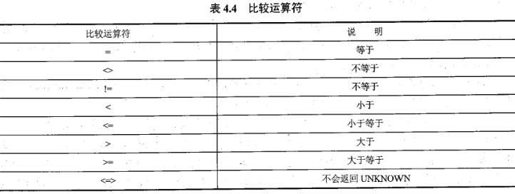

   - 例 4.34 在数据库 `mysql test`的表 `customers`中查找所有男性客户的信息。

     ```mysql
     mysql> SELECT *FROM mysql_test.customers
         -> WHERE cust_sex='M';
     ```

     

2. 判定范围

   1. `BETWEEN...AND`

      - 查询的过滤条件被限定在值的某个范围, 表达式 `expression` 的值不能大于表达式 `expression2`的值, 否则返回 `FALSE`；如果使用关键字`NOT`时，其返回值正好相反

      - ```mysql
        expression[NOT]BETWEEN expression1 AND expression2
        ```

      - 例 4.35 在数据库 `mysql test` 的表 `customers`中，查询客户 id 号在 903 至 912 之间的十个客户的信息。

        ```mysql
        mysql> SELECT *FROM mysql_test.customers
            -> WHERE cust_id BETWEEN 903 AND 912;
        ```

   2. `IN`

      - 使用关键字“`IN`”可以指定一个值的枚举表，该表中会列出所有可能的值，当要判定的值能与该表中任意一个值匹配时，会返回结果`TRUE`，否则返回 `FALSE`, 其使用语法格式是：

      - ```mysql
        expression IN(expression[,...])
        ```

      - 例 4.36 在数据库 `mysql test`的表 `customers`中，查询客户 id 号分别为 903、906 和 908 个客户的信息。

        ```mysql
        mysql> SELECT *FROM mysql_test.customers
            -> WHERE cust_id IN(903,906,908);
        ```

        

3. 判定空值

   - 使用关键字“ `IS NULL`”

     ```mysql
     expression IS[NOT]NULL
     ```

   - 例 4.37 在数据库 `mysql test`的表 `customers`中，查询是否存在没有填写客户联系方式的客户。

     ```mysql
     mysql> SELECT cust_name FROM mysql_test.customers
         -> WHERE cust_contact IS NULL;
     ```

     

4. 子查询

   - 使用 `SELECT`语句创建子查询
     1. 表子查询，即子查询返回的结果集是一个表。
     2. 行子查询，即子查询返回的结果集是带有一个或多个值的一行数据。
     3. 列子査询，即子査询返回的结果集是一列数据，该列可以有一行或多行，但每行只有一个值
     4. 标量子查询，即子查询返回的结果集仅仅是一个值。

   1. 结合关键字使用的子查询

      - 结合关键字“`IN`”所使用的子查询主要用于判定一个给定值是否存在于在子查询的结果集中，其使用语法格式是

        ```mysql
        expression[NOT]IN (subquery)
        ```

      - 例 4.38 根据第2章描述的学生基本信息登记表 `tb student`和学生成绩表 `tb score`，使用子査询的方式查询任意所选课程成绩高于80分的学生的学号和姓名信息。

        ```mysql
        mysql> SELECT studentNo,studentName
            -> FROM tb_student
            -> WHERE studentNo IN (SELECT studentNo FROM tb_score WHERE stScore>80);
        ```

        

   2. 结合比较运算符使用的子查询

      - 结合比较运算符所使用的子査询主要用于将表达式的值与子査询的结果进行比较运算，其使用语法格式是：

        ```mysql
        expression{=|<|<=|>|>=|<>|!=}{ALL|SOME|ANY}{subquery}
        ```

      - 在此语法中：三个关键字“`ALL`”“`SOME`”或“`ANY`”为选择项，用于指定对比较运算的限制。

        - 其中，关键字“ALL”用于指定表达式需要与子查询结果集中的每个值都进行比较，当表达式与每个值都满足比较关系时，会返回TRUE，否则返回 FALSE；
        - 关键字“SOME”和“ANY”是同义词，表示表达式只要与子查询结果集中的某个值满足比较关系时，就返回TRUE，否则返回 FALSE。

   3. 结合关键字“ `EXIST`”使用的子查询

      - 结合关键字“ `EXIST`”所使用的子查询主要用于判定子查询的结果集是否为空, 否则返回 FALSE。它的使用语法格式是：

        ```mysql
        EXIST(subquery)
        ```

        

      

### 4.5.5 GROUP BY 子句与分组查询

- 在 `SELECT`语句中，允许使用 `GROUP BY`子句，**将结果集中的数据行根据选择列的值逻辑分组，以便能汇总表内容的子集，即实现对每个组的聚集计算。**

  ```mysql
  GROUP BY{col_name|expr|position}{ASC|DESC},...[WITH ROLLUP]
  ```

  1. `col name`：指定用于分组的选择列。
     - 可以指定多个列，彼此间用逗号分隔。注意， `GROUP BY`子句中的各选择列必须也是 `SELECT`语句的选择列表清单中的一项。
  2. `expr`：指定用于分组的表达式。
     - 该表达式通常与聚合函数一块使用，例如可将表达式“ `COUNT（*）AS '人数'`”作为 `SELECT`语句的选择列表清单中的一项
  3. `position`：指定用于分组的选择列在 `SELECT`语句结果集中的位置，通常是一个正整数。
     - 例如，使用 `GROUP BY 3`表示根据 `SELECT`语句中列清单上的第3列的值进行逻辑分组。
  4. `ASC|DESC`：关键字“`ASC`”表示按升序分组；关键字“`DESC`”表示按降序分组。
     - 其中，默认值为ASC。这两个关键字必须位于对应的列名、表达式、列的位置之后。
  5. `WITH ROLLUP`：此关键字为可选项，用于指定在结果集中不仅包含由 `GROUP BY`子句分组后的数据行，还包含各分组的汇总行，以及所有分组的整体汇总行。
     - 因此，使用该关键字，可以得到每个分组以及每个分组汇总级别的值。
     - 其汇总规则是：按列的排列的逆序依次进行汇总，并且在生成的同一逻辑组的汇总行中，对于具有不同列值的字段值将被设置为NULL。

- 例 4.39 在数据库 `mysql test`的表 `customers`中获取一个数据结果集，要求该结果集中分别包含每个相同地址的男性客户人数和女性客户人数。

  ```mysql
  mysql> SELECT cust_address,cust_sex,COUNT(*) AS '人数'
      -> FROM mysql_test.customers
      -> GROUP BY cust_address,cust_sex;
  +--------------+----------+--------+
  | cust_address | cust_sex |  人数   |
  +--------------+----------+--------+
  | 南京市        | F        |      1 |
  | NULL         | M        |      1 |
  | 武汉市        | M        |      1 |
  +--------------+----------+--------+
  3 rows in set (0.05 sec)
  ```

- 例 4.40 在数据库 `mysql test`的表 `customers`中获取一个数据结果集，要求该结果集中包含每个相同地址的男性客户人数、女性客户人数、总人数以及客户的总人数

  ```mysql
  mysql> SELECT cust_address,cust_sex,COUNT(*)AS'人数'
      -> FROM mysql_test.customers
      -> GROUP BY cust_address,cust_sex
      -> WITH ROLLUP;
  +--------------+----------+--------+
  | cust_address | cust_sex | 人数   |
  +--------------+----------+--------+
  | NULL         | M        |      1 |
  | NULL         | NULL     |      1 |
  | 南京市        | F        |      3 |
  | 南京市        | NULL     |      3 |
  | 武汉市        | M        |      2 |
  | 武汉市        | NULL     |      2 |
  | NULL         | NULL     |      6 |
  +--------------+----------+--------+
  7 rows in set (0.03 sec)
  ```

- 此外，对于 `GROUP BY`子句的使用，需要注意以下几点。

  1.  `GROUP BY`子句可以包含任意数目的列，使得其可对分组进行嵌套，为数据分组提供更加细致的控制。
  2. 如果在 `GROUP BY`子句中嵌套了分组，那么将按 `GROUP BY`子句中列的排列顺序的逆序方式依次进行汇总，并将在最后规定的分组上进行一个完全汇总。
  3. `GROUP BY`子句中列出的每个列都必须是检索列或有效的表达式，但不能是聚合函数。如果在 `SELECT`语句中使用表达式，则必须在 `GROUP BY`子句中指定相同的表达式。注意，不能使用别名
  4. 除聚合函数之外， `SELECT`语句中的每个列都必须在 `GROUP BY`子句中给出。
  5. 如果用于分组的列中含有`NULL`值，则`NULL`将作为一个单独的分组返回；如果该列中存在多个`NULL`值，则将这些`NULL`值所在的行分为一组。

### 4.5.6 HAVING 子句

- 在结果集中规定包含哪些分组和排除哪些分组。

- `HAVING`子句的使用语法格式是

  ```mysql
  HAVING where_condition
  ```

- `HAVING`子句与 `WHERE`子句非常相似， `HAVING`子句支持 `WHERE`子句中所有的操作符和句法，但两者之间仍存在以下几点差异

  1.  `WHERE`子句主要用于过滤数据行，而 `HAVING`子句主要用于过滤分组，即`HAVING`子句可基于分组的聚合值而不是特定行的值来过滤数据。
  2. `HAVING`子句中的条件可以包含聚合函数，而 `WHERE`子句中则不可以。
  3. `WHERE`子句会在数据分组前进行过滤， `HAVING`子句则会在数据分组后进行过滤。因而， `WHERE`子句排除的行不包含在分组中，这就会可能改变计算值，从而影`HAVING`子句基于这些值过滤掉的分组。

- 例 4.41 在数据库 `mysql test`的表 `customers`中查找这样一类客户信息：要求在返回的果集中，列出相同客户地址中满足客户人数少于3的所有客户姓名及其对应地址。

  ```mysql
  mysql> SELECT cust_name,cust_address
      -> FROM mysql_test.customers
      -> GROUP BY cust_address,cust_name
      -> HAVING COUNT(*)<=3;
  ```

  

### 4.5.7 ORDER BY 子句

- 在 SELECT语句中，可以使用 ORDER BY子句将结果集中的数据行按一定的顺序进行排列，否则结果集中数据行的顺序是不可预料的。

- ORDER BY子句的使用语法格式是：

  ```mysql
  ORDER BY{col_name|expr|position}[ASC|DESC],...
  ```

  - `col name`：指定用于排序的列。可以同时指定多个列，列名彼此间用逗号分隔。
  - `expr`：指定用于排序的表达式。
  - `position`：指定用于排序的列在 `SELECT`语句结果集中的位置，通常是一个正整数例如，使用 `ORDER BY 2`表示对 `SELECT`语句中列清单上的第 2 列进行排序。
  - `ASC|DESC`：关键字“`ASC`”表示按升序排列；关键字“`DESC`”表示按降序排列。其中，默认值为`ASC`。这两个关键字必须位于对应的列名、表达式、列的位置之后。

- 例 4.42 在数据库 `mysql test`的表 `customers`中依次按照客户姓名和地址的降序方式输出客户的姓名和性别。

  ```mysql
  mysql> SELECT cust_name,cust_sex FROM mysql_test.customers
      -> ORDER BY cust_name DESC,cust_address DESC;
  +-----------+----------+
  | cust_name | cust_sex |
  +-----------+----------+
  | 张三      | F        |
  | 王五      | F        |
  | 王五      | F        |
  | 王六      | M        |
  | 李四      | M        |
  | 李四      | M        |
  +-----------+----------+
  6 rows in set (0.00 sec)
  ```

- 此外，关于 `ORDER BY`子句的使用，需要注意以下几点。

  1.  `ORDER BY`子句中可以包含子查询。
  2. 当对空值进行排序时， `ORDER BY`子句会将该空值作为最小值来对待。即，若按升序排列结果集，则 `ORDER BY`子句会将该空值所在的数据行置于结果集的最上方；若是使用降序排序，则会将其置于结果集的最下方
  3. 若在 `ORDER BY`子句中指定多个列进行排序，则在 MySQL 中会按照这些列从左至右所罗列的次序依次进行排序。
  4. 在使用 `GROUP BY`子句时，通常也会同时使用 `ORDER BY`子句，其中 表 4.5 汇总了 `ORDER BY`子句与 `GROUP BY`子句的差别。

  

### 4.5.8 LIMIT 子句

- 当使用 `SELECT`语句返回的结果集中行数很多时，为了便于用户对结果数据的浏览和操作，可以使用LIMI子句来限制被 `SELECT`语句返回的行数。

- `LIMT`子句的使用语法格式是：

  ```mysql
  LIMIT {[offset,]row_count|row_count OFFSET offset}
  ```

  1. `offset`：为可选项，默认为数字0，用于指定返回数据的第一行在 `SELECT`语句结果集中的偏移量，其必须是非负的整数常量。注意， `SELECT`语句结果集中第一行（初始行）的偏移量为0而不是1。
  2.  `row count`：用于指定返回数据的行数，其也必须是非负的整数常量。若这个指定行数大于实际能返回的行数时，在 MySQL中将只返回它能返回的数据行。
  3. `row count offset offset`：从第 `offset+1`行开始，取 `row count`行。

- 例443在数据库 `mysql test`的表 `customers`中查找从第 5 位客户开始的 3 位客户的 id号 和姓名信息。

  ```mysql
  mysql> SELECT cust_id,cust_name FROM mysql_test.customers
      -> ORDER BY cust_id
      -> LIMIT 4,3; #也可以写成 LIMIT 3 OFFSET 4;
  +---------+-----------+
  | cust_id | cust_name |
  +---------+-----------+
  |     906 | 王五      |
  |     907 | 王六      |
  +---------+-----------+
  2 rows in set (0.00 sec)
  ```

  


## 第六节 视图

- 视图是数据库中的一个对象，它是数据库管理系统提供给用户的以多种角度观察数据库中数据的一种重要机制。视图是从一个或多个表或者其他视图中通过查询语句导出的表，它也包含一系列带有名称的数据列和若干条数据行，并有自己的视图名，由此可见视图与基本表十分类似。然而，视图仍不同于数据库中真实存在的基本表，它们存在以下区别。
  1. 视图不是数据库中真实的表，而是一张虚拟表，其结构和数据是建立在对数据库中真实表的查询基础上的。
  2. 视图的内容是由存储在数据库中进行查询操作的SQL语句来定义的，它的列数据与行数据均来自于定义视图的查询所引用的真实表，并且这些数据是在引用视图时动态生成的
  3. 视图不是以数据集的形式存储在数据库中，它所对应的数据实际上是存储在视图所引用的真实表（基本表）中。
  4. 视图是用来查看存储在别处的数据的一种虚拟表，而其自身并不存储数据。
     尽管视图与数据库中的基本表存在着本质上的不同，但视图一经定义后，可以如同使用基本表一样，对视图进行查询、修改、删除和更新等操作，并且使用视图还具有如下一些优点。
  5. 集中分散数据。当用户所需的数据分散在数据库多个表中时，通过定义视图可以将这些数据集中在一起，以方使用户对分散数据的集中查询与处理。
  6. 简化查询语句。通过定义视图可为用户屏蔽数据库的复杂性，使其不必详细了解数据库中复杂的表结构和表连接，因而能简化用户对数据库的查询语句。例如，即便是底层数据库表发生了更改，也不会影响到上层用户对数据库的正常使用，只需数据库编程人员重新定义视图的内容即可。
  7. 重用SQL语句。视图提供的是一种对查询操作的封装，它本身不包含数据，其所呈现的数据是根据视图的定义从基本表中检索出来的，如若基本表中的数据被新增或更改，视图所呈现的则是更新后的数据。因此，通过定义视图，编写完所需查询后，可以方便地重用该视图，而不必了解它的具体查询细节。
  8. 保护数据安全。通过只授予用户使用视图的权限，而不具体指定使用表的权限，来保护基础数据的安全性。
  9. 共享所需数据。通过使用视图，每个用户不必都定义和存储自己所需的数据，可以共享数据库中的数据，从而同样的数据只需存储一次。
     更改数据格式。通过使用视图，可以重新格式化检索出的数据，并组织输出到其他应用程序中去

### 4.6.1 创建视图

- 使用 `CREATEⅤIEW`语句来创建视图

  ```mysql
  CREATEVIEW view_name[(column_list)]
  	AS select_statement
  	[WITH[CASCADED|LOCAL]CHECK OPTION]
  ```

  1. `view name`用于指定视图的名称，且该名称在数据库中必须是唯一的，**不能与其他表或视图同名**。
  2. `column list`是可选项，用于为视图中的每个列指定明确的名称，且列名的数目必须等于 `SELECT`语句检索出的结果数据集的列数，同时每个列名间用逗号分隔。如若省略`column list`，则新建视图使用与基本表或源视图中相同的列名
  3. `select statement`用于指定创建视图的 `SELECT`语句。这个 `SELECT`语句给出了视图的定义，它可用于查询多个基本表或源视图
  4. `WITH CHECK OPTION`是可选项，用于指定在可更新视图上所进行的修改都需要符合 `select statement`中所指定的限制条件，这样可以确保数据修改后，仍可以通过视图看到修改后的数据。当视图是根据另一个视图定义时，关键字“ `WITH CHECK OPTION`”给出两个参数，即 `CASCADED`和 `LOCAL`，它们决定检查测试的范围。其中，关键字“ `CASCADED`”为选项默认值，它会对所有视图进行检查，而关键字“ `LOCAL`”则使 `CHECK OPTION`只对定义的视图进行检查。

- 例 4.44 在数据库 `mysql test中`创建视图 `customers view`，要求该视图包含客户信息表`customers`中所有男客户的信息，并且要求保证今后对该视图数据的修改都必须符合客户性别为男性这个条件。

  ```mysql
  mysql> CREATE OR REPLACE VIEW mysql_test.customers_view
      -> AS
      -> SELECT *FROM mysql_test.customers
      -> WHERE cust_sex='M'
      -> WITH CHECK OPTION;
  Query OK, 0 rows affected (0.03 sec)
  ```

  

### 4.6.2 删除视图

- 使用 `DROP VIEW`语句来删除视图

  ```mysql
  DROPVIEW view_name[(cloumn_list)]
  	AS select_statement
  	[WITH[CASCADED|LOCAL]CHECK OPTION]
  ```

  

### 4.6.3 修改视图定义

- 使用 `ALTER VIEW`语句来对已有视图的定义（结构）进行修改

  ```mysql
  ALTERVIEW view_name[(column_list)]
  	AS select_statement
  	[WITH[CASCADED|LOCAL]CHECK OPTION]
  ```

  

### 4.6.4 查看视图定义

- 使用 `SHOW CREATE VIEW`语句来查看已有视图的定义（结构）

  ```mysql
  SHOW CREATE VIEW view_name
  ```

  


### 4.6.5 更新视图数据

1. 使用 `INSERT`语句通过视图向基本表插入数据

   - 例 4.45 在数据库 `mysql test`中，向视图 `customers view`插入下面一条记录

     ```mysql
     mysql> INSERT INTO mysql_test.customers_view
         -> VALUES(0,'周敏','M','武汉市','洪山区',NULL);
     Query OK, 1 row affected (0.01 sec)
     ```

     

2. 使用 `UPDATE`语句通过视图修改基本表的数据

   - 例 4.46 将视图 `customers vicw`中所有客户的 `cust address`列到更新为“上海市”。

     ```mysql
     mysql> UPDATE mysql_test.customers_view
         -> SET cust_address='上海市';
     Query OK, 4 rows affected (0.01 sec)
     ```

     

3. 使用 `DELETE`语句通过视图删除基本表的数据

   - 例 4.47 删除视图 `customers view`中姓名为“周明”的客户信息。

     ```mysql
     mysql> DELETE FROM mysql_test.customers_view
         -> WHERE cust_name='周敏';
     Query OK, 1 row affected (0.01 sec)
     ```

     

### 4.6.6 查询视图数据

- 例 4.48 在视图 `customers view`中查找客户 id 号为 905 的客户姓名及其地址信息

  ```mysql
  mysql> SELECT cust_name,cust_address
      -> FROM mysql_test.customers_view
      -> WHERE cust_id=904;
  +-----------+--------------+
  | cust_name | cust_address |
  +-----------+--------------+
  | 李四      | 上海市       |
  +-----------+--------------+
  1 row in set (0.00 sec)
  ```

  


## 本章小结

# 第五章 数据库编程

## 第一节 数据库编程

### 5.1.1 存储过程的基本概念

- 存储过程是一个可编程的函数，同时可看作是在数据库编程中对面向对象方法的模拟，它允许**控制数据的访问方式**。因而，当希望在不同的应用程序或平台上执行相同的特定功能时，存储过程尤为适合。使用存储过程通常具有以下一些好处。
  1. 可增强SQL语言的功能和灵活性存储过程可以用流控制语句编写，有很强的**灵活性**，可以完成复杂的判断和较复杂的运算。
  2. 良好的**封装性存储**过程被创建后，可以在程序中被多次调用，而不必重新编写该存储过程的SQL语句，并且数据库专业人员可以随时对存储过程进行修改，而不会影响到调用它的应用程序源代码
  3. 高性能存储过程执行一次后，其执行规划就驻留在高速缓冲存储器中，在以后的操作中，只需从高速缓冲存储器中调用已编译好的二进制代码执行即可，从而**提高了系统性能**。
  4. 可**减少网络流量**由于存储过程是在服务器端运行，且执行速度快，那么当在客户计算机上调用该存储过程时，网络中传送的只是该调用语句，从而可降低网络负载
  5. 存储过程可作为一种**安全机制**来确保数据库的安全性和数据的完整性使用存储过程可以完成所有数据库操作，并可通过编程方式控制这些数据库操作对数据库信息访问的权限。

### 5.1.2 创建存储过程

- `DELIMITER`命令的使用语法格式是：

  ```mysql
  DELIMITER $$
  ```

  - 其中，`$$`是用户定义的结束符，通常这个符号可以是一些特殊的符号，例如两个“`#`”或两个“`￥`”等；
  - 另外，当使用 `DELIMITER`命令时，应该避免使用反斜杠（“`/`”）字符，因为它是 `MySQL`的转义字符。

- 例 5.1 将 `MySQL`结束符修改为两个感叹号“`!!`

  ```mysql
  DELIMITER !!
  ```

  换回默认的分号“`；`”作为结束标志

  ```mysql
  DELIMITER ;
  ```

- 使用 `CREATE PROCEDURE`语句来创建存储过程

  ```mysql
  CREATE PROCEDURE sp_name([proc_apramenter[,...]])
  	routine_body
  ```

  语法项“ `proc parameter`”的语法格式是：

  ```mysql
  [IN|OUT|INOUT]param_name type
  ```

  1. 语法项“ `sp name`”用于指定存储过程的名称，且默认在当前数据库中创建。
  2. 语法项“ `proc parameter`”用于指定存储过程的参数列表。
     1. 其中，语法项“ `param name`”为参数名，语法项“`type`”为参数的类型（其可以是任何有效的 MySQL数据类型）。
     2. 当有多个参数时，参数列表中彼此间用逗号分隔。存储过程可以没有参数（此时存储过程的名称后仍须加上一对括号），也可以有一个或多个参数。 
     3. MySQL 存储过程支持三种类型的参数，即输入参数、输出参数和输入/输出参数，分用“`IN`”“`OUT`”和“ `INOUT`”三个关键字标识。其中，输入参数是使数据可以传递给一个存储过程；输出参数用于存储过程需要返回一个操作结果的情形；而输入输出参数既可以充当输入参数也可以充当输出参数。
     4. 需要注意的是，参数的取名不要与数据表的列名相同，否则尽管不会返回出错消息，但是存储过程中的SQL语句会将参数名看作是列名，从而引发不可预知的结果。
  3. 语法项“ `routine body`”表示存储过程的主体部分，也称为存储过程体，其包含了在过程调用的时候必须执行的 SQL 语句。
     1. 这个部分是以关键字“ `BEGIN`”开始，以关键字“`END`”结束。
     2. 如若存储过程体中只有一条 SQL 语句时，可以省略 `BEGIN…END`标志。
     3. 另外，在存储过程体中，`BEGN…END`复合语句还可以嵌套使用。

- 例 5.2 在数据库 `mysql test`中创建一个存储过程，用于实现给定表 `customers`中一个客户 id 号即可修改表 `customers`中该客户的性别为一个指定的性别。

  ```mysql
  mysql> DELIMITER $$
  mysql> CREATE PROCEDURE sp_update_sex(IN cid INT,IN csex CHAR(1))
      -> BEGIN
      ->  UPDATE customers SET cust_sex=csex WHERE cust_id=cid;
      -> END $$
  Query OK, 0 rows affected (0.09 sec)
  ```

  

### 5.1.3 存储过程体

1. 局部变量

   - 使用 `DECLARE`语句来声明局部变量，并且同时还可以对该局部变量赋予一个初始值

     ```mysql
     DECLARE var_name[,...]type[DEFAULT value]
     ```

     - 语法项“ `var name`”用于指定局部变量的名称；语法项“`type`”用于声明局部变量的数据类型； `DEFAULT`子句用于为局部变量指定一个默认值，若没有指定，则默认为`NULL`

   - 例 5.3 声明一个整型局部变量`cid`。

     ```mysql
     DECLARE cid INT(10)
     ```

     1. 局部变量只能在存储过程体的 `BEGIN…END`语句块中声明。
     2. 局部变量必须在存储过程体的开头处声明。
     3. 局部变量的作用范围仅限于声明它的`BEGN…END`语句块，其他语句块中的语句不可以使用它。
     4. 局部变量不同于用户变量，两者间的区别是：局部变量声明时，在其前面没有使用`@`符号，并且它只能被声明它的 `BEGIN…END`语句块中的语句所使用；而用户变量在声明时，会在其名称前面使用`@`符号，同时已声明的用户变量存在于整个会话之中。

2. `SET` 语句

   - 使用SET语句为局部变量赋值

     ```mysql
     SET var_name=expr[,var_name=expr]...
     ```

   - 例 5.4 为 例 5.3 中声明的局部变量`cid`赋予一个整数值 910

     ```mysql
     SET cid=910;
     ```

     

3. `SELECT…INTO` 语句

   - 使用 `SELECT…INTO`语句把选定列的值直接存储到局部变量中

     ```mysql
     SELECT col_name[,...]INTO var_name[,...] table_expr
     ```

     - 语法项“ `col name`”用于指定列名；语法项“ `var name`”用于指定要赋值的变量名；
     - 语法项“ '`table expr`”表示 `SELECT`语句中的`FROM`子句及后面的语法部分。
     - 此外，需要注意的是：存储过程体中的 `SELECT…INTO`语句返回的结果集只能有一行数据

4. 流程控制语句

   1. 条件判断语句
      - 常用的条件判断语句有`IF…THEN…ELSE`语句和`CASE`语句。它们的使用语法及方式类似于高级程序设计语言
   2. 循环语句
      - 常用的循环语句有`WHLE`语句、 `REPEAT`语句和`LOOP`语句。它们的使用语法及方式同样类似于高级程序设计语言。
      - 此外，循环语句中还可以使用 `ITERATE`语句，但它只能出现在循环语句的`LOOP`、 `REPEAT`和`WHLE`子句中，用于表示退出当前循环，且重新开始一个循环。

5. 游标

   游标是一个被 `SELECT`语句检索出来的结果集。在存储了游标后，应用程序或用户就可以根据需要滚动或浏览其中的数据。

   1. 声明游标, 使用 `DECLARE CURSOR`语句创建游标

      ```mysql
      DECLARE cursor_name CURSOR FOR select_statement
      ```

      - “ `cursor name`”用于指定要创建的游标的名称，其命名规则与表名相同
      - “ `select statement`”用于指定一个 `SELECT`语句，其会返回一行或多行的数据，且需注意此处的 `SELECT`语句不能有`INTO`子句。

   2. 打开游标

      在定义游标之后，必须打开该游标，才能使用。这个过程实际上是将游标连接到由`SELECT`语句返回的结果集中。在MSQL中，可以使用 `OPEN` 语句打开游标

      ```mysql
      OPEN cursor_name
      ```

      - “ `cursor name`”用于指定要打开的游标在实际应用中，
      - 一个游标可以被多次打开，由于其他用户或应用程序可能随时更新了数据表，因此每次打开游标的结果集可能会不同。

   3. 读取数据

      对于填有数据的游标，可根据需要取出数据。在 MySQL中，可以使用 `FETCH…INTO`语句从中读取数据

      ```mysql
      FETCH cursor_name INTO var_name[,var_name]...
      ```

      - “ `cursor name`”用于指定已打开的游标；语法项“ `var name`”用于指定存放数据的变量名。
      - `FETCH…NTO`语句与 `SELECT…INTO`语句具有相同的意义， `FETCH`语句是将游标指向的一行数据赋给一些变量，这些变量的数目必须等于声明游标时 `SELECT`子句中选择列的数目。
      - 游标相当于一个指针，它指向当前的一行数据。

   4. 关闭游标

      在结束游标使用时，必须关闭游标。在 MySQL中，可以使用 CLOSE语句关闭游标

      ```mysql
      CLOSE cursor_name
      ```

      - “`cursor name`”用于要关闭的游标。
      - 每个游标不再需要时都应该被关闭，使用 `CLOSE`语句将会释放游标所使用的全部资源。
      - 在一个游标被关闭后，如果没有重新被打开，则不能被使用。
      - 对于声明过的游标，则不需要再次声明，可直接使用`OPEN`语句打开。
      - 另外，如果没有明确关闭游标， `MySQL`将会在到达`END`语句时自动关闭它

- 例 5.5 在数据库 `mysql test`中创建一个存储过程，用于计算表 `customers`中数据行的行数

  ```mysql
  USE mysql_test;
  DELIMITER $$
  CREATE PROCEDURE sp_sumofrow(OUT ROWS2 INT)
  BEGIN
    DECLARE cid INT;
    DECLARE FOUND BOOLEAN DEFAULT TRUE;
    DECLARE cur_cid CURSOR FOR
    	SELECT cust_id FROM customers;
    DECLARE CONTINUE HANDLER FOR NOT FOUND
    	SET FOUND=FALSE;
    	SET ROWS2=0;
    OPEN cur_cid;
    FETCH cur_cid INTO cid;
    WHILE FOUND DO
    	SET ROWS2=ROWS2+1;
    	FETCH cur_cid INTO cid;
    END WHILE;
    CLOSE cur_cid;
  END$$
  ```

  `ROW` 是关键字, 用 `ROW2`; 

  对存储过程 `sp sumofrow `进行调用

  ```mysql
  mysql> DELIMITER ;
  mysql> CALL sp_sumofrow(@rows2);
  Query OK, 0 rows affected (0.00 sec)
  ```

  ```mysql
  mysql> SELECT @rows2;
  +--------+
  | @rows2 |
  +--------+
  |      6 |
  +--------+
  1 row in set (0.03 sec)
  ```

  - 由此例可以看出：定义了一个 `CONTINUE HANDLER`句柄，它是在条件出现时被执行的代码，用于控制循环语句，以实现游标的下移； 
  - `DECLARE`语句的使用存在特定的次序，即用 `DECLARE`语句定义的局部变量必须在定义任意游标或句柄之前定义，而句柄必须在游标之后定义，否则系统会出现错误消息。

- **在使用游标的过程中，需要注意以下几点(201810)**

  1. 游标只能用于**存储过程**或**存储函数**中，不能单独在**查询操作**中使用。
  2. 在存储过程或存储函数（在5.2节中介绍）中可以定义**多个游标**，但是在一个`BEGIN…END`语句块中每一个游标的名字必须是**唯一**的。
  3. 游标不是一条 `SELECT`语句，是**被 `SELECT`语句检索出来的结果集**。

### 5.1.4 调用存储过程体

- 创建好存储过程后，可以使用`CALL`语句在程序或者其他存储过程中调用它

  ```mysql
  CALL sp_name([parameter[,...]])
  CALL sp_name[()]
  ```

  - 语法项“ `sp name`”用于指定被调用的存储过程的名称。如果要调用某个特定数据库的存储过程，则需要在前面加上该数据库的名称
  - 语法项“ `parameter`”用于指定调用存储过程所要使用的参数。调用语句中参数的个数必须等于存储过程的参数个数。
  - 当调用没有参数的存储过程时，使用 `CALL sp_name()`语句与使用 `CALL sp_name`语句是相同的

- 例 5.6 调用数据库 `mysql test`中的存储过程 `sp update sex`，将客户 id号 为 909 的客户性别修改为男性“M”

  ```mysql
  mysql> CALL sp_update_sex(906,'M');
  Query OK, 1 row affected (0.00 sec)
  ```

  

### 5.1.5 删除存储过程体

- 存储过程在被创建后，会被保存在服务器上以供使用，直至被删除。在 MySQL中，可以使用 `DROP PROCEDURE`语句删除数据库中已创建的存储过程

  ```mysql
  DROP PROCEDURE[IF EXISTS]sp_name
  ```

  - “ `sp name`”用于指定要删除的存储过程的名称。需注意，它后面没有参数列表，也没有括号。在删除之前，必须确认该存储过程没有任何依赖关系，否则会导致其他与之关联的存储过程无法运行。
  - 此外，为防止因删除不存在的存储过程而引发的错误，在 `DROP PROCEDURE`语句中添加关键字“ `IF EXISTS`”。

- 例 5.7 删除数据库 `mysql test`中的存储过程 `sp update sex`

  ```mysql
  mysql> DROP PROCEDURE sp_update_sex;
  Query OK, 0 rows affected (0.04 sec)
  ```

  


## 第二节 存储函数

- 存储函数与存储过程一样，都是由SQL语句和过程式语句所组成的代码片断，并且可以被应用程序和其他SQL语句调用。然而，它们之间存在如下几点区别
  1. 存储函数**不能拥有输出参数**，这是因为存储函数自身就是输出参数；而存储过程可以拥有输出参数。
  2. 可以**直接对存储函数进行调用**，且不需要使用 `CALL` 语句；而对存储过程的调用，需要使用 `CALL` 语句。
  3. 存储函数中**必须包含一条 `RETURN `语句**，而这条特殊的 SQL 语句**不允许包含于存储过程中**。

### 5.2.1 创建存储函数 

- 使用 `CREATE FUNCTION`语句创建存储函数

  ```mysql
  CREATE FUNCTION sp_name([func_parameter[,..]])
  	RETURNS type
  	routine_body
  ```

  语法项 “ `func parameter`”的语法格式是：

  ```mysql
  param_name type
  ```

  - 语法项“`sp_name`”用于指定存储函数的名称，需注意，存储函数不能与存储过程具有相同的名字。
  - 语法项“ `func parameter`”用于指定存储函数的参数，这里的参数只有名称和类型，不能指定关键字“`IN`”“`OUT`”和“ `INOUT`
  - `RETURNS`子句用于声明存储函数返回值的数据类型，其中`type`用于指定返回值的数据类型。
  - 语法项“ `routine body`”用于指定存储函数的主体部分，也称为存储函数体。所有在存储过程中使用的SQL语句在存储函数中同样也适用，包括前面所介绍的局部变量、`SET`语句、流程控制语句、游标等。但是，存储函数体中还必须包含一个 `return value`语句, 其中`value`用于指定存储函数的返回值

- 例 5.8 在数据库 `mysql test`中创建一个存储函数，要求该函数能根据给定的客户id号返回客户的性别，如果数据库中没有给定的客户 id 号，则返回“没有该客户”。

  ```mysql
  USE mysql_test;
  DELIMITER $$
  CREATE FUNCTION fn_search(cid INT)
  	RETURNS CHAR(2)
      DETERMINISTIC
  BEGIN
  	DECLARE SEX CHAR(2);
  	SELECT cust_sex INTO SEX FROM customers
  		WHERE cust_id=cid;
  	IF SEX IS NULL THEN
  		RETURN(SELECT'没有该客户');
  	ELSE IF SEX='F' THEN
  		RETURN(SELECT'女');
  		ELSE RETURN(SELECT'男');
          END IF;
  	END IF;
  END$$
  DELIMITER ;
  ```

  

### 5.2.2 调用存储函数

- 可以如同调用系统内置函数一样，使用关键字 SELECT对其进行调用

  ```mysql
  SELECT sp_name([func_parameter[,...]])
  ```

- 例 5.9 调用数据库 `mysql test`中的存储函数 `fn search`

  ```mysql
  mysql> SELECT fn_search(904);
  +----------------+
  | fn_search(904) |
  +----------------+
  | 男             |
  +----------------+
  1 row in set (0.00 sec)
  ```

  

### 5.2.3 删除存储函数

- 存储函数在被创建后，会被保存在服务器上以供使用，直至被删除。删除存储函数的方法与删除存储过程的方法基本一样。在 MySQL中，可以使用 `DROP FUNCTION`语句来实现

  ```mysql
  DROP FUNCTION [IF EXISTS] sp_name
  ```

  - “ `sp name`”指定要删除的存储函数的名称。
  - 注意，它后面没有参数列表，也没有括号。
  - 在删除之前，必须确认该存储函数没有任何依赖关系，否则会导致其他与之关联的存储函数无法运行。
  - 同样，为防止因删除不存在的存储函数而引发的错误，可在 `DROP FUNCTION` 语句中添加关键字“ `IF EXISTS`”。

- 例 5.10 删除数据库 `mysql test`中的存储函数 `fn search`

  ```mysql
  mysql> DROP FUNCTION IF EXISTS fn_search;
  Query OK, 0 rows affected (0.01 sec)
  ```

  


# 第六章 数据库安全与防护

## 第一节 数据库完整性

### 6.1.1 完整性约束条件的作用对象

- 完整性检查是围绕完整性约束条件进行的，因而**完整性约束条件**是完整性控制机制的核心。完整性约束条件的作用对象可以是**列、元组和表**。
  1. **列级约束**主要指对列的类型、取值范围、精度等的约束
     1. 对**数据类型**的约束，其包括数据类型、长度、精度等。
        - 例如，在 `customers`表中将客户地址的数据类型设定为定长字符型，且长度为50。
     2. 对**数据格式**的约束。
        - 例如，在学生信息表 `tb student`表中可将学号 `studentNo`字段的前四位规定为学生的入学年份，第5位规定为院系的编号等。
     3. 对**取值范围**或**取值集合**的约束。
        - 例如，在学生成绩表 tb score表中规定成绩 score字段的取值范围为0到100。
     4. 对**空值**的约束。
        - 例如，在定义列时规定该列是否允许取空值。
  2. **元组约束**指元组中各个字段之间的相互约束
     - 例如某个活动的开始日期小于结束日期
  3. **表级约束**指若干元组之间、关系之间的联系的约束。
     - 例如，在学生成绩表 `tb score` 表中学号 `studentNo `字段的取值受学生信息表 `tb student` 表中学号 studentNo字段取值的约束。

### 6.1.2 定义与实现完整性约束

1. **实体完整性**

   在MSQL中，实体完整性是通过**主键约束**和**候选键约束**来实现的

   1. **主键约束**

      主键可以是表中的某一列，也可以是表中多个列所构成的一个组合。其中，由多个列组合而成的主键也称为复合主键。

      1. 每一个表只能定义**一个主键**。
      2. 主键的值，也称为键值，必须能够**唯一标志**表中的每一行记录，且不能为`NULL`也就是说，表中两个不同的行在主键上不能具有相同的值。这是唯一性原则
      3. 复合主键不能包含不必要的多余列。也就是说，当从一个复合主键中删除一列后，如果剩下的列构成主键仍能满足唯一性原则，那么这个复合主键是不正确的。这是**最小化规则**。
      4. 一个列名在复合主键的列表中只能出现一次。

      **主键约束**可以在 `CREATE TABLE` 或 `ALTER TABLE` 语句中使用关键字“ `PRIMARY KEY`”来实现，其方式有两种。

      1. 一种是作为**列的完整性约束**，此时只需在表中某个列的属性定义后加上关键字`PRIMARY KEY`”即可。

      2. 一种是作为**表的完整性约束**，需要在表中所有列的属性定义后添加一条 `PRIMARY KEY(index col_name,...)`格式的子句

         > 如果主键仅由一个表中的某一列所构成，上述两种方法均可以定义主键约束；如果主键是由表中多个列所构成的一个组合，则只能用上述第二种方法定义主键约束。定义主键约束后， MySQL 会自动为主键创建一个唯一性索引，用于在查询中使用主键对数据进行快速检索，该索引名默认为 `PRMMARY`，也可以重新自定义命名

   2. **候选键约束**

      - 候选键可以是表可以是表中多个列所构成的一个组合，候选键的值必须是唯一的，且不能为`NULL`。候选键可以在 `CREATE TABLE` 或 `ALTER TABLE` 语句中使用关键字“ `UNIQUE`”来定义
        1. 一个表中只能创建一个主键，但可以定义**若干个候选键**
        2. 定义主键约束时，系统会自动产生 `PRIMARY KEY`索引，而定义候选键约束时，系统自动产生 `UNIQUE`索引

2. **参照完整性**

   参照完整性是通过在创建表（ `CREATE TABLE`）或更新表（ `ALTER TABLE`）的同时定义一个**外键声明**来实现的。

   1. 在表中某个列的属性定义后直接加上“ `reference_definition`”语法项。

   2. 在表中所有列的属性定义后添加“ `FOREIGN KEY(index_col_name,...) reference_definition`”子句的语法项。

      - 这里列出 `CREATE TABLE`语句和 `ALTER TABLE` 语句中“ `reference definition`”语法项的定义：

        ```mysql
        REFERNCES tbs_name(index_col_name,...)
        	[ON DELETE reference_option]
        	[ON UPDATE reference_option]
        ```

      - `index_col_name` 语法格式

        ```mysql
        col_name[(length)][ASC|DESC]
        ```

      - `reference_option` 的语法格式

        ```mysql
        RESTRICT|CASXADE|SET NULL|NO ACTION
        ```

      - 由此可见，语法项“ `reference definition`”的语法定义主要包含外键所参照的表和列，以及参照动作的声明和实施策略等四部分内容。其中，相关语法说明如下

        1. “ `tbl_name`”指定外键所参照的表名。

           - 这个表称为被参照表（或父表），而外键所在的表称作参照表（或子表）。

        2. “ `col_name`”指定被参照的列名。

           - 外键可以引用被参照表中的主键或候选键，也可以引用被参照表中某些列的一个组合，但这个组合不能是被参照表中随机的一组列，必须保证该组合的取值在被参照表中是唯一的。
           - 外键中的所有列值在被参照表的列中必须全部存在，也就是通过外键来对参照表中某些列（外键）的取值进行限定与约束。

        3. 关键字“ `ON DELETE`”或“ `ON UPDATE`”指定参照动作相关的 `SOL` 语句。

           - 这里可为每个外键指定的参照动作分别对应于 DELETE语句和 UPDATE语句。

        4. 语法项“ `reference option`”指定参照完整性约束的实现策略。

           - 其中，当没有明确指定参照完整性的实现策略时，两个参照动作会默认使用 `RESTRICT`。

           - 关键字“ `RESTRICT`”表示限制策略，即当要删除或更新被参照表中被参照列上，并在外键中出现的值时，系统拒绝对被参照表的删除或更新操作：关键字“ `CASCADE`”表示级联策略，即从被参照表中删除或更新记录行时，自动删除或更新参照表中匹配的记录行；
           - 关键字“`SET NULL`”表示置空策略，即当从被参照表中删除或更新记录行时，设置参照表中与之对应的外键列的值为`NULL`，这个策略需要被参照表中的外键列没有声明限定词 `NOT NULL`；
           - 关键字“ `NO ACTION`”表示不采取实施策略，即当一个相关的外键值在被参照表中时，删除或更新被参照表中键值的动作不被允许，该策略的动作语义与 `RESTRICT`相同。

   3. 例 6.1 在数据库 `mysql test`中创建一个商品订单表`oder`，该表包含的订单信息有：订单号 `oder id`、订购商品名 `order product`、订购商品类型 `order product type`、订购客户 id 号 `cust id`、订购时间 `order date`、订购价格 `order price`、订购数量 `order amount`。要求商品订单表 `orders`中的所有订购客户信息均已在表 `customers` 中记录在册。

      ```mysql
      USE mysql_test;
      CREATE TABLE orders
      (
      	order_id INT NOT NULL AUTO_INCREMENT,
          order_product CHAR(50) NOT NULL,
          order_product_type CHAR(50) NOT NULL,
          cust_id INT NOT NULL,
          order_date DATETIME NOT NULL,
          order_price DOUBLE NOT NULL,
          order_amount INT NOT NULL,
          PRIMARY KEY(order_id),
          FOREIGN KEY(cust_id)
      		REFERENCES customers(cust_id)
              ON DELETE RESTRICT
              ON UPDATE RESTRICT
      );
      ```

      - 从 例 6.1 可以看到，其通过使用关键字“ `PRIMARY KEY`”定义了一个主键约束，与此同时，它还通过定义外键创建了一个参照完整性约束，其作用是确保 MySQL 随时检测插入到外键中的每一个非空值是否都已经在被参照表中作为主键出现了，具体而言就是，对于插入表 `orders`中的每一个订购客户 id 号都执行一次检测，查看这个订购客户 id 号是否已经出现在表 `customers` 的客户 id 号列（主键）中。
      - 如若没有，数据将无法正常插入，且系统会返回如下错误提示：`ERROR1452（23000：Cannot add or update a child row:a foreign key constraint fails`。
      - 这个过程也适用于使用 `UPDATE`语句更新表 `orders`中的 `cust id`列，即由 MySQL 确保表 `orders`中 `cust_id`列的内容总是表 `customers`中 `cust id`列的内容的个子集
      - 指定一个外键的规则
        1. 被参照表必须已经用一条 `CREATE TABLE`话句创建了，或者必须是当前正在创建的表。如若是后一种情形，则被参照表与参照表是同一个表，这样的表称为自参照表（self referencing table），这种结构称为自参照完整性（ self-referential integrity）
        2. 必须为被参照表定义主键。
        3. 必须在被参照表的表名后面指定列名或列名的组合。这个列或列组合必须是这个被参照表的主键或候选键。
        4. 尽管主键是不能够包含空值的，但允许在外键中出现一个空值。这意味着，只要外键的每个非空值出现在指定的主键中，这个外键的内容就是正确的
        5. 外键中的列的数目必须和被参照表的主键中的列的数目相同
        6. 外键中的列的数据类型必须和被参照表的主键中的对应列的数据类型相同。

3. **用户定义的完整性**

   1. **非空约束:** 在 MSQL 中，非空约束可以通过在 `CRETE TABLE` 或 `ALTER TABLE` 语句中的某个列定义后面，加上关键字“ `NOT NULL`”作为限定词，来约束该列的取值不能空。

      - 例如，在 例 6.1 创建表 `orders `的语句中对 `order id` 列添加了一个非空约束，以确保该列的取值不可以是`NULL`值。

   2. **`CHECK` 约束:** 与非空约束一样， `CHECK `约束也是在创建表（ `CREATE TABLE`）或更新表（ `ALTER TABLE`）的同时，根据用户的实际完整性要求来定义的。它可以分别对列或表实施 `CHECK` 约束

      ```mysql
      CHECK(expr)
      ```

      - 语法项“`expr`”是一个 SQL 表达式，用于指定需要检查的限定条件。在更新表数据时， MySQL会检查更新后的数据行是否满足 `CHECK` 约束中的限定条件。
      - MQL可以使用简单的表达式来实现 `CHECK` 约束，也允许使用复杂的表达式作为限定条件，例如，在限定条件中加入子查询。
      - 若将 `CHECK` 约束子句置于表中某个列的定义之后，则这种约束也称为基于列的 `CHECK`约束；
      - 若将 `CHECK` 约束子句置于表中所有列的定义以及主键约束和外键定义之后，则这种约束也称为基于表的 `CHECK` 约束，该约束可以同时对表中多个列设置限定条件。

### 6.1.3 命名完整性约束

- 在各种完整性约束的定义说明之前加上关键字“ `CONSTRAINT`”和该约束的名字

  ```mysql
  CONSTRAINT [symbol]
  ```

  - 其中，语法项“ `symbol`”是指定的**约束名字**，这个名字是在完整性约束说明的前面被定义，其在数据库里必须是唯一的。倘若没有明确给出约束的名字，则 MySQL自动创建一个约束名字。
  - 在定义完整性约束时，应当尽可能地为其指定名字，以便在需要对完整性约束进行修改或删除操作时，可以更加容易地引用它们。
  - 需要注意的是，**只能给基于表的完整性约束指定名字**，而无法给基于列的完整性约束指定名字。因此，基于表的完整性约束比基于列的完整性约束更受欢迎

### 6.1.4 更新完整性约束

- 当对各种约束进行命名后，就可以使用 `ALTER TABLE`语句来更新与列或表有关的各种约束。例如，若要添加约束，可在 `ALTER TABLE`语句中使用 `ADD CONSTRAINT`子句，实际上这也是定义约束的一种形式。此外，需要注意以下两点。
  1. **完整性约束不能直接被修改**。若要修改某个约束，实际上是用 `ALTER TABLE`语句先删除该约束，然后再增加一个与该约束同名的新约束
  2. 使用 `ALTER TABLE`语句，可以独立地删除完整性约束，而**不会删除表本身**。若使用 `DROP TABLE`语句删除一个表，则表中所有的完整性约束都会自动被删除。

## 第二节 触发器(难点)

- 触发器（ Trigger）是用户定义在关系表上的一类由**事件驱动的数据库对象**，也是一种**保证数据完整性的方法**。
- 触发器一旦定义，无须用户调用，任何对表的修改操作均由数据库服务器自动激活相应的触发器。
  - 例如，每当客户订购一个产品时，都从产品库存量中减去可订购的数量；每当删除客户基本信息表中一个客户的全部基本信息数据时，该客户所订购的未完成订单信息也应该被自动删除。

### 6.2.1 创建触发器

- 使用 CREATE TRIGGER语句创建触发器

  ```mysql
  CREATE TRIGGER trigger_name trigger_time trigger_event
  	ON tbl_name FOR EACH ROW trigger_body
  ```

  1. 语法项“ `trigger_name`”用于指定**触发器的名称**，触发器在当前数据库中必须具有唯的名称。
     - 如果要在某个特定数据库中创建，名称前面应该加上数据库的名称。
  2. 语法项“ `trigger_time`”用于指定触发器**被触发的时刻**，它有两个选项，即关键字“ `BEFORE`”和关键字“ `AFTER`”，用于表示触发器是在激活它的语句之前或者之后触发。
     - 如果希望验证新数据是否满足使用的限制，则使用 `BEFORE`选项；
     - 如果希望在激活触发器的语句执行之后完成几个或更多的改变，通常使用 `AFTER`选项。
  3. 语法项“ `trigger_event`”用于指定**触发事件**，即指定激活触发器的语句的种类，其可以是下述值之一：
     - 关键字“ `INSERT`”，表示将新的数据行插入到表时激活触发器；
     - 关键字“ `UPDATE`”，表示更改表中某一行数据时激活触发器；
     - 关键字“ `DELETE`”，表示从表中删除某一行数据时激活触发器。
  4. 语法项“ `tbl name`”用于指定**与触发器相关联的表名**，必须引用永久性表，不能将触发器与临时表或视图关联起来，且同一个表不能拥有两个具有相同触发时刻和事件的触发器
  5. 关键字“ `FOR EACH ROW`”用于指定对于**受触发事件影响**的每一行都要激活触发器的动作。
     - 例如，使用一条 INSERT语句向一个表中插入多行数据时，触发器会对每一行数据的插入都执行相应触发器动作
  6. 语法项“ `trigger body`”用于指定**触发器动作主体**，即包含触发器激活时将要**执行的MySQL语句**。
     - 如果要执行多个语句，可使用`BFGN…END`复合语句结构。
     - 此外，需要注意的是，在触发器的创建中，**每个表每个事件每次只允许一个触发器**。因此，**每个表最多支持6个触发器**，即每条 `INSERT`、 `UPDATE`和 `DELETE`的“**之前**”与“**之后**”。单一触发器不能与多个事件或多个表关联，例如，需要一个对 NSERT和 UPDATE操作执行的触发器，则应该定义两个触发器。

- 例 6.2 在数据库 `mysql test`的表 `customers` 中创建一个触发器 `customers insert trigger`用于每次向表插入一行数据时，将用户变量 `str` 的值设置为“ `one customer added!`”。

  ```mysql
  CREATE TRIGGER mysql_test.customers_insert_trigger AFTER INSERT
  	ON mysql_test.customers FOR EACH ROW SET @str='one customer added!';
  ```

  在 MySQL命令行客户端使用 `INSERT`语句向表 `customers`插入如下一行数据，并查询

  ```mysql
  mysql> INSERT INTO mysql_test.customers VALUES(NULL,'万华','F','长沙市','芙蓉区',NULL);
  Query OK, 1 row affected (0.01 sec)
  
  mysql> SELECT @str;
  +-------------------+
  | @str              |
  +-------------------+
  | one customer add! |
  +-------------------+
  1 row in set (0.00 sec)
  ```

  

### 6.2.2 删除触发器

- 使用DROP语句将触发器从数据库中删除

  ```mysql
  DROP TRIGGER[IF EXISTS][schema_name.]trigger_name
  ```

  - 其中，关键字“ `IF EXISTS`”用于避免在没有触发器的情况下删除触发器；
  - 语法项“`schema_name`”用于指定触发器所在的数据库的名称，若没有指定，则为当前默认数据库；
  - 语法项“ `trigger name`”指定要删除的触发器名称

- 例 6.3 删除数据库 `mysql test` 中的触发器 `customers insert trigger` 

  ```mysql
  DROP TRIGGER IF EXISTS mysql_test.customers_insert_trigger;
  ```

  - 当删除一个表的同时，也会自动地删除该表上的触发器，且触发器不能更新或覆盖，为了修改一个触发器，**必须先删除它，然后再重新创建**。

### 6.2.3 使用触发器

1. `INSERT` 触发器可在 `INSERT` 语句执行之前或之后执行。

   1. 在 `INSERT`触发器代码内，可引用一个名为`NEW`（不区分大小写）的虚拟表，来访问被插入的行。
   2. 在 `BEFORE INSERT`触发器中，`NEW`中的值也可以被更新，即允许更改被插入的值（只要具有对应的操作权限）。
   3. 对于 `AUTO INCREMENT`列，`NEW`在 `INSERT`执行之前包含的是 0 值，在 `INSERT` 执行之后将包含新的自动生成值。

   - 例 6.4 在数据库 `mysql test`的表 `customers`中重新创建触发器 `customers insert trigger`用于每次向表 `customers`插入一行数据时，将用户变量 str 的值设置为新插入客户的 id 号

     ```mysql
     CREATE TRIGGER mysql_test.customers_insert_trigger AFTER INSERT
     	ON mysql_test.customers FOR EACH ROW SET @str=NEW.cust_id;
     INSERT INTO mysql_test.customers
     	VALUES(NULL,'曾伟','F','长沙市','芙蓉区',NULL);
     SELECT @str;
     ```

     

2. `DELETE` 触发器可在 `DELETE`语句执行之前或之后执行。

   1. 在 `DELETE`触发器代码内，可以引用一个名为`OLD`（不区分大小写）的虚拟表，来访问被删除的行。
   2. `OLD `中的值全部是只读的，不能被更新。

3. `UPDATE` 触发器在 `UPDATE`语句执行之前或之后执行。

   1. 在 `UPDATE`触发器代码内，可以引用一个名为`OLD`（不区分大小写）的虚拟表访问以前（ `UPDATE`语句执行前）的值，也可以引用一个名为`NEW`（不区分大小写）的虚拟表访问新更新的值
   2. 在 `BEFORE UPDATE`触发器中，`NEW`中的值可能也被更新，即允许更改将要用于`UPDATE`语句中的值（只要具有对应的操作权限）。
   3. `OLD`中的值全部是只读的，不能被更新。
   4. 当触发器涉及对触发表自身的更新操作时，只能使用 `BEFORE UPDATE`触发器，而`AFTER UPDATE`触发器将不被允许

   - 例 6.5 在数据库 `mysql test`的表 `customers`中创建一个触发器 `customers update trigger`，用于每次更新表 `customers`时，将该表中 `cust address`列的值设置为 `cust contact`列的值

     ```mysql
     CREATE TRIGGER mysql_test.customers_update_trigger BEFORE UPDATE
     	ON mysql_test.customers FOR EACH ROW 
         SET NEW.cust_address=OLD.cust_contact;
     UPDATE mysql_test.customers SET cust_address='武汉市'
     	WHERE cust_name='曾伟';
     SELECT cust_address FROM mysql_test.customers
     	WHERE cust_name='曾伟';
     ```


## 第三节 安全性与访问控制

### 6.3.1 用户账号管理

- MySQL的用户账号及相关信息都存储在一个名为 `mysql` 的 MySQL数据库中，这个数据库里有一个名为 `user`的数据表，包含了所有用户账号，并且它用一个名为`user` 的列存储用户的登录名。

  ```mysql
  mysql> SELECT USER FROM mysql.user;
  +------------------+
  | USER             |
  +------------------+
  | mysql.infoschema |
  | mysql.session    |
  | mysql.sys        |
  | root             |
  +------------------+
  4 rows in set (0.00 sec)
  ```

- 在 MySQL的日常管理和实际操作中，为了避免恶意用户冒名使用 `root`账号操控数据库，通常需要创建一系列具备适当权限的账号，而尽可能地不用或少用 `root`账号登录系统，以此来确保数据的安全访问。

1. 使用 `CREATE USER` 语句来**创建**一个或多个 MySQL账户，并设置相应的口令

   ```mysql
   CREATE USER user[IDENTIFIED BY[PASSWOED]'passwoed']
   ```

   1. 语法项“`user`”指定创建用户账号，其格式为 `user_name'@'host_name'`。
      - 其中，`user name`表示用户名， `host name`表示主机名，即用户连接 MySQL 时所在主机的名字。
      - 如果在创建的过程中，只给出了账户中的用户名，而没指定主机名，则主机名会默认为是 “`%`”，其表示一组主机
   2. 语法项“ `IDENTIFIED BY`子句”是可选项，用于指定用户账号对应的口令，若该用户账号无口令，则可省略此子句
   3. 关键字“ `PASSWORD`”是可选项，用于指定散列口令，即若使用明文设置口令时，需忽略 `PASSWORD`关键字；
      - 如果不想以明文设置口令，且知道 `PASSWORD()`函数返回给密码的散列值，则可以在此口令设置语句中指定此该散列值，但需要加上关键字 `PASSWORD`
   4. 语法项“ `password`”指定用户账号的口令，其在 `IDENTIFIED BY` 关键字或 `PASSWORD` 关键字之后。
      - 设定的口令值可以是只由字母和数字组成的明文，也可以是通过`PASSWORD()`函数得到散列值

   - 例 6.6 在 MySQL 服务器中添加两个新的用户，其用户名分别为 `zhangsan`和`lisi`，他们的主机名均为 `localhost`，用户 `zhangsan`的口令设置为明文`123`，用户`lisi`的口令设置为对明文`456`使用 `PASSWORD()`函数加密返回的散列值。

     ```mysql
     # PASSWORD() 功能已在MySQL 8.0.11中删除。
     SELECT MD5(456);
     CREATE USER '张三'@'localhost' IDENTIFIED BY '123',
     	 '李四'@'localhost' IDENTIFIED BY '250cf8b51c773f3f8dc8b4be867a9a02';
     ```

     1. 要使用 `CREATE USER`语句，必须拥有 MySQL 中 `mysql` 数据库的 `INSERT` 权限或全局 `CREATE USER` 权限。
     2. 使用 `CREATE USER` 语句创建一个用户账号后，会在系统自身的 `mysql`数据库的`user`表中添加一条新记录。如果创建的账户已经存在，则语句执行会出现错误
     3. 如果两个用户具有**相同的用户名和不同的主机名**， MySQL 会将他们视为**不同的用户**，并允许为这两个用户分配不同的权限集合。
     4. 如果在 `CREATE USER` 语句的使用中，没有为用户指定口令，那么 MySQL 允许该用户可以不使用口令登录系统，然而从安全的角度而言，不推荐这种做法。
     5. 新创建的用户拥有的权限很少。他们可以登录到 MySQL，只允许进行不需要权限的操作，比如使用`show` 语句查询所有存储引擎和字符集的列表等，不能使用 `USE` 语句来让其他用户已经创建了的任何数据库成为当前数据库，因而无法访问那些数据库的表。

2. **删除**一个或多个用户账号以及相关的权限，可以使用 `DROP USER` 语句

   ```mysql
   DROP USER user[,user]...
   ```

   - 例 6.7 删除前面例子中的`lisi`用户。

     ```mysql
     DROP USER '李四'@localhost;
     ```

     - `DROP USER` 语句可用于删除一个或多个 MySQL 账户，并消除其权限。
     - 要使用 `DROP USER`语句，必须拥有 MySQL中 mysq 数据库的 DELETE权限或全局 CREATE USER权限
     - 在 `DROP USER` 语句的使用中，如果没有明确地给出账户的主机名，则该主机名会默认为是 `%`。
     - 用户的删除不会影响到他们之前所创建的表、索引或其他数据库对象，这是因为 MySQL 并没有记录是谁创建了这些对象。

3. 使用 `RENAME USER` 语句**修改**一个或多个已经存在的 MySQL 用户账号

   ```mysql
   RENAME USER old_user TO new_user[,old_user TO new_user]...
   ```

   - 例 6.8 将前面例子中用户 `张三`的名字修改成 `王五`

     ```mysql
     RENAME USER '张三'@localhost TO '王五'@localhost;
     ```

     - `RENAME USER` 语句用于对原有 MySQL账户进行重命名。
     - 要使用 `RENAME USER`语句，必须拥有 MySQL 中 `mysq` 数据库的 `UPDATE` 权限或全局 `CREATE USER`权限。
     - 倘若系统中旧账户不存在或者新账户已存在，则语句执行会出现错误。

4. 使用 `SET PASSWORD` 语句**修改**一个用户的登录口令

   ```mysql
   SET PASSWORD [FOR user]=
   {
   	PASSWORD('new_password')
   	|'encrypted password'
   }
   ```

   - 语法项“`FOR`子句”为可选项，用于指定欲修改口令的用户；
   
   - 语法项“ `PASSWORD(new password)`”表示使用函数 `PASSWORD()` 设置新口令 `new password`，即新口令必须传递到函数 `PASSWORD()` 中进行加密；
   
   - 语法项“ `encrypted password`”表示已被函数 `PASSWORD()` 加密的口令值。
   
     - 例 6.9 将前面例子中用户 `wangwu` 的口令修改成明文`hello`对应的散列值。
   
       ```mysql
       SET PASSWORD FOR '王五'@localhost
       ='5d41402abc4b2a76b9719d911017c592';
       ```
   
     - 若不加上 `FOR` 子句，表示**修改当前用户**的口令；
   
     - 若加上FOR子句，表示修改账户为`user`的用户口令，其中`user`的格式必须以 `user name@ ahost name`的格式给定， `user name`为账户的用户名， `host name`为账户所在的主机名。该账户必须在系统中存在，否则语句执行会出现错误。
   
     - 只能使用选项“ `PASSWORD(new password)`”和“ `encrypted password`”中的一项，且必须使用其中的某一项。

### 6.3.2 用户权限管理

- 成功创建用户账号后，需要为该用户分配访问适当的权限，因为新创建的用户账号没有访问权限，只能登录 MySQL服务器，不能执行任何数据库操作。

  - 例如，使用`SHOW GRANTS FOR`语句就可以查看前面新创建的用户 `zhangsan`的如下授权表

    ```mysql
    SHOW GRANTS FOR '王五'@localhost;
    ```

1. **权限的授予**

   ```mysql
   GRANT
   	priv_type[(column_list)]
   	[,priv_type[(column_list)]]...
   	ON[object_type]priv_level
   	TO user_specification[,user_specification]...
   	[WITH GRANT OPTION]
   ```

   1. 语法项“ `priv type`”用于指定**权限的名称**，例如 `SELECT`、 `UPDATE`、 `DELETE`等数据库操作。

   2. 可选语法项“ `column list`”用于指定权限要授予给表中哪些**具体的列**

   3. 语法项“`ON`子句”用于指定权限授予的**对象和级别**，例如可在关键字“`ON`”后面给出要授予权限的数据库名或表名等。

   4. 可选项“ `object type`”用于指定权限授予的**对象类型**，包括表、函数和存储过程分别用关键字“ `TABLE`”“ `FUNCTION`”和“ `PROCEDURE`”标识。

   5. 语法项“ `priv level`”：用于指定**权限的级别**，其可以授予的权限有这样几个：

      - 列权限、表权限、数据库权限和用户权限。
      - 相应地，在 GRANT语句中可用于指定权限级别的值有这样几类格式：
      - “`*`”表示**当前数据库中的所有表**；
      - “`*.*`”表示**所有数据库中的所有表**；
      - “ `db_name.*`”表示**某个数据库中的所有表**， `db name`指定数据库名；
      - “ `db name.tbl name`”表示某个数据库中的某个表或视图， `db name`指定数据库名， `tbl name`指定表名或视图名；
      - “ `tbl name`”表示某个表或视图， `tbl name`指定表名或视图名；
      - “ `db name.routine name`”表示某个数据库中的某个存储过程或函数， `routine name`指定存储过程名或函数名。

   6. 语法项“`TO`子句”用来设定**用户的口令**，以及指定被授予权限的用户`user`。

      - 若在`TO`子句中给系统中存在的用户指定口令，则新密码会将原密码覆盖；
      - 如果权限被授予给个不存在的用户， MySQL 会自动执行一条 `CREATE USER` 语句来创建这个用户，但同时必须为该用户指定口令。
      - 由此可见， `GRANT` 语句亦可以用于创建用户账号。

   7. 语法项“ `user specification`”是`To`子句中的**具体描述**部分，其常用的语法格式是：

      ```mysql
      user[IDENTIFIED BY [PASSWORD] 'password']
      ```

   8. 语法项“`WITH`子句”为可选项，用于实现权限的**转移或限制**。

   - 例 6.10 授予用户 `Zhangsan`在数据库 `mysql test`的表 `customers`上拥有对列 `cust id`和列`cust name`的 `SELECT`权限

     ```mysql
     GRANT SELECT (cust_id,cust_name)
     	ON mysql_test.customers
     		TO'王五'@localhost;
     ```

     ```mysql
     mysql> select *from mysql_test.customers;
     ERROR 1142 (42000): SELECT command denied to user 'wangwu'@'localhost' for table 'customers'
     ```

   - 例 6.11 当前系统中不存在用户 `liming`和用户 `huang`，要求创建这两个用户，并设置对应的系统登录口令，同时授予他们在数据库 `mysql test`的表 `customers`上拥有 `SELECT`和`UPDATE`的权限。

     ```mysql
     CREATE USER 'liming'@'localhost' IDENTIFIED BY '123',
     	 'huang'@'localhost' IDENTIFIED BY '234';
     #查看更新权限
     GRANT SELECT,UPDATE
     	ON mysql_test.customers
         TO 'liming'@'localhost',
         'huang'@'localhost';
     #数据库权限
     GRANT ALL
     	ON mysql_test.*
         TO 'wangwu'@'localhost';
     #创建用户权限
     GRANT ALL
     	ON *.*
         TO 'wangwu'@'localhost';
     ```

   1. 授予**表权限**时，语法项“ `priv type`”可以指定为以下值。
      - SELECT：表示授予用户可以使用 SELECT语句访问特定表的权限。
      - INSERT：表示授予用户使用 INSERT语句向一个特定表中添加数据行的权限。
      - DELETE：表示授予用户可以使用 DELETE语句向一个特定表中删除数据行的权限
      - UPDATE：表示授予用户可以使用 UPDATE语句修改特定数据表中值的权限。
      - REFERENCES：表示授予用户可以创建一个外键来参照特定数据表的权限
      - CREATE：表示授予用户可以使用特定的名字创建一个数据表的权限。
      - ALTER：表示授予用户可以使用 ALTER TABLE语句修改数据表的权限。
      - INDEX：表示授予用户可以在表上定义索引的权限。
      - DROP：表示授予用户可以删除数据表的权限。
      - ALL或 ALL PRIVILEGES：表示所有的权限名。
   2. 授予**列权限**时，语法项“ `priv type`”的值只能指定为 SELECT、 INSERT和UPDATE，同时权限的后面需要加上列名列表 `column list`
   3. 授予**数据库权限**时，语法项“ `priv type`”可以指定为以下值。
      - SELECT：表示授予用户可以使用 SELECT 语句**访问**特定数据库中所有表和视图的权限。
      - INSERT：表示授予用户可以使用 INSERT 语句向特定数据库中所有表**添加**数据行的权限
      - DELETE：表示授予用户可以使用 DELETE 语句**删除**特定数据库中所有表的数据行的权限。
      - UPDATE：表示授予用户可以使用 UPDATE 语句**更新**特定数据库中所有数据表的值的权限。
      - REFERENCES：表示授予用户可以**创建**指向特定的数据库中的表**外键**的权限。
      - CREATE：表示授予用户可以使用 CREATE TABLE 语句在特定数据库中**创建新表**的权限。
      - ALTER：表示授予用户可以使用 ALTER TABLE 语句**修改**特定数据库中所有数据表的权限。
      - INDEX：表示授予用户可以在特定数据库中的所有数据表上定义和删除**索引**的权限。
      - DROP：表示授予用户可以**删除**特定数据库中所有表和视图的权限
      - CREATE TEMPORARY TABLES：表示授予用户可以在特定数据库中**创建临时表**的权限。
      - CREATE VIEW：表示授予用户可以在特定数据库中**创建新的视图**的权限。
      - SHOW VIEW：表示授予用户可以**查看**特定数据库中已有视图的视图定义的权限
      - CREATE ROUTINE：表示授予用户可以为特定的数据库**创建存储过程**和存储函数等权限。
      - ALTER ROUTINE：表示授予用户可以**更新**和**删除**数据库中已有的存储过程和存储函数等权限。
      - EXECUTE ROUTINE：表示授予用户可以**调用**特定数据库的存储过程和存储函数的权限。
      - LOCK TABLES：表示授予用户可以**锁定**特定数据库的已有数据表的权限AL或 ALL 
      - PRIVILEGES：表示以上**所有**的权限名。
   4. 最有效率的权限是用户权限。**授予用户权限**时，语法项“ `priv type`”除了可以指定为授予数据库权限时的所有值之外，还可以是下面这些值。
      - CREATE USER：表示授予用户可以**创建和删除新用户**的权限。
      - SHOW DATABASES：表示授予用户可以使用 SHOW DATABASES 语句**查看**所有已有的数据库的定义的权限。

2. **权限的转移**

   通过在 `GRANT` 语句中使用 `WITH` 子句来实现。

   - 例 6.14 授予当前系统中一个不存在的用户`zhou`在数据库 `mysql test`的表 `customers`上拥有 `SELECT`和 `UPDATE`的权限，并允许其可以将自身的这个权限授予给其他用户。

     ```mysql
     CREATE USER 'zhou'@localhost IDENTIFIED BY'123';
     GRANT SELECT,UPDATE
     	ON mysql_test.customers
         TO 'zhou'@'localhost'
         WITH GRANT OPTION;
     ```

     

3. **权限的撤销**

   ```mysql
   REVOKE
   	priv_type[(column_list)]
   	[,priv_type[(column_list)]]...
   	ON [object_type]privl_evel
   	FROM user[,user]...
   ```

   回收特定用户的所有权限时

   ```mysql
   REVOKE ALL PRIVILEGES,GRANT OPTION FROM user[,user]...
   ```

   - 例 6.15 回收系统中已存在的用户`zhou`在数据库 `mysql test`的表`customers`上的`SELECT`权限。

     ```mysql
     REVOKE SELECT
     	ON mysql_test.customers
         FROM 'zhou'@localhost;
     ```

     

## 第四节 事务与并发控制

### 6.4.1 事务的概念(201810)

- **事务**
  - 事务是用户定义的一个**数据操作序列**，
  - 这些操作可作为一个完整的**工作单元**，要么**全部执行**，要么**全部不执行**，
  - 是一个**不可分割**的工作单位。
- 在SQL中，用户显式定义事务的语句一般有这样三条：BEGIN TRANSACTION、 COMMIT和 ROLLBACK，且事务通常是以 BEGIN TRANSACTION语句开始，以 COMMIT语句或 ROLLBACK语句结束。
  - 其中， COMMIT语句表示提交，即提交事务的所有操作，具体地说就是将事务中所有对数据库的更新写回到磁盘上的物理数据库中去，事务正常结束； 
  - ROLLBACK语句表示回滚，即在事务运行的过程中若发生了某种故障，事务不能继续执行，系统将事务中对数据库的所有已完成的操作全部撤销，回滚到事务开始时的状态。事务中的操作一般是对数据的更新操作，包括增、删、改。

### 6.4.2 事务的特征(ACID)(201810)

1. **原子性**（ Atomicity）
   - 事务的原子性保证事务包含的一组更新操作是原子不可分的，即**事务是不可分割的最小工作单位**，所包含的这些操作是一个整体。事务在执行时，要求遵守“要么全做，要么全不做”的原则。即使在系统崩溃之后，也能通过撤销系统崩溃时所处于活动状态的事务对数据库的影响，从而保证事务的原子性
2. **一致性**（ Consistency）
   - 一致性要求事务必须满足数据库的完整性约束，且事务执行完毕后将数据库**由一个一致性状态转变到另一个一致性状态**。其中，数据库的一致性状态是一种以一致性规则为基础的逻辑属性。例如一个典型实例：在银行数据库系统中，通常有这样一个事务“从账户A转账S金额资金到账户B”，此事务包含两个操作，即从账户A减去S金额资金，和在账户B中增加S金额资金，如果只执行其中一个操作，则数据库会处于不一致状态，那么就需要这两个操作成为一个整体，要么全做，要么全不做，否则不能成为事务。由此可见，一致性和原子性密切相关。
3. **隔离性**（ Isolation）
   - 隔离性要求事务是**彼此独立**的、**隔离**的，即一个事务的执行**不能被其他事务所干扰**，个事务对数据库变更的结果必须在它 COMMIT后，另一个事务才能存取。多个事务并发执行时，其结果应等价于它们的一种顺序执行的结果，就如同串行调度执行事务一般。这一特性也称为可串行性，即系统执行的任何交错操作调度实质上是一个串行调度，而串行调度是指每当调度一个事务，在该事务的所有操作没有结束之前其他的事务不能被执行。
4. **持续性**（ Durability）
   - 持续性也称为**永久性**（ Permanence），是指一个事务一旦提交，它对数据库中数据的改变就应该是永久性的，且接下来的其他操作或故障不应该对其执行结果有任何影响。

- 例 6.16 依据事务的 ACID 特征，分析并编写银行数据库系统中的转账事务 T：从账户 A 转账 S 金额资金到账户 B。

  ```mysql
  read(A);
  A=A-S;
  write(A);
  read(B);
  B=B+S;
  write(B);
  ```

  1. 在数据库执行上述所有操作执行的过程中，若某一时刻账户 A 已减去 S 金额的资金，而账户 B 尚未增加，这显然就会出现一种不一致的状态，因此需要将所有操作当作一个不可分割的整体，遵守“要么全做，要么全不做”的原则，保证事务的原子性
  2. 在数据库上述所有操作执行的过程中，要求数据库中账户 A 减去 S 金额资金的同时，账户 B 增加 S 金额资金，即账户 A 和账户 B 之和不变，维系数据库的一致性状态，保证事务的一致性。
  3. 在数据库上述所有操作执行的过程中，如若有其他操作插入进来修改账户 A 或账户 B 的金额，会导致错误数据的产生，因此需要隔离上述所有操作，保证事务的隔离性。
  4. 在数据库上述所有操作成功执行完毕后，系统需要确保以后任何故障都不会再引起与这次转账相关的数据的丢失，保证事务的持久性。

  ```mysql
  BEGIN TRANSACTION
  read(A);
  A=A-S;
  write(A);
  if(A<0)ROLLBACK;
  else
  {
  	read(B);
  	B=B+S;
  	write(B);
  	COMMIT;
  }
  ```

  - 其中， ROLLBACK 语句表示在账户 A 扣款透支时拒绝该转账操作，执行回滚操作，数据库中相关数据的值恢复到这个事务的初始状态； COMMIT 语句表示转账操作顺利结束，数据库处于新的一致性状态。

### 6.4.3 并发操作问题

1. 丢失更新

   - 设有两个事务 T1 和 T2 ，当它们同时读入同一数据并加以修改时，事务 T2 的提交结果会破坏事务 T1 提交的结果，由此导致事务 T1 的修改被丢失。这就是一种由于对数据的并发操作而带来的数据不一致性。

2. 不可重复读

   设有两个事务 T1 和 T2 ，不可重复读是指事务 T1 读取数据后，事务 T2 执行更新操作，使事务 T1 无法再现前一次读取结果。通常，不可重复读包括三种情况。

   1. 事务 T1 读取某一数据后，事务 T2 对其做了修改，当事务 T1 再次读该数据时，得到与前一次不同的值
   2. 事务 T1 按一定条件从数据库中读取了某些数据记录后，事务 T2 删除了其中部分记录，当事务 T1 再次按相同条件读取数据时，发现某些记录神秘地消失了
   3. 事务 T1 按一定条件从数据库中读取某些数据记录后，事务 T2 插入了一些记录，当事务 T1 再次按相同条件读取数据时，发现多了一些记录。

3. 读“脏”数据

   - 设有两个事务 T1 和 T2 ，读“脏”数据是指，事务 T1 修改某一数据，并将其写回磁盘，事务 T2 读取同一数据后，事务 T1 由于某种原因被撤销，这时事务 T1 已修改过的数据恢复原值，事务 T2 读到的数据就与数据库中的数据不一致，则事务 T2 读到的数据就为 “脏”数据，即不正确的数据。

解决并发操作所带来的数据不一致性问题的方法有**封锁**、**时间戳**、**乐观控制法**和**多版本并发控制**等。本节接下来主要介绍封锁方法，这也是众多数据库产品采用的基本方法。

### 6.4.4 封锁

1. 锁

   - 个锁实质上就是允许或阻止一个事务对一个数据对象的存取特权。一个事务对一个对象加锁的结果是将别的事务“封锁”在该对象之外，特别是防止了其他事务对该对象的变更，而加锁的事务则可执行它所希望的处理并维持该对象的正确状态
   - 确切的控制由封锁的类型决定。基本的封锁类型有两种：**排他锁（ Exclusive lock，Ⅹ锁）**和**共享锁（ Shared Lock, S锁）**。
   - 一般地，写操作要求 X 锁，读操作要求 S 锁

2. 用封锁进行并发控制

   1. 若事务 T 对数据 D 加了 X 锁，则所有别的事务对数据 D 的锁请求都必须等待直到事务 T 释放锁
   2. 若事务 T 对数据 D 加了 S 锁，则别的事务还可对数据D请求S锁，而对数据 D 的Ⅹ锁请求必须等待直到事务 T释放锁。
   3. 事务执行数据库操作时都要先请求相应的锁，即对读请求 S 锁，对更新（插入、删除、修改）请求 X 锁。这个过程一般是由DBMS在执行操作时自动隐含地进行。
   4. 事务一直占有获得的锁直到结束（ COMMIT或 ROLLBACK）时释放。
      因此，利用封锁机制可以解决上述并发操作所带来的三个不一致性问题。

3. 封锁的粒度

   - 通常以粒度来描述封锁的数据单元的大小。DBMS可以决定不同粒度的锁。
   - 由最底层的数据元素到最高层的整个数据库，粒度越细，并发性就越大，但软件复杂性和系统开销也就越大。锁住整个数据库，DBMS的管理与控制最简单，只需设置和测试一个锁，故系统开销也最小。
   - 然而对数据的存取则只能顺序进行，因而系统的总体性能大大下降。反之，数据元素层锁将提供最高的并发性，但DBMS要设置大量的锁装置来标识那些当前被封锁的数据元素，同时还要大量的锁检测，影响了每一事务的服务性能，系统总体性能也因此而下降。
   - 所以，大多数高性能系统都选择折中的锁粒度，至于哪一层最合适，则与应用环境下事务量、数据量及数据的易变性特征等都紧密相关

4. 封锁的级别

   1. 0 级封锁
      - 封锁的事务不重写其他非0级封锁事务的未提交的更新数据。这种状态实际上实用价值不大。
   2. 1 级封
      - 锁被封锁的事务不允许重写未提交的更新数据。这防止了丢失更新的发生。
   3. 2 级封锁
      - 被封锁的事务既不重写也不读未提交的更新数据。这除了1级封锁的效果外还防止了读脏数据。
   4. **3 级封锁**
      - 被封锁的事务不读未提交的更新数据，不写任何（包括读操作的）未提交数据。显然这除了包含 2 级封锁外，还不写未提交的读数据，因而防止了不可重读的问题。这是严格的封锁，它保证了多个事务并发执行的“可串行化”。

5. 活锁与死锁

   1. 一次性锁请求

      - 每一事务在处理时一次提出所有的锁请求，仅当这些请求全部满足时事务处理才进行否则让其等待，这样则不会出现死锁的情况。这种方法实现简单，但因系统的并行性降低事务处理的等待时间加长，所以系统性能将下降

   2. 锁请求排序

      - 将每个数据单元标以线性顺序，然后要求每一事务都按此顺序提出锁请求。这种方法也能防止死锁发生，但同样会降低系统的并行性

   3. 序列化处理

      - 通过应用设计为每一数据单元建立一个“主人”程序，对给定数据单元的所有请求都发送给“主人”，而“主人”以单道的形式运行。这样系统可以是多道运行，但由于任何两道都不请求相同的数据单元，因而可避免死锁发生，但系统性能、数据的完整性可能受到影响。

   4. 资源剥夺

      - 每当事务因锁请求不能满足而受阻时，强行令两个冲突的事务中的一个 ROLLBACK释放所有的锁，以后再重新运行。使用这个方法必须注意防止活锁的发生

      对待死锁的另一种办法是不去防止，而让其发生并随时进行检测，一旦检测到系统已发生了死锁再进行解除处理。死锁检测可以用图论的方法实现，并以正在执行的事务为结点

6. 可串行性

   - 一组事务的一个调度就是它们的基本操作的一种排序。若在一个调度中，对于任意两个事务 T1 和 T2 ，要么 T1 的所有操作都在 T2 所有操作之前，要么反之，则该调度是串行的，因而是正确的。
     - 若一个调度等价于某一串行高度，即它所产生的结果与某一串行调度的结果样，则说调度是可串行化的（ Serializable）。
     - 其中，需要指出的是：“可串行化的”不是调度本身“已串行化了”，只是其结果与某个串行调度一样；另外，一组事务的串行调度不是唯一的，因而可串行化的调度也不是唯一的。
   - 通常，在数据库系统中，**可串行性就是并发执行的正确性准则**，即当且仅当一组事务的并发执行调度是可串行化的，才认为它们是正确的

7. 两段封锁法（Two- Phase Locking，2PL）

   两段封锁法是一种最简单而有效的保障封锁其调度是可串行性的方法。

   1. **发展**（ Growing）或**加锁**阶段
      - 在此段期间，对任一数据对象进行任何操作之前，事务都要获得对该对象的一个相应的锁
   2. **收缩**（ Shrinking）或**释放锁**阶段
      - 一旦事务释放了一个锁，则标明它已进入了此阶段，此后它就不能再请求任何另外的锁。


   此外，关于两段锁协议有如下定理成立

   - 定理 6.1：**遵循两段锁协议的事务的任何并发调度都是可串行化的。**
     依据此定理，所有遵循 2PL 事务的任何并发执行的结果都是一致性的。需要指出的是，`2PL`是可串行化的充分条件，不是必要条件，即存在不全是`2PL`的事务的可串行化调度

## 第五章 备份与恢复

- 数据丢失
  1. 计算机硬件故障。
  2. 计算机软件故障。
  3. 病毒。
  4. 人为误操作。
  5. 自然灾害。
  6. 盗窃。
- MySQL 中使用 SQL 语句备份与恢复数据库中表数据的方法，这种方法有一点不足，就是只能导出或导入数据的内容，而不包括表的结构

1. 使用 `SELECT INTO… OUTFILE` 语句**备份数据**

   ```mysql
   SELECT *INTO OUTFILE 'file_name' export_option
   	|INTO DUMPFILE 'file_name'
   ```

   语法项“ export options”的格式是：

   ```mysql
   [FIELDS
   	[TERMINATED BY 'string']
   	[[OPTIONALLY]ENCLOSED BY 'char']
   	[ESCAPED BY 'char']
   ]
   [LINES TERMNIATED BY 'string']
   ```

   1. 语法项" `file name`"指定数据备份文件的名称。
      - 文件默认在服务器主机上创建，并且文件名不能是已经存在的，否则可能会将原文件覆盖。
      - 如果要将该文件写入到一个特定的位置，则要在文件名前加上具体的路径。在文件中，导出的数据行会以一定的形式存储，其中空值是用"N"表示。
   2. 导出语句中使用关键字" `OUTFILE`"时，可以在语法项" `export options`"中加入以下两个自选的子句，即 `FIELDS`子句和`LINES`子句，它们的作用是决定数据行在备份文件中存储的格式。
      - 如果 `FIELDS`和 `LINES`子句都不指定，则默认声明的是子句" `FIELDS TERMINATED BY '\t' ENCLOSED BY '' ESCAPED BY '\\' LINES TERMINATED BY '\n'`
   3. 语法项" `FIELDS`子句"中有三个亚子句，分别是" `TERMINATED BY`子句”  “`[OPTIONALLY] ENCLOSED BY`子句" 和 " `ESCAPED BY`子句"。
      - 如果指定了 `FIELDS`子句，则这三个亚子句中至少要求指定一个。
      - 其中， `TERMINATED BY`子句用来指定字段值之间的符号，例如" `TERMINATED BY ','`"指定逗号作为两个字段值之间的标志； 
      - `ENCLOSED BY`子句用来指定包裹文件中字符值的符号，例如" `ENCLOSED BY '"'`"表示文件中字符值放在双引号之间，若加上关键字" `OPTIONALLY`"则表示所有的值都放在双引号之间； 
      - `ESCAPED BY`子句用来指定转义字符，例如" `ESCAPED BY '*'`"将"`*`"指定为转义字符，取代`"\"`，如空格将表示为"`*N`"。
   4. 在LNES子句中使用关键字" `TERMINATED BY`"指定一个数据行结束的标志，如
      " `LINES TERMINATED BY '?'`表示一个数据行以"`?`"作为结束标志
   5. 导出语句中使用的是关键字" `DUMPFILE`"，而非" `OUTFILE`"时，导出的备份文件里面所有的数据行都会彼此紧挨着放置，即值和行之间没有任何标记。

2. 使用 `LOAD DATA… INFILE` 语句**恢复数据**

   ```mysql
   LOAD DATA INFILE 'file_name.txt'
   	INTO TABLE tbl_name
   	[FIELDS
   		[TERMINATED BY 'string']
   		[[OPTIONALLY]ENCLOSED BY 'char']
   		[ESCAPED BY 'char']
   	]
   	[LINES
   		[STARTING BY 'string']
   		[TERMINATED BY 'string']
   	]
   ```

   1. 语法项“ `file name`”指定待导入的数据库备份文件名，文件中保存了待载入数据库的所有数据行。
      - 输入文件可以手动创建，也可以使用其他的程序创建。
      - 导入文件时可以指定文件的绝对路径，则服务器会根据该路径搜索文件；若不指定路径，则服务器在默认数据库的数据库目录中读取。
   2. 语法项“ `tb name`”指定需要导入数据的表名，该表在数据库中必须存在，表结构必须与导入文件的数据行一致。
   3. 此处的 `FIELDS`子句和 `SELECT… .INTO OUTFILE`语句中的 `FIELDS`子句类似，用于判断字段之间和数据行之间的符号。
   4. 语法项“`LNES`子句”中的 `TERMINATED BY`亚子句用来指定一行结束的标志`STARTING BY`亚子句则指定一个前缀，导入数据行时，忽略数据行中的该前缀和前缀之前的内容。如果某行不包括该前缀，则整个数据行被跳过。

- 例 6.17 备份数据库 `mysql test`中表 `customers`的全部数据到 C 盘的 `BACKUP` 目录下个名为 `backupfile. txt`的文件中，要求字段值如果是字符则用双引号标注，字段值之间用逗号隔开，每行以问号为结束标志。然后，将备份后的数据导入到一个和 `customers`表结构相同的空表 `customers copy`中。

  ```mysql
  SELECT*FROM mysql_test.customers
  	INTO OUTFILE 'D:/BACKUP/backupfile.txt'
      FIELDS TERMINATED BY ','
      OPTIONALLY ENCLOSED BY '"'
      LINES TERMINATED BY '?';
      
  SELECT *FROM mysql_test.customers;
  SELECT *FROM mysql_test.customers_copy;
  alter table mysql_test.customers drop column cust_city;
  
  CREATE TABLE customers_copy
  (
  cust_id INT NOT NULL AUTO_INCREMENT,
  cust_name CHAR(50) NOT NULL,
  cust_sex CHAR(1) NOT NULL DEFAULT 0,
  cust_address CHAR(50) NULL,
  cust_contact CHAR(50) NULL,
  PRIMARY KEY(cust_id)
  );
  
  LOAD DATA INFILE 'D:/BACKUP/backupfile.txt'
  	INTO TABLE mysql_test.customers_copy
      FIELDS TERMINATED BY ','
      OPTIONALLY ENCLOSED BY '"'
      LINES TERMINATED BY '?';
  ```

  - 在导入数据时需要特别注意，必须根据数据备份文件中数据行的格式来指定判断的符号。例如，在 `backupfile. txt`文件中字段值是以逗号隔开的，导入数据时就一定要使用`TERMINATED BY；`”子句指定逗号为字段值之间的分隔符，即与 `SELECT…INTo OUTFILE`语句相对应

  - > **Error Code\] 1290 - The MySQL server is running with the --secure-file-priv option解决办法**
    >
    > 1.进入mysql查看secure_file_prive的值
    >
    > $mysql -u root -p
    >
    > mysql>SHOW VARIABLES LIKE "secure_file_priv";
    >
    > secure_file_prive=null  -- 限制mysqld 不允许导入导出
    >
    > secure_file_priv=/tmp/  -- 限制mysqld的导入导出只能发生在/tmp/目录下
    >
    > secure_file_priv=' '     -- 不对mysqld 的导入 导出做限制
    >
    > 2.更改secure_file_pri的值
    >
    > 找到my.ini配置文件，加入在mysqld目录下，secure_file_priv=''，重启mysql服务器即可。

- 另外需要注意的是，在多个用户同时使用 MySQL数据库的情况下，为了得到一个一致的备份，需要在指定的表上使用 `LOCK TABLES table name READ`语句做一个读锁定，以防止在备份过程中表被其他用户更新；而当恢复数据时，则需要使用 `LOCK TABLES table name WritE`语句做一个写锁定，以避免发生数据冲突。在数据库备份或恢复完毕之后需要使用 `UNLOCK TABLES`语句对该表进行解锁。


# 第七章 数据库应用设计与开发实例

## 第一节 需求描述与分析

- 结合某高校个性化课程在线选课的实际需求，给出一个简化的需求分析。
- 经过调研，得知选课系统的用户类型有教务管理员、学生和教师

### 7.1.1 功能性需求

1. 管理员后台模块

   管理员后台是专门为教务管理员使用的，主要用于系统的数据管理，包括学生管理、教师管理、班级管理和课程管理，其具体的功能需求如下。

   1. 学生信息管理用于对学生进行管理。
      - 例如，若有学生信息发生变化时，管理员可及时补充或更正学生信息
   2. 教师信息管理用于对教师进行管理。
      - 例如，当教师出现工作部门调动或职称变动等情况时，教务管理员需要及时修正教师信息。
   3. 课程信息管理用于管理个性化课程。
      - 每一门个性化课程的信息都会在此模块中显示，如果遇到课程安排发生变动时，则要求管理员及时更正课程信息，以方便学生选课
   4. 班级信息管理用于对班级进行管理。
      - 从建立一个班级开始，其信息已经基本固定下来，唯一有可能变化的就是班级人数。当有一名新学生加入班级时，学生人数自动加1；相反，当有一名学生转专业、留级、休学或退学时，班级人数自动减1。

2. 学生使用模块

   学生是使用个性课程选课系统的主体，学生使用学号和初始密码登录，在主页可以浏览到所有的课程信息并进行选课。学生使用模块包含三个功能，具体功能需求如下。

   1. 查询课程根据学生输入的检索条件和值，模糊查询满足条件的课程。
   2. 浏览所选课程显示该学生选的所有课程。
   3. 查询成绩学生可以査看本人所选课程的最终成绩。

3. 教师使用模块

   此模块主要完成教师登分和查询本人开设课程的操作。教师使用工号和初始密码登录系统，在教师主页可以査看所有的课程。教师使用模块有两个功能，其功能需求如下。

   1. 我的课程负责显示教师本人开设的所有课程。
   2. 登分通过此功能，每位教师可以为所有的选择自己开设课程的学生录入分数到本系统中，以供学生查询和教务管理员统计分数。

### 7.1.2 非功能性需求

- 作为一个基于网络的在线选课系统，本系统采用浏览器/服务器（BS）结构，即一种基于Web应用的客户服务器结构，因而对于客户端和服务器端，分别有不同的软、硬件环境需求。客户端要能在支持 IE 的浏览器上运行，并在客户机上安装了网卡；服务器要求部署WAMP环境，即使用 Windows作为操作系统， Apache作为Web服务器， MySQL作为数据库管理系统，PHP语言作为服务器端脚本解释器，同时要求具有8GB内存、2TB磁盘容量、千兆带宽。

- 此外，还需要考虑质量要求。有关选课系统质量需求描述如 表7.1 所示

  

## 第二节 系统设计

### 7.2.1 功能模块设计

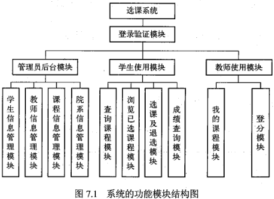

1. 登录验证模块

   - 此模块用于用户登录系统，只有当用户的身份信息被检验成功后，才可以进入系统，否则要重新登录。

2. 管理员后台模块

   - 此模块有学生信息管理、教师信息管理、课程信息管理、班级信息管理的功能，主要用于教务管理员对系统数据的日常维护，向学生和教师提供数据支撑，如 图 7.2 所示。

3. 学生使用模块

   - 学生模块可以査询课程、浏览已选课程、查询成绩和选/退课程，如 图7.3 所示。

   

   此模块主要用于学生自主选课，学生单击下拉菜单并选择课程类别、学分、教师、上课时间、上课地点、课程编号、课程名称等检索项并输入关键字来査询课程。例如，单击系统主页的课程编码可以査看课程细节并进行选课，如果想退选，则进入浏览已选课程模块单击课程编码进行退选，且当考试结束后，可查询成绩。

4. 教师使用模块

   - 如 图 7.4 所示，教师可以在所有课程中浏览到自己的课程，并能知道每门课程的上课时间和上课地点等相关课程信息。此模块还用于教师给学生登分，教师进入登分模块单击下拉菜单中的某门课程，依次把所有学生的分数输入到系统中，以便学生可以查询成绩

   

### 7.2.2 数据库设计

- 根据系统的功能模块设计结果，以及前期的需求分析，可首先明确本系统的数据库范围，然后可通过使用ER图作为数据库概念设计的描述工具，建立本系统所涉及的局部信息结构，再将各个局部信息结构合并成为一个优化的全局信息结构，最后将全局信息结构的E R图转换为关系模型，并依据关系数据库规范化理论进行优化。

1. 确定实体

   1. 学生实体 用于描述学生的基本信息，包括学号、姓名、性别、密码等信息。

   2. 教师实体 用于描述教师的基本信息，包括教师工号、姓名、性别、年龄、职称、密码等信息

   3. 课程实体 用于描述课程的基本信息，包括课程号、课程名、学分、时间、地点、类别、开课学院、限选人数等信息。

   4. 院系实体 用于描述院系的基本信息，包括院系名称、办公地点、教师人数等信息。

   5. 系统管理员实体 用于描述系统管理员的基本信息，包括姓名、ID号、密码等信息

      需要注意的是：在数据库设计时，实体的描述信息可根据实际需求进行增加或删减，如果实体的属性较多，在构建ER模型时不一定需要把所有的属性都标识在ER模型上，可以另外用文字说明，这样也使得ER模型简明清晰，便于分析。

2. 局部信息结构

   1. **学生课程ER图**如 图 7.5 所示，其描述了学生实体与课程实体之间的联系。其中，学生实体与课程实体之间的联系命名为“选修”，它是一个多对多的联系（M:N），即每个生可以选修多门个性化课程，同时每门个性化课程也可以被多名学生所选修。

      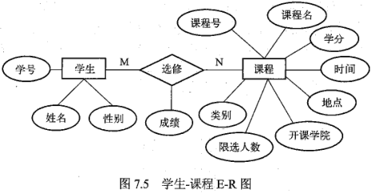

   2. **教师课程ER图**如 图 7.6 所示，其描述了教师实体与课程实体之间的联系。其中教师实体与课程实体之间的联系命名为“授课”，它是一个一对多的联系（1:N），即每位教师可以教授多门个性化课程，但每门个性化课程只能由一名教师来教授。

      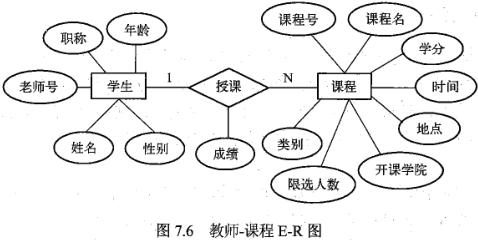

   3. **教师-院系E-R图**如 图 7.7 所示，其描述了教师实体与院系实体之间的联系。其中，院系实体与教师实体之间的联系命名为“属于”，它是一个一对多的联系（1:N），即每个院系可以拥有多位教师，但每位教师只能在一个院系里任职。

      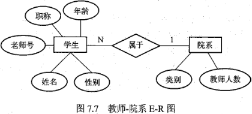

   4. **学生院系ER图**如图 7.8 所示，其描述了学生实体与院系实体之间的联系。其中院系实体与学生实体之间的联系命名为“属于”，它是一个一对多的联系（1:N），即每个院系可以包含多名学生，但每名学生只能在一个院系里就读。

      

   5. **系统管理员学生E-R图**如 图 7.9 所示，其描述了系统管理员实体与学生实体之间的联系。其中，系统管理员实体与学生实体之间的联系命名为“管理”，它是一个多对多的联系（M:N），即每个系统管理员可以管理多名学生的信息，同时每名学生的信息可以被多个系统管理员管理。

      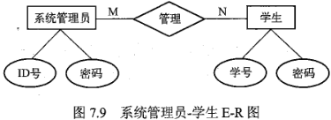

   6. **系统管理员-教师ER图**如 图 7.10 所示，其描述了系统管理员实体与教师实体之间的联系。其中，系统管理员实体与教师实体之间的联系命名为“管理”，它是一个多对多的联系（M:N），即每个系统管理员可以管理多位教师的信息，同时每位教师的信息可以被多个系统管理员管理。

      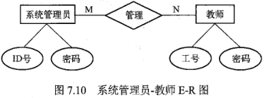

   7. **系统管理员-课程E-R图**如 图 7.11 所示，其描述了系统管理员实体与课程实体之间的联系。其中，系统管理员实体与课程实体之间的联系命名为“管理”，它是一个多对多的联系（M:N），即每个系统管理员可以管理多门课程的信息，同时每门课程的信息可以被多个系统管理员管理

      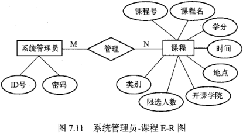

   8. **系统管理员-院系ER图**如 图 7.12 所示，其描述了系统管理员实体与院系实体之间的联系。其中，系统管理员实体与院系实体之间的联系命名为“管理”，它是一个多对多的联系（M:N），即每个系统管理员可以管理多个院系的信息，同时每个院系的信息可以被多个系统管理员管理。

      

3. 全局信息结构

   在构建出上述局部信息结构的基础上，通过采用逐步合并、进行累加的方式，以及消除可能存在的属性冲突、命名冲突和结构冲突，最终形成一个本系统的全局信息结构。

   1. 首先将学生课程ER图、教师-课程E-R图、教师-院系ER图、学生-院系ER图合并成为一个较大的局部信息结构，即学生-教师-课程-院系E-R图，用于描述学生、教师、课程及院系四个实体之间的联系，如图713所示。其中，在教师院系ER图和学生院系ER图中均有同名的联系“属于”，但其实质内容是不同的，因而在合并这两个ER图时，应当为这两个同名的联系重新命名，分别是：“任职”和“从属”

      

   2. 同样，再将系统管理员-学生ER图、系统管理员-教师E-R图、系统管理员-课程E-R图、系统管理员-院系ER图合并成为另一个较大的局部信息结构，即系统管理员学生-教师课程-院系ER图，用于描述系统管理员实体与学生、教师、课程及院系四个实体之间的联系，如图7.14所示。其中，在系统管理员学生ER图、系统管理员-教师ER图、系统管理员-课程ER图、系统管理员-院系ER图中均有同名的联系“管理”，但其实质内容是不同的，因而在合并这4个ER图时，应当为这4个同名的联系重新命名，分别是：“管理学生”“管理教师”“管理课程”“管理院系”

      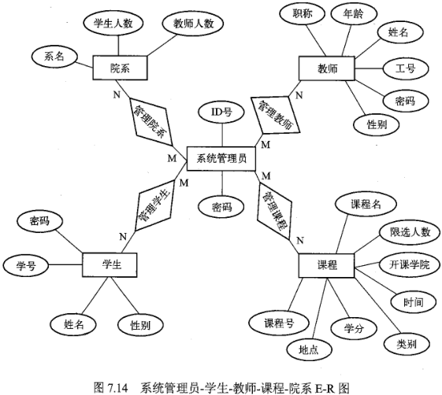

   3. 最后，将学生-教师-课程院系ER图和系统管理员-学生-教师课程-院系ER图合并成为一个本系统的全局ER图，如 图 7.15所示。

4. 逻辑结构与规范化设计

   - 形成本系统的全局ER模型之后，即可开展关系数据库的逻辑结构设计了，也就是设计本数据库应用软件的基本关系模式。根据第三章介绍的ER图向关系模型转换的原则，可将图7.15所示的全局ER图转换为如下一些关系模式，其中主码用下划线标识。
     - 学生（学号、姓名、性别、登录密码、院系编号）
     - 院系（院系编号、系名、学生人数、教师人数、办公地点）
     - 教师（职工号、姓名、性别、年龄、职称、登录密码、院系编号）
     - 课程（课程号、课程名称、课程类别、学分、上课时间、上课地点、开课学院、限选人数、职工号）
     - 系统管理员（ID号、姓名、登录密码）
     - 选修（学号、课程号、成绩）
     - 管理学生（管理员ID号、学号、操作时间）
     - 管理院系（管理员ID号、院系编号、操作时间）
     - 管理教师（管理员ID号、职工号、操作时间）
     - 管理课程（管理员ID号、课程号、操作时间）

   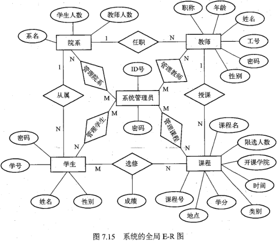

- 由此可见，上述转换是
  - 将全局ER图中的5个实体直接转换成了5个对应的关系模式即“学生”“院系”“教师”“课程”和“系统管理员”；
  - 而后将全局E-R图中3个一对多（1：N）联系分别与对应的关系模式进行了合并，即“学生”“教师”“课程”；
  - 最后是将全局ER图中5个多对多（MN）联系分别转换成5个独立的关系模式，且各关系的码分别是各自联系两端的实体码的组合。
- 在将ER图转换为关系模式之后，还需要进一步分析各关系模式是否符合第三范式的要求。如若不符合，则通常需要将这些关系模式分解为符合第三范式要求的关系模式，从而实现数据库的规范化设计。
- 由此，根据第二章介绍的关系规范化理论，经分析发现：
  - 在上述这些关系模式中，“学生”“教师”“系统管理员”“选修”“管理学生”“管理院系”“管理教师”“管理课程”等8个关系模式既不存在部分函数依赖，也不存在传递函数依赖，满足第三范式要求；
  - 而“院系”尽管不存在部分函数依赖，满足第二范式要求，但存在着传递函数依赖，故需要进一步分解，以满足第三范式的要求，其可分解成关系模式“院系编码（院系编号、系名）”和关系模式“院系（院系编号、学生人数、教师人数、办公地点）”；
  - 同样，“课程”也是尽管不存在部分函数依赖，满足第二范式要求，但存在着传递函数依赖，需要进一步分解，以满足第三范式的要求，其可分解成关系模式“课程编码（课程号、课程名称）”和关系模式“课程（课程号、课程类别、学分、上课时间、上课地点、开课学院、限选人数、职工号）”。

## 第三节 系统实现

- 按照数据库应用软件开发步骤的划分，在完成系统的数据库设计和功能设计之后，就可以采用相应的数据库管理系统和应用软件开发语言，分别实现系统的数据库和业务功能，即数据库实现和系统功能实现。这里，数据库实现是基于MSQL数据库来完成，系统的业务功能是采用PP语言来开发（关于使用PHP语言开发数据库应用的有关知识，读者可自行参阅本书附录2）。

1. 数据库的实现

   ```mysql
   CREATE DATABASE db_xuanke;
   ```

   然后，根据本应用数据库逻辑结构设计所得出的关系模式，通过使用 MySQL数据库的 `CREATE TABLE` 命名，在数据库 `db xuanke` 中创建 12 张数据表，并建立各表的主键，从而构成主键索引。

   - 这些表的结构定义分别如表 7.2-7.13所示。

   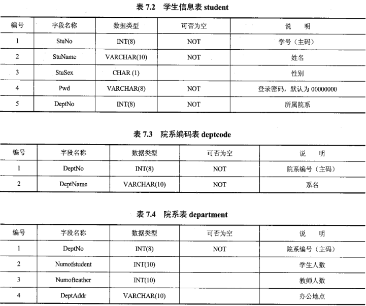

   

   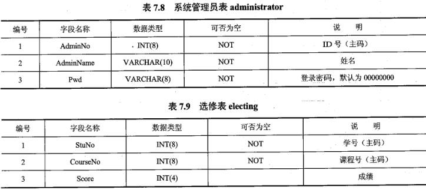

   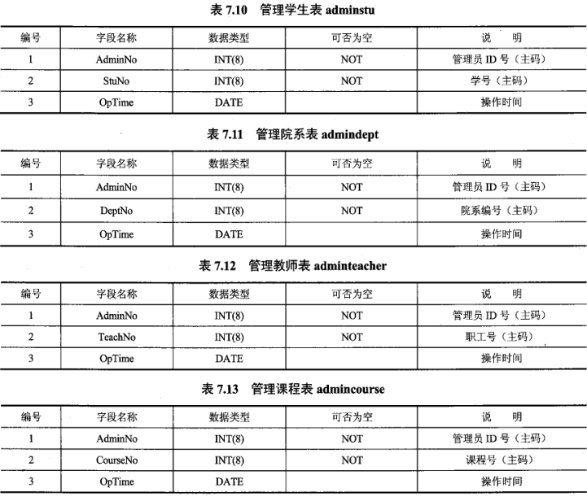

2. 系统功能的实现

   实现数据库行为实现数据库行为是实现数据库行为设计的结果，主要是通过SQL语言完成与本应用功能相关的增、删、改、查等数据库操作，也包括为提髙数据库操作效率或保护数据库安全而创建的各种数据库对象，例如子査询、视图、触发器、存储过程或存储函数等。

   1. 安全控制

      例如，为新来的教务管理人员金老师（用户名 `jin`）分配具备管理学生、院系、教师和课程的权限，可在数据库中编写如下SQL语句实现：

      ```mysql
      GRANT SELECT,UPDATE,INSERT,DELETE
      	ON db_xuanke.*
      	TO 'jin'@'localhost'
      ```

   2. 管理学生。
      例如，教务管理人员金老师需要在学生管理功能中添加一名计算机学院的女生黄然同学时，可在数据库中编写如下SQL语句实现

      ```mysql
      INSERT INTO db_xuanke.student
      	SET StuNo=20170922,StuName='黄然',StuSex='女',Pwd=DEFAULT,DeptNo=
      	SELECT DeptNo FROM db_xuanke.deptcode WHERE DeptName='计算机学院';
      ```

   3. 数据库保护。
      例如，当每位教师进行登分操作时，系统需要根据教师所登分数值进行自动验证，判断该分数值是否位于0~100分区间，以此保护数据库中数据的正确性，因而可在数据库中编写如下SQL语句实现：

      ```mysql
      CREATE TRIGGER tri_test AFTER INSERT ON db_xuanke.electing
      	FOR EACH ROW BEGIN
      IF NEW.Score<0 and NEW.Score>100 THEN
      DELETE FROM db_xuanke.electing WHERE Score=NEW.Score
      END IF
      END;
      ```

   4. 事务与并发控制。
      例如，教务管理人员金老师需要批量录入教师信息时，为防止其他操作对数据的影响可通过使用事务处理来维护数据库的完整性，因而可在数据库中编写如下SQL语句实现：

      ```mysql
      BEGIN; #开始事务
      INSERT INTO db_xuanke.teacher VALUES(10021,'万明',NULL,NULL,NULL,DEFAULT,10);
      INSERT INTO db_xuanke.teacher VALUES(10073,'黄新',NULL,NULL,NULL,DEFAULT,10);
      INSERT INTO db_xuanke.teacher VALUES(11031,'徐丽',NULL,NULL,NULL,DEFAULT,11);
      COMMIT; #提交事务
      ```

   5. 数据查询与统计报表。
      在数据库应用系统中，数据查询是最常用的功能，其应根据用户提出的查询条件实现相应的查询功能。其中，生成统计报表是很多数据库应用软件所提供的一个功能。例如，在本选课系统中，可以为教务管理人员提供统计每个学生选修课程总学分的报表，因而这个用户需求可以通过使用SQL语句定义如下视图来实现

      ```mysql
      CREATE VIEW v_score(StuNo,totlescore)
      AS
      SELECT student.Student.StuNo,SUM(course.Credit)
      FROM student JOIN electing ON student.StuNo=electing.StuNo
      JOIN course ON course.CourseNo=electing.CourseNo 
      WHERE electing.Scoure>=60
      GROUP BY student.StuNo;
      ```

3. 实现应用软件的业务逻辑

   - 这一阶段的开发工作主要是根据系统功能设计的结果，分别逐个实现各个功能模块。其中，各模块与底层数据库的交互操作，是通过应用软件的编程语言（如PHP）进行封装的。
   - 这里，以本系统的登录验证模块为例，简单描述其实现过程。
   - 首先，使用网页设计语言 HTML/CSS实现如 图716 所示的系统登录验证页面
   - 然后，通过使用PHP编程语言编写相应的服务器端代码，完成此登录验证页面与后台数据库的交互操作，具体包括建立与MSQL数据库服务器的连接，査询数据库表 student、 teacher administrator I中是否存在通过登录验证页面表单采用POST方式传递到后台服务器的数据。
   - 最后，后台服务器根据在数据库中进行查询操作的返回结果，向网络页面请求用户做出相应的反馈，即若查询操作返回存在数据的结果集，则用户正常登录系统，否则用户无法登录系统。

## 第四节 系统测试与维护

- 完成系统的实现工作之后，在正式交付用户使用之前，需要对所开发的系统进行必要的测试，验证其是否满足用户的功能要求，并根据测试的结果，以及用户的反馈意见，对该系统进行进一步的修改、完善和维护工作。例如，在本系统中，可以分别针对不同的功能模块制定相应的测试方案

1. 登录验证功能测试

   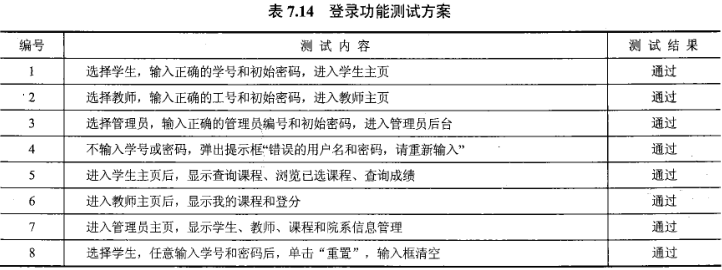

2. 管理员后台主要功能测试

   1. 学生信息管理功能

      

   2. 课程信息管理功能

      

      

3. 学生使用模块功能测试

   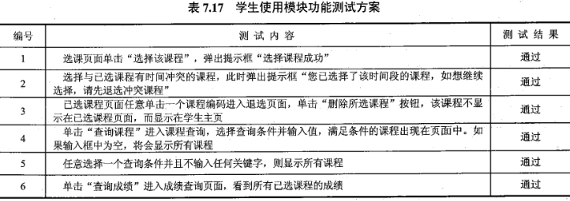

4. 教师使用模块功能测试

   

## 本章小结

# 第八章 数据管理技术的发展

## 第一节 数据库技术发展概述

- 数据模型是数据库系统的核心和基础。以数据模型的发展为主线，数据库技术可以相应地分为三个发展阶段，即第一代的网状、层次数据库系统，第二代的关系数据库系统，以及新一代的数据库系统

### 8.1.1 第一代数据库系统

- 第一代数据库系统有如下两类代表。
  1. 1969年BM公司研制的层次模型数据库管理系统MS
  2. 美国数据库系统语言研究会（ CODASYL）下属的数据库任务组（DBTG）对数据库方法进行了系统的研究和探讨，于20世纪60年代末70年代初提出了若干报告，称为DBTG报告。DBTG报告确定并建立了数据库系统的许多概念、方法和技术。DBTG所提议的方法是基于网状结构的，是网状模型数据库系统的典型代表。
- 这两类数据库系统具有以下几个共同特点。
  1. 支持三级模式（外模式、模式、内模式）的体系结构。模式之间具有转换（或称为映射）功能。
  2. 用存取路径来表示数据之间的联系。这是数据库系统和文件系统的主要区别之数据库不仅存储数据，而且存储数据之间的联系。数据之间的联系在层次和网状数据库系统中都是用存取路径来表示和实现的。
  3. 独立的数据定义语言。层次数据库系统和网状数据库系统有独立的数据定义语言，用以描述数据库的三级模式以及相互映像。诸模式一经定义，就很难修改。
  4. 导航的数据操纵语言。层次和网状数据库的数据查询和数据操纵语言是一次一个记录的导航式的过程化语言。这类语言通常嵌入某一种高级语言，例如 COBOL、 FORTRAN、C语言中。

### 8.1.2 第二代数据库系统

1. 奠定了关系模型的理论基础，给出了人们一致接受的关系模型的规范说明。研究了关系数据库理论，主要包括函数依赖、多值依赖、连接依赖、范式等。根据规范化理论指导数据库设计，将不好的数据库逻辑结构分解。随后又研究了“泛关系”理论，使得用户使用时仍把数据库看成一个整体，而实际存储是按规范化理论分解的关系结构存储。
2. 研究了关系数据语言，有关系代数、关系演算、S①L语言及QBE等。这些描述性语言一改以往程序设计语言和网状、层次数据库系统中数据库语言的风格，以其易学易懂的优点得到了最终用户的喜爱，为20世纪80年代数据库语言标准化打下了基础。
3. 研制了大量的 RDBMS的原型，攻克了系统实现中査询优化、并发控制、故障恢复等一系列关键技术。不仅大大丰富了DBMS实现技术和数据库理论，更重要的是促进了RDBMS产品和蓬勃发展和广泛应用。
   关系数据库系统从实验室走向了社会，因而在计算机领域，有人把20世纪70年代称为数据库时代。20世纪80年代几乎所有新开发的DBMS均是关系数据库系统。关系数据库是以关系模型为基础的，而关系模型是由数据结构、关系操作和数据完整性三部分组成。关系模型不仅简单、清晰，而且由关系代数作为语言模型，由关系数据理论作为理论基础。
   因此，第二代关系数据库系统具有模型简单清晰、理论基础好、数据独立性强、数据库语言非过程化和标准化等特点。

### 8.1.3 第三代数据库系统

1. 第三代数据库系统应支持数据管理、对象管理和知识管理除提供传统的数据管理服务外，第三代数据库系统将支持更加丰富的对象结构和规则，应该集数据管理、对象管理和知识管理为一体。《宣言》认为，无论该数据库系统支持何种复杂的、非传统的数据模型，它应该具有面向对象模型的基本特征。数据模型是划分数据库发展阶段的基本依据。因此，第三代数据库系统应该是以支持面向对象数据模型为主要特征的数据库系统。但是，只支持面向对象模型的系统不能称为第三代数据库系统。第三代数据库系统还应具备其他特征。

2. 第三代数据库系统必须保持或继承第二代数据库系统的技术第三代数据库系统必须保持第二代数据库系统的非过程化数据存取方式和数据独立性应继承第二代数据库系统已有的技术。不仅能很好地支持对象管理和规则管理，而且能更好地支持原有的数据管理，支持多数用户需要的即席查询等。

3. 第三代数据库系统必须对其他系统开放数据库系统的开放性表现在：支持数据库语言标准；在网络上支持标准网络协议；系统具有良好的可移植性、可连接性、可扩展性和互操作性等。

   既然对于第三代数据库系统并没有形成一致的认识，因而通常把第二代以后的数据库系统称为新一代数据库系统。新一代数据库系统将是以更加丰富的数据模型和更强大的数据管理功能为特征，从而满足广泛更加复杂的新应用的要求。

## 第二节 数据仓库与数据挖掘

### 8.2.1 从数据库到数据仓库

- 数据库与数据仓库只有一字之差，似乎是一样的概念，但实际则不然。

- 计算机系统中存在着两类不同的数据处理工作：

  - 一类是操作型处理，也称为联机事务处理（ Online Transaction Processing, OLTP），它是针对具体业务在数据库联机的日常操作，通常对少数记录进行查询和修改，用户较为关心操作的响应时间、数据的安全性、完整性和并发支持的用户数等问题，传统的数据库系统作为数据管理的主要手段，主要用于操作型处理；

  - 另类是分析型处理，也称为联机分析处理（ Online Analytical Processing, OLAP），一般针对某些主题的历史数据进行分析，支持管理决策，它通常是对海量的历史数据查询和分析，如金融风险预测预警系统、证券股市违规分析系统等，这些系统要访问的数据量非常大，查询和分析的操作十分复杂。

    事务型处理数据和分析型处理数据的区别可如 表 8.1 所示。

  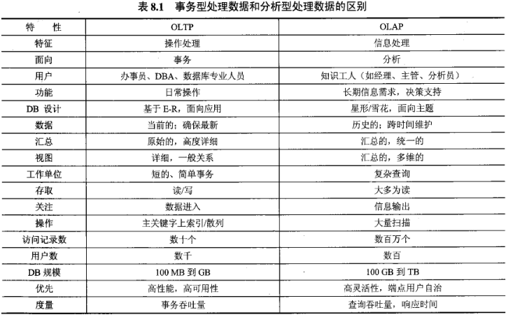

  - DTP和OLAP两者之间的差异使得传统的数据库技术不能同时满足两类数据的处理要求，因此在20世纪80年代数据仓库（ Data Warehouse,pw）技术应运而生。数据仓库的建立将操作型处理和分析型处理区分开来。传统的数据库技术为操作型处理服务，数据仓库为分析型处理服务。二者各司其职，泾渭分明。越来越多的组织或企业认识到数据仓库的重要性，逐步在原有数据库基础上建立起自己的数据仓库系统

- 1992年数据仓库概念的创始人 W.H. Inmon在其《 Building the Data Warehouse》一书中定义了数据仓库的概念：数据仓库是面向主题的、集成的、稳定的、随时间变化的数据集合，用以支持管理决策的过程。数据仓库不是可以买到的产品，而是一种面向分析的数据存储方案。对于数据仓库的概念，可以从两个层次进行理解：首先，数据仓库用于支持决策，面向分析型数据处理，不同于提高业务效率的操作型数据库；其次，数据仓库对分布在组织或企业中的多个异构数据源集成，按照决策主题选择数据并以新的数据模型存储。此外，存储在数据仓库中的数据一般不能修改。相应地，数据仓库主要有以下特征。

  1. 面向主题数据仓库中的数据是按照各种主题来组织的。主题在数据仓库中的物理实现是一系列的相关表，这不同于面向应用环境。例如，保险公司按照应用组织可能是汽车保险、生命保险、伤亡保险，而数据仓库是按照客户、政策、保险金和索赔来组织数据。面向主题的数据组织方式可在较高层次上对分析对象的数据给出完整、一致的描述，能完整、统一地刻画各个分析对象所涉及的各项数据以及数据之间的联系，从而适应组织或企业各个部门的业务活动特点和数据的动态特征，从根本上实现数据与应用的分离。
  2. 集成性数据仓库中的数据是从原有分散的源数据库中提取出来的，其每一个主题所对应的源数据在原有的数据库中有许多冗余和不一致，且与不同的应用逻辑相关。为了创建一个有效的主题域，必须将这些来自不同数据源的数据集成起来，使之遵循统一的编码规则
  3. 数据的非易失性数据的非易失性主要是针对应用而言的。数据仓库的用户对数据的操作大多是数据查询或比较复杂的挖掘，一旦数据进入数据仓库以后，一般情况下都被较长时间的保留。数据仓库中一般有大量的查询操作，但修改和删除操作较少。因此，数据经加工和集成进入数据仓库后是极少更新的，通常只需要定期加载和更新。
  4. 数据的时变性许多商业分析要求对发展趋势做出预测，对发展趋势的分析需要访问历史数据。因此数据仓库必须不断捕捉OLTP数据库中变化的数据，生成数据库的快照，经集成后增加到数据仓库中去：另外数据仓库还需要随时间的变化删去过期的、对分析没有帮助的数据，并且还需要按规定的时间段增加综合数据。

- 一般地，数据仓库具有三个常用的重要概念，即粒度、分割和维。

  1. 粒度粒度问题是设计数据仓库的一个最重要的方面。粒度是指数据仓库的数据单位中保存数据的细化或综合程度的级别，细化程度越高，粒度级就越小，相反地，细化程度越低，粒度级就越大。数据的粒度一直是一个设计问题。在早期建立的操作型系统中，粒度是用于访问授权的，当详细的数据被更新时，几乎总是把它存储在最低粒度级上。但在数据仓库环境中对粒度不做假设。在数据仓库环境中粒度之所以是主要的设计问题，是因为它深深地影响存储在数据仓库中的数据量的大小，同时影响数据仓库所能回答的查询类型。在数据仓库中的数据量大小与查询的详细程度之间要做出权衡。
  2. 分割分割是将数据分散到各自的物理单元中，以便能分别处理，以提高数据处理的效率。数据分割后的单元称为切片。数据分割的标准可以根据实际情况来确定，通常可按日期、地理分布、业务范围等进行分割，数据分割后较小单元的数据处理相对独立，使数据更易于重构、索引、恢复和监控，处理起来更快。
  3. 维维是人们观察数据的特定角度，是考虑问题时的一类属性。此类属性的集合构成一个维度，例如时间维、产品维等。维可以有细节程度的不同描述方面，这些不同描述方面称为维的层次，维层次中维的一个取值称为维的一个成员，不同的多个维成员的组合组成了该维的不同维层次。最常用的维是时间维，时间维的维层次可以有日、周、月、季、年等。数据仓库中的数据按照不同的维组织起来形成了一个多维立方体。维的概念使用户能够从多个角度观察数据仓库中的数据，以便深入了解包含在数据中的信息。

  此外，数据仓库有时也称为企业仓库。企业数据仓库可以在大型机、超级计算机服务器或并行结构平台上实现，但建设数据仓库是一项庞大的系统工程，需要广泛业务建模，其工作量大、代价和风险很高。为此，人们提出了数据集市（ Data Mart）体系结构的数据仓库概念。数据集市的基本思想是自下而上的数据仓库的开发方法。数据集市结构的数据仓库，又称为主题结构数据仓库，是按照主题进行构思所形成的数据仓库。数据集市结构一般只能对某个主题进行操作，如果用户希望对两个以上的主题进行操作，则必须对这两主题的数据结构都了解，否则无法实现多主题的操作，而多主题的数据仓库结构往往会产生大量的冗余。一般可以将数据集市分为独立的数据集市（ Independent Data Mart）和从属的数据集市（ Dependent Data Ma）或这两种数据集市的混合。

### 8.2.2 数据挖掘技术

- 数据挖掘（ Data Mining）是从大量的、不完全的、有噪声的、模糊的、随机的实际应用数据中发现并提取隐藏在其中的、人们事先不知道的、但又是潜在有用的信息和知识的一种技术。它又被称为数据库中的知识发现（ Knowledge Discovery in DataBase,KDD），其与数据库、数理统计、机器学习、模式识别、模糊数学等诸多技术相关。
- 在数据库技术中，数据处理基于查洵，可以发现有用的信息。然而，这种查询的回答反映直接存储在数据库中的信息，或通过聚合函数可计算的信息，它们并不反映复杂的模式，或隐藏在数据库中的规律。因此，数据处理不是数据挖掘在数据仓库技术中，OLAP是数据汇总/聚集工具，可帮助简化数据分析，而数据挖掘是自动地发现隐藏在大量数据中的隐含模式和有趣知识；OLAP工具的目标是简化和支持交互式数据分析，而数据挖掘工具的目标是尽可能自动处理。在这种意义下，数据挖掘比传统的联机分析处理前进了一步
- 相应地，数据挖掘具备下列几种功能。
  1. 概念描述通过数据挖掘技术，可以归纳总结出数据的某些特征。
  2. 关联分析在数据挖据技术中，基于关联规则的挖掘是应用较广的一种方法。数据关联是数据库中存在的一类重要的可被发现的知识。若两个或多个变量的取值之间存在某种规律性，就称为关联。也就是说，关联规则表示了数据库中一组数据项间的相关性。关联可分为简单关联、时序关联、因果关联。关联分析的目的是找出数据库中隐藏的关联网。有时用户并不知道数据库中数据的关联函数，即使知道也是不确定的。常见的关联分析算法有 Apriori、FP growth等。
  3. 分类与预测分类就是找出一个类别的概念描述，它代表了这类数据的整体信息，即该类的内涵描述，并用这种描述来构造模型，一般用规则或决策树模式表示。描述可以是显式的，即特征概念描述或清晰的概念描述，也可以说分类是利用训练数据集通过一定的算法而求得分类规则。分类可被用于规则描述和预测。根据不同类对象特征的描述可以得出辅助决策信息。常见的分类模型及算法有决策树模型、神经网络模型、线性回归模型等。
  4. 聚类聚类是把数据按照相似性归纳成若千类别，同一类中的数据彼此相似，不同类中的数据相异。聚类分析可以建立宏观的概念，发现数据的分布模式，以及可能的数据属性之间的相互关系。聚类的目的是使属于同一类别的对象之间的距离尽可能小，而不同类别的对象间的距离尽可能大。与分类方法不同的是，聚类没有预先的分类特征，而是根据一定的规则将对象归类，对分类后的对象类显式或隐式地描述其共同特征。常用的聚类算法有 K-Means、 GMM等
  5. 孤立点检测孤立点是指数据中与整体表现行为不一致的数据集合。这些数据虽然是一些特例，但往往在错误检查和特例分析中是非常有用的。
  6. 趋势和演变分析通过数据挖掘技术，可以描述行为随着时间变化的对象所遵循的规律或趋势
- 在实际使用中，数据挖掘的过程通常由以下六个步骤构成。
  1. 确定业务对象。将用户需求和目标转换成一种数据挖掘的问题定义，设计出达到目标的一个初步计划。认清数据挖掘的目的是数据挖掘的重要一步，挖掘的最后结果是不可预测的，但要探索的问题应是有预见的，为了数据挖掘而数据挖掘带有盲目性，是不会成功的。
  2. 数据的选择。搜索所有与业务对象有关的内部和外部数据信息，并从中选择出适用于数据挖掘应用的数据。数据挖掘的数据主要有两种来源，即数据可以是从数据仓库中来的，也可以是直接从数据库中而来。
  3. 数据的预处理。实际应用数据往往是不完全的、有噪声的、模糊的、随机的，因此要根据不同的需求在挖掘之前进行预处理，即将最初的原始数据构造成最终适合建模工具处理的数据集，包括表、记录和属性的选择、数据转换和数据清洗等。其中，从数据仓库中直接得到数据挖掘的数据有许多好处，因为数据仓库的数据已经过了预处理，许多数据不一致的问题都较好地解决了，在数据挖掘时可大大减少清洗数据的工作量。
  4. 建模。选择和应用各种建模技术，并对模型参数选择合适的算法进行优化。
  5. 模型评估。对模型进行评价，并检査构建模型的每个步骤，确认其是否真正实现了预定的目的。
  6. 模型部署。创建完模型并不意味着工作结束，即使创建模型的目的是为了増加用户对数据的了解，所获得的知识也要用一种用户可以使用的方式来组织和表示，通常要将活动模型应用到决策制定的过程中。

## 第三节 大数据管理技术

### 8.3.1 大数据定义

- 目前大数据尚无统一的定义，通常被认为是数据量很大、数据形式多样化的数据。例如，EMC公司认为“大”是指大型数据集，一般在10TB规模左右，同时这些数据来自多种数据源，以实时、迭代的方式实现。IBM则是把大数据概括为4个V，即大量化（ Volume）、多样化（ Variety）、快速化（ Velocity）和真实性（ Verity），强调大数据呈现价值稀疏性的特点。维基百科认为，大数据是指利用常用软件工具捕获、管理和处理数据所耗时间超过可忍时间的数据集。
- 一般意义上，大数据是指无法在可容忍的时间内用现有信息技术和软、硬件工具对其进行感知、获取、管理、处理的服务的数据集合，且其具有如下特征。
  1. 数据量巨大，即大量化（ Volume）。通过各种设备产生海量数据，数据规模庞大，数据量从TB级别，跃升到PB级别。IDC的研究报告称，未来10年全球大数据将增加50倍，管理数据仓库的服务器数量将增加10倍。
  2. 数据种类繁多，即多样化（ Variety）。大数据种类繁多，在编码方式、数据格式和应用特征等多个方面存在差异性，多信息源并发形成大量的异构数据。相对于以往便于存储和分析的结构化数据，大数据的数据类型不再是单一的文本形式，网络日志、音频、视频、图片、地理位置信息等多类型的数据对数据的存储和处理能力提出了更高的要求。据统计，企业中80%的数据是非结构化或半结构化的
  3. 处理速度快，即快速化（ Velocity）。大数据对实时处理有着较高的要求，在海量数据面前，处理数据的效率就是企业的竞争力iv）价值（ Value）密度低。价值密度的高低与数据总量的大小成反比。在现实应用中，数据量大的数据并不一定有很大的价值，不能被及时有效处理分析的数据也没有很大的应用价值。大数据的本质并非在于大，而在于其价值含量。

### 8.3.2 大数据管理技术典型代表

1. 1.大数据存储

2. NOSQL数据管理系统

   - NOSQL是以互联网大数据应用为背景发展起来的分布式数据管理系统。 NoSQL有两种解释：一种是Non- Relational，即非关系数据库；另一种是 Not Only SQL，即数据管理技术不仅仅是SQL 

   - NOSQL系统为了提高存储能力和并发读写能力采用了极其简单的数据模型，支持简单的查询操作，而将复杂操作留给应用层实现。该系统对数据进行划分，对各个数据分区进行备份，以应对结点可能的失败，提高系统可用性；通过大量结点的并行处理获得高性能，采用的是横向扩展的方式。它弥补了传统数据库由于事务等机制而带来的对海量数据高并发请求处理性能上的欠缺，采用一种非关系的方式来解决大数据存储和管理的问题

   - NoSQL系统支持的数据存储模型通常有键值（Key-vlue）模型、文档（ Document）模型、列（ Colum）模型和图（ Graph）模型等。

     1. 键值（Key-alue）存储

        Key-value存储是 NOSQL数据库采用最多的数据存储方式，它的数据是以Key-ahue的形式存储的。Key-aue数据模型是一个映射，Key是查找数据地址的唯一关键字，而 Value是数据实际存储的内容。它采用这个弱关系的数据模型，使用哈希函数实现关键字到值的快速映射，从而提高数据的存储能力和并发读/写能力。虽然它的数据处理速度非常快，适合通过主键进行查询或遍历，但基本上只能通过Key的完全一致查询获取数据。常见的键值存储数据库包括 Tokyo Cabinet/Tyrant、 Redis和 Oracle bDB等。

     2. 文档存储文档存储

        不需要定义表结构，但可以像定义表结构一样使用。文档存储的存储格式可以多样化，适合存储系统日志等非结构化数据。与Key-Vale存储不同的是，它可以通过复杂的查询条件来获取数据。虽然它不具备关系数据库所具有的事务处理和JON的处理能力但基本上能实现除此之外的其他处理。常见的文档型数据库有 CouchDB、 MongoDB等。

     3. 列存储

        列存储是以列为单位来存储数据的，擅长以列为单位读入数据，比较适合对某一列进行随杋査询处理。采用列存储数据模型让数据库系统具有高扩展性，即使数据增加也不会降低相应的处理速度，因此列存储主要应用于需要处理大量数据的情况。常见的列存储数据库有Cassandra、 HBase等。

     4. 图存储图存储

        数据库是基于图理论构建的，使用结点、属性和边的概念。结点代表实体，属性保存与结点相关的信息，而边用来连接结点，表示两者关系。图数据库存储某些数据集非常快，可以把图直接映射到面向对象应用程序中。

3. MapReduce技术

   - MapReduce技术是（ Google公司于2004年提出的大规模并行计算解决方案，主要应用于大规模廉价集群上的大数据并行处理。 MapReduce以 Key/value的分布式存储系统为基础，通过元数据集中存储、数据以 chunk为单位分布存储和数据 chunk冗余复制来保证其高可用性。
   - MapReduce是一种并行编程模型。它把计算过程分解为两个阶段，即Map阶段和Reduce阶段。具体执行过程是：首先，对输入的数据源进行分块，交给多个Map任务去执行，Map任务执行Map函数，根据某种规则对数据分类，写入本地硬盘；然后，进入Reduce阶段，在该阶段由 Reduce函数将Map阶段具有相同Key值的中间结果收集到相同的Reduce节点进行合并处理，并将结果写入本地磁盘。程序的最终结果可以通过合并所有Reduce任务的输出得到。其中，Map函数和Rduc函数是用户根据应用的具体需求进行编写。
   - MapReduce是一种简单易用的软件框架。基于它可以开发出运行在成千上万个结点上，并以容错的方式并行处理海量数据的算法和软件。通常，计算结点和存储结点是同一个节点，即 MapReduce框架和 Hadoop分布式文件系统运行于相同的结点集。


