# [计算机二级C语言](https://github.com/Eished/self-study-exam_notes)

> **最新自考笔记** : https://github.com/Eished/self-study-exam_notes
>
> **配套代码**：https://github.com/Eished/C-CPP

https://www.bilibili.com/video/BV1sb411a7h6

## 第二章 C基础

### 数据类型


### 算术表达式


运算规则（优先级）：先函数，再括号后乘除，终加减，最后赋值

1. 等号优先级最低, 先计算右边, 在赋值给左边
2. n=n+1;有意义, 在原有变量n的基础上,增加1;
3. 左边不能是表达式a+b=c错误
4. 右边可以是赋值表达式a=b=7+1; 但是a=7+1=b是错误的

### 一些容易出错的优先级问题

上表中，优先级同为1 的几种运算符如果同时出现，那怎么确定表达式的优先级呢？这是很多初学者迷糊的地方。下表就整理了这些容易出错的情况：


### 复合赋值表达式

主要运算符号

```
+= -= /= *=
例:
n+=1;(n=n+1)
n*=m+1(n=n*(m+1))
```

例: 已有变量a, 其值为9, 计算表达式a+=a-=a+a的值
1.先计算a+a=18
2计算a-=18 (此时a仍然是9) a=a-18a变成9
3计算 a+=9 (此时a是9) a=a+(-9) a变

### 赋值运算的类型转换

赋值两边类型不一致,将等号右侧的值转换成左侧数据类型,仅限数值,成为"赋值兼容
整数运算符转换原则

1. 运算符号两边一个短整型,一个长整型,都转化成长整型
2. 运算符号两边一个无符号,一个有符号,都转化成无符号

整数赋值转换原则

1. 左短右长,截取右边,丢高保低
2. 左无右有,复制右边,负数变整数
3. 左有右无,复制右边,高位为1,变负数

### 自增 自减 逗号 运算符号

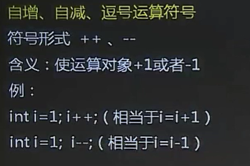

1自增、自减符号可以放在变量前面形成前缀也可以放在后面形成后缀
2如果是前缀,先做自我运算,后运行语句;
3如果是后缀,先运行语句,后做自我运算;
4.不要在一个表达式中多次对同一个变量做运算

### 逗号表达式

逗号表达式运算法则从左到右,一个表达式一个表达式计算,全部运算完毕后,

**最后一个表达式的结果是整个表达式的值**
例:

```
(i=3,i++,++i,i+5)
表达式的值为10,
i的值是5
```


## 第三章 顺序结构

### 赋值语句

赋值语句也称作表达式语句,主要在赋值表达式后加入分号;就构成表达式语句

```
int i=10;∥/赋初值语句
12;/赋值语句
```


### 数据输出

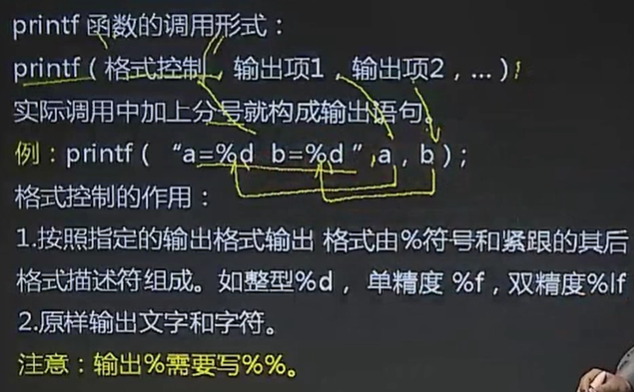

#### 输出修饰符

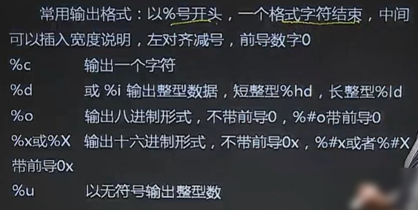


#### 长度修饰符

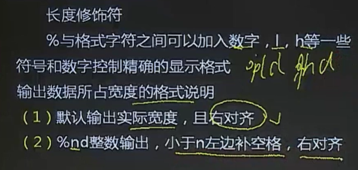


重点考第七种

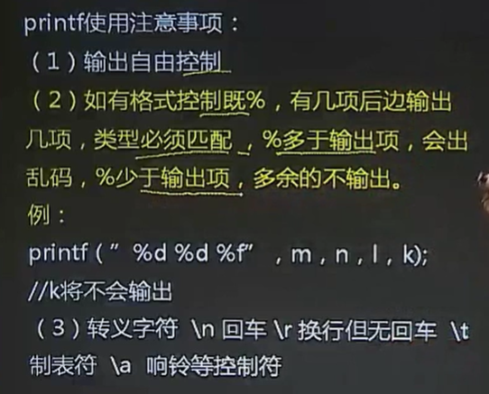

`printf`中是右运算

### 数据输入


#### 输入格式控制符


#### `scanf`函数的使用说明


### 复合语句和空语句

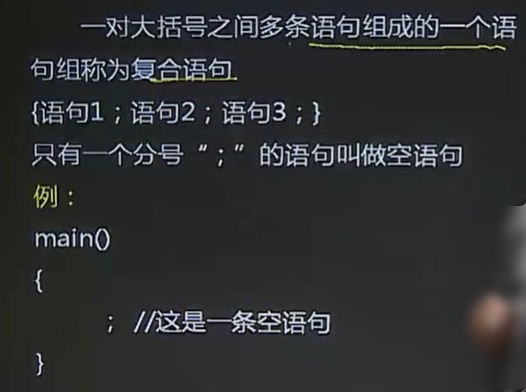

### 算法-后两位四舍五入

原理
(1)原数乘以100
(2)加上0.5
(3)取整
(4)除以100输出


## 第四章 选择结构

### 关系运算和逻辑运算


### 逻辑运算符

双目运算符 单目运算符


### if语句和用if语句构成的选择结构


### 条件表达式


### switch语句


switch 是另外一种选择结构的语句，用来代替简单的、拥有多个分枝的 if else 语句，基本格式如下：

```c
switch(表达式){
  case 整型数值1: 语句 1;
  case 整型数值2: 语句 2;
  ......
  case 整型数值n: 语句 n;
  default: 语句 n+1;
}
```

```c
#include <stdio.h>

int main()
{
  int i = 10, f;
  scanf("%d", &f);
  switch (i / f)
  {
  case 2:
    printf("2");
  case 5:
    printf("5");
  case 10:
    printf("10");
    break;
  default:
    printf("Null");
  }
  return 0;
}

```

它的执行过程是：
1) 首先计算“表达式”的值，假设为 m。

2) 从第一个 case 开始，比较“整型数值1”和 m，如果它们相等，就**执行冒号后面的所有语句**，也就是从“语句1”一直执行到“语句n+1”，而**不管后面的 case 是否匹配成功**。

3) 如果“整型数值1”和 m 不相等，就跳过冒号后面的“语句1”，继续比较第二个 case、第三个 case……一旦发现和某个整型数值相等了，就会执行后面所有的语句。假设 m 和“整型数值5”相等，那么就会从“语句5”一直执行到“语句n+1”。

4) 如果直到最后一个“整型数值n”都没有找到相等的值，那么就执行 default 后的“语句 n+1”。

需要重点强调的是，当和某个整型数值匹配成功后，会执行该分支以及后面所有分支的语句。

由于 default 是最后一个分支，匹配后不会再执行其他分支，所以也可以不添加`break;`语句。

1. case 后面必须是一个整数，或者是结果为整数的表达式，但不能包含任何变量。
2. default 不是必须的。当没有 default 时，如果所有 case 都匹配失败，那么就什么都不执行。


## 第五章 循环结构

### 5.1 while和do-while


***do-while 分号结尾***

### 正负号累加算法

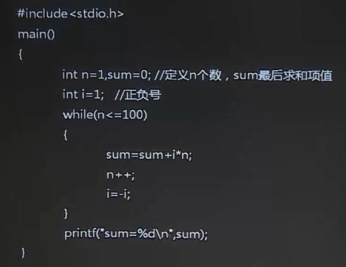

整型/浮点型=浮点型；使用 1.0/n 使整型转换为浮点型

### 精度处理

```c
abs() /*取整数绝对值*/
fabs() /*取整数绝对值*/
```


### 5.2 重要算法 斐波那契数列


```c
#include <stdio.h>

int main()
{
  int f, f1 = 0, f2 = 1;
  printf("%d,", f1);
  do
  {
    printf("%d,", f2);
    f = f1 + f2;
    f1 = f2;
    f2 = f;
  } while (f2 <= 1000);
  return 0;
}
```


### 5.3 for循环


三个参数都可以省略。分号不能省略。


### 5.4 循环嵌套 重点算法判断质数（素数）

重点算法判断质数（素数）
1.什么是质数？
能够被1和自身整除的数
2.最小的质数？
2″是最小的质数
3.如何判断—个数是不是质数？
从2开始到此数之间没能找到一个数
将其除尽，此数为质数。

### 5.5 continue 语句 break 语句

结束本次循环

跳出所有循环

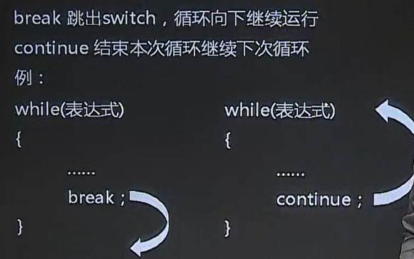


## 第六章 字符型数据

大纲中只规定了字符串与字符数组。
但本章内容涉及以下内容：

1. 字符常量，字符串常量
2. 字符变量的定义及使用
3. 字符型与整型数据的换算关系
4. 转义字符
5. 字符的输入与输出


### 6.1 字符型常量


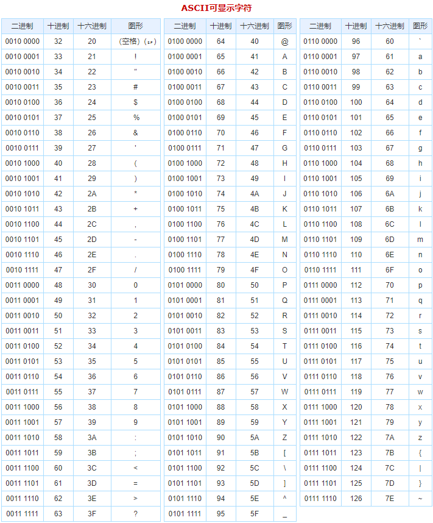


**字符常量**


**什么是转义字符常量？**
单引号括起来，中间由反斜杠开头后跟一个特定字符。
常用转义字符

```c
\n回车换行
\t个制表符（按键盘tab键出现的空格数）
\r回车符 
\\输出反斜杠
\'单引号字符
\"双引号字符
\O空值（屏幕不可见）ACSII值0
注意：
\数字’只代表一个字符
```

**什么是字符串常量？**
双引号括起来，中间由若干字符和
转义字符组成。

`例如：“abd"“acb\n"`

**字符计算**

```c
'B'-'A'=1;
'a'-'A'=32;
```


### 6.2字符变量

定义形式

```c
char 变量名 [=值]
例
char a='a';
char a=97;
```


### 6.3 字符的输入输出

字符输出：`putchart(字符)` 等同于 `printf("%c",char)`
字符输入：`变量= getchar()` 等同于 `sacnf("%c",&char)`
注意:
空格、tab、回车会被接收


### 重点算法 字母大小写转换

例：把从终端输入的小字母转换成大写字母，其他字符不变
分析

1. 小写字母转大写需要减去32
2. 如何判断小写字母，在`a`到`z`之间的字符

```c
#include <stdio.h>
int main()
{
  char c;                         //定义一个字符型变量
  while ((c = getchar()) != '\n') //没有读入字符没有到回车时候转换
  {
    if (c >= 'a' && c <= 'z')
    {
      c = c - 'a' + 'A'; //或者直接写c=c-32
      putchar(c);        //输出字符c
    }
  }
  putchar('\n');
}
```


### 重点算法 统计字符个数

例:统计字符中大写字母和小写字母个数

```c
#include <stdio.h>
int main()
{
  int s = 0, b = 0, n = 0; //定义变量s为小写字母数量,b为大写字母数量,n数字
  char c;
  while ((c = getchar()) != '\n')
  {
    if (c >= 'a' && c <= 'z')
      s++;
    if (c >= 'A' && c <= 'Z')
      b++;
    if (c >= '0' && c <= '9')
      n++;
  }
  printf("%d,%d,%d", s, b, n);
}
```


## 第七章 函数

1. 库函数的正确调用.
2. 函数的定义方法.
3. 函数的类型和返回值.
4. 开式参数与实在参数,参数值的传递.
5. 函数的正确调用,**嵌套调用,递归调用.**
6. **局部变量和全局变量.**
7. **变量的存储类别(自动,静态,寄存器,外部)，变量的作用域和生存期**

### 7.1 库函数

1. C语言是由函数组成的从 `main()`函数开始,在`main()`函数中结束
2. 标准库函数的引入通过命令行的形式 `#include<库函数头文件>`或者`#include"库函数头文件"`
3. 标准库函数的调用形式: 函数名(参数表)
   例：`y=sqrt(13);//开平方`

**常用数学函数**

- pow(底数,指数) 求幂
- sqrt(数值) 开平方
- abs(整数值) 取整数的绝对值
- fabs(实型值) 取实型值的绝对值
- sin(实型) 取得sin值
- cos(实型) 取得cos值
- exp(实型) 以自然对数e为底的幂


### 7.2 函数的定义和返回值

用户自定义函数的一般形式:

```c
函数返回值的类型名 函数名(类型名形参1, 类型名形参2,...)/*函数的首部*/
{
说明部分           /函数体*/
语句部分  
}
```

注意:

1. 函数名及形参由用户定义的标识符组成
2. 同一程序中函数名必须唯一
3. 形参名字在同一函数中命名唯一
4. **不能函数内部定义函数**
5. 如果**不指定返回值类型, 返回值为int型**
6. 函数调用前必须先定义(说明)
7. 无返回值,在函数返回类型处,用 void


**返回值**

函数返回值通过 return语句返回,形式: return表达式

一个函数中允许有多条 return,但是只能有一条执行


### 7.3 函数的调用

调用方法:

1. 函数名(实在参数表)

2. 函数名() 无实参情况
   例

   ```c
   double x=10.2,y=19.3,z;
   z=add(x,y);
   ```

函数调用原则：先定义，后调用。如果函数在调用之后，除返回值是int和char型的，都需要在程序之前进行说明

```c
char b()
{
  printf("bbbb");
}
#include <stdio.h>
double c()
{
  printf("ccc");
}

double d();

// 函数调用与声明
int main()
{
  double e();
  a();
  b();
  c();
  d();
  e();
}
int a()
{
  printf("aaaa");
}
// char a()
// {
//   printf("aaaa");
// }
// double a()
// {
//   printf("aaaa");
// }

double d()
{
  printf("dddd");
}
double e()
{
  printf("eee");
}

```


### 7.5 函数调用之间的数据传递

函数调用中，实参的数据和形参对应传递
两种传递方式

1. 值传递
   只传送值，实参不做改变
2. 地址传递
   传送地址，实参被改变

```c
#include <stdio.h>
void swap(int, int); /*函数说明*/
int main()
{
  int x = 10, y = 20;
  printf("(1)x=%d y=%d\n", x, y);
  swap(x, y); //值传递
  printf("(4)x=%d y=%d\n", x, y);
}
void swap(int a, int b)
{
  int t;
  printf("(2)a=%d b=%d\n", a, b);
  t = a, a = b, b = t;
  printf("(3)a=%d b=%d\n", a, b);
}
```


### 7.6 逗号表达式

逗号优先级最低

只保留右侧操作

右加加优先级低于传参

```c
#include <stdio.h>
#include <stdlib.h>
int main()
{
  int a = 1, b = 1;
  a = ++a, a + 10, a * 10;
  printf("a=%d", a);
  b = (++b, b + 10, b * 10);
  printf("b=%d", b);
  return 0;
}
```

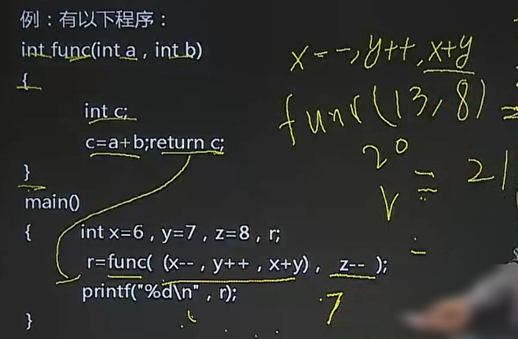

21

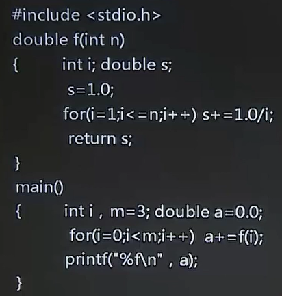

5.5


4


## 第八章 地址和指针

1. 变量的地址和指针
2. 指针变量的定义和指针变量的基类型
3. 给指针变量赋值
4. 对指针变量的操作
5. 函数之间地址值的传递

### 8.1 变量地址和指针

计算机的内存是以字节为单位的一片连续的存储空间,每—个字节都有一个编号这个编号就成为内存地址.

每个变量的地址是指该变量所占存储单元的第一个字节的地址

回忆:

计算机的存储单位

一进制的位(bit)  8bit=1字节. 1024字节=1KB, 1024KB=1M, 1024M=1G

例: int a=5;在内存中的存储结构通过&a可以取出a在内存中的地址此时a的地址为1245052

一种特殊的变量
这种变量只是用来存放内存地址的,起名为指针变量
假设定义了一个只存地址的变量 p
把变量a的地址赋予指针变量 p,
则指针变量p的值为 1245052
当访问变量a时,访问的是什么? 5
当访问指针变量p时,访问的是什么? 1245052

当访问变量时,为"直接存取(直接访问)"
我们也可以通过指针变量间接的访问该地址中原来的值.此时称为"间接存取(间接访问)


### 8.2 指针变量的定义和指针变量的基类型

```c
int*pi;
int *pJ, *pa;
```

说明:

1. pl, pJ, pa都是变量,不过都是指针变量,定义时在普通变量名的左边加上星号就行了
2. pi,pj,pa三个指针变量的类型为整型,说明三变量中只能存放n类型变量的地址
3. 这时我们称n是指针变量 pi, pj, pa的基类型.


例: 

```c
double *pd;
char *s1,*s2;
pd的基类型为 dou ble类型,在指针变量pd中,
只能存放 double类型变量的地址.
s1和s2的基类型为char类型,在指针变量s1和
s2中,只能存放cha类型变量的地址
  
指向指针的指针
例:
int **p,k,*s=&k; // 先取*p，再取*（*p）
p=&s;
```


### 8.3 给指针变量赋值

```c
int k,*q,p;//*k为整型变量,q和p都是指针变量.*
k=1;//*给普通变量赋值
q=&K;//*整型变量k的地址赋值给指针变量q*/
p=q;//*将q的值赋值给p*/
```

```c
#include <stdio.h>
int main()
{
  int a, b = 2, *p = NULL;// 必须赋值后才能使用指针
  a = 1;
  p = &a;
  *p = b;
  printf("%d,%d,%p,%p,%p", *p, a, &p, p, &a);
}
```


**给指针变量赋值**
除了给指针变量赋地址值之外,还可以给指针变量赋—个特殊的值, 该值为"空"值
注意
此时,指针变量p中不是没有值,而是有一个空值。

通过指针来引用一个存储单元,"间址运算符 \*"

```c
#include <stdio.h>
main(){
int k,*q,*p;
q=&k;
p=97;
printf("%d\n%d\n%d\n k,*q,*p);
}
```


### 8.4 对指针变量的操作

址运算符说明

1. \*与\&是逆运算

2. 在指针变量已经存有某一变量地址时, 可以利用"\*变量=值"的形式给指针变量指向的内存空间赋值

3. 关于`++、--`号对指针变量的运算
   例:

   ```c
   ++*p 代表 ++(*p);
   p++ 代表 *(p++);
   
   如果在右边使用自增或者自减符号,必须加括号
   (*p)++
   ```

   

例:用指针指向两个变量,通过指针运算选出值最小的那个数

```c
#include <stdio.h>
main(){
  int a,b,min,*pa,*pb,*pmin;
  pa=&a; pb=&b; pmin=&min;
  scanf("%d%d",pa,pb);
  printf( "a=%d b=%d\",a,b);
  *pmin=*pa;
  if(*pa>*pb) *pmin=*pb;
  printf("min=%d\n", min);
}

```


**移动指针**
所谓移动指针就是对指针变量加上或减去个整数,或通过赋值运算,使指针变昰指向相邻的存储单元

形式:

1. 指针变量+整型常量
2. 指针变量+整型变量


假定在内存中开辟了如图所示的五个连续的存放int类型整数的存储单元.
并分别给它们取代号为:`a[0]、a[1]、a[2 ]a[3]、a[4]`
这些代号所代表的存储单元中,分别有值为: 11、22、33、44、55.p指向a0所在地址,p++代表a[1]


### 8.5 函数之间地址值的传递

形参为指针变量时实参和形参之间的数据传递

```c
#include <stdio. h>
int myadd (int *a, int *b)
{int sum;
sum=*a+*b
return sum;
 }
main(){
  Int x,y,z;
  pint(" Enter xy:") scanf("%d%d",&x,&y);
  z=myadd(&x, &y)
  printf("%d+%d=%d\n ",x,y,z);
}
```


## 第九章 数组

一维数组和二维数组的定义、初始化和数组元素的引用

1. 维数组的定义和一维数组元素的引用
2. 维数组和指针
3. 函数之间对维数组和数组元素的引用
4. 维数组应用举例
5. 二维数组的定义和二维数组元素的引用
6. 二维数组和指针
7. 二维数组名和指针数组作为实参


### 9.1 一维数组的定义和一维数组元素的引用

1. 什么是数组?

   数组是具有相同类型的变量的集合,这些变量在内存中占有连续的存储单元

   一维数组的定义形式如下:

   ```c
   类型名 数组名[整型常量表达式或整型常量]
   数组名:和变量名的命名规则相同
     
   [整型常量表达式]:也叫下标表达式,当只有一下标时,为一维数组,代表数组的数量
   ```

   ```c
   int a[8];//定义了一个名为a的一维数组
   	方括号中的8规定了a数组含有8个元素变量),
   它们是a0、a[1]、…a[7]
     类型名in规定了a数组中每个元素都是整型,在每个元素中只能存放整型数.
   在使用该数组时,它的下标范围是从0~7,即下标的下界为0,上界为7.
   ```

2. 在一个定义数组语句中,可以有多个数组说明符,
   它们之间用逗号隔开.如: `double w[22],v[100],u[5]`

3. 个数组元索实质上就是一个变量,代表内存中的一个存储单元.

   在引用数组元素时,数组元素中下标表达式的值必须是整数,下标表达式值的下限从0开始.


例9.1 编写程序,定义一个含有30个元素的int类型数组.

依次给数组元素赋奇数1、3、5、…
然后按每行10个数顺序输出,最后再按每行10个数逆序输出
分析
(1)定义30个元素的一维数组
(2)循环从1开始每次加2赋值给数组
(3)顺序输出,当数量%10==0时候换行
(4)逆序输出,当数量%10==0时候换行

```c
#include <stdio.h>
#define M 30
int main()
{
  int s[M], i, k = 1;
  for (i = 0; i < M; i++)
  {
    s[i] = k;
    k += 2;
  }
  printf("\nSequence Output: \n");
  for (i = 0; i < M; i++)
  {
    printf("%4d", s[i]);
    if ((i + 1) % 10 == 0)
      printf("\n");
  }
  printf("\ninvert Output: \n");
  for (i = M - 1; i >= 0; i--)
  {
    printf("%4d", s[i]);
    if (i % 10 == 0)
      printf("\n");
  }
  printf("\n");
}
```


### 9.2 一维数组和指针

维数组和数组元素的地址
如下定义的是一个包含5个元索的一维数组
`int a[5];`
引用5个元素地址
`a[0]、&a[1]、&a[2]、&a[3]、&a[4]`
直接输出a, 观察发现`a与&a[0]`相等.
数组名a也表示地址
**数组名代表数组的首地址,也就是第一个元素的地址.**
注意:不可以给a赋新的值


**通过数组的首地址引用数组元素**

```c
#include <stdio.h>
#define M 3
int main()
{
  int *p, a[M], i;
  for (p = a; p - a < M; p++)
  {
    scanf("%d", p);
    printf("%p，%p\n", a, p); // a为数组首地址 p为数组首地址
  }
  p -= M; // 重置指针起始位置
  for (i = 0; i < M; i++)
  {
    printf("%d，%d，%d\n", p[i], *(a + i), *(p + i)); // 通过指针获取数组值 数组和指针操作相同； a 是常量，p 是变量
  }
}
```


**用带下标的指针变量引用一维数组元素**
例如:

```
若有以下定义和语句:
int *p, s[10],i;
比如的取值范围:i>=0&&i<10
地址的表示方式有三种:&s[i] s+ p+i
数组元索的表示方式也有三种:s[i] *(s+1) *(p + i)
```

数组首地址是常量，指针是变量。


### 9.3 函数之间对一维数组和数组元素的引用

**数组元素地址作为实参**
例:编写函数,对具有10个元素的char类型数组从下标为4的元素开始,全部设置星号"*,保持前4个元素中的内容不变.


**函数的指针形参和函数体中数组的区别**

返回形参数组时，只返回首地址，数组内存已经销毁。数组要用实参传输。


### 9.5 二维数组的定义和二维数组元素的引用

二维数组的定义形式如下
类型名数组名`[整型常量表达式1][整型常量表达式2] 例如: int a[3][4]`

1. 定义了一个名为a的二维数组.
2. a中每个元素都是整型
3. a数组中共有两个下标,第一个方括号中的下标的下限为0,上限为2; 第二个方括号中的下标的下限为0,上限为3.

在引用数组元索时,数组元素中下标表达式的值必须是整数,下标表达式值的下限从O开始,且不能超越界限.引用二维数组时,一定要把两个下标分别放在两个方括号内.
例:以下引用都是非法的

```
W[O,1]
W[i+1,k-j-i]
```

**数组初始化和赋值**

```c
(1)为所定义的数组元素赋初值:
int a[4][3]={{1,2,3},{4,5,6},{8,9,3},{10,11,12}};

(2)当每行所赋初值的个数与数组元素个数不同时,例如:
int a[4][3]{{1,2},{4,5},{7},{10}};

(3)当所赋初值行数少于数组行数时,例如:
int a[4][3]={{1,2},{4,5}};

(4)当所赋初值省略行花括号时,例如: 从左到右，从上至下，依次赋值
inta[4][3]={1,2,4,5};

(5)通过赋初值定义二维数组的大小
例如: int a[][3]={{1,2,3},{4.5}{6},{8}};
注意:
对于二维数组,省略只能省略第一个方括号中的常量表达式
如上的赋值语句等同于:
int a[4][3]={{1,2,3},{45},{6},{8}}

(6)当用以下形式赋值时:
int c[][3]={1,2,3,4,5};
第一维的大小按以下规则决定
当花括号对中的个数能整除第二维的常量表达式时,整除的结果就是第一维的大小;
否则,第一维的大小等于所得的结果加1.

```


### 9.6二维数组和指针

```c
可以通过a[o][o],a[o][1]引用
可以把a[0]看做个整体,当做个数组名
a[O]就代表a[O][0],a[0][1]的地址.
p=a[0]是合法的p=a[0]+1相当于&a[0][1]

```

`a[0][0]`为具有4个整型元素的数组
`p=a;`非法
**指针p基类型只有4个字节, 二维数组a基类型有4X4个字节**

```c
再如有变量利,它们的取值范围为0<=i<3、0<=j<4
a[i][j] 的地址可以用以下五种表达形式
(1)&a[i][j]
(2)a[i]+j
(3)*(a+i)+j
(4)&a[0][0]+4*1+j
(5)a[0]+4*i+j
```


**取出数据的六种方法**


### 9.7 二维数组名和指针数组作为实参

```c
#include <stdio.h>
#define M 5
#define N 3
main(){
double s[M][N];
fun(s);
}

// 接收实参
fun(double (*a)[N]);
fun(double a[][n]);
fun (double a[M][N])
```


**二维数组的各种写法**

  `*a[0] = *(*(a + 0)) = **a; // * 等于 []`  指向指针的指针的转换
  `*a[1] = *(*(a + 1));       // 下标 等于 指针位移`
  `*(&a) = a;                 // * 逆运算 & 相互抵消; 由 * 等于 []，推出 [] 也和 & 相互抵消；`

```c
#include <stdio.h>
#define M 2
#define N 3

// 首地址+行数+列数
// void fun(double a[M][N])
// {
// }

// 首地址+列数
// void fun2(double a[][N])
// {
// }

// 行指针+列数
void fun(double (*a)[N])
{
  // printf("%8.2lf%8.2lf%8.2lf\n", (*a)[0], (*a)[1], (*a)[2]);                     // 取行地址值【列下标】
  printf("%8.2lf%8.2lf%8.2lf\n", (*(a + 1))[0], (*(a + 1))[1], (*(a + 1))[2]); // 取行地址值（行指针+位移）【列下标】  *优先级高于+
  // printf("%8.2lf%8.2lf%8.2lf\n", *(*a), *(*a + 1), *(*a + 2));                   // 取值（行指针地址+位移）
  printf("%8.2lf%8.2lf%8.2lf\n", *a[1], *(a[1] + 1), *(a[1] + 2));               // 取值（行指针【行下标】+位移）
  printf("%8.2lf%8.2lf%8.2lf\n", *(*(a + 1)), *(*(a + 1) + 1), *(*(a + 1) + 2)); // 取值（取行地址值（行指针+位移）+位移）

  printf("%p\n%p\n%p\n%p\n", (&a[0] + 1), (&a[0])[1], &a[1], (&a + 7));                                                                     // 相同地址
  printf("%8.2lf%8.2lf%8.2lf%8.2lf%8.2lf%8.2lf\n", *((&a[0] + 1)[0]), *((&a[0])[1]), *(*(&a[1])), *(&a[1][0]), *(&a + 7), *(*(&a[0] + 1))); // *逆运算&

  *a[0] = *(*(a + 0)) = **a; // * 等于 []
  *a[1] = *(*(a + 1));       // 下标 等于 指针位移
  *(&a) = a;                 // * 逆运算 & 相互抵消; 由 * 等于 []，推出 [] 也和 & 相互抵消；
  printf("%d\n", *a[0] == *(*(a + 0)) == **a);

  *(*(&a[1])) = *(*(a + 1)) = *a[1];

  *(&a[1][0]) = *(*(&a[1])) = a[1][0] = *a[1];
  *((&a[0])[1]) = *(*(*(&a) + 1)) = *a[1];
  *((&a[0] + 1)[0]) = *(*(*(&a) + 1)) = *(*(a + 1)) = *a[1];
}

int main()
{
  double s[M][N] = {{1, 2, 3}, {4, 5, 6}};
  fun(s);
}

```


**指针数组作为实参时实参和形参之间的数据传递**

```c
#include <stdio.h>
#define M 5
#define N 3

// 行指针+列数
void fun(double *a[], int i) // 加括号：（指针）【列数】； 不加括号：指针数组 ；**a 指向指针的指针
{
  for (int j = 0; j < N; j++)
  {
    printf("%8.2lf", a[i][j]); // 首地址【行地址】【列地址】
  }
  printf("\n");
}

int main()
{
  double s[M][N] = {{1, 2, 3}, {4, 5, 6}}, *ps[M];
  for (int i = 0; i < M; i++)
  {
    printf("%p", &s[i]);
    ps[i] = s[i]; // 把二维数组每一行的[首地址]存到指针数组里面
    fun(ps, i);   // 传递指针数组及当前行
    // for (int j = 0; j < N; j++)
    // {
    //   printf("%8.2lf", ps[i][j]); // 首地址【行地址】【列地址】
    // }
    // printf("\n");
  }
}

```


## 第十章 字符串

字符串的地址以及指向字符串的指针
变量的定义.

字符常量:是用单引号括起来的一个字符
字符串常量:是由双引号括起来的一串字符

在内存中,系统会自动的在字符串的末尾加上个`\0`,作为字符串的结束标志,系统只要看到它
就认为该字符串到此就结束了.但要注意,该字符串的实际长度还是为5. 只是占位6.

注意:由于变量只能存放一个字符,所以**字符串的存放只能存储在数组当中**


### 10.1 用一维字符数组存放字符串

```c
(1) char str[10]={'h','e','l','l','o','\0'};
(2) char str[]={'h','e','l','l','o','\0'};
(3) char str[10]= {"hello"};
(4) char str[10]="hello";
(5) char str[]="hello";
```

注意：字符数组可以没有 '\0' 但字符串必须有 '0'

定义时长度 +1;


**字符串的赋值**

字符串是数组

```c
char mark[10]:
mark[0]='h'; mark[1]='e'; mark[2]='I';
mark[3]='1'; mark[4]='o'; mark[5]='\0';
  
下面做法是错误的
char mark[10];
mark="hello";
```


### 10.2 使指针指向一个字符串

可以在**定义字符指针变量的同时,将一个字符串赋值指针变量**.例如:

`char*ps1="form one";`

把存放字符串常量的 无名存储区 的首地址赋给指针变量ps1, 使ps1指向字符串的第一个字符f.

通过赋值运算使指针指向一个字符串

```c
char *s; // 正确示例；通过指针定义变量字符串
s=good；
```


**用字符数组作为字符串和用指针指向的字符串之间的区别**

若有以下定义:

```c
char mark[]="PROGRAM"
char *mark="PROGRAM"
```

两个字符串分别占有不同的存储空间.

指针变量 mark中的地址可以改变而指向另外一个长度不同的字符串.

两个字符串分别占有不同的存储空间. 指针变量 mark中的地址可以改变而指向另外一个长度不同的字符串.


### 10.3 字符串的输入和输出

1. 输入和输出的格式说明符为%s。

   ```c
   scanf("%s",字符串的首地址);
   ```

   输入字符串时候如果遇到**空格**和**回车**会作为**分隔符不能被读入**。

2. 若输入的长度超过指定长度, **越界**

3. 当输入是**数组元素的地址**时候, 将从该元素读入字符
   例:

   ```c
   char str[15];
   scant("%s,str+1); // 从指定位置读入
   ```

4. 当输入项为指针变量时,必须确保指针变量指向足够的空间


- 输出字符串

  ```c
  printf("%s",字符串首地址);
  ```

  遇到第一个`\0` 结束输出


- **利用gets接收字符串**

  ```c
  char str[20];
  gets(str);
  ```

  注意: 此处**可以接收空格**, **回车符将被替换成 `\0`**

- 利用puts输出字符串

  - `puts(字符串的起始地址);`

```c
*p1=*p2--; // 先赋值，后p2--；
```

```c
#include <stdio.h>
#include <string.h>
void fun(char *w, int m)
{
  char *p1, *p2, s;
  p1 = w;
  p2 = w + m - 1; // *p2="G";
  while (p1 < p2)
  {
    s = *p1++;   // s="A"; 后++优先级低于= 低于* 加括号也不管用
    *p1 = *p2--; // *(p1+1)="G"; 先取值赋值，最后--
    *p2 = s;     // *(p2-1)="A";
  }              // AG...AG;
}
int main()
{
  char a[] = "ABCDEFG";
  fun(a, strlen(a));
  puts(a);
}

```


### 10.4 字符串数组

所谓**字符串数组就是一个二维字符数组.**

```c
char name[10][80];/*定义了一个10行80列的二维字符数组*/
```

也可以把该二维数组视为由10个维数组构成, 每—个维数组中又包含80个数组元素

可以理解为: 10行, 每行80个字符  

定义时赋初值时行下标可以省略

```c
char ca[][5]="A", bb","CCC");
```


可以定义字符型**指针数组并通过赋初值来构成一个类似的字符串数组**

例如: `char *pa[3]={"a","bb","cc"};`

定义了一个字符型指针数组; 该数组中含有3个元素p[0]、p[1]、p[2],且每一个元素都是一个指向字符串的指针

各个字符串占用的空间不一定是连续的,访问这些字符串依赖于pa指针


### 10.5用于字符串处理的函数

C语言中提供了很多有关串操作的库函数

调用这些库函数能够对字符串进行整体的处理和一些操作

不过,在调用之前,必须在程序前面用命令行指定包含标准的头文件.

`include <string.h>`

1. **字符串复制**函数 `strcpy`；调用形式为: `strcpy(s1,s2)`
2. **字符串连接**函数 `strcat`；调用形式为: `strcat(s1,s2);`
3. **求字符串长度**函数 `strlen`；调用形式为: `strlen(s);`
4. **字符串比较**函数 `strcmp`；调用形式为: `strcmp(s1,s2);` 返回 `0` 相等。


## 第十一章 对函数的进一步讨论

### 11.1 传给main函数的参数

`int main(arg,arg2)`

### 11.2 通过实参向函数传递函数名或指向函数的指针变量

在C语言中**函数名**代表该函数的**入口地址**, 因此可以定义一种指向函数的指针来存放这种地址

`double (*fp)( int a,int*);`

### 11.3 函数的递归调用

所谓递归是函数自身调用自身

**求阶乘**

```c
#include <stdio.h>

int fac(int n)
{
  int t;
  if (n == 1 || n == 0)
    return 1;
  else
  {
    t = n * fac(n - 1);
    return t;
  }
}
int main()
{
  int m, y;
  scanf("%d", &m);
  if (m < 0)
    printf("Input Err!");
  else
  {
    y = fac(m);
    printf("%d!=%d", m, y);
  }
}

```


## 第十二章 C语言中用户标识符的作用域和储存类

### 12.1 局部变呈、全局变量和存储分类

1. 基本概念:
   1. 定义: 定义是指给变量分配确定的存储单元.
   2. 说明: 说明只是说明变量的性质, 而并不分配存储空间.
2. 分类
   1. 按作用域分：
      1. 局部变量
      2. 全局变量
   2. 按储存状态分：
      1. 自动类：局部变量既可说明为自动类也可说明为静态类。
      2. 静态类：全局变量只能是静态类。
   3. 四个与两种存储类别有关的说明符：
      1. auto（自动）
      2. register（寄存器）
      3. static（静态）
      4. extern（外部）

### 12.2 局部变量及其作用域和生存期

1. auto变量
   1. 当在函数内部或复合语句内定义变量时，如果没有指定存储类、或使用了auto说明符，系统就认为所定义的变量具有自动类别
   2. auto变量的存储单元被分配在内存的**动态存储区**。每当进入函数体（或复合语句）时，系统自动为auto变量分配存储单元；**退出时自动释放**这些存储单元另作它用
   3. 局部变量的定义必须放在所在函数体（或复合语句）中全部可执行语句之前。
2. register变量
   1. 寄存器变量也是自动类变量。它与auto变量的区别在于：用register说明变量是建议编译程序将变量的值保留在CPU的寄存器中，而不是象一般变量那样，占内存单元
   2. CFU中寄存器的数目是有限的，因此只能说明少量的寄存器变量
   3. 由于 register变量的值是放在寄存器内而不是放在内存中，所以 register变量**没有地址**，也就不能对它进行求地址运算。
3. 静态存储类的局部变量
   1. 在整个程序运行期间，静态局部变量在内存的**静态存储区**中占据着**永久性的存储单元**。
   2. 静态局部变量的初值是编译时賦予的，在程序执行期间不再赋予初值。对未赋初值的静态局部变量，C编译程序**自动给它赋初值0**。

### 12.3 全局变呈及其作用域和生存期

1. 全局变量的作用域和生存期
   1. 全局变量的作用域从变量定义的位置开始，**到整个源文件结束为止**
   2. 当函数内有与全局变量名**相同的局部变量时**，**先用局部变量**，没有再用全局变量。
2. 在同一编译单元内用 extern说明符来扩展全局变量的作用域
   1. 全局变量的**说明**与全局变量的**定义**不同；变量的**定义**只能出现一次，在定义全局变量时，**不可使用 extern说明符**；而对全局变量的**说明**，在定义全局变量时，不可使用 extern说明符；而对全局变量的**说明**则可以出现在需要的地方，这时必须用 extern说明符。
   2. 可以重复说明。
   3. 类似于函数声明（说明）。
3. 在不同编译单位用 extern说明符来扩展全局变量的作用域
   1. 全局变量**可以在另一个编译单位中声明引用**；
   2. 但用 static 说明全局变量时，**即“静态”全局变量，只限本编译单位使用**。

### 12.4 函数的存储分类

1. 用 extern说明函数
   1. 当定义一个函数时，若在函数返回值的类型前加上说明符 extern时，称此函数为**“外部”函数**。 **Extern说明可以省略，一般的函数都隐含说明为 extern**。所以，我们之前所定义的函数都属于外部函数
   2. 外部函数的特征是：可以被其它编译单位中的函数调用。且函数的**返回值为非整型时**，应该在调用语句所在函数的说明部分**用 extern对所用的函数进行函数说明**。、
2. 用 static 说明函数
   1. 当定义一个函数时，若在函数返回值的类型前加上说明符 static时，则称此函数为“静态”函数。
   2. 静态函数的特征是：**只限于本编译单位的其它函数调用它**，而不允许其它**编译单位**中的函数对它进行调用。静态函数又可称作“内部”函数。


## 第十三章 编译预处理和动态存储分配

### 13.1 宏替换

1. 不带参数的宏替换

   1. “编译预处理”就是在C编译程序对C源程序进行編译前，由编译预处理程序对这些预处理命令进行处理的过程。

   2. 不带参数的宏定义命令形式如下：

      ```c
      #define 宏名 文本
      或
      #define 宏名
      ```

      1. **预处理命令必须以一个 “#” 开头，末尾不得加“；”**。
      2. 宏名不得与程序中的其它名字相同；

   3. 宏名与替换文本就是等量的代换的关系。

   4. 宏定义换行时，在最后一个字符后紧跟一个 “\”。

   5. 替换文本**不能替换双引号或用户标识符**中与宏名相同的字符串成分。

2. 带参数的宏替换

   1. `#define 宏名(形参表) 替换文本;`

   2. 等量代换

      ```c
      #define MU(x,y) ((x)*(y)) // 同样注意括号
      a=MU(5,2)=((5)*(2))=10;
      b=6/MU(a+3,a)=6/((a+3)*(a));
      ```

   3. 优先级

      ```c
      #define MIN(x, y) (x)<(y)?(x):(y)
      int i=10,j=15;
      k=10=MIN(i, j);
      =10*(i)(3)?(x):(y)
      =10×1015?10:15
      =100K15:10:15
      =15
      ```

3. 终止宏定义: `#undef 宏名`  

   1. 没有分号，在此后不替换宏名


### 13.2 文件包含和动态存储分配

1. 文件包含格式

   1. 格式

      `#include"文件名"`  或  `#include<文件名>` 

      如果文件名用双引号括起来，系统先在源程序所在的目录内查找指定的包含文件，如果找不到，再按照系统指定的标准方式到有关目录中去寻找。如果文件名用尖括号括起来，系统将直接按照系统指定的标准方式到有关目录中去寻找。

   2. 说明

      1. `#include`命令行通常书写在所有文件的开头，故有时也把包含文件称作“头文件”。头文件名可以**由用户指定**，其后缀不一定用 `".h"`。系统头文件必须 h 结尾

      2. 包含文件中，一般包含有一些公用的`#define`命令行、外部说明或对（库）函数的原型说明。

         例如 `stdio.h`就是这样的头文件

      3. 当包含文件修改后，对包含该文件的源程序必须重新进行编译连接

      4. 在一个程序中，允许有任意多个`#include`命令行

      5. 在包含文件中还可以包含其它文件。

2. 动态存储分配

   1. malloc 函数

      1. 函数的调用格式为：`malloc（size）`；

      2. 函数的返回值类型为：`void*`；

      3. malloc函数用来分配size个字节的存储区。**返回一个指向存储区首地址的基类型为void的地址。**

      4. 以下程序段使指针 pi 指向一个 int 类型的存储单元，指针 pf 指向一个 float 类型的存储单元。

         ```c
         int *p1, float *pf;
         pi=(int *)malloc(sizeof (int));
         pf(float *)malloc(sizeof (float));
         ```

      5. 没有足够的内存单元供分配,函数返回空NULL;

   2. free函数

      1. 函数的调用形式为：free(p）：这里指针变量p必须指向由动态分配函数 mallo分配的地址。Free函数将指针p所指的存储空间释放，使这部分空间可以由系统重新支配
      2. 此函数没有返回值

   3. calloc

      1. 函数函数的调用格式为：`calloc(n,size);`

      2. 函数的返回值类型为：void*;

      3. Calloc 函数用来给 n 个同一类型的数据分配连续的存储空间；每个数据项的长度为size个字节。

      4. 若没有足够的内存单元供分配，函数的返回空NULL；

      5. 以下函数调用语句开辟了10个连续的char类型的存储单元，由 ps 指向存储单元的首地址。

         ```c
         char *ps;
         ps=(char *)calloc(10,sizeof(char));
         ```

         

      6. 使用 callco 函数动态开辟的存储单元相当于开辟了一个一维数组。函数的第一个参数决定一维数组的大小；第二个参数决定了数组元素的类型。

      7. 使用 callco 函数开辟的动态存储单元，同样用free函数释放。


## 第十四章 结构体、共同体和用户自定义类型（重要）

1. 用 Typedef说明一个新类型。
2. 结构体和共用体类型数据的定义和成员的引用。
3. 通过结构体构成链表，单向链表的建立结点数据的输出、删除与插入。

### 14.1 利用 Typedef 定义新类型

- `typedef`：给变量类型起别名

  - `typedef int tni;`：把`int` 取别名 `tni`；
  - 不同于宏替换，预处理之后别名任然有效，等于普通变量

- 通常用法，声明结构体类型

  - ```C
    typedef struct 类型名{
      // 声明和函数
    }实例化变量;
    ```

### 14.2 结构体类型

- 创建结构体类型

  - ```c
    struct 结构体标识名
    {
    	类型名1 结构成员名表1;
    	类型名2 结构成员名表2;
    	类型名n 结构成员名表n;
    };
    ```

    结构体变量占的内存空间就为各成员的总和

  - ```C
    struct weapon
    {
      char name[20];
      int atk;
      int price;
    };
    ```

- 声明变量

  - 可以直接在尾部定义变量

    - ```C
      struct weapon// 可以不声明结构体类型名字,但不能重复使用
      {
        char name[20];
        int atk;
        int price;
      }weapon_1;
      ```

  - 也可以单独定义

    - ```C
      #include <stdio.h>
      struct weapon //自定义类型
      {
        char name[20];
        int atk;
        int price;
      } weapon_2; //可以直接在尾部定义变量
      int main()
      {
        int a = 0;
        float b = 0.0;
      
        struct weapon weapon_1; // 可以省略 struct
      
        return 0;
      }
      ```

    

## 第十五章 位运算


## 第十六章 文件


## 附件 VSCode配置

```json
// https://code.visualstudio.com/docs/cpp/launch-json-reference
{
    "version": "0.2.0",
    "configurations": [{
        "name": "(gdb) Launch", // 配置名称，将会在启动配置的下拉菜单中显示
        "type": "cppdbg", // 配置类型，对于C/C++可认为此处只能是cppdbg，由cpptools提供；不同编程语言不同
        "request": "launch", // 可以为launch（启动）或attach（附加）
        "program": "${fileDirname}/${fileBasenameNoExtension}.exe", // 将要进行调试的程序的路径
        "args": [], // 程序调试时传递给程序的命令行参数，一般设为空
        "stopAtEntry": false, // 设为true时程序将暂停在程序入口处，相当于在main上打断点
        "cwd": "${workspaceFolder}", // 调试程序时的工作目录，此为工作区文件夹；改成${fileDirname}可变为文件所在目录
        "environment": [], // 环境变量
        "externalConsole": false, // 使用单独的cmd窗口，与其它IDE一致；为false时使用内置终端
        "internalConsoleOptions": "neverOpen", // 如果不设为neverOpen，调试时会跳到“调试控制台”选项卡，你应该不需要对gdb手动输命令吧？
        "MIMode": "gdb", // 指定连接的调试器，可以为gdb或lldb。但我没试过lldb
        "miDebuggerPath": "gdb.exe", // 调试器路径，Windows下后缀不能省略，Linux下则不要
        "setupCommands": [
            { // 模板自带，好像可以更好地显示STL容器的内容，具体作用自行Google
                "description": "Enable pretty-printing for gdb",
                "text": "-enable-pretty-printing",
                "ignoreFailures": false
            }
        ],
        "preLaunchTask": "Compile" // 调试前执行的任务，一般为编译程序。与tasks.json的label相对应
    }]
}
```

```json
// https://code.visualstudio.com/docs/editor/tasks
{
    "version": "2.0.0",
    "tasks": [{
        "label": "Compile", // 任务名称，与launch.json的preLaunchTask相对应
        "command": "gcc",   // 要使用的编译器，C++用g++
        "args": [
            "${file}",
            "-o",    // 指定输出文件名，不加该参数则默认输出a.exe，Linux下默认a.out
            "${fileDirname}/${fileBasenameNoExtension}.exe",
            "-g",    // 生成和调试有关的信息 断点参数
            // "-m64",  // 不知为何有时会生成16位程序而无法运行，此条可强制生成64位的
            "-Wall", // 开启额外警告
            "-static-libgcc",     // 静态链接libgcc，一般都会加上
            // "-fexec-charset=GBK", // 生成的程序使用GBK编码，不加这条会导致Win下输出中文乱码；繁体系统改成BIG5
            // "-D__USE_MINGW_ANSI_STDIO", // 用MinGW写C时留着，否则不需要，用于支持printf的%zd和%Lf等
        ], // 编译的命令，其实相当于VSC帮你在终端中输了这些东西
        "type": "process", // process是把预定义变量和转义解析后直接全部传给command；shell相当于先打开shell再输入命令，所以args还会经过shell再解析一遍
        "group": {
            "kind": "build",
            "isDefault": true // 不为true时ctrl shift B就要手动选择了
        },
        "presentation": {
            "echo": true,
            "reveal": "always", // 执行任务时是否跳转到终端面板，可以为always，silent，never。具体参见VSC的文档，即使设为never，手动点进去还是可以看到
            "focus": false,     // 设为true后可以使执行task时焦点聚集在终端，但对编译C/C++来说，设为true没有意义
            "panel": "shared"   // 不同的文件的编译信息共享一个终端面板
        },
        "problemMatcher":"$gcc" // 捕捉编译时终端里的报错信息到问题面板中，修改代码后需要重新编译才会再次触发
        // 本来有Lint，再开problemMatcher就有双重报错，但MinGW的Lint效果实在太差了；用Clangd可以注释掉
    }]
}
```

```json
{
    "configurations": [
        {
            "name": "Win32",
            "includePath": [
                "${workspaceFolder}/**"
            ],
            "defines": [
                "_DEBUG",
                "UNICODE",
                "_UNICODE"
            ],
            "intelliSenseMode": "gcc-x64",
            "compilerPath": "C:/TDM-GCC-64/bin/g++.exe"
        }
    ],
    "version": 4
}
```

```json
{
    "files.defaultLanguage": "c", // ctrl+N新建文件后默认的语言
    // "editor.formatOnType": true,  // 输入分号(C/C++的语句结束标识)后自动格式化当前这一行的代码
    // "editor.suggest.snippetsPreventQuickSuggestions": false, // clangd的snippets有很多的跳转点，不用这个就必须手动触发Intellisense了
    // "editor.acceptSuggestionOnEnter": "off", // 我个人的习惯，按回车时一定是真正的换行，只有tab才会接受Intellisense
    // "editor.snippetSuggestions": "top", // （可选）snippets显示在补全列表顶端，默认是inline

    // "code-runner.runInTerminal": true, // 设置成false会在“输出”中输出，无法输入
    // "code-runner.executorMap": {
    //     "c": "gcc '$fileName' -o '$fileNameWithoutExt.exe' -Wall -O2 -m64 -lm -static-libgcc -fexec-charset=GBK -D__USE_MINGW_ANSI_STDIO && &'./$fileNameWithoutExt.exe'",
    //     "cpp": "g++ '$fileName' -o '$fileNameWithoutExt.exe' -Wall -O2 -m64 -static-libgcc -fexec-charset=GBK && &'./$fileNameWithoutExt.exe'"
    //     // "c": "gcc $fileName -o $fileNameWithoutExt.exe -Wall -O2 -m64 -lm -static-libgcc -fexec-charset=GBK -D__USE_MINGW_ANSI_STDIO && $dir$fileNameWithoutExt.exe",
    //     // "cpp": "g++ $fileName -o $fileNameWithoutExt.exe -Wall -O2 -m64 -static-libgcc -fexec-charset=GBK && $dir$fileNameWithoutExt.exe"
    // }, // 右键run code时运行的命令；未注释的仅适用于PowerShell（Win10默认）和pwsh，文件名中有空格也可以编译运行；注释掉的适用于cmd（win7默认）、PS和bash，但文件名中有空格时无法运行
    // "code-runner.saveFileBeforeRun": true, // run code前保存
    // "code-runner.preserveFocus": true,     // 若为false，run code后光标会聚焦到终端上。如果需要频繁输入数据可设为false
    // "code-runner.clearPreviousOutput": false, // 每次run code前清空属于code runner的终端消息，默认false
    // "code-runner.ignoreSelection": true,   // 默认为false，效果是鼠标选中一块代码后可以单独执行，但C是编译型语言，不适合这样用
    // "code-runner.fileDirectoryAsCwd": true, // 将code runner终端的工作目录切换到文件目录再运行，对依赖cwd的程序产生影响；如果为false，executorMap要加cd $dir

    "C_Cpp.clang_format_sortIncludes": true, // 格式化时调整include的顺序（按字母排序）
}
```

