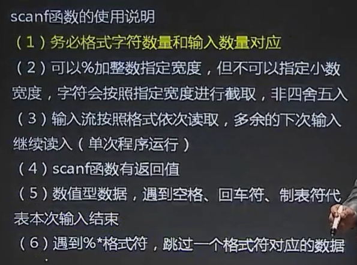
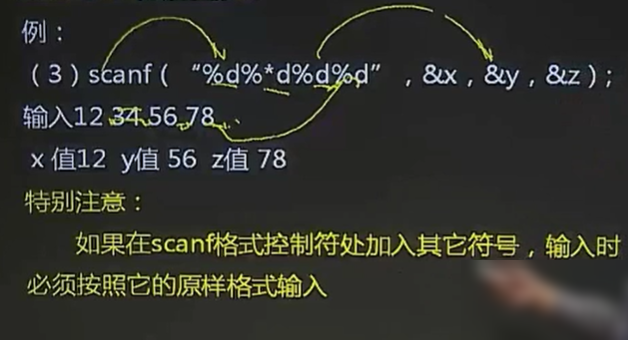
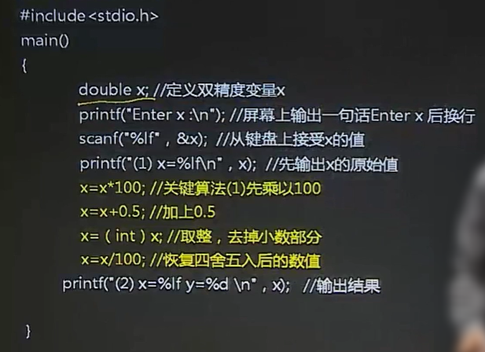

# 计算机二级C语言

https://www.bilibili.com/video/BV1sb411a7h6

## 第二章 C基础

### 数据类型

### 算术表达式

运算规则（优先级）：先函数，再括号后乘除，终加减，最后赋值

### 复合赋值表达式

### 赋值运算的类型转换

### 自增 自减 逗号 运算符号

### 逗号表达式

## 第三章 顺序结构

### 赋值语句

### 数据输出

#### 输出修饰符

#### 长度修饰符

重点考第七种

`printf`中是右运算

### 数据输入

#### 输入格式控制符

#### `scanf`函数的使用说明

### 复合语句和空语句

### 算法-后两位四舍五入

## 第四章 选择结构

## 第五章 循环结构

## 第六章 字符型数据

## 第七章 函数

## 第八章 地址和指针

## 第九章 数组

## 第十章 字符串

## 第十一章 对函数的进一步讨论

## 第十二章 全局变量及其作用域和生存周期

### 函数的存储分类

## 第十三章 宏替换

### 文件包含和动态存储分配

## 第十四章 结构体、共同体和用户自定义类型

## 第十五章 位运算

## 第十六章 文件