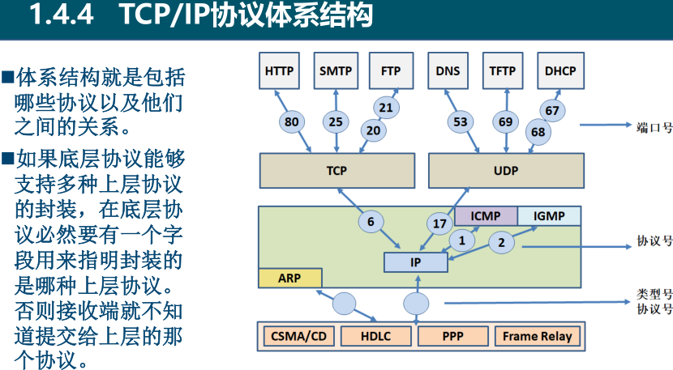
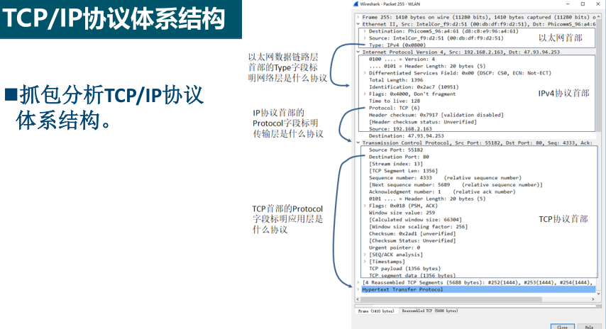
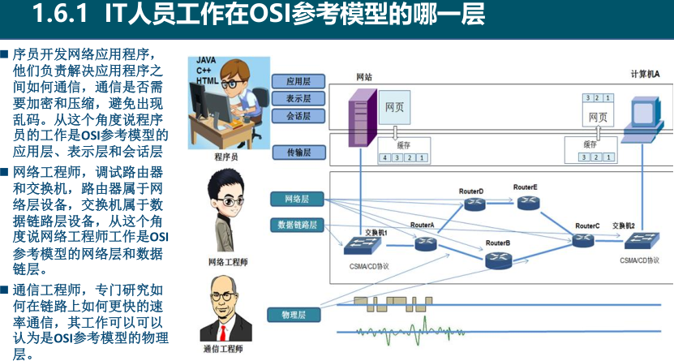
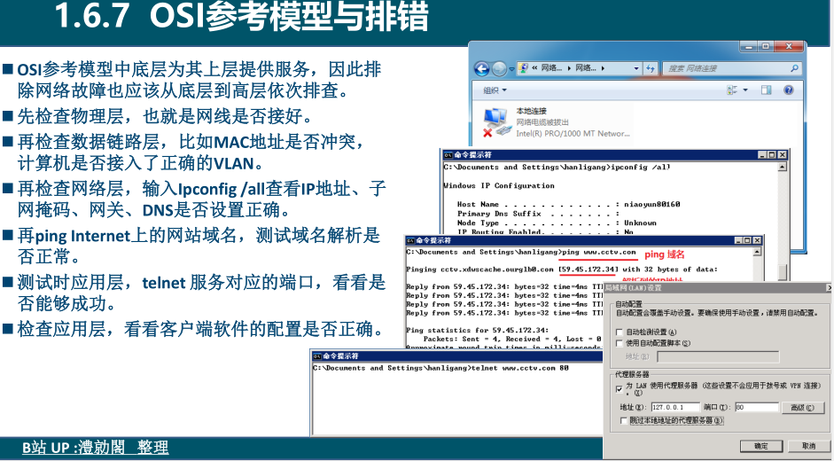
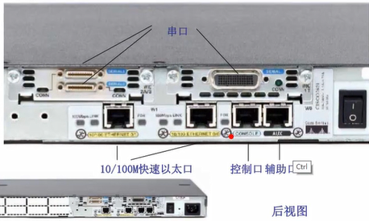
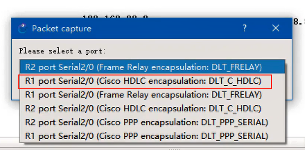
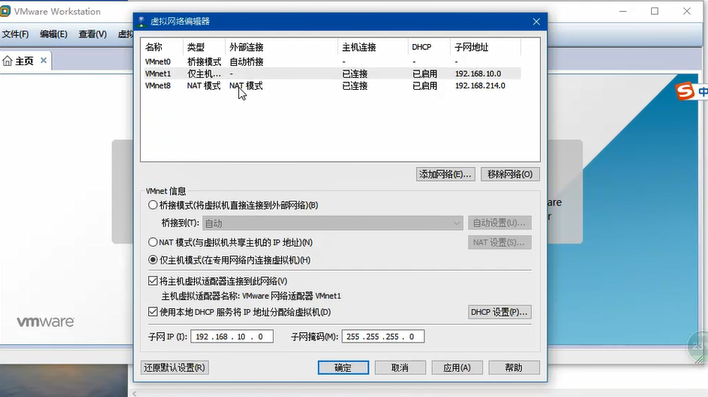
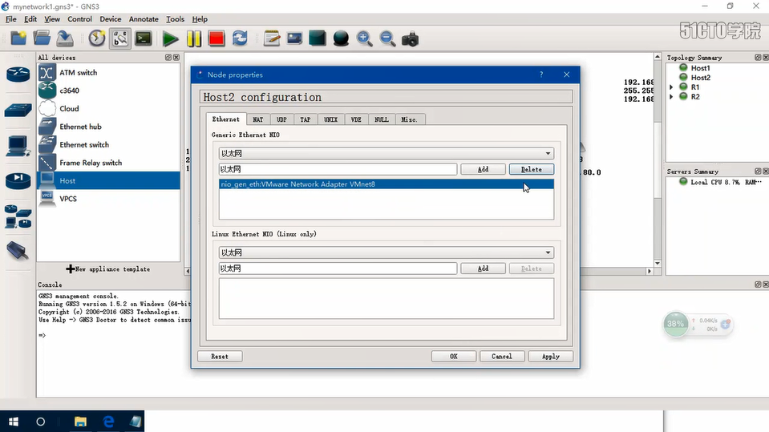

# 课程介绍:

课程目标：
理解数据通信的过程和TCP、IP协议的工作过程。
适用人群：
将来从事IT工作的人群，打算彻底从理论上搞明白计算机网络是如何通信的人群。

课程大纲-2019全新《计算机网络原理》考研视频教程

资料下载


# 第1章 计算机网络和协议

6小时43分钟30节

1-1 高端IT运维职位需要学习的技能 04:40 


## 1-2 理解计算机通信使用的协议 24:28 


## 1-3 抓包分析应用层协议 12:37 


## 1-4 协议标准化的好处 10:04 

- 互联网中有很多常见的
  应用，很多家公司开发
  服务端程序，也有很多
  家公司开发客户端程序。
  为了使不同厂家开发的
  服务端程序和客户端程
  序能够通信 ，必须将这
  些应用程序通信协议的
  协议进行标准化

- TCP/IP协议组中知名的应用层协议
  ◼ 超级文本传输协议--HTTP ，用于访问Web 服务。
  ◼ 安全的超级文本传输协议--HTTPS ，能够将HTTP 协议通信进行加密访问。
  ◼ 简单邮件传输协议--SMTP ，用于发送电子邮件。
  ◼ 邮局协议版本3 --POP3 ，用于接收电子邮件。
  ◼ 域名解析协议--DNS ，用于域名解析。
  ◼ 文件传输协议--FTP ，用于在Internet 上传和下载文件。
  ◼ 简单文件传输协议--TFTP ，在客户机与服务器之间进行简单文件传输
  的协议。
  ◼ 远程登录--telnet 协议，用于远程配置网络设备和Linux 系统。
  ◼ 动态主机配置协议--DHCP ，用于计算机自动请求IP


## 1-5 以HTTP协议为例理解计算机通信协议 05:55 

- **HTTP 协议的甲方乙方分别是**
  Web 服务器和浏览器
  ◼ 该协议就是规定浏览器访问网
  站方法和规则。
  ◼ 定义了客户端能够向服务器发
  送哪些请求。
  ◼ 服务器能够向客户端发送哪些
  响应。
  ◼ 定义了请求报文格式。
  ◼ 定义了响应报文格式。

- **计算机通信使用的协议包含三要素**
  ◼ 计算机通信使用的协议包含三要素：语法、语义和同步。
  ◼ 语法
  ⚫  定义协议中每种报文的格式：有哪些字段，字段是定长还是变长，如果是变
  长，字段分割符是什么，都要在协议中定义。一个协议有可能需要定义多种
  报文格式，比如ICMP 协议，定义了ICMP 请求报文格式、ICMP 响应报文格式、
  ICMP 差错报告报文格式。
  ◼ 语义
  ⚫  客户端能够向服务器发送那些请求（方法或命令），服务器有哪些响应（状
  态代码），每种状态代码代表什么意思。
  ◼ 同步
  ⚫  客户端访和服务器命令交互顺序，比如POP3 协议，需要先验证用户身份才能
  收邮件。


## 1-6 TCP/IP协议体系结构 17:17 







## 1-7 OSI参考模型和TCP/IP协议之间的关系 05:51 


- 1.5.2 **OSI参考模型每层功能**
  ◼  应用层 ，根据互联网中需要通信的应用程序的功能，定义客户端和服务端程序通信的规范，应用层向表示层
  发出请求。
  ◼  表示层，定义数据格式、是否加密或压缩。例如，FTP 允许你选择以二进制或ASCII 格式传输。如果选择二进
  制，那么发送方和接收方不改变文件的内容。如果选择ASCII 格式，发送方将把文本从发送方的字符集转换成
  标准的ASCII 后发送数据。在接收方将标准的ASCII 转换成接收方计算机的字符集。
  ◼  会话层 ，它定义了如何开始、控制和结束一个会话，包括对多个双向消息的控制和管理，以便在只完成连续
  消息的一部分时可以通知应用，从而使表示层看到的数据是连续的。
  ◼  传输层 ，常规数据递送，面向连接或无连接。面向连接实现可靠传输，比如TCP 协议，面向无连接，提供不
  可靠传输，比如UDP 协议。
  ◼  网络层 ，根据网络地址为数据包选择选择转发路径。网络层为传输层提供服务，只是尽力转发数据包，不保
  证不丢包，也不保证按顺序到达接收端。
  ◼  数据链路层 ，数据链路层常简称链路层，两台主机之间的数据传输，总是在一段一段的链路上传送的，这就
  需要专门的链路层的协议。
  ◼  物理层 ，在物理层上所传输的数据单位是比特。发送方发送1 （或0 ）时，接收方应该收到1 （或0 ），而不是
  0 （或1 ）。因此物理层要考虑用多大电压代表“1 ”或“0 ”，以及接收方如何识别出发送方所代表的比特。
  物理层还要确定连接电缆的的插头应当有多少根引脚以及各条引脚应如何连接。


## 1.6.6 用分层的思想考虑问题

◼ 计算机通信按功能分层的好处就是当某一层有变换不会波及
其他层。
◼ 比如单位的网络IP 地址重新规划，不会影响企业内外的服务
的访问。
◼ 要实现这个分层，就不要在应用层包含网络层的信息，比如
开发的客户端程序连接服务器就不要写服务器的IP 地址，而
是写服务器的名称。如果将服务器的IP 地址写进应用程序，
就没有采纳OSI 参考模型的分层思想。网络一旦调整，就需要
修改客户端程序。这就是网络层变换引起应用层变化了。

1-8 课程介绍 09:27 


1-9 网络和互联网络 23:15 


1-10 通信分层的好处 18:33 


1-11 OSI参考模型详细讲解 20:30 


1-12 捕获数据包查看数据包中的内容 12:26 


1-13 会话层和传输层 09:35 


1-14 通过传输层连接确定是否中木马 09:22 


## 1-15 网络层功能 07:25 





1-16 数据链路层功能 07:31 


1-17 物理层功能 06:57 


## 1-18 OSI参考模型指导网络排错 31:25 




## 1-19 OSI参考模型和网络安全 10:18 


## 1-20 TCP/IP协议通信过程 28:15 


## 1-21 集线器交换机路由工作在哪一层？ 07:29 


## 1-22 什么是协议 13:52 


## 1-23 计算机网络性能指标--速率 08:15 


## 1-24 计算机网络性能指标--带宽 08:47 


## 1-25 计算机网络性能指标--吞吐量 12:12 


## 1-26 计算机网络性能指标--时延 17:23 


## 1-27 计算机网络性能指标-排队时延和处理时延 11:46 


## 1-28 计算机网络性能指标-时延带宽积 17:29 


## 1-29 计算机网络分类 14:28 


## 1-30 局域网设计-接入层汇聚层核心层交换机路由器 15:44 


# 第2章 物理层

4小时29分钟15节


## 2-1 物理层实现的功能 12:13 


## 2-2 数据通信基础-信息 数据 信号 26:53 


## 2-3 数据通信基础-数字信号和模拟信号 08:47 


## 2-4 信道复用技术 10:57 


## 2-5 调制技术-基带调制和带通调制 19:37 


## 2-6 信道极限容量-码元的最高传输速率（奈氏准则） 16:43 


## 2-7 信道极限容量-最高数据传输速率（香农公式） 21:16 


## 2-8 传输媒体-导向传输媒体 24:16 


## 2-9 传输媒体-非导向传输媒体 10:03 


## 2-10 信道复用-频分复用 17:05 


## 2-11 信道复用-时分复用和波分复用 15:35 


## 2-12 信道复用-码分复用 27:33 


## 2-13 宽带接入技术-铜线接入 18:08 


## 2-14 宽带接入技术-光纤同轴混合网 光纤接入和移动互联网接 10:17 


## 2-15 本章总结 30:02 


# 第3章 GNS3和VMWare虚拟机搭建学习环境

2小时31分钟12节


## 3-1 本章的地位 05:40 

1. 思科路由操作系统

   

2. 下载GNS3最新版，默认安装，自带**抓包工具**

   

## 3-2 安装抓包工具分析数据包 12:16 


## 3-3 定义和使用抓包筛选器 16:01 


跟换协议过滤器点右上角箭头生效


## 3-4 安装和配置GNS3 12:45 

1. www.gns3.com

2. 最新版，默认安装

3. 新建项目

4. 安装路由器

   

5. 非模块化路由器与模块化路由器

   1. 非模块化路由器 Cisco 2500

      

      

      

   2. 模块化路由器

      

6. 配置模块

   


## 3-5 配置路由器和VPCS 24:09 

1. **pc配置命令和思科路由器命令**

   ```sh
   PC
   pc>ip192.168.10.2255.255.250192.168.10.10
   PC1> show
   
   配置路由器以太网接口地址
   R1#configure terminal
   RI（config）#interface fastEthernet 0/0
   R1（ config-if）# ip address192.168.10.1025255.250
   R1（config-if）#no shutdown
   RI（config-if）#exit
   RI（config）#exit
   R1#
   
   配置广域网接口的命令
   R1#show controllers serial 2/0
   R1（config）#interface s
   R1（config）#interface serial 2/0
   RI（config-if）#clock rate
   R1（config-if）#clock rate 64000
   R1（ config-if）# ip address192.168.20.10255.25.255.0
   RI（config-if）#no shutdown
   R1#copy running-config startup-config
   R1#show running-config
   
   RI#show ip route
   R1(config)# ip route 192.168.80.0 255.255.255.0 192.168.20.20
   ```

   

## 3-6 将配置好的环境保存成快照 10:37 


## 3-7 使用Wireshark捕获GNS3搭建的网络环境中的 06:26 


项目名不要用中文，会无法运行抓包工具

- 可以抓多种传输协议




## 3-8 详细讲解VMWareWorkstation在你的计算 21:57 



- 桥接模式
  - 和电脑共用网卡，
  - 相当于直接连接外部路由器
- 仅主机
  - 物理机通过虚拟网卡与虚拟机相连
- NAT 模式
  - 共享主机 ip 地址

```
win环境：
运行,
wf.msc,
快速打开防火墙设置
```


## 3-9 GNS3路由器连接VMWare虚拟机 18:44 

- 连接形式


- 主机设置

  

- 新版使用云替代主机

  

- 虚拟机ip地址设置

  

- 路由转发表设置及命令

  `show ip route`

  `ip route 目的ip域 掩码 跳板ip地址 `

  

- 跟踪路由

  `tracert ip`

  

  


## 3-10 思科Packet Tracer 03:20 

- CCNA 学习考试用，不是真实路由器


## 3-11 Cisco PacketTracer 模拟软件搭建实验环境 15:45 


## 3-12 使用PacketTracer跟踪数据包 04:08 


# 第4章 数据链路层

5小时3分钟26节


## 4-1 本章主要内容 13:08 


## 4-2 数据链路层功能-封装成帧 17:49 


## 4-3 数据链路层功能-透明传输 10:32 


## 4-4 数据链路层功能-差错检验 11:43 


## 4-5 点到点信道数据链路层 10:56 


## 4-6 配置路由器广域网接口使用PPP协议封装 07:32 


## 4-7 PPP协议帧格式 07:36 


## 4-8 同步传输和异步传输 11:37 


## 4-9 PPP协议透明传输填充方式 06:06 


## 4-10 广播信道的数据链路层-CSMA/CD协议 19:23 


## 4-11 计算以太网最短帧 11:50 


## 4-12 冲突解决方法-退避算法 14:35 


## 4-13 以太网帧格式 11:37 


## 4-14 以太网道利用率 06:18 


## 4-15 网卡的作用-工作在数据链路层和物理层 09:08 


## 4-16 查看 更改网卡的MAC地址 跨网段扫描MAC地址 28:56 


## 4-17 扩展以太网规模和距离 07:31 


## 4-18 使用网桥和交换机优化以太网 08:01 


## 4-19 网桥MAC地址表构建过程 08:34 


## 4-20 实战：查看交换机MAC地址表 06:31 


## 4-21 交换机组网优缺点 13:59 


## 4-22 生成树协议 17:03 


## 4-23 配置生成树协议查看接口状态 10:05 


## 4-24 实战：查看生成树 关闭生成树 观察广播风暴 12:11 


## 4-25 快速以太网-100M以太网 06:21 


## 4-26 千兆万兆以太网 14:29 


# 第5章 IP地址和子网划分

4小时11分钟22节


## 5-1 预备知识-二进制和十进制之间的关系 21:08 


## 5-2 预备知识-十六进制和二进制之间的转换 08:11 


## 5-3 MAC地址的作用和IP地址的作用 08:24 


## 5-4 IP地址格式 08:46 


## 5-5 子网掩码的作用 13:29 


## 5-6 IP地址的分类 14:35 


## 5-7 保留的特殊IP地址 12:29 


## 5-8 实战 验证主机位全1代表本网段所有主机 16:13 


## 5-9 公网IP地址和私网IP地址地址 12:32 


## 5-10 私网地址访问Internet需要进行端口地址转换(P 14:18 


## 5-11 为什么要划分子网 08:50 


## 5-12 等长子网划分 14:46 


## 5-13 等分成4个子网8个子网 18:19 


## 5-14 B类地址和A类地址子网划分 09:39 


## 5-15 变长子网划分 10:14 


## 5-16 点到点网络的子网掩码 04:54 


## 5-17 子网掩码的另外一种表示方法-CIDR 08:21 


## 5-18 判断一个IP地址所在的网段 07:07 


## 5-19 子网划分需要注意的几个问题 07:03 


## 5-20 使用超网合并网段 14:47 


## 5-21 合并网段的规律 10:28 


## 5-22 判断一个网段是超网还是子网 06:40 


# 第6章 静态路由和动态路由

5小时18分钟28节


## 6-1 网络层实现的功能 05:42 


## 6-2 网络畅通的条件 11:14 


## 6-3 静态路由 07:13 


## 6-4 搭建静态路由实验环境 14:10 


## 6-5 实战:添加静态路由 18:05 


## 6-6 添加静态路由需要注意的两个地方 09:54 


## 6-7 路由汇总 14:08 


## 6-8 路由汇总例外和**汇总 08:48 


## 6-9 全球最大的网段和默认路由 06:30 


## 6-10 默认路由指向Internet 08:33 


## 6-11 让默认路由代表大多数网段 12:20 


## 6-12 Internet上路由器的路由表 10:08 


## 6-13 管理Windows系统上的路由 16:50 


## 6-14 排查路由引起的网络故障 11:54 


## 6-15 动态路由协议-RIP协议 18:06 


## 6-16 搭建RIP协议实验环境 23:03 


## 6-17 配置RIP协议 11:46 


## 6-18 RIP协议network的作用 16:48 


## 6-19 跟踪RIP协议工作过程 06:43 


## 6-20 验证RIP协议的健壮性 10:49 


## 6-21 RIP协议数据包格式 05:41 


## 6-22 介绍OSPF协议 09:10 


## 6-23 OSPF协议术语和OSPF协议工作过程 15:37 


## 6-24 OSPF支持多区域 06:40 


## 6-25 配置OSPF协议 09:31 


## 6-26 查看OSPF协议邻居表 链路状态表 路由表 16:30 


## 6-27 验证OSPF协议健壮性 04:36 


## 6-28 本章总结 08:09 


# 第7章 网络层协议

4小时49分钟26节


## 7-1 网络层协议本章重点 07:15 


## 7-2 网络层首部 06:10 


## 7-3 网络层首部-版本和首部长度 11:41 


## 7-4 网络层首部-区分服务 17:12 


## 7-5 网络层首部-总长度 09:40 


## 7-6 网络层首部-分片标志 11:40 


## 7-7 网络层首部-片偏移 18:47 


## 7-8 网络层首部-生存时间 13:45 


## 7-9 抓包观察数据包TTL变化 08:30 


## 7-10 网络层首部-协议号 05:33 


## 7-11 ICMP差错报告报文-TTL耗尽和目标主机不可到达 09:49 


## 7-12 ICMP协议数据包类型 10:57 


## 7-13 网络层首部-标识 04:24 


## 7-14 ICMP差错报告报文-路由重定向 11:51 


## 7-15 ICMP差错报告报文格式 05:40 


## 7-16 ICMP差错报告报文-给应用程序返回差错报告 07:01 


## 7-17 使用ping命令测试网络是否畅通 12:45 


## 7-18 跟踪数据包路径-tracert和pathping 12:13 


## 7-19 ARP协议的作用 09:18 


## 7-20 ARP欺骗 25:19 


## 7-21 防止ARP欺骗 12:02 


## 7-22 组播（多播）应用场景 11:39 


## 7-23 搭建点播和多播视频服务器 09:57 


## 7-24 多播IP地址和多播MAC地址 09:23 


## 7-25 IGMP协议功能 04:12 


## 7-26 配置跨网段多播看视频 23:09 


# 第8章 传输层

6小时18分钟27节


## 8-1 本章重点 07:16 


## 8-2 传输层两个协议应用场景 24:47 


## 8-3 传输层协议和应用层协议之间的关系 04:22 


## 8-4 服务和端口的关系 09:25 


## 8-5 安装服务查看侦听的端口 14:02 


## 8-6 使用telnet和端口扫描工具扫描远程服务器打开的端 10:06 


## 8-7 服务器和客户端的端口要求本地唯一 07:57 


## 8-8 更改服务使用的端口 15:14 


## 8-9 端口和网络安全 10:52 


## 8-10 Windows防火墙和TCPIP筛选实现网络安全 13:46 


## 8-11 UDP协议特点和首部格式 14:44 


## 8-12 TCP协议特点 17:56 


## 8-13 TCP报文首部字段 18:31 


## 8-14 TCP报文格式-标记位 20:53 


## 8-15 TCP可靠传输的实现-停止等待协议 07:42 


## 8-16 改进的停止等待协议-连续ARQ和滑动窗口 10:42 


## 8-17 以字节为单位的滑动窗口技术详解 14:57 


## 8-18 选择性确认SACK 17:48 


## 8-19 超时重传时间的调整 18:30 


## 8-20 TCP协议流量控制功能-发送端根据接收端的接收能力调 21:24 


## 8-21 TCP协议拥塞控制 14:42 


# 第9章 应用层协议

7小时44分钟40节


## 9-15 查看释放刷新IP地址以及抓包观察DHCP协议定义的四 07:20 


## 9-16 跨网段分配IP地址 06:56 


## 9-17 配置跨网段分配IP地址 11:13 


## 9-18 telnet协议 16:22 


## 9-19 Windows远程桌面协议RDP 10:32 


## 9-20 http协议和html文档 11:50 


## 9-21 定位全球资源-统一资源定位符URL 17:35 


## 9-22 很路径和相对路径 04:21 


## 9-23 创建Web站点 17:48 


## 9-24 HTTP协议的版本 09:50 


## 9-25 HTTP请求报文和响应报文 09:21 


## 9-26 HTTP请求报文-POST和GET方法 05:25 


## 9-27 http响应报文状态代码 04:59 


## 9-28 记录用户身份-Cookie 13:54 


## 9-29 通过web代理访问网站 14:37 


## 9-30 Web代理服务器应用场 25:40 


## 9-31 FTP协议主动模式被动模式 12:33 


## 9-32 更改FTP客户端主动模式被动模式 14:14 


## 9-33 抓包分析FTP数据包 15:19 


## 9-34 隔离用户的FTP 11:34 


## 9-35 收发电子邮件使用的协议 09:08 


## 9-36 配置邮件客户端收发电子邮件 10:13 


## 9-37 使用telnet直接发送邮件 14:38 


## 9-38 POP3协议和IMAP协议 03:26 


## 9-39 POP3协议和IMAP协议 20:07 


## 9-40 通过抓包工具分析SMTP协议和POP协议数据包格式 08:05 


# 第10章 网络安全

5小时34分钟18节


## 10-1 网络安全介绍OK 14:34 


## 10-2 网络安全4个威胁 20:34 


## 10-3 篡改和伪造 22:59 


## 10-4 病毒和木马 22:25 


## 10-5 对称加密 11:13 


## 10-6 非对称加密和数字签名 28:41 


## 10-7 证书颁发机构 14:26 


## 10-8 安装CA并申请证书和邮箱 26:50 


## 10-9 发送签名加密电子邮件 20:50 


## 10-10 安全套接字SSLOK 19:10 


## 10-11 配置网站使用SSL通信OK 17:23 


## 10-12 验证http不加密 08:06 


## 10-13 验证https的安全性 18:32 


## 10-14 使用抓包工具验证https安全性 06:27 


## 10-15 网络层安全IPSec介绍 20:04 


## 10-16 搭建IPSec实验环境 10:28 


## 10-17 配置IPSec 29:09 


## 10-18 数据链路层安全 22:39 


# 第11章 Internet上音频视频

1小时31分钟5节


## 11-1 安装流媒体服务器 15:46 


## 11-2 通过网站访问流媒体服务器上的视频 15:36 


## 11-3 流媒体实现现场直播OK 26:26 


## 11-4 IP电话OK 17:15 


## 11-5 Internet上的音频视频面临的问题 16:33 


# 第12章 无线网络

32分钟2节


## 12-1 创建临时网络 12:17 


## 12-2 无线网络 20:20 


# 第13章 IPv6

5小时48分钟22节


## 13-1 IPv6网络层协议 14:45 


## 13-2 IPv6改进 14:21 


## 13-3 IPv6基本首部和扩展首部 19:42 


## 13-4 IPv6地址格式 20:31 


## 13-5 使用IPv6访问网站 06:50 


## 13-6 实战1：无状态IPv6地址自动配置 23:17 


## 13-7 实战2：有状态IPv6地址自动配置 19:49 


## 13-8 使用接口物理地址构造IPv6地址接口ID 05:13 


## 13-9 实战3：配置IPv6静态路由 04:40 


## 13-10 实战4：IPv6动态路由-RIPng 09:42 


## 13-11 实战5：配置EIGRPv6支持IPv6 08:22 


## 13-12 实战6：配置OSPFv3支持IPv6 05:54 


## 13-13 实战7：IPv6和IPv4的共存技术-双协议6 33:58 


## 13-14 实战8：IPv4和IPv6共存技术-6to4隧道技术 23:35 


## 13-15 实战8：IPv4和IPv6共存技术-6to4隧道配置 09:35 


## 13-16 实战9：IPv4和IPv6共存技术-ISATAP隧道 20:17 


## 13-17 实战9：ISATAP隧道IPv4和IPv6配置通 16:38 


## 13-18 实战11：IPv4和IPv6共存技术-动态NAT-P 17:12 


## 13-19 实战10：IPv4和IPv6共存技术-NAT-PT 25:23 


## 13-20 验证NAT-PT 20:57 


## 13-21 动态NAT-PT配置 19:26 


## 13-22 配置ISATAP路由器 为Windows指定ISAT 08:34 

# 附录：

win命令

```powershell
netstat -aon|findstr "10010"
UDP127.0.0.1:10010*:*18308
tasklist|findstr "18308"
NVIDIA Web Helper.exe18308 Console1 14,544 K
```

