> # [**计算机信息管理专业课程**](https://github.com/Eished/self-study-exam_notes)
>
> **最新自考笔记** : https://github.com/Eished/self-study-exam_notes
>

# 计算机网络原理  04741

## 第一章 计算机网络概述

- 重点：
  - 计算机网络的基本概念、分组交换网络工作原理、计算机网络性能指标极其计算、OSI 参考模型与 TCP/IP 参考模型；
- 难点：
  - 分层网络体系结构的理解
  - 分组交换网络的性能指标计算

### 第一节 计算机网络基本概念

#### 一、计算机网络的定义

1. 定义：计算机网络就是**互连的、自治的**计算机集合

   - 自治：无主从关系
   - 互连：互联互通
     - 通信链路

2. 通过交换网络互连主机

   

3. 什么是 Internet？

   

   - 全球最大的**互联网络**
     - ISP 网络互连的"网络之网络"
   - 数以百万计的互连的**计算设备**集合:
     - 主机( hosts)=端系统(end systems)
     - 运行各种网络应用
   - **通信链路**
     - 光纤, 铜缆, 无线电, 卫星.
   - **分组交换**：转发分组(数据包)
     - 路由器( routers)和交换机( switches)
   - **为网络应用提供通信服务的通信基础设施**：
     - Web,VoIP,emal,网络游戏,电子商务,社交网络,…
   - **为网络应用提供应用编程接口(API):**
     - 支持应用程序"连接" Internet,发送/接收数据
     - 提供类似于邮政系统的数据传输服务

#### 二、协议的定义

1. 协议是计算机网络有序运行的重要保证

   - 硬件(主机、路由器、通信链路等)是计算机网络的基础
   - 计算机网络中的数据交换必须遵守事先约定好的规则
   - 如同交通系统

2. 任何通信或信息交换过程都需要规则

   - 网络通信：通信主体是"机器"而不是人
   - 交换"电子化"或"数字化"消息
   - 计算机网络的所有通信过程都必须遵守某种/些规则一协议

   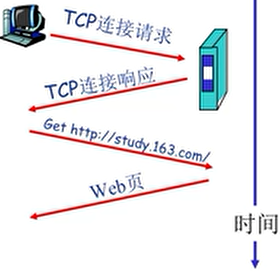

3. 什么是网络协议?

   - **网络协议** network protocol），简称为协议是为进行网络中的数据交换而建立的规则、标准或约定。
   - **协议**规定了通信实体之间所交换的消息的**格式、意义、顺序**以及针对收到信息或发生的事件所采取的“**动作**”（ actions）。

4. 协议的三要素

   1. **语法**（Syntax）
      - 数据与控制信息的结构或格式
      - 信号电平
   2. **语义**（Semantics）
      - 需要发出何种控制信息
      - 完成何种动作及做出何种响应
      - 差错控制
   3. **时序**（Timing）
      - 时间顺序
      - 速度匹配

5. 协议是计算机网络的重要内容

   - **协议规范了网络中所有信息发送和接收过程**
     - e.g.， Tcp，Ip， Http， Skype，802.11
   - **学习网络的重要内容之一**
   - **网络创新的表现形式之一**
   - **Internet 协议标准**
     - RFC：Request for Comments
     - IETF：互联网工程任务组（Internet Engineering Task Force）

#### 三、计算机网络的功能

#### 四、计算机网络的分类

### 第二节 计算机网络结构

#### 一、网络边缘

- **主机（端系统）**
  - 位于“网络边缘”
  - 运行网络应用程序
  - 如：Web, email
- **网络应用**
  - **客户/服务器 (client/server) 应用模型**：
    - 客户发送请求，接收服务器响应
    - 如：Web应用，文件传输FTP应用
  - **对等 (peer-peer, P2P) 应用模型:**
    - 无（或不仅依赖）专用服务器
    - 通信在对等实体之间直接进行
    - 如：Gnutella, BT, Skype, QQ

#### 二、接入网络

- 接入网络，物理介质

  - 有线或无线通信链路

- **数字用户线路 (DSL)**

  

  - 利用**已有的电话线**连接中心局的DSLAM
    - 数据通信通过DSL电话线接入Internet
    - 语音（电话）通过DSL电话线接入电话网
  - < 2.5 Mbps上行传输速率 (典型速率 < 1 Mbps)
  - < 24 Mbps下行传输速率 (典型速率 < 10)
  - **FDM**: 
    - \>50 kHz - 1 MHz用于下行
    - 4 kHz - 50 kHz用于上行
    - 0 kHz - 4 kHz用于传统电话

- **电缆网络**

  

  - **频分多路复用** :  在不同频带（载波）上传输不同频道

  

  - **HFC**: 混合光纤同轴电缆（ hybrid fiber coax ）
    - 非对称:  下行高达30Mbps 传输速率，上行为2 Mbps传 传率 输速率
  - 各家庭（设备）通过电缆网络→ 光纤接入ISP 路由器
    - 各家庭 **共享** 家庭至电缆头端的络 **接入网络**
    - 不同于DSL的 的 **独占** 至中心局的接入

- **典型家庭网络的接入**

  

- **机构（企业）接入网络 (Ethernet)**

  

  - 主要用于公司、高校、企业等组织机构
  - 典型传输速率：10 Mbps, 100Mbps, 1Gbps, 10Gbps
  - 目前，端系统通常直接连接以太网交换机（switch）

-  **无线接入网络**

  - 通过**共享**的 无线接入网络连接端系统与路由器
    - 通过**基站**（base station）或称为“**接入点**”（access point）
  - **无线局域网（LANs ）**:
    - 同一建筑物内 (30m)
    - 802.11b/g (WiFi): 11Mbps、
    - 54Mbps传输速率
  - **广域无线接入：**
    - 通过电信运营商 (蜂窝网) ，接入范围在几十公里~
    - 带宽：1 Mbps、10 Mbps、100Mbps
    - 3G、 4G: LTE
    - 移动互联网

#### 三、接入核心

- 网络核心（核心网络）

  - 互联的路由器（或分组转发设备）
  - 网络之网络

- **网络核心**的关键功能: **路由+转发**

  

- **Internet 结构:  网络之网络**

  - 端系统通过入 接入**ISP （access ISPs  ）**连接到
    Internet
    - 家庭、公司和大学ISPs
  - 接入ISP 必须进一步互连
    - 这样任意两个主机才可以互相发送分组
  - 构成复杂的网络互连的网络
    - 经济和国家政策是网络演进的主要驱动力
  - 当前Internet 结构？
    - 无人能给出精确描述
  - 连接方式：
    - **区域网络（regional networks）**连接接入ISP和运营商ISP
    - **内容提供商网络（content provider networks）** ，如： Google,
      Microsoft 等) 

  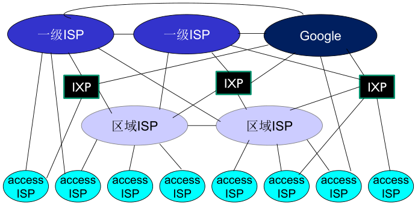

- 在网络中心: 少数互连的大型网络

  -  **“一级” (tier-1) 商业ISPs** (如：网通、电信、Sprint、 AT&T)，提供国家或国际范围的覆盖
  - **内容提供商网络（content provider network， 如：Google)**：私有网络，连接其数据中心与Internet，通常绕过一级ISP和区域ISPs

### 第三节 数据交换技术

#### 一、数据交换概念

- 为什么需要数据交换？

  

- 什么是交换？

  - 动态转接

    

  - **动态分配传输资源**

- 数据交换的类型

  1. 电路交换
  2. 报文交换
  3. 分组交换

#### 二、电路交换

- 电路交换的特点

  - 最典型电路交换网络：电话网络
  - 电路交换的三个阶段：
    1. 建立连接（呼叫/电路建立）
    2. 通信
    3. 释放连接（拆除电路）
  - **独占资源**

  

- **多路复用（Multiplexing）**：简称复用，是通信技术中的基本概念

  

  

  - **多路复用(Multiplexing):** 

    - 链路/网络资源（如带宽）划分为“资源片”
    - 将资源片分配给各路“呼叫”（calls）
    - 每路呼叫**独占**分配到的资源片进行通信
    - 资源片可能“**闲置”(idle)**(无共享)

  - **典型多路复用方法:**

    - **频分多路复用**( frequency division multiplexing-**FDM** )

      

      - **频分多路复用**的各用户占用不同的带宽资源（请注意，这里的“带宽”是**频率带宽（单位：Hz）**而不是数据的发送速率）
      - 用户在分配到一定的频带后，在通信过程中自始至终都占用这个频带

      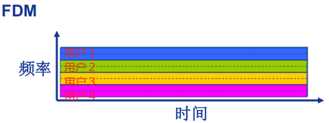

    - **时分多路复用**( time division multiplexing-**TDM** )

      - **时分复用**则是将时间划分为一段段等长的**时分复用帧（TDM 帧）**，每个用户在每个 TDM 帧中占用固定序号的**时隙**
      - 每用户所占用的时隙是**周期性出现**（其周期就是TDM 帧的长度）

      

      - 时分复用的所有用户是在不同的时间占用**相同的频带宽度**

      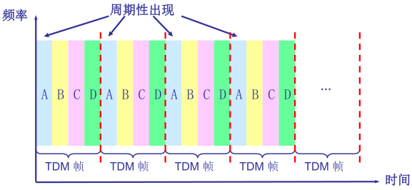

    - **波分多路复用**(Wavelength division multiplexing-**WDM**)

      - 波分复用就是光的频分复用

      

      

      

    - **码分多路复用**( Code division multiplexing-**CDM** )

      -  广泛应用于无线链路共享 (如蜂窝网,卫星通信等)

      - 每 个 用 户 分 配 一 个 唯 一 的 **m bit 码 片 序 列 (chippingsequence)**，其中“0”用**“-1”**表示、“1”用**“+1”**表示，例如：

        - S 站的码片序列：(–1 –1 –1 +1 +1 –1 +1 +1)

      - 各用户使用**相同频率载波**，利用各自码片序列编码数据

      - **编码信号 = (原始数据) × (码片序列)**

        - 如发送比特 1（+1），则发送自己的 **m bit 码片序列**
        - 如发送比特 0（-1），则发送该码片序列的**m bit 码片序列的反码**

      - 各用户码片序列相互**正交 (orthogonal)**

        

      - 令${d_i }$为原始数据序列，各用户的叠加向量为

        

      - 解码 : 码片序列与编码信号的内积

        

      单用户：

      

      多用户：

      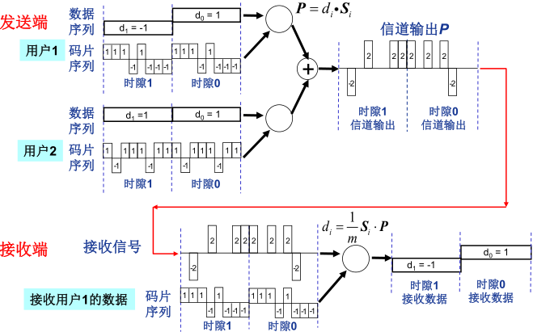

#### 三、报文交换

- **报文交换（message switching）**

  - **报文**：源（应用）发送信息整体
    - 比如：一个文件

  

  

#### 四、分组交换

- **分组交换（package switching ）**

  - **分组**：报文分拆出来的一系列相对较小的数据包

    

  - 分组交换需要报文的**拆分**与**重组**

  - 产生**额外开销**

  

  

- **分组交换: 统计多路复用（Statistical Multiplexing ）**

  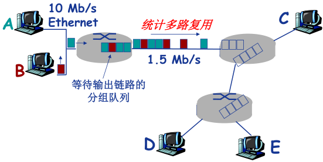

  - A & B分组序列不确定，**按需共享链路**
    - statistical multiplexing.

- **存储- 转发（store-and-forward ）**

  

  - **报文交换**与**分组交换**均采用**存储-转发**交换方式
  - 区别：
    - 报文交换以**完整报文**进行“存储-转发”
    - 分组交换以**较小的分组**进行“存储-转发”

- **分组交换:  传输延迟**

  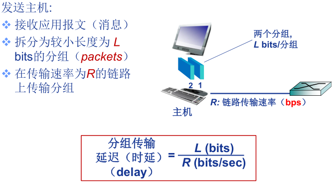

- **报文交换 vs  分组交换**

  

  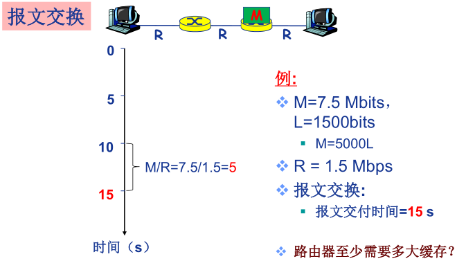

  

- **分组交换的报文交付时间**

  

**例题1.1**

- 在下图所示的采用“存储-转发”方式的分组交换网络中，所有链路的数据传输速率为100 Mbps，分组大小为1 000 B，其中分组头大小为20 B。若主机H1向主机H2发送一个大小为980 000 B的文件，则在不考虑分组拆装时间和传播延迟的情况下，从H1发送开始到H2接收完为止，需要的时间至少是多少？

  

  - 【 解】980 000 B大小的文件需要分1000个分组，每个分组1 000 B。H1发送整个文件需要的传输延迟为`(980 000+20*1000)*8/100 000 000=80ms`；根据路由选择基本原理，所有数据分组应该经过两个路由器的转发，所以再加上最后一个分组的两次转发的传输延迟，即`2*1000*8/100 000 000=0.16ms`。所以，H2收完整个文件至少需要80+0.16=80.16ms。

- **分组交换 vs  电路交换**

  

  - 分组交换绝对优于电路交换？
    - 分组交换适用于 **突发** 数据传输网络
      - 资源充分共享
      - 简单、无需呼叫建立
    - 可能**产生拥塞（congestion ）**:  分组延迟和丢失
      - 需要协议处理可靠数据传输和拥塞控制
    - Q:  **如何提供电路级性能保障?**
      - 例如，音/视频应用所需的带宽保障

### 第四节 计算机网络性能

#### 一、速率与带宽

- **速率**

  - 速率即**数据率**(data rate)或称**数据传输速率**或**比特率**(bit rate)
    - 单位时间（秒）传输信息（比特）量
    - 计算机网络中最重要的一个性能指标
    - 单位：b/s（或bps）、kb/s、Mb/s、Gb/s
    - $k=10^3 、M=10^6 、G=10^9$
  - 速率往往是指**额定速率**或**标称速率**

- **带宽**

  - “**带宽**”(bandwidth)：原本指信号具有的**频带宽度**，即**最高频率与最低频率之差**，单位是**赫兹（Hz）**
  - 网络的“带宽”：通常是数字信道所能传送的“**最高数据率**”，单位：**b/s (bps)**
  - 常用的带宽单位:
    - kb/s （$10^3 b/s$）
    - Mb/s（$10^ 6 b/s$）
    - Gb/s（$10^ 9 b/s$）
    - Tb/s（$10^ {12} b/s$）

  

#### 二、时延

- **延迟/ 时延**(delay 或latency)

  - Q:分组交换为什么会发生丢包和时延?
    A:分组在路由器缓存中排队
  - 分组到达速率超出输出链路容量时
  - 分组排队，等待输出链路可用

  

- **四种分组延迟**

  

  - $d_{proc}$ : **结点处理延迟**（nodal processing delay）
    - 差错检测
    - 确定输出链路
    - 通常< msec
  - $d_{queue}$ : **排队延迟**（queueing delay）
    - 等待输出链路可用
    - 取决于路由器拥塞程度

  

  - $d_{trans}$ : **传输延迟**（transmission delay）
    - L: 分组长度(bits)
    - R: 链路带宽 (bps)
    - $d_{trans}$ = L/R
  - $d_{prop}$ : **传播延迟**（propagation delay）
    -  d: 物理链路长度
    - s: 信号传播速度  ($铜\approx2×10 ^8m/sec$)
    - $d_{prop}$ = d/s

-  **类比：车队**

  

  - 车速为100 km/hr ~ 信号传播速度
  - 收费站放行一台车用时12 秒 ~ 比特传输时间
  - 车 ~ 比特；车队 ~ 分组
  - 车队通过收费站时间 ~ **传输延迟**（120秒）
  - 每台车从第一个收费站跑到第二个收费站用时~ **传播延迟**（1小时）

- **排队延迟**

  

#### 三、时延带宽积

- 链路的时延带宽积又称为**以比特为单位的链路长度**

#### 四、丢包率

- **分组丢失**（丢包）

  - 队列缓存容量有限
  - 分组到达已满队列将被丢弃 (即丢包)
  - 丢弃分组可能由前序结点或源重发（也可能不重发）

  

  

#### 五、吞吐率

- 吞吐量/ 率（Throughput ）

  - 吞吐量 :表示在发送端与接收端之间传送数据速率 (b/s)
    - 即时 吞吐量: 给定时刻的速率
    - 平均吞吐量 : 一段时间的平均速率

  

- 瓶颈链路（ bottleneck link ）

  - 端到端路径上，限制端到端吞吐量的链路。

  

- 吞吐量: Internet 场景

  

### 第五节 计算机网络体系结构

#### 一、计算机网络分层体系结构

- 为什么需要计算机网络体系结构

  - 计算机网络是一个非常复杂的系统 , 涉及许多组成部分 :
    - 主机（hosts）
    - 路由器（routers）
    - 各种链路（links）
    - 应用（applications）
    - 协议（protocols）
    - 硬件、软件

- 何为计算机网络的体系结构？

  - 网络体系结构是从**功能**上描述计算机网络结构
  - 计算机网络体系结构简称网络体系结构(network architecture)是**分层结构**
  - 每层遵循某个/些**网络协议**完成本层功能
  - **计算机网络体系结构**是计算机网络的各层及其协议的集合
  - 体系结构是一个计算机网络的功能层次及其关系的**定义**
  - 体系结构是**抽象的**

- 为什么采用分层结构?

  - 结构清晰，有利于识别复杂系统的部件及其关系
    - 分层的参考模型（reference model ）
  - 模块化的分层易于系统更新、维护
    - 任何一层服务实现的改变对于系统其它层都是透明的
    - 例如，登机过程的改变并不影响航空系统的其它部分（层）
  - 有利于标准化
  - 分层是否有不利之处？

- 分层网络体系结构基本概念

  

  - **实体(entity)**  表示任何可发送或接收信息的硬件或软件进程。
  - 协议是控制 **两个对等实体** 进行通信的规则的集合，协议 是 “ **水平的** ”  。
  - 任一层实体 需要使用 **下层** 服务，遵循本层协议，实现本层功能， 向 **上层** 提供 服务 ，服务是“ **垂直的** ” 。
  - 下层协议的实现对上层的 服务用户是 **透明** 的。
  - 同系统的相邻层 实体 间通过 **接口** 进行交互，通过 **服务访问点 SAP**(Service Access Point) ，交换 **原语** ，指定请求的特定服务。

#### 二、OSI 参考模型

- **OSI 参考模型解释的通信过程**

  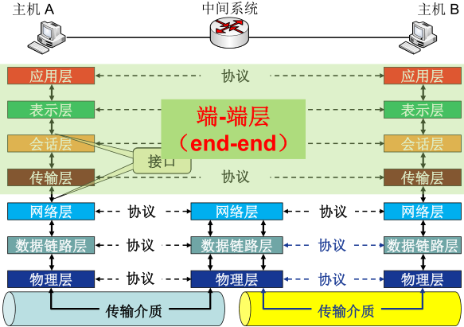

- **OSI 参考模型数据封装与通信过程**

  

- **为什么需要数据封装 ？**

  - 增加**控制信息**
    - 构造协议数据单元 (PDU)
  - 控制信息主要包括:
    - **地址（Address）**: 标识发送端/接收端
    - **差错检测编码（Error-detecting code）**: 用于差错检测或纠正
    - **协议控制（Protocol control）**: 实现协议功能的附加信息，如: 优先级（priority）、服务质量（QoS）、 和安全控制等

**七层模型的功能**

1. **物理层功能**

   

   - **接口特性**
     - 机械特性、电气特性、功能特性、规程特性
   - **比特编码**
   - **数据率**
   - **比特同步**
     - 时钟同步
   - **传输模式**
     1. 单工（Simplex）
     2. 半双工（half-duplex）
     3. 全双工（full-duplex）

2. **数据链路层功能**

   

   - 负责**结点- 结点（node-to-node）**  数据输 传输
   - **组帧（Framing ）**
   - **物理寻址（Physical addressing ）**
     - 在帧头中增加发送端和/或接收端的**物理地址**标识数据帧的发送端和/或接收端

   

   - **流量控制（Flow control）**
     - 避免淹没接收端
   - **差错控制（Error control）**
     - 检测并重传损坏或丢失帧，并避免重复帧
   - **访问(接入)控制（Access control）**
     - 在任一给定时刻决定哪个设备拥有链路（物理介质）控制使用权

3. **网络层功能**

   

   - 负责**源主机到目的主机**数据分组（packet）交付
     - 可能穿越多个网络
   - **逻辑寻址（Logical addressing）**
     - 全局唯一逻辑地址，确保数据分组被送达目的主机，如IP地址
   - **路由（Routing）**
     - 路由器(或网关)互连网络，并路由分组至最终目的主机
     - 路径选择
   - **分组转发**

   

   

4. **传输层功能**

   

   - 负责 **源—目的（端—端）** （进程间） **完整报文传输**
   - **分段与重组**
   - **SAP寻址**
     - 确保将完整报文提交给正确进程，如端口号

   

   - **连接控制**
   - **流量控制**
   - **差错控制**

5. **会话层功能**

   

   - **对话控制（dialog controlling）**
     - 建立、维护
   - **同步(synchronization)**
     - 在数据流中插入“同步点”
   - 最“**薄**”的一层

6. **表示层功能**

   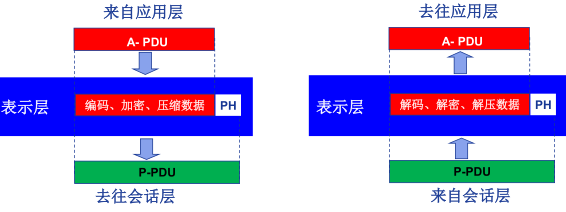

   处理两个系统间交换信息的 **语法与语义（syntax and semantics ）**问题

   - **数据表示转化**
     - 转换为主机独立的编码
   - **加密/解密**
   - **压缩/解压缩**

7. **应用层功能**

   

   - 支持用户通过用户代理（如浏览器）或网络接口**使用网络（服务）**
   - 典型应用层服务：
     - 文件传输（FTP）
     - 电子邮件（SMTP）
     - Web（HTTP）

#### 三、TCP/IP 参考模型

#### 四、五层参考模型

综合 OSI 和 TCP/IP 的优点

1. **应用层** : 支持各种网络应用
   - FTP, SMTP, HTTP
2. **传输层** : 进程-进程的数据传输
   - TCP, UDP
3. **网络层** : 源主机到目的主机的数据分组路由与转发
   - IP协议、路由协议等
4. **链路层** : 相邻网络元素（主机、交换机、路由器等）的数据传输
   - 以太网（Ethernet）、802.11 (WiFi)、PPP
5. **物理层** :比特传输

- **5 层模型的数据封装**

  

### 第六节 计算机网络与因特网发展简史

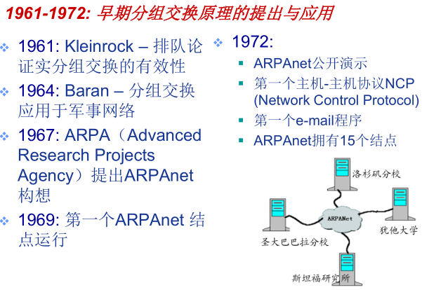

本章小结

习题

## 第二章 网络应用

- 重点：
  - 理解网络应用体系结构、特点与通信基本原理，掌握 DNS 域名解析过程、HTTP、SMTP、POP、FTP、P2P 应用，了解 Socket 编程基础
- 难点：
  - 是网络应用通信基本原理
  - 典型应用层协议
  - P2P 文件分发
  - Socket 编程基础

### 第一节 计算机网络应用体系结构

#### 一、客户/服务器（C/S）结构网络应用

#### 二、纯 P2P 结构网络应用

#### 三、混合网络应用

### 第二节 网络应用通信基本原理

### 第三节 域名系统

#### 一、层次化域名空间

#### 二、域名服务器

#### 三、域名解析过程

### 第四节 万维网应用

#### 一、万维网应用结构

#### 二、HTTP

#### 三、Cookie

### 第五节 Internet 电子邮件

#### 一、电子邮件系统结构

#### 二、SMTP

#### 三、电子邮件格式与 MIME

#### 四、邮件读取协议

### 第六节 FTP

### 第七节 P2P 应用

### 第八节 Socket 编程基础（重要）

## 第三章 传输层

- 重点：
  - 可靠数据传输基本原理、停—等协议、典型滑动窗口协议（GBN 协议、SR 协议）；
  - TCP 的报文段结构、TCP 连接建立于断开过程、TCP 序列号以及确认序列号、TCP 可靠数据传输机制、TCP 拥塞控制方法。
- 难点：
  - 停—等协议与滑动窗口协议的理解与信道利用率的计算
  - TCP 的连接管理
  - TCP 报文段序列号
  - TCP 的拥塞控制方法

### 第一节 传输层的基本服务

#### 一、传输层功能

#### 二、传输层寻址与端口

#### 三、无连接服务与面向连接服务

### 第二节 传输层的复用与分解

#### 一、无连接的多路复用与多路分解

#### 二、面向连接的多路复用与多路分解

### 第三节 停—等协议与滑动窗口协议

#### 一、可靠数据传输基本原理

#### 二、停—等协议

#### 三、滑动窗口协议

### 第四节 用户数据报协议（UDP）

#### 一、UDP 数据报结构

#### 二、UDP校验和

### 第五节 传输控制协议（TCP）

#### 一、TCP 报文段结构

#### 二、TCP 连接管理

#### 三、TCP 可靠数据传输

#### 四、TCP 流量控制

#### 五、TCP 拥塞控制

## 第四章 网络层

- 重点：
  - 转发与路由概念的理解
  - 虚电路网络与数据报网络工作原理
  - IP 数据报结构
  - IP 数据报分片
  - IP 地址
  - 子网划分
  - CIDR 
  - 路由聚合
  - 路由表
  - ICMP
  - DHCP
  - NAT
  - 链路状态路由选择算法
  - 距离向量路由选择算法
  - 层次化路由
  - RIP
  - OSPF
  - BGP基本工作过程
- 难点：
  - IP 数据报分片
  - IP 地址
  - 子网划分
  - 子网掩码
  - CIDR 
  - 路由聚合
  - 路由表
  - 路由计算
  - 层次化路由
  - OSPF
  - BGP

### 第一节 网络层服务

### 第二节 数据报网络与虚电路网络

#### 一、数据报网络

#### 二、虚电路网络

### 第三节 网络互连与网络互联设备

#### 一、异构网络互联

#### 二、路由器

### 第四节 网络层拥塞控制

#### 一、网络拥塞

#### 二、流量感知路由

#### 三、准入控制

#### 四、流量调节

#### 五、负载脱落

### 第五节 Internet 网络层

#### 一、IPv4 协议

#### 二、IPv4 编址

#### 三、动态主机配置协议

#### 四、网络地址转换

#### 五、ICMP

#### 六、IPv6

### 第六节 路由算法与路由协议

#### 一、链路状态路由选择算法

#### 二、距离向量路由选择算法

#### 三、层次化路由选择

#### 四、Internet 路由选择协议

## 第五层 数据链路层与局域网

- 重点：
  - 典型的差错编码
  - CDMA 工作原理
  - ALOHA、CSMA、CSMA/CD 及轮询协议的工作原理
  - MAC 地址、ARP、以太网、交换机的特点及其工作原理
  - PPP 工作原理
- 难点：
  - CDMA 工作原理
  - CSMA/CD 协议、以太网、交换机工作原理
  - VLAN 工作原理

### 第一节 数据链路层服务

### 第二节 差错控制

#### 一、差错控制的基本方式

#### 二、差错控制的基本原理

#### 三、差错控制的检错与纠错能力

#### 四、典型的差错编码

### 第三节 多路访问控制协议

#### 一、信道划分 MAC 协议

#### 二、随机访问 MAC 协议

#### 三、受控接入 MAC 协议

### 第四节 局域网

#### 一、数据链路层寻址与 ARP

#### 二、以太网

#### 三、交换机

#### 四、虚拟局域网

### 第五节 点对点链路协议

#### 一、PPP

#### 二、HDLC 协议

## 第六章 物理层

- 重点：
  - 数据通信基础、物理介质、信道容量、基带传输编码、频带传输调制技术、物理层接口规程特性；
- 难点：
  - 信道容量计算
  - 基带传输编码
  - 频带传输的基本原理调制技术

### 第一节 数据通信基础

#### 一、数据通信基本概念

#### 二、数据通信系统模型

### 第二节 物理介质

#### 一、引导型传输介质

#### 二、非引导型传输介质

### 第三节 信道与信道容量

#### 一、信道分类与模型

#### 二、信道传输特性

#### 三、信道容量

### 第四节 基带传输

#### 一、基带传输基本概念

#### 二、数字基带传输编码

### 第五节 频带传输

#### 一、频带传输的基本概念

#### 二、频带传输中的三种调制方式

### 第六节 物理层接口规程

#### 一、物理层接口概述

#### 二、物理层接口特性 

## 第七章 无线与移动网络

- 重点：
  - 无线网络基本结构
  - 无线网络特性
  - 移动网络基本原理
  - 间接路由与直接路由
  - IEEE 802.11 
  - CSMA/CA
  - 移动 IP 网络
- 难点：
  - CSMA/CA 协议及其退避机制
  - IEEE 802.11 帧的地址字段

### 第一节 无线网络

#### 一、无线网络基本结构

#### 二、无线链路与无线网络特性

### 第二节 移动网络

#### 一、移动网络基本原理

#### 二、寻址

#### 三、移动节点的路由选择

### 第三节 无线局域网 IEEE 802.11

#### 一、IEEE 802.11 体系结构

#### 二、IEEE 802.11 的 MAC 协议

#### 三、IEEE 802.11 帧

### 第四节 蜂窝网络

#### 一、蜂窝网络体系结构

#### 二、蜂窝网络中的移动性管理

#### 三、移动通信 2G/3G/4G/5G 网络

### 第五节 移动 IP 网络

#### 一、代理发现

#### 二、向归属代理注册

### 第六节 其他典型无线网络简介

#### 一、WiMax

#### 二、蓝牙

#### 三、ZigBee

## 第八章 网络安全基础

- 重点：
  - 计算机网络安全基本概念
  - 网络安全基本属性
  - 典型数据加密算法
  - 消息完整性验证、报文认证、数字签名、身份认证方法、KDC 与 CA、防火墙基本原理与分类
  - 网络安全协议（PGP、SSL、和 IPSec）
- 难点：
  - 数据加密算法
  - 网络安全协议（PGP、SSL 和 IPSec）

### 第一节 网络安全概述

#### 一、基本概念

#### 二、网络安全威胁

### 第二节 数据加密

#### 一、传统加密方式

#### 二、对称密钥加密

#### 三、非对称/公开密钥加密

### 第三节 消息完整性与数字签名

#### 一、消息完整性检测方法

#### 二、报文认证

#### 三、数字签名

### 第四节 身份认证

### 第五节 密钥分发中心与证书认证机构

#### 一、密钥分发中心

#### 二、证书认证机构

### 第六节 防火墙与入侵检测系统

#### 一、防火墙基本概念

#### 二、防火墙分类

#### 三、入侵检测系统 IDS 

### 第七节 网络安全协议

#### 一、安全电子邮件

#### 二、安全套接字层 SSL

#### 三、虚拟专用网 VPN 和 IP 安全协议 IPSec

