# [**计算机信息管理专业课程**](https://github.com/Eished/self-study-exam_notes)

**最新自考笔记** : https://github.com/Eished/self-study-exam_notes

# 运筹学基础 (02375) 2002版

> 摄像头 + ORC 辅助笔记

## 题型

1. 单项选择题
   - 20题x1分 = 20分
2. 填空题
   - 10题x2分 = 20分
3. 简答题
   - 5题x4分 = 20分
4. 综合题
   - 4题x10分 = 40分

## 试卷分析

### 学习方法

1.依据《运筹学基础》考试大纲的要求，在前面系统学习的基础上对重点章节要仔细阋阅读，对重考率高的考点要重点理解和记忆。
2**.参考历年考题在对教材有一定的把握后，参阅以前年度的考试试题，透过历年的考题了解题型、了解不同类型的考题的相关知识点。**
3.系统训练解决应试教育的方法离不开习题的训练。

## 第1章 导论

### 1.1 概述

#### 1.1.1 运筹学与管理决策

运筹学诞生于20世纪30年代。在第二次世界大战中，曾被成功地应用于作战的战略战术和后勤供应问题，取得了很好的效果。战后，运筹学又被广泛应用于制定国民经济计划、经济建设和现代社会管理方面的决策，为规划的制定、生产建设，创造和节省巨大的财高

运筹学（ Operations Research，简称OR）是一门研究如何有效地组织和管理人机系统的科学。在一个复杂的人机系统中，涉及到大量人力和其它资源的统筹组织安排，运筹学应用分析的、经验的和数量的方法，对各种可供选择的方案进行比较评价，为制定最优的管理决策提供数量上的依据。

对管理领域，运筹学也是对管理决策工作进行决策的计量方法。

在现代工商业和政府管理中，管理者需要大量的助手和信息技术工具以应付事务、业务的复杂性。没有帮助，人们不可能承担起包含在各种事物中的种种复杂事务，诸如经济开发区的选址、智能化大厦的管理、生产顾客需要的上百种不同产品的企业运行等。在安排任务、企业配送中心、销售网、库存管理、定价以及设备管理中都需要做大量的决策。特别是管理者常被一些不确定因素所约束，例如，顾客的爱好和时尚预测，经济预测和研究发展等。通常人们主要凭主观就断和直觉来行动，而不知道他们所作的决策是否是最好的。

企业领导的主要职责是作出决策。当他观察问题的时候，就自觉不自觉地开始这个进程。企业领导首先确定问题，然后指定目标，确认约束条件和估价方案。最后，选择明显的、最好的行动方针一选择最优解。

这种分析程序可以是定性的，也可以是不定性的。也就是说，分析程序有两种基本形式：定性的和定量的

当企业领导遇到的问题可以用过去的经验或单凭个人的判断就可以解决时，就只采用定性方法。这样的直觉方法对面临的情境作出决策可能是够了

定性分析的技巧是企业领导固有的，随着经验的积累面增强

可是，企业领导们还需要定量分析的方法。当他们对需要解决的问题没有经验时；或者问题是如此重要而复杂，以致需要全面分析（如果涉及到大量的金钱或复杂的变量组）时或者发生的问题可能是重复的和简单的，用计量过程可以节约企业领导的时间时，对这类情况就要使用这种方法

通过学习本书中引进的数学“工具”，我们可以掌握定量分析的技能。使用这些工具企业领导们可以使他们的决策效率达到最大。他们能够比较和组合他们所要处置的定性和定量的资料，从而可能做出最好的决策。
运筹学为管理人员制定决策提供了定量基础。OR提高了企业领导制定长期规划和解决管理企业、政府部门或私人机构的日常问题的能力。
据此，运筹学的定义为运筹学利用计划方法和有关多学科的要求，把复杂功能关系表示成数学模型，其目的是通过定量分析为决策和揭露新问题提供数量根据。
虽然，运筹学是支持企事业决策判断的一个助手和指南，但不是替代它。
本书仍然采用传统的运筹学建模方法论，但考虑到运筹学的发展与计算机密切相关，因此，下面稍加提出它们之间的关系。

#### 1.1.2 计算机与运筹学

简单讨论一下运筹学和计算机的紧密关系以替代阐述对运筹学的历史概述。在现代管理和信息技术高速发展情况下，计算机是运筹学发展的基本因素。部分的原因是因为对任何实际问题没有现代计算机用来产生最终结果，大多数运筹技术是完全不能实现的。大多数大规哪运筹技术的应用只需一个计算机几分钟的时间而用人工则要几周、几月甚至几年。更为重要的是计算机能快速利用某些类型的管理信息，没有这些信息许多运筹设计是没有意又的运筹专家很难举出完全不靠计算机做工具的应用例子。
毫无疑问，计算机是运筹学的不可分割的部分和不可缺少的工具，并且计算机方法和运筹方法是并行发展的，今天，大多数运筹人员的计算机知识均能达到编写所要求的运筹学计算机程序的水平，预计，在当今信息时代，运筹学和计算机方法的分界线将会消失，并将脱离各自原来的领域，组合成更通用更广泛的管理科学的形式

#### 1.1.3 决策方法的分类

决策是决策人员的工作。决策人员根据决策类型制定相应的计量方法。

1. 决策方法的分类。
   （1）**定性决策。**基本上根据决策人员的**主观**经验或感受到的感觉或知识而制定的决策，称为定性决策。
   （2）**定量决策。**借助于某些正规的**计量**方法而做出的决策，称为定量决策。本书将评述计量方法的基础部分。
   （3）**混合性决策。**必须运用定性和定量两种方法才能制定的决策，称为混合性决策

2. 决策人员采用计量方法的几种情况。
   成功的决策人员，当遇到下列情况时，就会采用有关的计量方法，这些情况是

   （1）要解决的问题是复杂的并且具有许多变量；
   （2）说明能决策的问题的各种状况的数据是可以得到的
   （3）待决策问题的各项目标可以确定为各种数量关系；
   （4）对应于上述情况，有关的切实可行的模型是当前可以建立起来的。

   

### 1.2 应用运等学进行决策过程的几个步骤

作为运筹学应用者，接受管理部门的要求，去收集和阐明数据，建立和试验数学模型，预言未来作业，然后制定方案，并推荐给经理部门。运筹学应用的活动可以概括为下面的六个步骤，这些步骤构成运筹学的一套科学方法。

#### 1.2.1 观察传决策问题所处的环境

问题域的环境有内部环境和外部环境，对企业来说，内部环境一般指问题域内部人财、物之间的交互活动，外部环境一般指问题域界面与外界的人、财，物之间的交互活动。
例如，一个拥有12个商品部（商场级）的大型商场，该商场日均营业额400万元，商品品种6万种，这些商品由数百家厂商供应。对如此庞大的人、财、物之间的交互活动筹学专家认为该大型商场必须建立相应的数学模型和计算机信息管理系统，才能安善的处置人、财、物的交互活动。

#### 1.2.2 分析和定义待决策的问题

首先，运筹学应用者拟定研究目标，既确定问题的类型及其解答方式。他可以决定那些与解答有关的结果，而这些结果可以在管理部门的控制下分离出来。
他们必须注意工作方法。首先，确定问题的范围。按照管理部门所能控制的一系列相互联系的因素的情况，系统地阐述这个问题然后，他们汇报这方面的情况，指出问题所在和成本效益分析。如果这个研究是成功的，那么，就应估计成本的解决办法和经济效益。他们以下面几种可能的肯定的结论来结束汇报：按原建议继续进行分析；由于其成本超过了可能的利润面放弃这项研究；或者按比例减计划，以增加预期的利润管理部门得到这样的资料以后，就可以从良好的地位出发去决定这个方案是否值得。

#### 1.2.3 拟定模型

一旦主管人员批准这个方案，下一步就是建立一个从数学上表示的模型。这个模型可以表明作用与反作用之间或因果之间的关系及其相互关系。下一步的任务就是对问题的解决提的一种能预测某些决定性因素与效果的模型

模型可以是图像的，也可以是符号的。图像模型是有形象的，它是某些真实的事物在不同标度方面（如飞机模型）或者理想方式（如摄影员的模型）的有形表现运筹学是研究符号或抽象的模型的。如，经济上简单的需求曲线是一个符号的模型，它预言在不同的价格水平下购买者的情况。方程式一般是适用于运筹学中的数学模型。损益表是企业经理熟悉的模型。它通常是用一张纸来表示，这种模型是以度量其作业成绩的方式来概括公司一年来的情况。这张报表不再展示这一年中发生的每一个行动，而是展开所有活动的净结果。显然，上年的损益表和下一年的预算是两个符号式模型。
必须注意到，要想对现实世界问题找到最理想的表示方法，不是一件容易的事。无论对什么样的模型，我们都要测试和推敲，一般说，这个工作是OR项目的最费时的部分。

#### 1.2.4 选择输入资料

一且建立成适当的模型，就要准备收集那个模型所需要的数据。我们可以从保存得完善的记录、当前的试验和实验，或者甚至根据经验推测等方式中收集这些资料。
例如，高等学校的教务长，在春季开学前拟定下学年的课程表。该教务长收集了以下的输入资料：学生人数、教师人数及其专长、必修和选修课程数、根据学生座位的容量分配教室数目、按日按周定出合用的课时数，以及上学年入学的学生数。根据上学年的经验，低年级的英语课和数学课不能安排在一个学期中。
显然，在决策的过程中，数据收集是一个重要的步骤。它能够有效地影响模型的输出。
决不要设想，一旦确定了目标和发展模型就能解决我们所要解决的问题。具有50个决策变量和25个约束条件的中等规模的线性规划模型可能必须鉴别超过1300个数据元。如果希望减少数据收集错误的可能性，就必须花费时间去准备这些数据。

#### 1.2.5 提出解并验证它的合理性

一且收集和准备好输人资料，就能解答这个模型，这个解答对我们研究的问题提供了答案

例如，有一个冷饮店的店主，计划需要多少冰淇淋和何时为夏季订货。店主建立存货模型，并计划其输人如订货费、运输费和脱销费等。如果进人冬季时，他们仍采取这个计划，就可能库存超量而现金短缺

为使解答容易起见，一般我们都要简化模型。要做到这一点，应切记，这个解答一般只在那些简化的设想条件下才有效，因此，一且有了模型的解答，就要试图改变模型及其输人，并性视将要发生什么样的输出。一般把这样的过程叫做敏感度试验。这种试验不仅可以发现这些反应的大小，而且也发现这些反应的趋向

下一步是向管理部门解释对模型的探讨结果。这里，重要的是，应详细说明在哪些条件下可以使用模型的结果。为了使管理部门了解到当他们采用运筹学工作者提供的模型来产生要取得的成果时，他们所要承担的风险，有必要指出这个模型的基本设想的弱点。应确定限制范围，在这些范围以内，运用这种模型所取得的结果是有效的，还要确定在哪些条件下这种模型不起作用

#### 1.2.6 实施最优解

最后一步是运筹学应用者向管理部门呈报研究结果。关键是要求主管业务的领导参与，并允许使用这个研究结果。
模型的使用并非是新事物，早已遍及各个组织机构中。一项工作的描述，实际上是某些人在一定时期内完成任务的模型。例如，在某公司的预算模型中，收益表是显示公司在整个过程中效能的模型；平衡表是显示公司财务情况的模型。这些运筹学模型把许多因素联系在起，通过使用数学方法，使我们解决传统方法所不能解决的复杂问题。
运筹学模型的最有用的部分，可能使我们的试验不致引起“真实的”错误。一经建成模型，我们就要执行敏感度分析，改变输入和注视输出可能发生什么结果，这样就不致使我们运行的模型招致破坏。我们可以决定哪些因素较重要，以及在整个进程中，我们的模型怎样随看情况的改变而正常运转。由于具有通过数学形式去改变条件的能力，因此，运筹学已经成为处理快速移动、动态情况的一个有效的工具。

#### 作业题

1.区别决策中的定性分析和定量分析，试各举两例
2.构成运等学的科学方法论的六个步骤是哪些？
3简述运等学的定义

## 第2章 预测

### 2.1 预测的概念和程序

#### 2.1.1预测的概念和作用

俗话说，“凡事预则立，不预则废”，这个“预”字就包含有预见的意思，讲的是预见的重要作用。但是预测作为一门研究未来和探索未来的学科，还是20世纪40年代第二次世界大战期间形成并发展起来的。一方面是由于大规模军事决策的需要，另一方面是由于应用数学、统计等学科的发展。战后，这门学科在经济，科学技术、社会领域的广泛应用中取得了显著成果，得到了社会经济界的重视经济发达的国家十分重视

预测工作，它们将预测工作视为决定企业命运和国家成败的条件。因此，政府部门大力资助社会建立科研预测机构。很多企业建立了专门预测机构，进行预测工作。由于开展预测工作，所获得的收益十分可观。多年来，我国由于贯彻对外开放对内搞活的政策，预测工作得到了普遍重视。但是探讨如何进一步加强对预测工作现实意义的认识还是十分必要的

预测就是对未来的不确定的事件进行估计或判断

企业对其生产经营的产品或劳务进行预测，就是要在调查研究的基础上，掌握各种可靠的信息，采用科学的预测方法，对未来一定时期内企业生产、经营的商品或劳务做出估计或企业在日常的生产、经营活动中，经常要对在未来的一定时期内它所生产、经营的商品判断，预测所要实现的任务。

或劳务的价格做出决策。预测是决策的基础。企业预测的目的就是为企业决策提供适当的数据和资料

应该指出：由于社会活动的复杂性，至今还没有一种预测方法能使管理人员获得满意的据或资料预测精度，但是因为管理人员每天都需要进行决策，因此他们总要努力地去搜集所能得到的、并非理想的和并非最好的预测资料去预测未来的不确定的事件。所以当今预测中的现实问题，不是勉强地要求预测的精度如何高，而是要求如何不断地研究和使用那些还不够精确的现有的预测方法。

管理学家近年来创立了很多预测方法，以协助管理者处理在决策中遇到的愈来愈复杂的问题。每种预测方法都有特定的用途。对各种预测方法理解得越透彻，预测结果所能获得的成功机会就越大。本章的目的，就是在下面介绍一些常用的预测方法，并说明这些方法如何为企业预测所用。

#### 2.1.2预测方法的分类

预测的内容十分广泛，因此，预测方法种类繁多。就其内容来说有

1. 经济预测。它又分为宏观经济预测和微观经济预测。宏观经济是指对整个国民经济范围的经济预测，如对国民收入增长率、工农业总产值增长率的预测，为描述国民经济大系统以及相应经济变量的社会综合值的预测。微观经济预测是指对单个经济实体（企业）的各项经济指标及其所涉及到国内外市场经济形势的预测，如市场需求、市场占有率、产品的销售量（额）等。
2. 科技预测。它分为科学预测和技术预测。科学预测包括：科学发展趋势和发明，科学发展、产品发展与社会生活的关系等。技术预测包括：新技术发明可能应用的领域、范围和速度，新设备、新工艺、新材料的特点、性能及作用等。
3. 社会预测。研究社会发展有关的问题，如人口增长预测，社会购买心理的预测等
4. 军事预测。研究与战争、军事有关的问题。

就其应用的方法来说有

1. 定性预测。是指利用直观材料，依靠个人经验的主观判断和分析能力，对未来的发展进行预测，又称之为直观预测。我国现行的市场调查多属于此类。国外有专家座谈会法和特尔斐法（函询调查法）等。
2. 定量预测。根据历史数据和资料，应用数理统计方法来预测事物的未来，或者利用事物发展的因果关系来预测事物的未来。凡利用历史数据来推算事物发展趋势的叫外推法，常用的有时间序列分析法；凡利用事物内部因素发展的因果关系来预测事物发展趋势的叫因果法，常用的有回归分析法，经济计量法、投入产出分析法等。

就预测的时间期限来说有：**长期预测、中期预测和短期预测**（或称近期预测）
限划分的标准很不统一，它直接与预测的内容有关。

一般来说，**经济预测3-5年以上为长期，年为中期，年内为短期，**

**科技预测30-59年以上为长期，10-30年为中期，5-10年为短期**

#### 2.1.3预测的程序

无论采用哪一种预测方法，预测的程序都大致相同。现以企业价格预测为例

1. **确定预测的对象或目标**。就价格预测而言，可以预测在某个时期内整个国家的价格总水平是上涨的，还是下降的？上涨或下降的幅度有多大？这是属于宏观范畴的价格预测；预测的目标也可以是微观范畴的价格预测，即企业所生产的产品在某个时期内可以保持怎样的价格水平？
2. **选择预测周期。**对价格预测来说，预测周期分长期的、中期的和短期的。长期价格预测一般是指对5年以上的未来时期进行价格预测；这种长期价格预测比较适用于这样一些严品：第一，这些产品的品种、规格在今后较长时期内变化不大，如粮食、肉类、汽油等等；第二，这些产品的寿命周期较长或企业享受该产品的专利期较长，如各种型号的波音飞机等。否则，产品的品种、规格已经发生变化，因而也就没有必要对原产品进行价格预测。中期价格预测一般是指对1-5年的未来时期进行价格预测；现在各个发达国家在科学技术方面的发展都很快，新产品的开发非常迅速，产品的寿命周期在缩短，因此企业特别有必要做好与本企业关系密切的各方面的中期预测，如科技发展预测、供求关系预测、竞争对手的预测等等，只有这样才能为企业的更新改造、产品的更新换代做到心中有数、有备无患，从而也为较正确地做出价格预测莫定基础。短期价格预测一般是指对一年内的未来时期进行价格预测；短期价格预测适用于对企业尚有生命力的老产品和将上市的新产品在未来一年中的价格进行预测。因为未来的一年是转瞬即至的时间，因此对企业来说，应该更具体地、更敏感地调查研究影响企业产品价格的各种因素，做出较正确的价格预测和决策，并随时根据市场上的各种变化，调整价格预测和价格决策
3. **选择预测方法。**几种常用的预测方法和对这些预测方法的选择与应用，我们将在下面讲述
4. **收集有关资料。**收集预测中所需的数据和资料，判断它们的准确程度，并确定哪些数据和资料可能产生最好的预测结果
5. **进行预测。**做出预测，包括定性预测或定量预测。

### 2.2 定性预测法：判断预测法

定性预测法也叫判断预测法。在生产和经济活动中，常常会出现这样的情况，在这些情况下，人们的判断是惟一现实的预测方法。情况之一是由于建立某个定量模型缺少数据或资料，例如要预测某个新产品的销售量和销售价格。情况之二是由于社会环境或经济环境发生了剧的变化，从而过去的历史数据不再具有代表性，例如，在1973年石油输出国组织在实行石油禁运以后，要及时预测与石油能源有关的各种产品的销售量和销售价格，在这两种情况，就只有采用判断预测法

判断预测法一般有下列两种：特尔斐法和专家小组法。

#### 2.2.1 特尔斐法

特尔斐是希腊神话中的一个地名，相传是神发表告示的地方，因而特尔斐被看作能预见未来的圣地在社会环境和经济环境越来越复杂的情况下，管理者在进行决策时，需要掌握社会环境和经济环境的各方面的变化和测资料；而专家们或熟悉情况者对将来某个领域内可能发生的各种情况的预测意见，会更加厂泛地被决策人采的，特尔斐法是希望在“专家群”中取得较一致的意见的方法特尔要法的特点是：第一，在接受面讯或函询者之间是背对背的，也就是说专家发表意见是匿名的。这样做的好处是受询者可以根据自己所面临的现实和自己的见解自由地发表意见，而不受领导人员或权威人士的约束，也可以不受能言善辩者所左右。第二，进行多次信息反馈。调研人员将专家们首次发表的意见搜集起来后，经过分析整理，将比较集中的意见、比较新颖的或比较特殊的意见反馈给专家，请他们再次发表意见。一般地说，经过三轮或四轮反馈，专家们的意见就能趋向于比较一致。第三，最后由调研人员整理并归纳专家们的总结意见，将比较统一的意见和比较特殊的意见一起交给有关部门，以供他们决策。

特尔斐法的实施程序是

1. 确定课题。例如，我们不妨确定这样的预测课题：某个大城市的电影发行是采用建章华影院、提高电影票的票价的方式为主？还是采用广建有线电视网，通过有线电视网播映电影，以薄利多“销”的方式为主？
2. 选择专家，这里的专家不是全指学者、教授、高级工程师等等，面是也指熟悉预测课题的人。在本例中，选择的专家可以是豪华影院的经理、经常光顾豪华影院的观众、有线电视网的管理人员，电影发行公司的管理人员、不常光顾豪华影院的电视观众等等。
3. 设计咨询表。在本例中咨询表的内容可以包括：豪华影院电影票的价格、豪华影院常观众的月收人、观众来影院的方法一乘公共电车、汽车，坐出租车、自备汽车？如坐自备汽车的观众日益增多，停车场如何解决？豪华影院接纳观众的面较窄，如何体现电影事业为工农兵大众服务的方针？采用有线电视播映电影有何困难？有何优点、缺点？有线电视播映电影如何计价收费？有线电视以薄利多“销”为经营方针，其经济效益能否与豪华影院相匹放？广大市民、电影发行部门对于采用有线电视播映电影有何意见？如此等等。
4. 逐轮咨询和信息反馈。调研人员将咨询表搜集起来，经过整理、归纳，再将较有条理的各种意见匿名反情给专家，再次征求意见；这样反馈几次，就能得出比较集中和一致的见
5. 采用统计分析方法，对预测结果进行定量评价和描述。在本例中，经过分析和统计，大致可以得出这样的预测结果：有多大百分比的人赞成以豪华电影院为主放映电影？有多大百分比的人主张以有线电视为主播映电影？或者豪华影院与有线电视之间应如何结合？豪华影院的服务半径应有多大？如此等等

特尔法因为要经过几轮信息反馈，进行预测的时间势必比较长，因此它适用于长期成中期预测，另外，对接受函或面询者，应预先说明调查的意又，并将酌付酬，以使他们能挤出时间来认真填咨询表

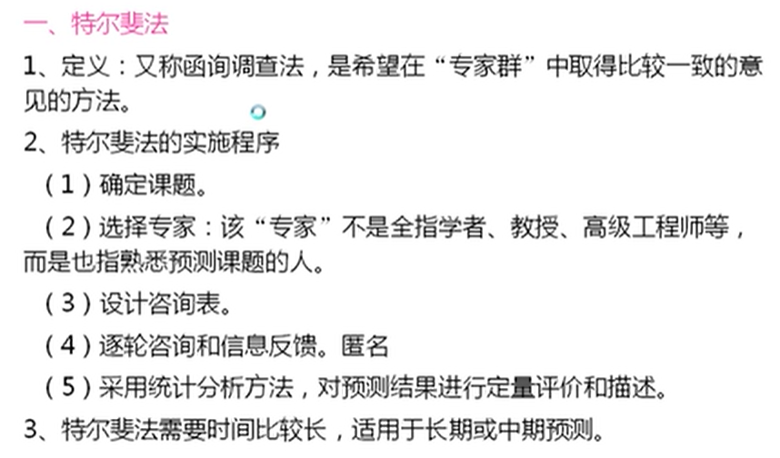

#### 2.2.2 专家小组法

专家小组法是在接受咨询的专家之间组成一个小组，面对面地进行讨论与磋商，最后对需要预测的课题得出比较一致的意见这种方法的优点是可以做到相互协商，相互补充；但当小组会议组织得不好时，也可能会使权或人士左右会场或多数人的意见湮没了少数人的创新见解专家小组法的预测过程比较紧凑，因而适用于短期预测。例如，原北京洗衣机厂在1979年秋生产了“白兰”牌单缸洗衣机，原定每台售价为298元。据北京地安门、月坛百货商场的统计，当时三五天才售出一台“白兰”洗衣机，销售形势十分不好。后来厂里的领导人员分析了当时的社会和经济环境，弄清了几个方面的情况：第一，1979年时我国城镇职工平均收入每月才50元左右，一台单缸洗衣机的售价相当于一个职工6个月的工资。第二，当时一台14英寸国产黑白电视机的价格在400元左右，每辆普通自行车的价格在150元左右，电视机要天天看，自行车要天天用，而洗衣机的使用频率却不高，相比之下，洗衣机的价格确实费了一点，还不是一般收人的职工能够买得起的。该厂经过分析预测，为了打开单缸洗衣机的销路，决定从1980年2月10日起，每台洗衣机的零售价从298元降到228元。降价以后，销路迅速打开，“白兰”成了紧俏商品，市场上出现脱销现象。零售价格降低后，每台“白兰”的出厂价格只有198元，而当时的工厂成本却达到228元，卖一台就要赔30元。在这样的情况下，工厂的领导不是想到提价的问题，而是想方设法降低成本，使每台“白兰”的成本降到192元，略有微利。由于实行薄利多销的方针，该厂在1980年原计划生产“白兰”3000，而实际生产了51260台，超额70.7%，获得净利润256500元

### 2.3 时间序列预测法（重要)

时间序列就是将历史数据按时间顺序排列的一组数字序列。如工业部门或企业按年度排列的年产量（或产值），商业部门按月份或季度排列的商品销售额等等，它是日常经济工作中的统计数据。时间序列分析法就是根据预测对象的这些数据，利用数理统计方法加以处理，来预测事物的发展趋势。它是经济工作中常用的一种预测方法。

它的基本原理是：

（1）承认事物发展的延续性，任何事物的发展总是同它的过去有着密切的联系，因此它的过去也会延续发展到未来，只要运用过去的时间序列数据进行统计分析，就能推测事物的发展趋势，做出定量预测。因为这种方法是用事物的过去推测其未来，故又称其为外推法。这种方法的特点是简便易行。但是，任何事物的发展不可能是它过去的简单重复，因而这种方法的准确性较差，一般只适用于短期预测。

（2）考虑了事物发展中随机因素的影响和干扰。这种方法为了消除事物发展的不规律性的影响，将历史时间序列数据作为随机变量序列，运用统计分析中加权平均的方法进行趋势预测

在实际统计工作，时间序列的组成形式是十分复杂的，大致可分为：长期趋势、季节性度动，周期性波动和随机波动等等。因此，应用于预测的方法也很多，下面简要介绍几种常用的方法

#### 2.3.1 滑动平均预测法

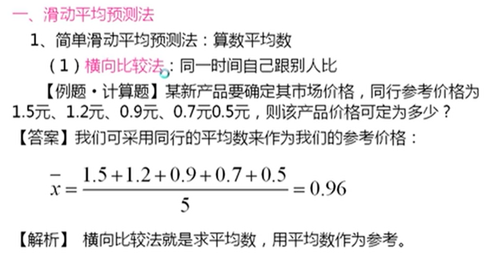

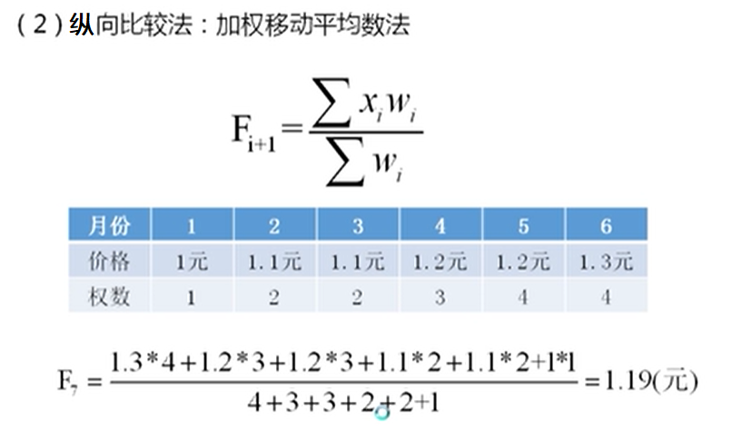

滑动平均预测法又分为简单平均预测法和加权平均预测法。

1. 简单滑动平均预测法，简单滑动平均预测法实际上是一种算术平均数预测法。
   利用算术平均数进行预测的公式为:
   $$
   \displaystyle\overline{x}=\frac{x_1+x_2+...+x_n}{n}
   $$
   $\overline{x} $为算术平均数; 

   $x_1, x_2...x_n$ 为 $n$ 个已知数据; 

   $n$ 采用的实际数据的个数.

   企业在对其所生产的商品进行价格预测时，可采用横向比较和纵向比较两种方法，下面分别举例予以说明。

   （1）横向比较法。
   设某乡镇企业试制成功一种5号干电池，经过市场调查，性能相近的该种电池的出厂价格分别为1.5元、1.2元、0.9元、0.7元、0.5元，该厂通过计算，得出5号干电池的平均出厂价格如下:

   

   0.96元是该厂对市场上5种性能相近的5号电池进行横向比较后，得出的平均出厂价格。根据这个定量所得的预测值，企业还可结合对竞争对手的状况、供求状况的定性预测，围绕这个平均数，定出自己生产5号电池的出厂价格。

   （2）纵向比较法：简单滑动平均数法设上述电池厂在生产和销售5号电池6个月以后，得到前后顺序排列的6个出厂价格1元、1.1元、1.1元、1.2元、1.2元、1.3元；则该厂亦可对过去6个月的出厂价格进行纵向比较，得出算术平均数如下：

   

   

   这个由纵向比较而得出的平均数，可以作为该厂决定第7个月的出厂价格的定量预测指在预测方法中，有一种常用的方法叫时间序列预测法，我们在这里所讲的以纵向比较法求算术平均数的例子就是一种最简单的时间序列预测法。如果在本例中，该电池厂总是按前6个月的出厂价格的平均数来预测下个月的出厂价格，那么第8个月的出厂价格的预测值就是前第2至第7个月的出厂价格的平均数，而第9个月的出厂价格预测值则是前第3至第8个月的出厂价格的平均数，这种逐次往后移动一个月，以计算平均数的方法叫简单滑动平均法，这种方法的通用计算公式如下:
   $$
   \displaystyle\stackrel{ˆ}{x}_{t+1}=\frac{x_t+x_{t-1}+x_{t-2}+...+x_{t-(n-1)}}{n}
   $$
   $\stackrel{ˆ}{x}_{t+1}$ 为 $t+1$ 期预测值; 

   $x_t+x_{t-1}+x_{t-2}+...+x_{t-(n-1)}$ 为 $t$ 期及 $t$ 期以前相应各期的实际值;

   $n$ 所取的实际值的个数.

   容易理解，所谓时间序列就是把过去的历史数据，如上述6个月的出厂价格，按时间顺序排列起来所组成的一个数字序列。如某地每年7月份的日平均气温、某地每年4月份的总降水量等等，常常是描述或预测相应地区、相应时间的自然状态时极有用的时间序列。

2. 加权平均数预测法。

   （1）横向比较法。
   设上述电池厂认为自己试制成功的5号电池，在性能上更接近于出厂价格较高的那些电池，因而采用算术平均数预测法不太合适，转而采用加权平均数预测法。
   利用加权平均数进行预测的公式为：
   $$
   \overline{x}_w=\frac{x_1w_1+x_2w_2+...+x_nw_n}{w_1+w_2+...+w_n}=\frac{\sum x_iw_i}{\sum w_i}
   $$
   为方便起见，我们把 $\displaystyle \sum ^n _{i=1}$ 简化为 $\sum$ 。

   $\overline{x}_w$ 加权平均数；

   $x_1+x_2+...+x_n$ 已知实际数据；

   $w_1+w_2+...+w_n$ 对应实际数据所取的权数；

   $n$ 采用的实际数据的个数。

   如上所述5种不同电池的出厂价格为：1.5元、1.2元、0.9元、0.7元、0.5元，而对它们设定的相应的权数为：5、4、3、2、1，那么按加权平均数计算出来的该厂所生产的5号电池的出厂价格的预测值为：

   

   1.13元这个加权平均数由于考虑到电池质量的差别问题，可能是比算术平均数更恰当的预测值

   （2）纵向比较法：加权移动平均数法。
   采用加权移动平均数法计算预测值的公式为：

   
   $$
   F_{i+1}=\frac{x_iw_i+x_{i-1}w_{i-1}+x_{i-2}w_{i-2}+...+x_{i-(n-1)}w_{i-(n-1)}}{w_i+w_{i-1}+w_{i-2}+...+w_{i-(n-1)}}=\frac{\sum x_iw_i}{\sum w_i}
   $$
   

   $F_{i+1}$ 加群平均数；

   ${x_i+x_{i-1}+x_{i-2}+...+x_{i-(n-1)}}$ 已知实际数据；

   ${w_i+w_{i-1}+w_{i-2}+...+w_{i-(n-1)}}$ 对应实际数据所取的权数；

   $i+1, i, i-1, ..., i-(n-1)$ 顺次往回推算的期数。

   仍以上述电池厂为例，该厂前6个月5号电池的出厂价格为：1元、1.1元、1.1元
   1.2元、1.2元、13元。预测人员认为果用加权移动平均数法预测电池的出厂价格时，应加大与预测期较近的实际数据的权数。结果他们确定出厂价格与权数之间的对应关系如下：

   出厂价格	1元 1.1元 1.1元 1.2元 1.2 元 1.3 元

   设定的权数 1		2		2		3		3		4

   于是设定该厂第7个月的5号电池的出厂价格预测值为：

   

   由于加大了近期出厂价格的权数，1.19元这个预测数字比较更接近于1.3元、1.2元这些实际数据。当然在做出价格决策时，决策人员还应根据当时当地的其它情况，做到定量预测与定性预测的结合。

#### 2.3.2指数平滑预测法

指数平滑预测法的公式如下：
$$
F_{t+1}=F_t+\alpha(x_t-F_t)=F_t+\alpha e_t
$$
$F_{t+1}, F_t$，$t+1, t$ 期的预测值；

$x_t$ t 期实际值；

$\alpha$ 平滑系数；

$e_t$ t 期的实际值与预测值之间的误差。

式中可以看出指数平滑预测法实际上是定量方法与定性方法相结合的一种预测方法。
当我们发现 t 期的预测值 F 与 t 期的实际值 x 之间出现较大的正或负误差 e 时，我们可以根据当时当地的实际情况，加大平滑系数 a 的值，使 t+1 期的预测值比较接近于 t 期的实际值；如果误差 e 的值不大，这说明 t 期的预测值与实际值比较接近，而当时当地的情况又不会有太大的变化时，则 a 值可取得小些。a 值的一般取值范围是：0≤a≤1.当a取0时，则表明不考虑t期的误差，$F_{t+1}=F_t$；当 a 取1时，则表明将误差全部考虑进去，则$F_{t+1}=x_t$。一般来说，a的值总是取0与1之间的一个数值。
在特殊的情况下，即当商品的价格看涨或看跌时，a的值亦可取大于1的数值。例如仍以上述电池厂的例子来说明。该厂5号电池的出厂价格前6个月的实际值依次为：

| 月（次）       | 1    | 2    | 3    | 4    | 5    | 6    |
| -------------- | ---- | ---- | ---- | ---- | ---- | ---- |
| 出厂价格（元） | 1    | 1.1  | 1.1  | 1.2  | 1.2  | 1.3  |

根据加权移动平均数法计算出来的第7个月的预测值为：Ft=1.19元；假设第7个月实际的出厂价格为：x7=1.3元。按照前6个月的实际数据，再结合7月份的实际出厂价格为1.3元来看，第8个月的出厂价格很可能上涨到1.4元，因此采用指数平滑法来进行第8个月的出厂价格的预测时，可加大值到1.9；有关的计算公式如下

1.39元即1.4元这个预测值可能是与实际情况相符合的。由此可见，对于短期预测更应加强调查研究，摸清当前的实际情况，使定量预测与定性预测更好地结合如果我们将（2-5）式：F…1=F1+a（x,F，）变换一下形式，可得

### 2.4 回归模型预测法

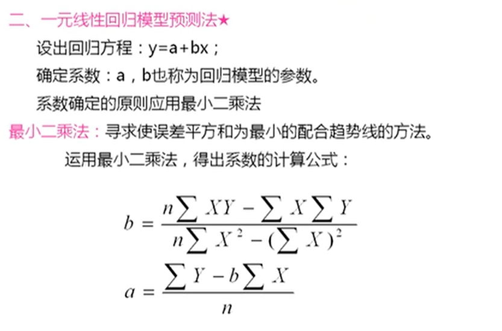

确定相关系数：

置信区间：

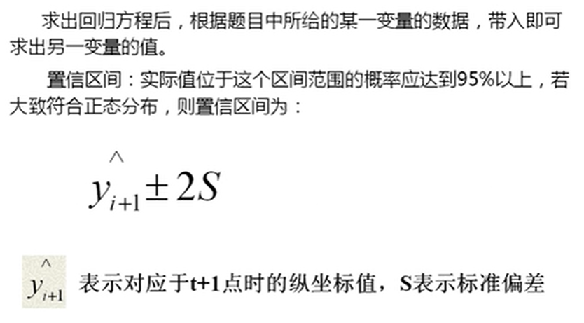

### 2.5 季节性变动的预测

## 第3章 决策（重要）

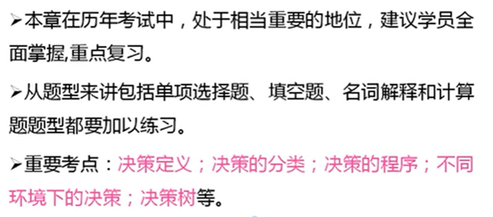

### 3.1 决策的概念和程序

### 3.2 在不同环境下的决策

### 3.3 不确定条件下的决策

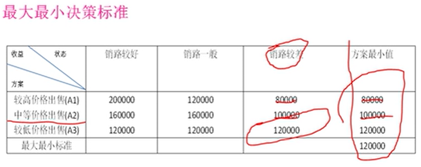

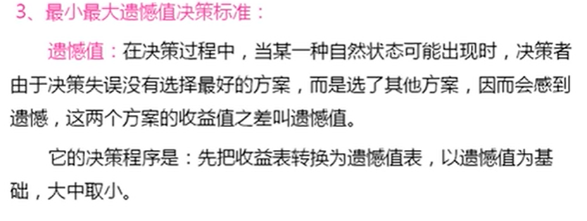

### 3.4 风险条件下的决策

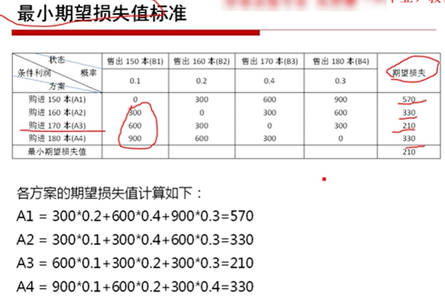

### 3.5 决策树

## 第4章 库存管理

### 4.1 库存管理的作用和意义

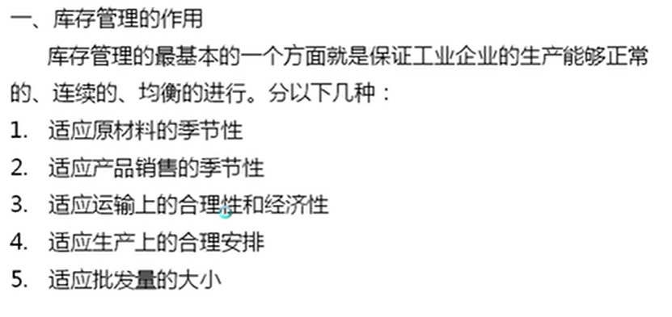

### 4.2 库存管理的存货台法与ABC分类管理

### 4.3 库存费用分析和平均库存的概念

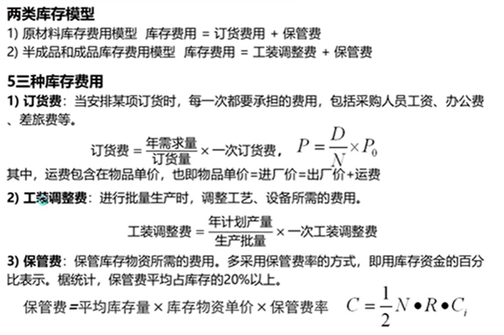

### 4.4 经济订货量（EOQ）的计算方法（重要）

### 4.5 经济们货量（EOQ）公式的典型应用示例

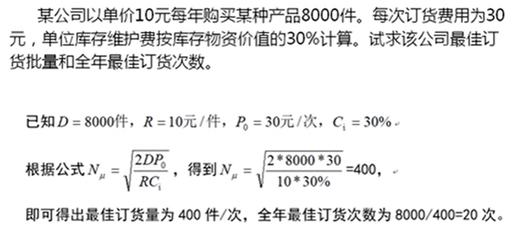

### 4.6 订货时间的确定

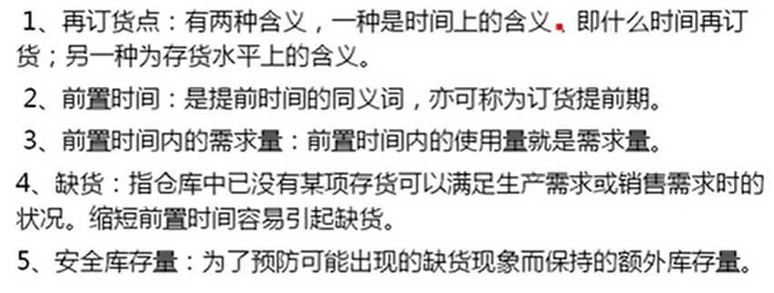

### 4.7 正确估价供应商所供的数量折扣

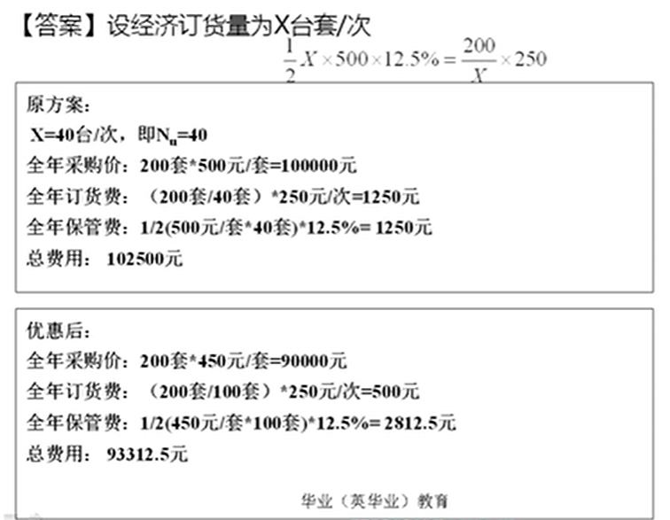

## 第5章 线性规划

### 5.1 概述

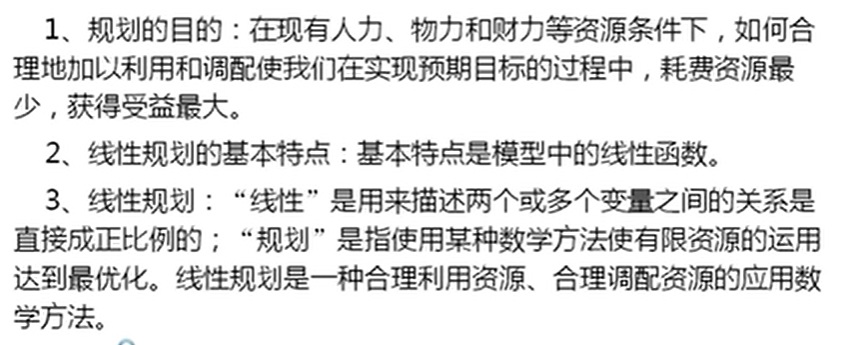

### 5.2 线性规划的模型结构

### 5.3 线性规划的图解法

### 5.4 线性规划问题的单纯形法

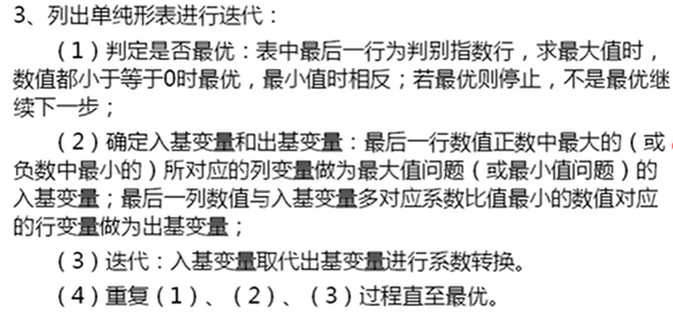

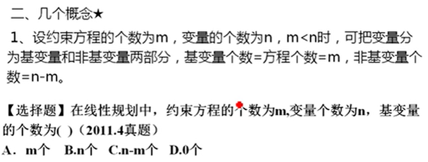

### 5.5 线性规划应用示例

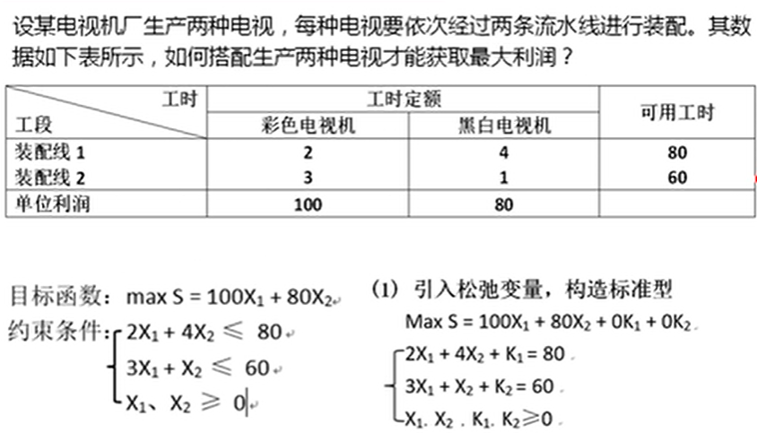

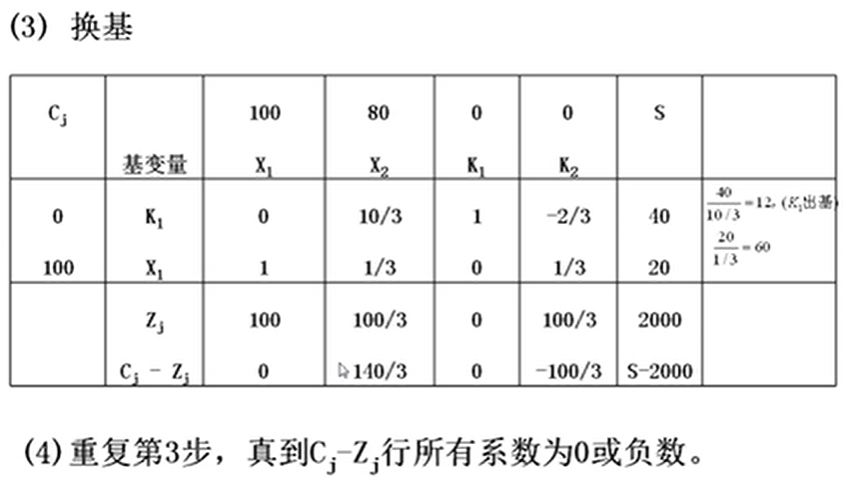

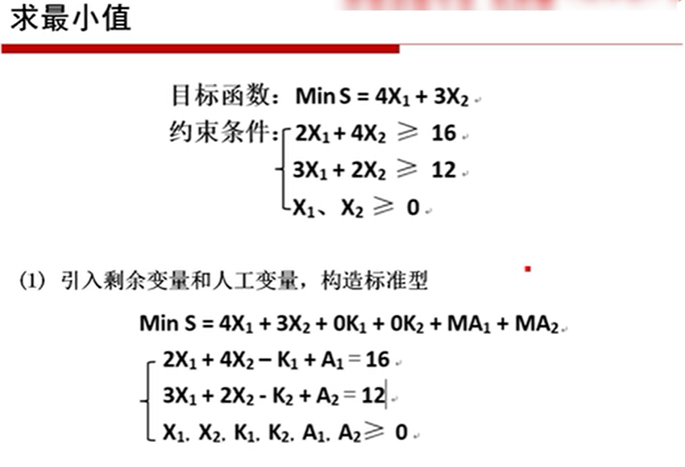

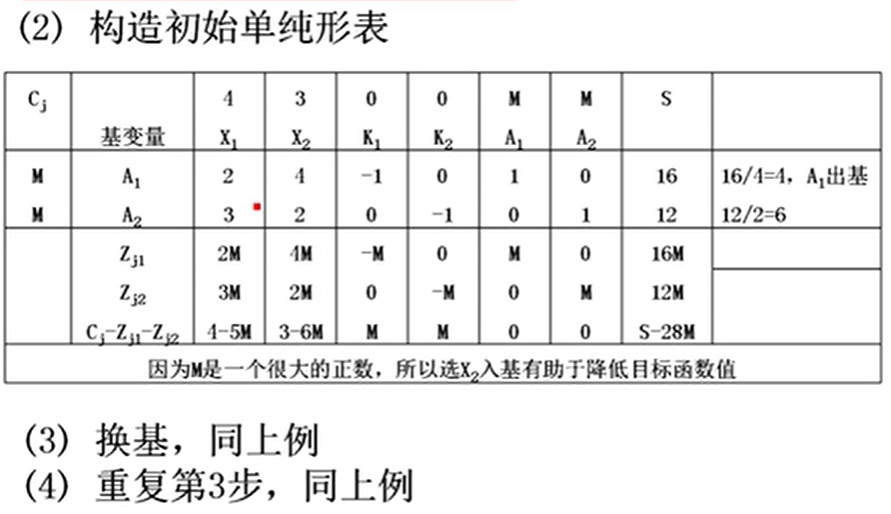

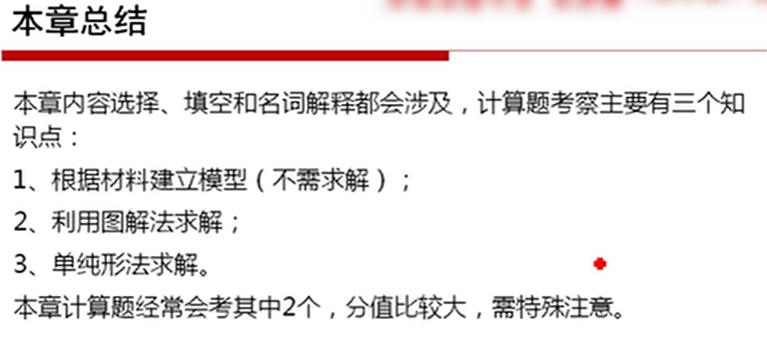

## 第6章 运输问题

### 6.1 运输问题及其特殊结构

### 6.2 需要量等于供应量的运输问题

### 6.3 需要量不等于供应量的运输问题

## 第7章 网络计划技术

### 7.1 网络图

### 7.2 网络时间的计算

### 7.3 时差和关键线路

### 7.4 最优方案的选择

### 7.5 网络计划技术的推广和应用

## 第8章 图论方法

### 8.1 图的基本概念

### 8.2 树和树的逐步生成法

### 8.3 最小枝权树问题

### 8.4 最短路线问题

### 8.5 最大流量问题

## 第9章 马尔柯夫分析

### 9.1 马尔柯夫分析的数学原理

### 9.2 马尔树夫分析问题的要求

### 9.3 马尔夫分析在管理工作中的应用

## 第10章 盈亏分析模型

### 10.1 盈亏平衡问题概述

### 10.2 盈亏分析模型的基本结构

### 10.3 线性盈亏分析模型及其应用示例

### 10.4 非线性盈亏分析模型

### 10.5 盈亏平衡分析在企业管理中的应用

## 第11章 模拟的基本概念

### 11.1 概述

### 11.2 概率分布及其在模拟中的应用

### 11.3 模拟的应用示例